# 掌握 Pandas(和 Python)中的日期和时间戳

> 原文：<https://towardsdatascience.com/mastering-dates-and-timestamps-in-pandas-and-python-in-general-5b8c6edcc50c?source=collection_archive---------3----------------------->

## 你所需要的就是在熊猫中处理日期和时间戳！提供了许多例子。

# **内容**

*   一般日期

更具体地说，用…处理操作

*   天
*   周；星期
*   月份
*   年

额外:生成日期范围

*   生成连续的日期范围
*   生成随机日期范围


照片由 [Aron 视觉效果](https://unsplash.com/@aronvisuals?utm_source=medium&utm_medium=referral)在 [Unsplash](https://unsplash.com?utm_source=medium&utm_medium=referral) 上拍摄

# 一般日期

(*)在运行任何代码之前，请导入熊猫！

```
import pandas as pd
```

现在，让我们开始吧。

## **改变列数据框架中的日期格式**

按照这个简单的 [**strftime**](http://strftime.org/) 文档，你可以随意选择每种格式。

例如，从这个数据框架开始:

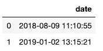

将**日期格式**更改为:

```
df['date'] = df['date'].apply(lambda x: pd.Timestamp(x).**strftime('%Y-%m-%d')**)
```

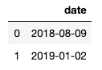

或者，我们可以来点更有异国情调的:

```
df['date'] = df['date'].apply(lambda x: pd.Timestamp(x).**strftime('%B-%d-%Y %I:%M %p')**)
```

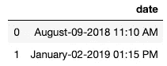

请记住，您可以选择的时间戳格式的所有变体都可以在此链接中找到: [**strftime**](http://strftime.org/)

你自己试试！从这个示例构建的数据框架开始:

```
df = pd.DataFrame({'date': ['2018-08-09 11:10:55','2019-03-02 13:15:21']})
```

## 将列类型从对象/字符串更改为日期时间

```
# 4 possible options# 1
df['date'] = pd.to_datetime(df['date'])
# 2
df['date'] = df['date'].astype('datetime64[ns]')
# 3
df['date'] = df['date'].apply(lambda x: parse(x))
# 4
df['date'] = df['date'].apply(lambda x: pd.Timestamp(x))
```

示例(我们只尝试了 4 个选项中的一个，但所有选项都应该有效)

```
df = pd.DataFrame({'date': ['2018-08-09 11:10:55','2019-01-02 13:15:21']})df
df.dtypesdf['date'] = pd.to_datetime(df['date'])
df
df.dtypes
```

输出:

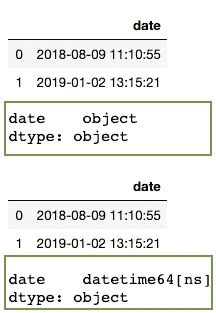

## 从字符串到日期格式，再从日期格式到字符串

隔离变量示例:

```
from dateutil.parser import parsestr_date = '2018-05-01'# String to Date:
date_1 = parse(str_date)
print ('date_1: ',date_1, type(date_1))# Date to String:
date_2 = date_1.strftime('%Y-%m-%d')
print ('date_2: ',date_2, type(date_2))
```

输出:

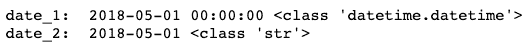

## 从 Unix/纪元时间到可读日期格式

```
df['date'] = pd.to_datetime(df['date'],unit='s')
```

示例:

```
df = pd.DataFrame({'date': [1349720105,1349806505]})dfdf['date'] = pd.to_datetime(df['date'],unit='s')df
```

输出(之前和之后):

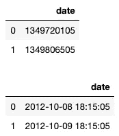

## 加减日期

使用**时间增量**！示例:

```
from datetime import datetime, timedelta
from dateutil.parser import parseparse('2019-04-07') — timedelta(days=3)# or, to get it as a string
(parse('2019-04-07') — timedelta(days=3)).strftime('%Y-%m-%d')
```

输出:

```
# with date format 
datetime.datetime(2019, 4, 4, 0, 0) # with string format
'2019-04-04'
```

## 得到两个日期之间的差异

将两个字符串转换成日期格式，然后进行计算。示例:

```
from dateutil.parser import parsed1 = parse('2018-12-01')
d2 = parse('2018-12-08')
abs((d2 - d1).days)
```

输出:

```
7
# 7 days
```

# 带天数的操作

## 从日期中获取日期

```
# for a column in a DataFrame
from datetime import datetime as dt
df['day'] = df['date'].dt.day# for a single value
from dateutil.parser import parse
parse('2018-08-09').day
```

输出:

```
9
```

# 数周的操作

## 获取一年中的第几周

示例:

```
df = pd.DataFrame({'date': ['2018-08-09 11:10:55','2019-01-02 13:15:21']})# if date column type is a string
df['week'] = pd.DatetimeIndex(df['date']).week# if date column type is a datetime
# df['week'] = df['date'].dt.week
```

输出:

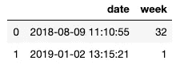

(*)要创建 yyyy-ww 格式的周列，请使用:

```
df = pd.DataFrame({'date': ['2018-08-09 11:10:55','2019-03-02 13:15:21']})# if column type is a string/object
df['yyyy_ww'] = pd.DatetimeIndex(df['date']).strftime('%Y-%U')# if column type is a datetime
# df['yyyy_ww'] = df['date'].dt.strftime('%Y-%U')
```

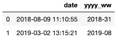

对于独立变量:

```
import datetime
date_1 = '2018-02-06'
parse(date_1).isocalendar()[1]
```

输出:

```
6
# 6th week of the year
```

## 获取工作日

示例:

```
df['weekday'] = df['date'].apply(lambda x: parse(str(x)).strftime("%A"))
```

输出:


## 从年-周格式转换到 yyyy-mm-dd 格式(获得一周的第一天和最后一天)

示例:您想知道 2018 年第 37 周的开始和结束日期:

```
# define this function
def get_start_end_dates(yyyyww):
    year = yyyyww[:4]
    week = yyyyww[-2:]
    first_day_year = str(year) + '-' +  '01' + '-' + '01'
    d = parse(first_day_year)
    if(d.weekday()<= 3):
        d = d - timedelta(d.weekday())             
    else:
        d = d + timedelta(7-d.weekday())
    dlt = timedelta(days = (int(week)-1)*7)
    return (d + dlt).strftime('%Y-%m-%d'),  (d + dlt + timedelta(days=6)).strftime('%Y-%m-%d')# run it
get_start_end_dates('201837')
```

输出(包含一周的开始和结束的元组):

```
('2018-09-10', '2018-09-16')
```

# 月操作

## 获取一年中的月份号

示例:

```
df = pd.DataFrame({'date': ['2018-08-09 11:10:55','2019-03-02 13:15:21']})# if date column type is a string/object
df['month'] = pd.DatetimeIndex(df['date']).month# if date column type is a datetime
# df['month'] = df['date'].dt.month
```

输出:

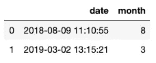

对于独立变量:

```
import datetime
date_1 = '2018-02-06'
parse(date_1).month
```

输出:

```
2
# 2nd month of the year
```

(*)要创建 YYYY-MM 格式的月份列，请使用:

```
df = pd.DataFrame({'date': ['2018-08-09 11:10:55','2019-03-02 13:15:21']})# if column type is a string/object
df['yyyy_mm'] = pd.DatetimeIndex(df['date']).strftime('%Y-%m')# if column type is a datetime
# df['yyyy_mm'] = df['date'].dt.strftime('%Y-%m')
```

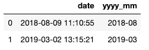

## 加减月份(向前或向后移动 X 个月)

使用此功能

```
def monthdelta(date, delta):
    m, y = (date.month+delta) % 12, date.year + ((date.month)+delta-1) // 12
    if not m: m = 12
    d = min(date.day, [31,
        29 if y%4==0 and not y%400==0 else 28,31,30,31,30,31,31,30,31,30,31][m-1])
    new_date = (date.replace(day=d,month=m, year=y))
    return new_date.strftime('%Y-%m-%d')
```

示例(某个日期减去 4 个月):

```
monthdelta(parse('2019-11-09'), -4)
```

输出(显示相同的日期，但在 4 个月之前):

```
'2019-07-09'
```

# 运营年限

## 获得年份

示例:

```
df = pd.DataFrame({'date': ['2018-08-09 11:10:55','2019-03-02 13:15:21']})# if date column type is a string/object
df['year'] = pd.DatetimeIndex(df['date']).year# if date column type is a datetime
# df['year'] = df['date'].dt.year
```

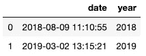

对于独立变量:

```
import datetime
date_1 = '2018-02-06'
parse(date_1).year
```

输出:

```
2018
```

# 生成数据范围

## 生成连续的日期范围

示例:生成从 2019 年 1 月 1 日到 2019 年 1 月 2 日的日期范围，频率为每小时。

```
from datetime import datetime
import numpy as npdate_range = pd.date_range(start='01/01/2019', end='01/02/2019', freq='H')
```

参见[中的不同频率选项。](https://pandas.pydata.org/pandas-docs/stable/user_guide/timeseries.html#timeseries-offset-aliases)

## 生成随机日期范围

```
import random
import time
from dateutil.parser import parsedef str_time_prop(start, end, format, prop):
    stime = time.mktime(time.strptime(start, format))
    etime = time.mktime(time.strptime(end, format))
    ptime = stime + prop * (etime - stime)
    return time.strftime(format, time.localtime(ptime))selected_format = '%Y-%m-%d %H:%M:%S'def random_date(start, end, prop):
    return parse(str_time_prop(start, end, selected_format, prop)).strftime(selected_format)print(random_date("2020-01-01 13:40:00", "2020-01-01 14:10:00", random.random()))def make_date(x):
    return random_date("2012-12-01 13:40:00", "2012-12-24 14:50:00", random.random())
```

这里是这个函数的[源](# more https://stackoverflow.com/questions/553303/generate-a-random-date-between-two-other-dates)。

由此，我们可以生成随机日期。例如，让我们生成圣诞节和新年之间的 10 个随机时间戳的列表:

```
def make_date(x):
    return random_date("2012-12-24 00:00:00", "2012-12-31 23:59:59", random.random())[make_date(x) for x in range(10)]
```

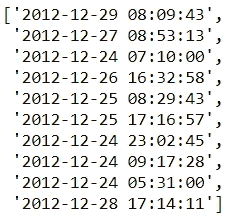

我们还可以将它添加到任何数据帧中，如下所示:

```
df = pd.DataFrame({'number': [1,2,3,4,5]})
df['time'] = df['number'].apply(make_date)
df
```

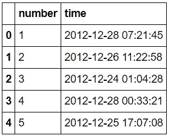

这是文章的结尾。希望你喜欢它，也希望你能好好利用它！

如果您有任何问题，请给我发消息或留下回复。

如果你想在将来了解类似这样的文章，请关注我！