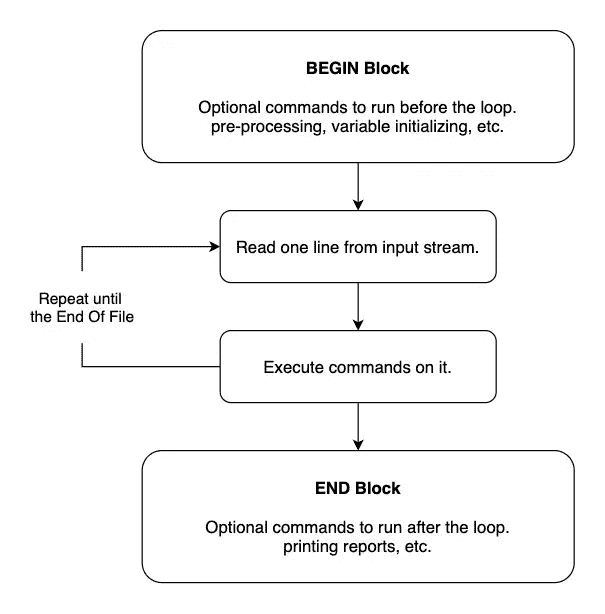

# 使用 Awk 实用程序掌握文件和文本操作

> 原文：<https://towardsdatascience.com/mastering-file-and-text-manipulation-with-awk-utility-65fc09d56bef?source=collection_archive---------21----------------------->

## 只需一行命令即可实现高级文本处理


由[马丁·范·登·霍维尔](https://unsplash.com/@mvdheuvel?utm_source=unsplash&utm_medium=referral&utm_content=creditCopyText)在 [Unsplash](https://unsplash.com/?utm_source=unsplash&utm_medium=referral&utm_content=creditCopyText) 拍摄的照片

作为软件开发人员、系统管理员和数据科学家，处理和操作文件是我们日常工作中频繁而重要的一部分。知道如何处理文本文件，并以快速有效的方式对它们进行所需的更改，可以节省我们大量的时间。

在本文中，我将向您介绍 Awk command，这是一个非常强大的文本处理工具，可以用一行或几行代码完成复杂的文本处理任务。你可能倾向于使用你最喜欢的编程语言，比如 Python、Java、C……来完成这类任务，但是在阅读完这篇教程之后，你会意识到用 Awk 来完成其中的许多任务会更加简单和高效。

我将通过提供如何用 Awk 解决常见文本处理任务的基本示例来演示 Awk 的用法。

# 装置

默认情况下，Awk 在大多数 Unix 发行版上都是可用的。如果您没有它，您可以使用以下命令来安装它。

对于基于 Debian 的发行版:

```
$ sudo apt-get install gawk
```

对于基于 RPM 的分发:

```
# yum install gawk
```

如果您使用的是 Microsoft Windows，请查看 [GNU 手册](https://www.gnu.org/software/gawk/manual/gawk.html#Non_002dUnix-Installation)中的安装说明。

# 工作流程

Awk 工作流程很简单。它从输入流中读取一行，对它执行指定的命令，并重复这个过程，直到文件结束。

还有 BEGIN 和 END 块，您可以使用它们在重复过程之前和之后执行一些命令。



作者流程图

# 让我们开始吧

Awk 命令的基本结构是这样的:

```
awk [options] file ...
```

让我们举几个例子。

## 示例 1:按原样打印每一行

考虑一个文本文件 **input.txt** ，其内容如下:

```
John 23 ItalyDavid 18 SpainSarah 21 GermanyDan 42 GermanyBrian 50 EnglandLewis 37 FranceEthan 12 France
```

通过运行命令:

```
$ awk '{print}' input.txt
```

它将为正在打印的每一行运行`{print}`。因此输出将与输入相同。

## 示例 2:打印前两列

这里我们只想打印每个人的名字(第一个单词)和年龄(第二个单词)，用制表符分开。

命令:

```
$ awk '{print $1 "\t" $2}' input.txt
```

输出:

```
John    23David   18Sarah   21Dan     42Brian   50Lewis   37Ethan   12
```

在上面的例子中， **$1 和$2** 代表每条输入线的第一个和第二个场。 **$0** 代表整行。

## 示例 3:在每一行的开头添加行号

在这里，我们将变量定义为 count，在读取每一行时递增，并在第一行打印出来。

命令:

```
$ awk -v count=0 '{print ++count " " $0}' input.txt
```

注意我们也可以去掉`-v count=0`部分。它将被隐式定义为值 0:

```
$ awk '{print ++count " " $0}' input.txt
```

输出:

```
1 John 23 Italy2 David 18 Spain3 Sarah 21 Germany4 Dan 42 Germany5 Brian 50 England6 Lewis 37 France7 Ethan 12 France
```

## 示例 4:仅打印 30 岁以上的人

Awk 编程语言也支持条件。

命令:

```
$ awk  '{if ($2 > 30) print $0}' input.txt
```

输出:

```
Dan 42 GermanyBrian 50 EnglandLewis 37 France
```

## 示例 5:生成每个国家有多少人的报告

我们可以通过使用字典和循环来达到这个目的。

命令:

```
$ awk '{my_dict[$3] += 1} END {for (key in my_dict) {print key, my_dict[key]}}' input.txt
```

这里我们有一本名为`my_dict`的字典。对于每一行，关键字是第三个单词(国家名称),我们将它的值增加 1。在`END`关键字之后，我们可以编写结束块命令，我们已经在工作流部分解释过了。在结束块，我们循环字典并打印它的(键，值)对。

输出:

```
Spain 1France 2Germany 2Italy 1England 1
```

## 示例 6:计算平均年龄

命令:

```
$ awk '{age_sum += $2} END {print age_sum/NR}' input.txt
```

`NR`是一个内置变量，代表当前记录号。所以在`END block`，它将等于总行数。

输出:

```
29
```

你可以在这里看到其他 Awk 内置变量。

## 示例 7:仅打印姓名中包含“s”字符的人

我们可以在 Awk 中使用正则表达式。

命令:

```
awk '$1 ~ /[sS]/ {print $1}' input.txt
```

这里我们指定第一个单词`$1`应该匹配正则表达式`[sS]`。

输出:

```
SarahLewis
```

## 示例 7:如果输入文件是另一种格式，比如 CSV，该怎么办？

您可以使用`-F`选项设置用于分隔字段的正则表达式。

考虑将该文件命名为`input.csv`:

```
John,23,ItalyDavid,18,SpainSarah,21,GermanyDan,42,GermanyBrian,50,EnglandLewis,37,FranceEthan,12,France
```

命令:

```
awk -F "," '{print $1 " " $3}' input.csv
```

输出:

```
John ItalyDavid SpainSarah GermanyDan GermanyBrian EnglandLewis FranceEthan France
```

## 示例 8:通过定义一个函数，添加一个新列来显示这个人是小于还是大于 20 岁

在这个例子中，我们将展示如何创建和使用函数。此外，我们将把代码添加到一个名为`prog.awk`的文件中，而不是把它作为输入参数。我们还将输出打印到一个名为`output.txt`的文件中。

程序 awk:

```
# Returns if the person is younger or older than 20
function age_func(age) {
    if (age < 20) {
        return "younger"
    }
    return "older"
}{print $0 " " age_func($2)}
```

命令:

```
awk -f prog.awk input.txt > output.txt
```

输出. txt:

```
John 23 Italy olderDavid 18 Spain youngerSarah 21 Germany olderDan 42 Germany olderBrian 50 England olderLewis 37 France olderEthan 12 France younger
```

Awk 也有一些内置函数，你可以在这里查看[。](https://www.tutorialspoint.com/awk/awk_built_in_functions.htm)

# 摘要

在本文中，我们展示了 Awk 命令的工作流程，通过提供一些例子，我们看到 Awk 是一个强大而灵活的文本处理工具，可以在许多场景中使用。你可以阅读[GNU Awk 用户指南](https://www.gnu.org/software/gawk/manual/gawk.html\)以获得更详细的说明。

谢谢大家，编码快乐！