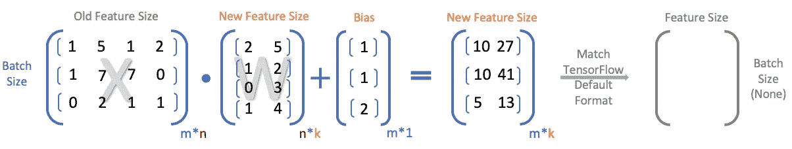
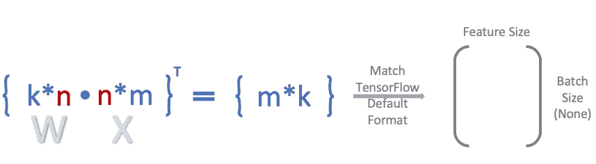
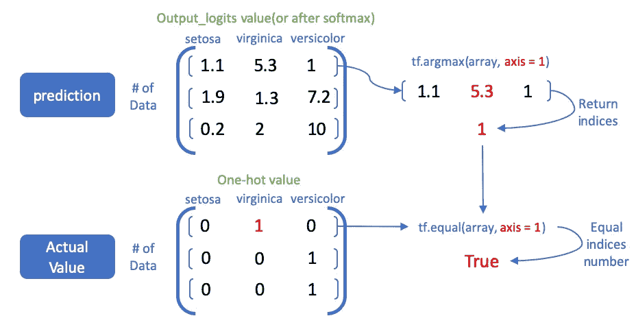

# 张量流上深度学习模型的线性代数

> 原文：<https://towardsdatascience.com/mastering-linear-algebra-in-tensorflow-part1-input-layer-e0480a8d69bf?source=collection_archive---------17----------------------->

## 以表格数据为例进行处理

初学者的一个耗时问题是不同深度学习架构下的矩阵运算。换句话说，处理线性代数的东西代表了你对矩阵计算机制的理解程度。如果你对线性代数中的矩阵或张量没有什么概念，可以看看维哈尔·鞍马在 Medium 上的文章。为了减少混乱， **TensorFlow 1。x 和张量流 2。x 都将包含在本教程**中。所有代码在 Google Colab 上都是可执行的，你可以在最短的时间内进入主题。

# 主要数据格式

在详细介绍之前，输入数据格式有四种主要类型:

**1。矢量数据**

(1)数据形状:(数据样本*特征)

**2。时间序列数据或序列数据**

(1)数据形状:(数据样本*时间戳*特征)

对于序列数据，时间戳代表输入数据的序列长度，该长度在输入模型之前应该是固定的。通常的方法包括零填充和切片。至于时间序列数据，它代表每个时间段。

**3。图像数据**

(1)数据形状:(数据样本*高度*宽度*通道)

高度和宽度指的是图像的形状。通道表示 RGB(通道是 3)、灰度(通道是 1)等。

(2)数据形状:(数据样本*特征)如果展平高度*宽度*通道

**4。视频数据**

(1)数据形状:(数据样本*帧*高度*宽度*通道)

(2)数据形状:(数据样本*特征)如果展平框架*高度*宽度*通道

# 矢量数据

今天，在构建这种类型的模型时，我们将重点关注矢量数据和线性代数处理。请注意，数据预处理可能会被忽略，因为我们现在关注的内容不在这里。向量数据，也称为 2D 张量。如果我们说单个数据是一个向量，那么 2D 向量数据就是我们一次处理多个单个数据的时候。2D 向量数据是机器学习中最常见的任务，我们有时也会将图像数据等高维矩阵转换为 2D 向量。

# 矢量数据—分类问题

## 1.数据准备

假设我们正在 TensorFlow 1.X 上为虹膜数据集实现一个 3 层多层感知器，用于分类。首先，我们导入一些必要的包:

*关于 TensorFlow 1。X:*

*在 TensorFlow 2 上。X:*

## 2.模型架构准备

然后，我们分配每层数据的维度:

## 3.模型构建(输入和隐藏层)

为了方便起见，我们将隐藏层的输出形状设置为相同的维度，即 4。`n_class`指目标特征的类别数。那么，我们先来处理棘手的部分:`inputs, and labels`。

*关于 TensorFlow 1。X:*

根据 TensorFlow 的设计，我们倾向于将`feature_size`作为第二维度，将`None`作为第一维度的任意数量的样本(批量)。对于权重(`w1`)，我们使用`[feature_size, hidden_1]`。至于偏，形状是`[hidden_1, ]`。因此，我们做第 1 层`tf.add(tf.matmul(x, w1), b1)`。**但是，为什么不是 W*x + b 呢？为什么 x*W 更有意义？我们来看下图:**

TensorFlow 预期形状为`(number of examples, num_classes)`。因此，做`tf.matmul(x, W)`对于适应 TensorFlow 的 API 格式更直观。不过，你可能会看到一些输入数据或教程，如来自吴恩达的[*Deep learning . ai*](https://www.coursera.org/specializations/deep-learning)use`tf.matmul(W, x)`。**但是，这种格式需要点积后的转置操作(** `tf.transpose(tf.matmul(W, x))` **)** :

根据这个原因，就更容易知道为什么下面几层是这个样子了:

*在 TensorFlow 2 上。X:*

张量流 2。x 就方便多了，你只需要小心输入层，应该是`(feature_size, )`。至于其他的，你只需要指定输出形状，TensorFlow 2。x 会帮你完成剩下的部分。注意，代码的格式是函数式 API 格式，保持了更大的灵活性。但是您仍然可以使用通用的，因为我两者都提供了。

## 4.模型构建(优化器和预测)

对于初学者来说，预测也是一个棘手的部分，尤其是当他们看到到处都是像`tf.argmax`和`tf.reduce_mean`这样的语法时。

*在 TensorFlow 1 上。X:*

`tf.argmax`是一个返回数组中最大数字的索引的函数。参数`axis`指定您正在比较哪个维度。例如，`axis = 1`比较第二维，即 Iris 数据集中的特征列。为了说明清楚，我们来看下图:

在`tf.equal(tf.argmax(targets, 1), tf.argmax(output_logits, 1))`之后，我们将收到一个布尔值列表，指示两个索引是否匹配相同的值，也就是说，正确的预测。然后，`tf.reduce_mean`是对结果进行平均的函数，总精度！

*在 TensorFlow 2 上。X:*

# 向量数据—回归问题

至于回归问题，它们比分类要简单得多，因为标签只是一个 1D 向量。你需要的是改变输出维度和激活函数，比如把激活函数从‘soft max’改成‘relu’，就万事大吉了。

**表格数据教程到此结束。接下来，我们将开始处理序列数据和时序数据上的线性代数！**