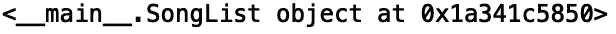
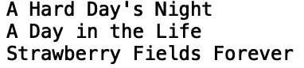
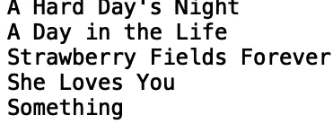

# 掌握 Python 中的链表

> 原文：<https://towardsdatascience.com/mastering-linked-lists-in-python-ce66650de666?source=collection_archive---------45----------------------->

## 理解单链表数据结构


[来源](https://www.pexels.com/photo/beautiful-calm-chain-chain-link-145683/)

链表是计算机科学中重要的数据结构。链表是节点的线性集合，其中每个节点包含一个数据值和对列表中下一个节点的引用。在这篇文章中，我们将通过一个例子来构建一个对应于音乐播放列表的单链表。

我们开始吧！

首先，我们将定义一个名为“SongNode”的类。在“__init__”方法的参数中，我们将属性“current_song”和“next_song”初始化为“None”:

```
class SongNode:
    def __init__(self, current_song=None, next_song = None):
```

接下来，我们定义类属性，“当前歌曲”和“下一首歌曲”:

```
class SongNode:
    def __init__(self, current_song=None, next_song = None):
        self.current_song = current_song
        self.next_song = next_song
```

现在，让我们写一个类，允许我们建立我们的链接歌曲列表。让我们称这个类为“歌曲列表”:

```
class SongList:
    def __init__(self):  
        self.head = None
```

我们将使用“SongList”类来初始化我们的歌曲列表对象，该类将包含对“SongNode”类型的引用。让我们编写一个 song list 类的实例并打印结果:

```
if __name__=='__main__':
    #initialize linked list object
    linkedlist = SongList()
    print(linkedlist)
```



现在让我们为我们的播放列表建立一个链接的歌曲列表。让我们根据 [*娱乐周刊*](https://ew.com/music/2009/09/04/beatles-50-best-songs/) *选出**披头士**有史以来的前 3 首歌曲。首先让我们定义每个节点的值。(注:‘…’对应省略的代码):*

```
if __name__=='__main__':
    ... 
    #assign values to nodes 
    linkedlist.head = SongNode("A Hard Day's Night")
    second = SongNode('A Day in the Life')
    third = SongNode("Strawberry Fields Forever")
```

现在让我们定义头节点的“下一首歌”值(第一首歌):

```
if __name__=='__main__':
    ...
    #link nodes
    linkedlist.head.next_song = second
```

然后我们定义第二个节点的“下一首歌”值:

```
if __name__=='__main__':
    ...
    second.next_song = third
```

接下来，让我们定义一个简单的函数，它将允许我们遍历链接的歌曲列表。在 while 循环中，我们将打印当前歌曲的值，并将当前值重新定义为下一首歌曲，直到它到达链表的尾部，指向 null:

```
class SongList:   
    ...
    def printSongs(self): 
        value = self.head 
        while (value): 
            print(value.current_song) 
            value = value.next_song
```

接下来，让我们打印我们的歌曲列表:

```
if __name__=='__main__':
    ...
    linkedlist.printSongs()
```



接下来，让我们定义一个函数，允许我们在链表的末尾插入一首歌曲。该函数将采用参数“new_song”。该函数首先检查链表的头是否为‘None’。如果是，头取新歌的值:

```
def NewSong(self, new_song):
        NewSongNode = SongNode(new_song)
        if self.head is None:
            self.head = NewSongNode
```

接下来，变量“last”被定义为头节点，在 while 循环中，我们遍历链接的对象，直到到达指向 null 的 song 节点。“最后”节点的“下一首歌曲”值被定义为新的歌曲节点:

```
def newSong(self, new_song):
    NewSongNode = SongNode(new_song)
    if self.head is None:
        self.head = NewSongNode
    last = self.head
    while(last.next_song):
        last = last.next_song
    last.next_song=NewSongNode
```

现在，让我们添加两首新歌“她爱你”和“什么”，并打印我们的歌曲列表:

```
if __name__=='__main__':
    ...
    linkedlist.newSong("She Loves You")
    linkedlist.newSong("Something")
    linkedlist.printSongs()
```



我就讲到这里，但是我鼓励你自己去研究代码。具体来说，您可能想尝试在“SongList”类中定义一个函数，允许您搜索一个节点。您还可以尝试定义一个允许您删除节点的方法。

总之，在这篇文章中，我们讨论了如何创建一个与歌曲播放列表相对应的链表。我们展示了如何使用“SongNode”类定义歌曲节点，以及如何使用“SongList”类链接“SongNode”对象。我们还展示了如何在链表的末尾添加额外的歌曲节点。我希望你觉得这篇文章有用/有趣。这篇文章的代码可以在 GitHub 上找到。感谢您的阅读！