# 掌握 Python 中的列表方法

> 原文：<https://towardsdatascience.com/mastering-list-methods-in-python-183e2469ae87?source=collection_archive---------50----------------------->

## Python 中可用于列出对象的方法


[来源](https://www.pexels.com/photo/plastic-animal-toys-on-wooden-surface-1319572/)

在 python 中，列表是可变的值集合。鉴于 python 中的列表是对象，就像 Python 中的大多数事物一样，它们有各自的属性和方法。在这篇文章中，我们将讨论 python 中列表对象可用的方法。

我们开始吧！

首先，让我们定义一个包含一些编程语言名称的基本列表:

```
languages = ['python', 'swift', 'julia', 'ruby', 'go']
```

我们可以使用内置的 python 方法“len()”来获得列表的长度:

```
print("Length: ", len(languages))
```

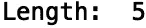

接下来，我们可以使用“type()”方法来验证我们的列表对象类型:

```
print(type(languages))
```

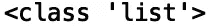

现在让我们使用' dir()'来查看 list 对象可用的所有方法和属性:

```
print(dir(languages))
```

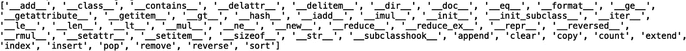

现在，让我们考虑“append()”方法。我们可以使用 append 方法向列表中添加元素。首先，让我们打印“语言”列表:

```
print(languages)
```

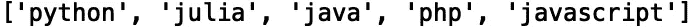

让我们使用“append”方法将“scala”添加到我们的列表中，并打印结果:

```
languages.append('scala')
print(languages)
```

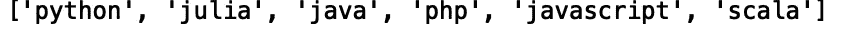

我们还可以在 for 循环中追加值:

```
for i in range(5):    
    languages.append('scala')
print(languages)
```

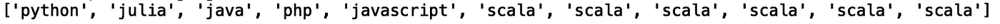

另一个有用的方法是“count()”。我们可以用这个方法来计算一个值在列表中出现的次数:

```
languages = ['python', 'swift', 'julia', 'ruby', 'go']
languages.append('scala')
for i in range(5):    
    languages.append('scala')
print("Count:",languages.count('scala'))
```

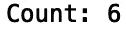

我们还可以使用“clear()”方法删除所有元素:

```
languages.clear()
print("Empty list: ", languages)
```


让我们重新定义我们的原始列表:

```
languages = ['python', 'swift', 'julia', 'ruby', 'go']
```

接下来，我们可以使用“copy()”方法将列表的浅层副本存储在一个新变量中:

```
languages_copy =  languages.copy()
```

为了验证这是一个浅层拷贝而不是引用，让我们通过将“sql”追加到“languages_copy”来修改“languages_copy”:

```
languages_copy.append('sql')
print(languages)
print(languages_copy)
```

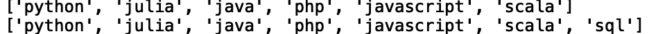

我们看到“languages_copy”被修改，而“language”未被修改。让我们将其与一个参考进行比较:

```
languages_reference =  languages
languages_reference.append('r')
print(languages)
print(languages_reference)
```

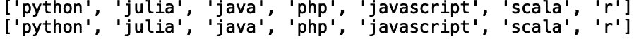

正如我们所料，修改“languages_reference”列表也会修改原始语言列表，这在许多情况下并不是理想的行为。浅层复制方法在一定程度上解决了这个问题。现在，如果我们有一个如下的列表列表:

```
languages = [['python', 'swift'], ['julia', 'ruby', 'go']]
languages_copy =  languages.copy()
```

我们修改了子列表中的一个元素，例如将“julia”改写为“r”:

```
languages_copy[1][0] = 'r'
print(languages)
print(languages_copy)
```

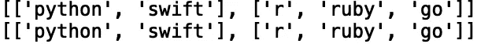

这也将修改原始列表。这是浅层拷贝的一个局限。副本只有一层，所有后续层都是对原始对象的引用。为了执行深度复制，我们使用“复制”模块中的“deep copy()”方法:

```
import copy
languages = [['python', 'swift'], ['julia', 'ruby', 'go']]
languages_deep_copy = copy.deepcopy(languages)
```

现在我们可以在副本中修改子列表的元素，而不修改原始列表:

```
languages_deep_copy[1][0] = 'r'
print(languages)
print(languages_deep_copy)
```

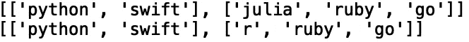

我们要讨论的下一个方法是“extend()”，它允许我们将一个列表中的元素添加到另一个列表中。这里我们有两个城市列表，我们将使用' extend()'将一个列表的元素添加到另一个列表中。

```
list_one = ['New York', 'Boston', 'Los Angeles']
list_two = ['Dallas', 'Portland', 'Hoboken']
list_one.extend(list_two)
print(list_one)
```

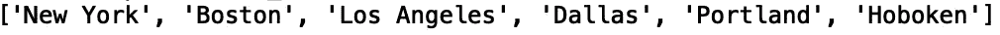

另一个有用的方法是“reverse()”，它允许我们在适当的位置反转列表中的元素。让我们为我们最初的“语言”列表这样做:

```
languages = ['python', 'swift', 'julia', 'ruby', 'go']
languages.reverse()
print(languages)
```

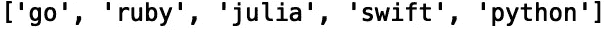

此外，我们有“sort()”方法，它允许我们按数字或字母顺序对元素进行排序。对于我们的语言列表，我们有:

```
languages = ['python', 'swift', 'julia', 'ruby', 'go']
languages.sort()
print(languages)
```

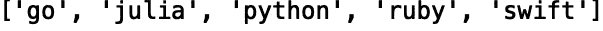

如果我们有一个数字列表:

```
list_of_numbers = [10, 300, 1, 400, 10]
list_of_numbers.sort()
print(list_of_numbers)
```

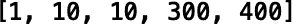

我们将讨论的最后一个方法是“pop()”方法。此方法接受一个索引，并返回和移除该索引处的元素。如果没有提供索引，它将返回并删除最后一个值:

```
languages = ['python', 'swift', 'julia', 'ruby', 'go']
print("Last element: ",languages.pop())
```


如果我们想返回并删除第三个索引处的值，我们应该得到“julia”:

```
languages = ['python', 'swift', 'julia', 'ruby', 'go']
print("Third index element: ",languages.pop(2))
```

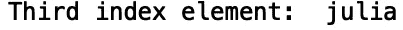

我将在这里停下来，但是我鼓励你自己尝试这些列表方法。

## 结论

总之，在这篇文章中，我们讨论了 python 中的列表方法。我们讨论了如何计算列表中的值，复制列表，反转列表中的元素，排序列表值，清除列表值，弹出列表值等等。我希望你觉得这篇文章有用/有趣。感谢您的阅读！