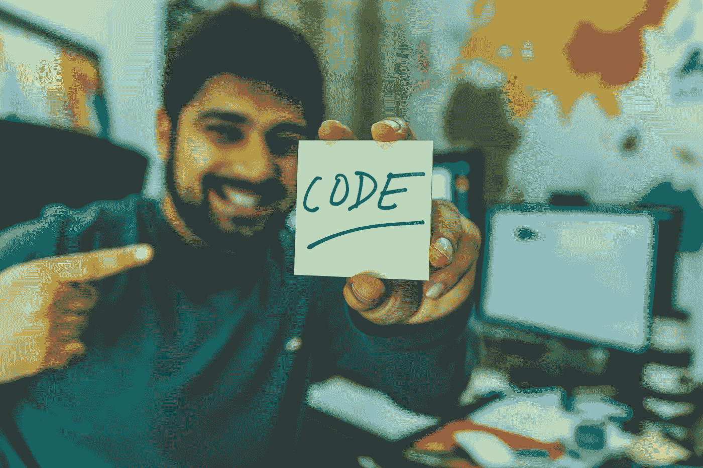

# 掌握 Python 中的机器学习

> 原文：<https://towardsdatascience.com/mastering-machine-learning-in-python-67b8a9e5db50?source=collection_archive---------34----------------------->

## 可访问的机器学习用例



照片由[像素](https://www.pexels.com/photo/man-in-grey-sweater-holding-yellow-sticky-note-879109/)上的 [Hitesh Choudhary](https://www.pexels.com/@hiteshchoudhary) 拍摄

机器学习是使用特征来预测结果测量的过程。机器学习在很多行业都扮演着重要的角色。一些例子包括使用机器学习进行医疗诊断、预测股票价格和广告推广优化。

机器学习采用统计学、数据挖掘、工程学和许多其他学科的方法。在机器学习中，我们使用一组训练数据，其中我们观察过去的结果和特征测量，以建立预测模型。我们可以随后使用这个模型来预测未来事件的结果测量。这种方法被称为监督机器学习。这里还有几个机器学习的用例:

1.  预测森林火灾过火面积
2.  识别图像中的对象
3.  预测医疗成本

在我们继续之前，让我们简要回顾一下一些术语。我们来区分一下有监督和无监督的机器学习。

# **监督机器学习**

*监督学习是*学习一个函数的任务，该函数基于过去的特征-结果对的例子将特征测量映射到结果测量。在受监督的机器学习中，测量输出在本质上可以根据示例而变化。有定量测量结果，我们使用回归模型，定性测量结果，我们使用分类模型。

# **无监督机器学习**

另一种类型的机器学习是*无监督学习*，其中我们只观察特征测量，而不观察结果。*无监督学习*是在没有预先存在的测量结果的情况下发现未检测到的模式的任务。

# 监督学习的定量和定性结果

**定量测量结果(回归)**

例如，在预测森林火灾的燃烧面积时，输出是一种定量测量。可以有大的烧伤面积、小的烧伤面积以及介于两者之间的数值范围。同样，在预测医疗费用的例子中，您可以有大的和小的医疗费用以及介于两者之间的例子。一般来说，价值接近的结果测量具有相似的性质(相似的特征/输入)。

**定性测量结果(分类)**

定性变量是描述性标签或有序分类值的分类或离散变量。在图像分类的例子中，图像标签只是对图像内容的简单描述(例如:建筑物、飞机等等)。定性变量通常用数字代码表示。例如，如果您正在对猫和狗的图像进行分类，猫可以用“0”进行编码，狗可以用“1”进行编码(因为狗更好)。

在这篇文章的剩余部分，我将介绍上面列出的三个机器学习用例。我将开发一个基线模型，用 python 实现，演示回归和分类的监督学习。

我们开始吧！

# **预测森林火灾过火面积**

这个例子的数据包含了来自葡萄牙 Montesinho 自然公园的 517 起火灾。该数据包含烧伤区域和相应的事故周、月和坐标。它还包含气象信息，如雨水、温度、湿度和风力。目标是从包括空间、时间和天气变量在内的大量测量数据中预测烧伤面积。这个例子是一个监督学习回归问题，因为结果测量是定量的。数据可以在[这里](https://www.kaggle.com/sumitm004/forest-fire-area)找到。

首先，让我们进口熊猫。Pandas 是一个 python 库，用于各种任务，包括数据读取、统计分析、数据聚合等等。我们将使用 Pandas 将我们的数据读入所谓的数据帧。数据框是带有标注列的二维数据结构。数据框与 Excel 电子表格非常相似。

让我们用熊猫来读取我们的数据:

```
import pandas as pd df = pd.read_csv("forestfires.csv")
```

让我们打印前五行数据:


让我们使用随机森林模型来进行预测。随机森林使用一组不相关的决策树。决策树是流程图，包含关于数据特征的是或否问题和答案。为了更好地介绍随机森林，我推荐你阅读[了解随机森林](/understanding-random-forest-58381e0602d2)。

对于我们的模型，我们将使用“月”、“温度”、“风”和“雨”来预测烧伤面积。让我们将月份转换成可以用作输入的数值:

```
df['month_cat'] = df['month'].astype('category')
df['month_cat'] = df['month_cat'].cat.codes
```

接下来，让我们定义输入“X”和输出“y”:

```
import numpy as np
X = np.array(df[['month_cat', 'temp', 'wind', 'rain']])
y = np.array(df[['area']]).ravel()
```

然后，我们将数据进行拆分，用于训练和测试:

```
from sklearn.model_selection import train_test_splitX_train, X_test, y_train, y_test = train_test_split(X, y, test_size = 0.2)
```

现在让我们定义我们的随机森林对象，并使我们的模型适合我们的训练数据。这里我们将使用 100 个评估器(决策树的数量)和最大深度 100(要问的问题的数量):

```
reg = RandomForestRegressor(n_estimators = 100, max_depth = 100)
reg.fit(X_train, y_train)
```

然后，我们可以根据测试数据进行预测:

```
y_pred = reg.predict(X_test)
```

我们可以通过运行训练/测试分割和预测计算 1000 次并取所有运行的平均值来评估我们的模型的性能:

```
for i in range(0, 1000):X_train, X_test, y_train, y_test = train_test_split(X, y, test_size = 0.2)

    reg = RandomForestRegressor(n_estimators = 100, max_depth = 100)
    reg.fit(X_train, y_train)

    y_pred = reg.predict(X_test)
    result.append(mean_absolute_error(y_test, y_pred))

print("Accuracy: ", np.mean(result))
```


现在，让我们转到另一个机器学习用例:图像分类。

# **识别图像中的物体**

在本例中，我们将使用来自英特尔图像分类挑战赛的数据构建一个分类模型。它包含了 25k 张森林、海洋、建筑、冰川、山脉和街道的图片。数据可以在[这里](https://www.kaggle.com/puneet6060/intel-image-classification)找到。

我们将使用卷积神经网络(CNN)对图像数据中的对象进行分类。CNN 是一类最常用于计算机视觉的深度神经网络。CNN 发现图像的低级特征，如边缘和曲线，并通过一系列卷积建立更一般的概念。

CNN 的组成包括以下几层:

**卷积层**:滤镜一次扫描几个像素。从这些像素中，生成特征并用于预测每个特征所属的类别。

**汇集层**:该层对卷积层输出的每个特征的信息量进行下采样，同时保留最重要的信息。

**展平图层**:该图层从之前的图层中提取输出，并将它们转换成一个单独的矢量，用于输入。

**完全连接层**:该层将权重应用于生成的特征。

**输出层**:最后一层给出类别预测。

CNN 大致上是受视觉皮层的启发，在视觉皮层中，细胞的小区域对视野中的特定区域很敏感。因此，神经元会在特定方向的边缘出现时放电，共同产生视觉感知。对于 CNN 更彻底的讨论，可以考虑阅读[理解卷积神经网络的初学者指南](https://adeshpande3.github.io/A-Beginner%27s-Guide-To-Understanding-Convolutional-Neural-Networks/)。如果你想进一步了解 CNN，文章[卷积神经网络中的全连接层:完整指南](https://missinglink.ai/guides/convolutional-neural-networks/fully-connected-layers-convolutional-neural-networks-complete-guide/)是另一个有用的资源。

现在让我们建立我们的图像分类模型。本文中的代码灵感来自 Kaggle 内核:[英特尔图像分类(CNN — Keras)](https://www.kaggle.com/vincee/intel-image-classification-cnn-keras) 。

首先，让我们导入必要的包:

```
import os
from sklearn.metrics import confusion_matrix
from sklearn.utils import shuffle                    
import cv2                                 
import numpy as np 
from tensorflow.python.keras.models import Sequential
from tensorflow.python.keras.layers import Dense, Conv2D, MaxPooling2D, Flatten
```

接下来，让我们定义一个加载数据的函数:

```
def load_data():

    datasets = ['seg_train/seg_train', 'seg_test/seg_test']
    output = []

    for dataset in datasets:

        images = []
        labels = []

        print("Loading {}".format(dataset))

        for folder in os.listdir(dataset):
            current_label = class_names_label[folder]            
            for file in os.listdir(os.path.join(dataset, folder)):

                image_path = os.path.join(os.path.join(dataset, folder), file) current_image = cv2.imread(image_path)
                current_image = cv2.resize(current_image, (150, 150)) 

                images.append(current_image)
                labels.append(current_label)

        images = np.array(images, dtype = 'float32')
        labels = np.array(labels, dtype = 'int32')   

        result.append((images, labels))return result
```

然后，我们定义用于训练和测试的数据:

```
(X_train, y_train), (X_test, y_test) = load_data()
```

接下来，让我们定义我们的模型:

```
model = Sequential()
model.add(Conv2D(32, (3, 3), activation = 'relu', input_shape = (150, 150, 3)))
model.add(MaxPooling2D(2,2))        
model.add(Conv2D(32, (3, 3), activation = 'relu'))
model.add(MaxPooling2D(2,2)) model.add(Flatten())
model.add(Dense(128, activation = 'relu'))
model.add(Dense(6, activation = 'softmax'))
```

然后我们编译我们的模型。我们使用稀疏分类交叉熵或对数损失作为损失函数。该指标通常用于衡量分类模型的性能:

```
model.compile(optimizer = 'adam', loss = 'sparse_categorical_crossentropy', metrics=['accuracy'])
```

接下来，让我们来拟合我们的模型。这里，我们将使用一个 epoch(为了节省时间)和 128:

```
model.fit(X_train, y_train, batch_size=128, epochs=1, validation_split = 0.2)
```


接下来，让我们生成预测概率，并选择概率最高的标签:

```
y_pred = model.predict(X_test)
y_pred = np.argmax(y_pred, axis = 1)
```

最后，我们可以使用 seaborn 中的热图混淆矩阵来可视化模型的输出:

```
import seaborn as sns 
confusion_mat = confusion_matrix(y_test, y_pred)
ax = plt.axes()
sns.heatmap(confusion_mat, annot=True, 
           annot_kws={"size": 10}, 
           xticklabels=class_names, 
           yticklabels=class_names, ax = ax)
ax.set_title('Confusion matrix')
plt.show()
```


我们的模型在预测街道和森林方面做得不错，但在其他类别方面还有很多不足之处。随意执行进一步的超参数调整(试验层数、神经元、时期和批量大小)以进一步降低分类错误率。

你也可以试着把这个应用到其他的图像分类问题上。这里可以找到几个[。](https://www.kaggle.com/search?q=image+classification+in%3Adatasets)

现在让我们继续最后一个机器学习用例:预测医疗成本。

# **预测医疗费用**

我们将使用的数据是来自 Brett Lantz 的机器学习入门书[的模拟保险成本数据。这些数据包含主要保险持有人的年龄、性别、身体质量指数、子女数量、吸烟状况、受益人的居住区域以及健康保险支付的个人医疗费用。数据可以在](https://www.packtpub.com/big-data-and-business-intelligence/machine-learning-r)[这里](https://www.kaggle.com/mirichoi0218/insurance)找到。

让我们导入熊猫并将数据读入熊猫数据框:

```
import pandas as pddf = pd.read_csv("insurance.csv")
```

让我们打印前五行数据:

```
print(df.head())
```


正如我们所见，这是一个非常简单的数据集。在本例中，我们将使用年龄、性别、身体质量指数、父母身份、吸烟者身份和地理区域来预测医疗费用。

对于这个例子，我们将构建一个*k*-最近邻回归模型来预测医疗费用。虽然我们将使用*k*-最近邻进行回归，但它也可以用于分类。在这两种情况下，它使用欧几里德距离计算来预测 *k* 最近邻的结果测量。

接下来，让我们将分类列转换成可以用作模型输入的数值:

```
df['sex_cat'] = df['sex'].astype('category')
df['sex_cat'] = df['sex_cat'].cat.codesdf['smoker_cat'] = df['smoker'].astype('category')
df['smoker_cat'] = df['smoker_cat'].cat.codesdf['region_cat'] = df['region'].astype('category')
df['region_cat'] = df['region_cat'].cat.codes
```

接下来，让我们定义输入“X”和输出“y”:

```
import numpy as np
X = np.array(df[['age', 'sex_cat', 'bmi', 'children', 'smoker_cat', 'region_cat']])
y = np.array(df['charges'])
```

让我们将数据分为训练和测试两部分:

```
from sklearn.model_selection import train_test_splitX_train, X_test, y_train, y_test = train_test_split(X, y, test_size = 0.2)
```

现在，让我们定义我们的*k*-最近邻回归模型对象。让我们使用 5 个邻居:

```
from sklearn.neighbor import KNeighborsRegressor
reg = KNeighborsRegressor(n_neighbors = 5)
```

接下来，我们将模型与训练数据进行拟合:

```
reg.fit(X_train, y_train)
```

根据测试数据生成预测:

```
y_pred = reg.predict(X_test)
```

我们现在可以评估我们的模型了。让我们使用平均绝对误差指标:

```
from sklearn.metrics import mean_absolute_error
accuracy = mean_absolute_error(y_test, y_pred)
print("Mean Absolute Error: ", accuracy)
```

最后，让我们来看看我们的输出:

```
import matplotlib.pyplot as plt 
plt.scatter(y_test, y_pred)
plt.xlabel('True')
plt.ylabel('Predicted')
plt.title('K-nearest neighbors')
```


我就说到这里，但是您可以随意调整最近邻居算法，通过调整邻居的数量来调整。一般来说，*k*-最近邻算法更适合异常检测问题。你可以在这里找到这些问题的几个例子[。](https://www.kaggle.com/search?q=anomaly+detection+in%3Adatasets)

# 结论

总之，在这篇文章中，我们讨论了机器学习和三个使用机器学习和统计方法的相关用例。我们简要讨论了监督学习和非监督学习的区别。我们还用两种问题类型的例子区分了回归模型和分类模型。我鼓励您将这些方法应用到其他有趣的用例中。例如，你可以使用 CNN 来检测 x 光图像中的乳腺癌(数据可以在这里找到)或者你可以使用*K*-最近邻来检测信用卡欺诈(数据可以在这里找到)。我希望你觉得这篇文章有趣/有用。如果你有任何问题，请留下评论。这篇文章的代码可以在 [GitHub](https://github.com/spierre91/medium_code/blob/master/what_is_ml.py) 上找到。祝好运，机器学习快乐！