# 驾驭熊猫

> 原文：<https://towardsdatascience.com/mastering-pandas-4e0018c9658f?source=collection_archive---------25----------------------->

## 熊猫的数据操作


照片由[像素](https://www.pexels.com/photo/adult-apple-device-business-code-340152/)上的 [Hitesh Choudhary](https://www.pexels.com/@hiteshchoudhary) 拍摄

Pandas 是一个流行的 python 库，用于数据操作和分析。它支持多种数据格式的各种读取功能。它还提供了各种数据操作工具，如合并、连接和连接。在本帖中，我们将重点介绍如何使用 pandas 的计算工具进行统计分析、开窗和生成滚动统计数据。熊猫的文档可以在[这里](https://pandas.pydata.org/docs/user_guide/index.html#user-guide)找到，熊猫计算工具的文档可以在[这里](https://pandas.pydata.org/docs/user_guide/computation.html)找到。

我们开始吧！

我们将使用“TSLA”和“AAPL”的历史股票价格(过去 5 年的数据)在熊猫身上演示这些方法。“TSLA”的数据可以在这里[找到](https://finance.yahoo.com/quote/TSLA/history?p=TSLA)，而“AAPL”的数据可以在这里找到[。](https://finance.yahoo.com/quote/AAPL/history?p=AAPL)

首先，让我们使用 pandas 导入数据:

```
import pandas as pd 
pd.set_option('display.max_columns', None)
pd.set_option('display.max_rows', None)df_TSLA = pd.read_csv("TSLA.csv")
```

让我们打印前五行:

```
print(df_TSLA.head())
```

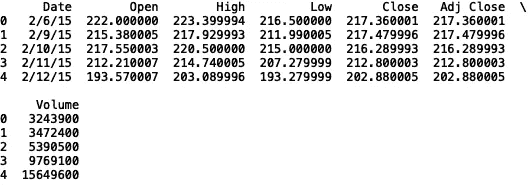

我们可以做的第一件事是使用“pct_change”方法，该方法可用于熊猫系列和数据帧。让我们在“开放”栏中尝试一下:

```
print(df_TSLA[‘Open’].pct_change().head())
```

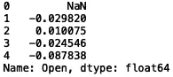

我们也可以对“打开”、“高”、“低”和“关闭”进行同样的操作:

```
print(df_TSLA[["Open", "High", "Low", "Close"]].pct_change().head())
```

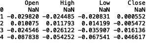

您还可以在“pct_change”方法中指定一个期间。例如，如果我们想计算每列每 3 条记录的百分比变化:

```
print(df_TSLA[["Open", "High", "Low", "Close"]].pct_change(periods = 3).head(6))
```


您还可以计算列之间的协方差。让我们计算“TSLA”价格和“AAPL”价格之间的协方差。首先，让我们读入‘AAPL’的数据:

```
df_AAPL = pd.read_csv("AAPL.csv")
```

让我们指定两个系列，一个是“TSLA”公开价格，另一个是“AAPL”公开价格:

```
Series_TSLA = df_TSLA['Open']
Series_AAPL = df_AAPL['Open']
```

现在让我们打印协方差:

```
print("Covariance Between TSLA and AAPL:", Series_TSLA.cov(Series_AAPL))
```

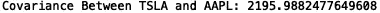

您还可以计算数据框中系列之间的成对协方差。对于“TSLA”，我们得到:

```
print(df_TSLA.cov().head())
```

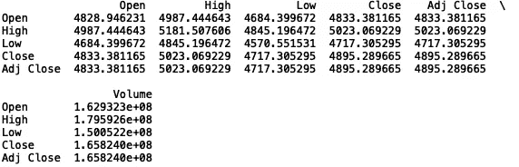

对于“AAPL”:

```
print(df_AAPL.cov().head())
```

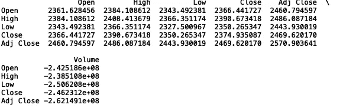

我们可以对相关性做同样的事情:

```
print("Correlation Between TSLA and AAPL:", Series_TSLA.corr(Series_AAPL))
```

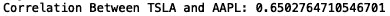

对于“TSLA”数据帧内的系列的成对相关:

```
print(df_TSLA.corr().head())
```

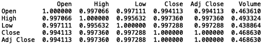

对于“AAPL”:

```
print(df_AAPL.corr().head())
```

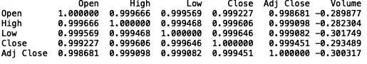

pandas 中提供了几种计算窗口和滚动统计的方法。这包括总和、平均值、中间值、相关性等等。我们将在下面演示其中的一些。

让我们计算未平仓“AAPL”价格的累计总和:

```
print(df_AAPL['Open'].cumsum().head())
```


我们也可以用我们选择的窗口大小来计算滚动平均值。让我们计算窗口大小为 10 的“AAPL”的滚动平均开盘价:

```
print(df_AAPL['Open'].rolling(window = 10).mean().head(20))
```

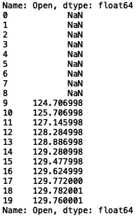

我们也可以将这些结果可视化。首先，让我们将日期转换为日期-时间对象，将日期-时间设置为数据框索引，并选择“打开”列:

```
df_AAPL = df_AAPL[['Date', 'Open']]
df_AAPL['Date'] = pd.to_datetime(df_AAPL['Date'])
df_AAPL.set_index('Date', inplace = True)
df_AAPL = df_AAPL['Open']
```

现在让我们使用 matplotlib 和 seaborn 绘图:

```
import seaborn as sns
import matplotlib.pyplot as pltsns.set()
plt.xlabel('Date')
plt.ylabel('Price')
df_AAPL.plot(style = 'k--')df_AAPL.rolling(window = 10).mean().plot(style = 'k')
```

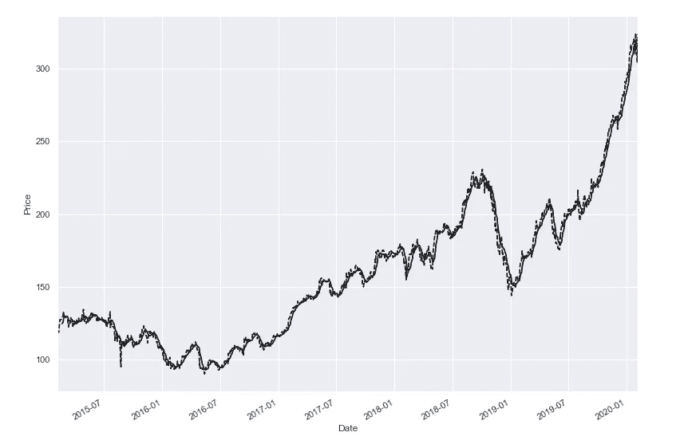

我就说到这里，但是你可以随意使用我在这篇文章中提到的一些方法。尝试寻找额外的数据集，这些方法可以提供对数据趋势的有用见解。我也鼓励你探索 pandas 中的一些额外的计算工具，比如自定义函数应用、时间感知窗口、聚合等等。

概括地说，在这篇文章中，我讨论了 python pandas 库中可用的一些计算工具。我讲述了如何生成汇总统计数据，如熊猫系列之间的协方差和相关性，以及如何生成滚动统计数据，如累积和及滚动平均值。我希望这篇文章对你有用。这篇文章的代码可以在 GitHub 上找到。感谢您的阅读！