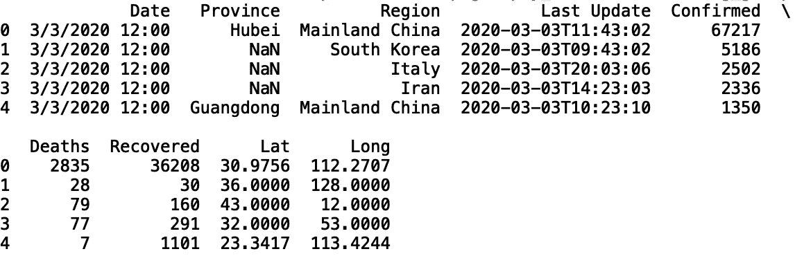
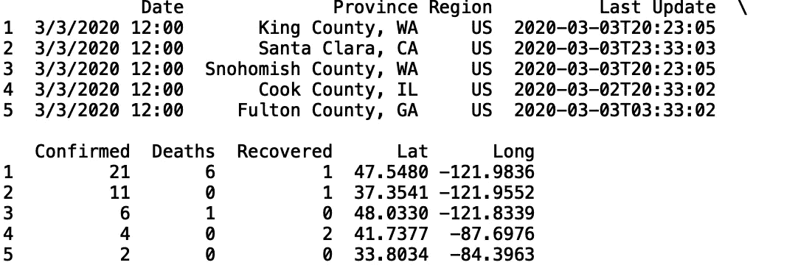

# 掌握熊猫小组

> 原文：<https://towardsdatascience.com/mastering-pandas-groupby-efc6600d093?source=collection_archive---------25----------------------->

## 了解 Groupby 方法


[来源](https://www.pexels.com/photo/crowd-reflection-color-toy-1679618/)

Pandas 是一个 python 库，提供数据转换和统计分析工具。pandas 中的“groupby”方法允许我们对大量数据进行分组，并对这些组执行操作。在本帖中，我们将讨论如何在熊猫中使用“分组”方法。出于我们的目的，我们将使用*全球冠状病毒数据集*，它可以在[这里](https://www.kaggle.com/de5d5fe61fcaa6ad7a66/coronavirus-dataset-update-0206)找到。

我们开始吧！

首先，我们将名为“2019-nCoV-cases-JHU.csv”的文件读入一个熊猫数据框:

```
import pandas as pd 
df = pd.read_csv("2019-nCoV-cases-JHU.csv")
```

接下来，让我们打印前五行数据:

```
print(df.head())
```



为了简单起见，让我们将数据限制为仅包括美国的记录:

```
df = df[df['Region'] == 'US'] #filter to only include US data
df.reset_index(inplace = True) #reset index
del df['index'] # remove old index
print(df.head())
```


我们可能不需要考虑“省”的“未分配位置(来自钻石公主)”值，所以我们也把它去掉:

```
df = df[df['Province'] != 'Unassigned Location (From Diamond Princess)']
print(df.head())
```



现在，让我们通过提取“省”列中字符串值的最后两个字符来创建一个“州”列:

```
df['State'] = df['Province'].str[-2:]
```

我们可以做一些类似的事情来创建一个“县”列。让我们提取“省”列中字符串值的所有字符，不包括最后 4 个字符:

```
df['County'] = df['Province'].str[:-4]
print(df.head())
```


接下来，让我们将日期列转换成熊猫的“日期时间”:

```
df['Date'] = pd.to_datetime(df['Date'], format ='%m/%d/%Y %H:%M')
```

我们现在处于执行一些有趣的“分组”操作的有利位置。让我们在州级生成一些对应于数字列值的统计数据，如死亡、确诊病例和恢复。

为此，让我们首先在州级执行“分组”:

```
gb = df.groupby('State')
```

这里，我们创建了一个“groupby”对象。接下来我们可以做的是拉一个特定的组。我们可以使用“get_group”方法来实现这一点。让我们得到对应于 CA 的组，并将索引设置为日期:

```
df_ca = gb.get_group('CA').set_index('Date')
print(df_ca.head())
```


我们还可以迭代“groupby”对象，并为每个州创建一个包含一列的数据框:

```
deaths = pd.DataFrame()
for name, group in df.groupby('State'):
    if deaths.empty:
        deaths = group.set_index('Date')[["Deaths"]].rename(columns={"Deaths": name})
    else:
        deaths = deaths.join(group.set_index('Date')[["Deaths"]].rename(columns={"Deaths": name}))
```

让我们打印包含分组死亡统计数据的结果数据框:

```
print(deaths.head())
```


请注意，该数据包含有限数量的状态。我们还可以使用 describe 方法来获得关于新数据的基本统计信息:

```
death_stats = deaths.describe()
death_stats = death_stats.astype(int)
print(death_stats)
```


这里，计数对应于行数。我们还有死亡人数的平均值、标准差、百分位数、最小值和最大值。请注意，该数据中的最新记录对应于 2020 年 3 月 3 日，这是在病例大规模爆发之前。我们可以定义一个函数，为给定的数字列自动生成这些统计信息:

```
def get_statistics(column_name):
    column_df = pd.DataFrame()

    for name, group in df.groupby('State'):
        if column_df.empty:
            column_df = group.set_index('Date')[[column_name]].rename(columns={column_name: name})
        else:
            column_df = column_df.join(group.set_index('Date')[[column_name]].rename(columns={column_name: name}))

    column_df.fillna(0, inplace = True)    

    column_stats = column_df.describe()
    column_stats = column_stats.astype(int)
    print(column_stats)
```

让我们用“已确认”列作为输入来调用这个函数:

```
get_statistics("Confirmed")
```


并且恢复了:

```
get_statistics("Recovered")
```


我们也可以将索引设置为天数。让我们创建一个日列，并使用日编号作为索引为“已确认”列生成分组统计信息:

```
df['Day'] = df['Date'].dt.daydef get_statistics_day(column_name):
    column_df = pd.DataFrame()

    for name, group in df.groupby('State'):
        if column_df.empty:
            column_df = group.set_index('Day')[[column_name]].rename(columns={column_name: name})
        else:
            column_df = column_df.join(group.set_index('Day')[[column_name]].rename(columns={column_name: name}))

    column_df.fillna(0, inplace = True)    

    column_stats = column_df.describe()
    column_stats = column_stats.astype(int)
    print(column_stats)get_statistics_day("Confirmed")
```


这些是对应于各州每日确诊病例的统计数据。我就讲到这里，但我鼓励您继续研究代码和数据。例如，您可以尝试在县一级生成这些统计数据。您只需将“groupby('State ')”更改为“groupby('County ')”。

## 结论

总之，在这篇文章中，我们讨论了如何使用熊猫的“分组”方法。我们对冠状病毒引起的美国确诊病例、康复和死亡进行了分组统计。我们使用日期时间值和天数值作为索引来生成这些统计数据。我希望你觉得这篇文章有用/有趣。这篇文章的代码可以在 GitHub 上找到。感谢您的阅读！