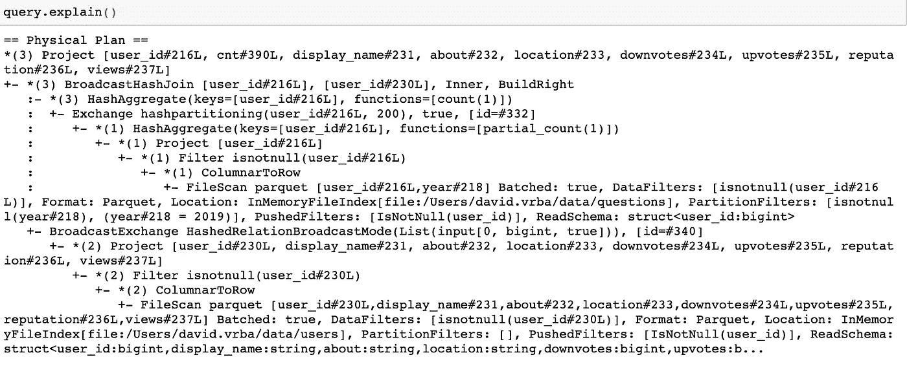
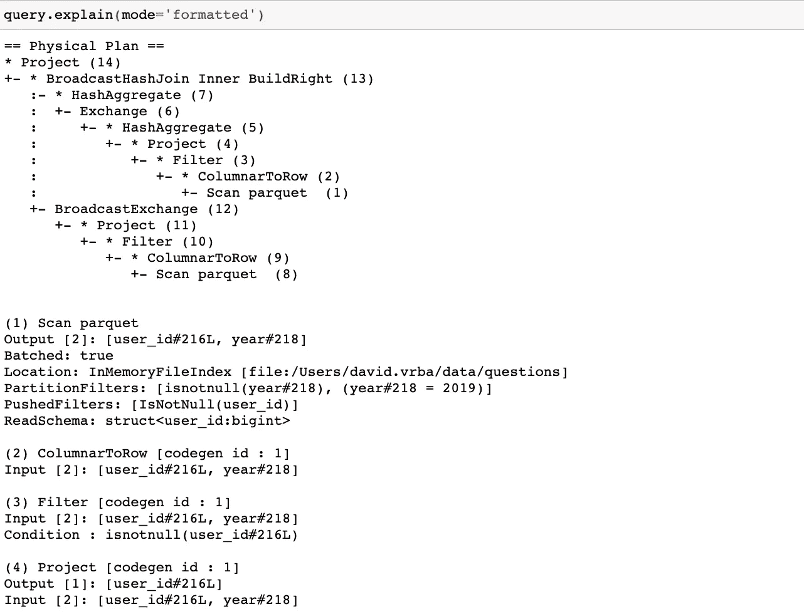
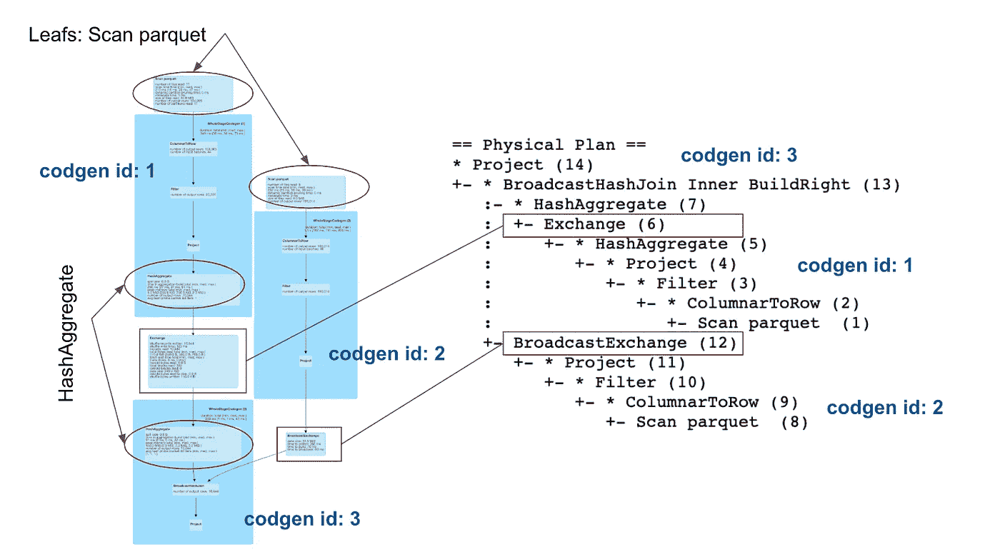
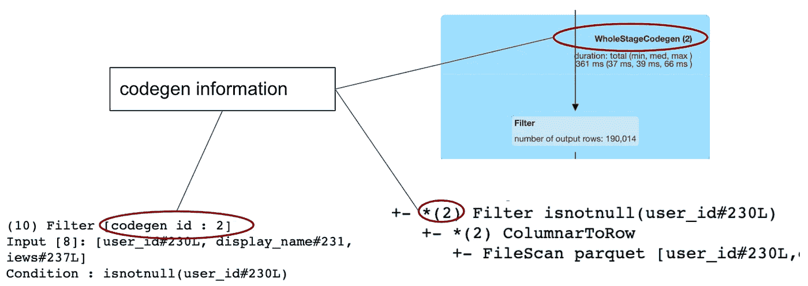

# 掌握 Spark 3.0 中的查询计划

> 原文：<https://towardsdatascience.com/mastering-query-plans-in-spark-3-0-f4c334663aa4?source=collection_archive---------1----------------------->

## 简单地说，Spark 查询计划。

在 Spark SQL 中，查询计划是理解查询执行细节的切入点。它携带了大量有用的信息，并提供了关于查询将如何执行的见解。这一点非常重要，尤其是在工作负载较重或者执行时间较长且成本较高的情况下。基于来自查询计划的信息，我们可以找出哪些是低效的，并决定重写部分查询以获得更好的性能。

对于不熟悉查询计划的人来说，乍一看，这些信息可能有点神秘。它有一个树形结构，每个节点代表一个操作符，提供一些关于执行的基本细节。官方的 Spark 文档在其他方面写得很好，信息量也很大，但在涉及到执行计划时就显得不够了。这篇文章的动机是提供一些熟悉的物理平面图，我们将参观一些最常用的运营商，并解释他们提供什么信息以及如何解释它。

这里介绍的理论主要基于对 Spark 源代码的研究，以及日常运行和优化 Spark 查询的实践经验。

## 基本示例设置

为了简单起见，让我们考虑一个查询，其中我们应用了一个过滤器，执行了一个聚合，并与另一个数据帧连接:

```
# in PySpark API:query = (
  questionsDF
  .filter(col('year') == 2019)
  .groupBy('user_id')
  .agg(
     count('*').alias('cnt')
  )
  .join(usersDF, 'user_id')
)
```

你可以以这样一种方式来考虑这个例子中的数据，即 *usersDF* 是一组用户，他们提出由 *questionsDF 表示的问题。*问题由*年*栏划分，这是提出问题的年份。在查询中，我们对 2019 年问的问题感兴趣，对于每个用户，我们想知道他/她问了多少个问题。同样对于每个用户，我们希望在输出中有一些额外的信息，这就是为什么我们在聚合之后加入了 *usersDF* 。

有两种基本方法可以看到物理平面图。第一种是在显示计划文本表示的数据帧上调用*解释*功能:



Spark 3.0 在这方面有了一些改进，现在*解释*函数有了新的参数*模式*。该参数的值可以是下列值之一:*格式化*、*成本*、*代码生成*。使用*格式的*模式将查询计划转换为组织更好的输出(这里只显示了计划的一部分):



因此，在格式化的计划中，您可以看到“裸”树，它只有带括号的操作符名称。在树的下面，有一个由数字引用的每个操作符的详细描述。*成本*模式除了显示物理计划之外，还将显示优化的逻辑计划，以及每个操作员的统计数据，这样您就可以看到在不同的执行步骤中，数据大小的估计值。最后， *codegen* 模式显示了将要执行的生成的 java 代码。

查看计划的第二个选项是 Spark UI 中的 SQL 选项卡，其中列出了所有正在运行和已完成的查询。通过单击您的查询，您将看到物理规划的图形表示。在下面的图片中，我将图形表示与格式化的文本树结合起来，以查看它们是如何相互对应的:



这里的区别在于，图形表示的叶节点在顶部，根节点在底部，而文本树是颠倒的。

## 崩溃代码生成阶段

在物理计划的图形表示中，您可以看到操作符被分组到蓝色的大矩形中。这些大矩形对应于*代号*阶段。这是一个优化特性，发生在物理规划阶段。有一个名为 *CollapseCodegenStages* 的规则负责这一点，其思想是将支持代码生成的操作符合并在一起，通过消除虚函数调用来加速执行。不是所有的操作符都支持代码生成，所以有些操作符(例如*交换*)不是大矩形的一部分。在我们的例子中，有三个 *codegen* 阶段对应于三个大矩形，在格式化的计划输出中，您可以在操作符的括号中看到 *codegen* 阶段的 *id* 。同样从树中，你可以看出一个操作者是否支持*代码*，因为如果*代码*被支持，括号中会有一个对应阶段*代码* *id* 的星号。



现在让我们简要描述一下如何解释查询计划中的每个操作符。

## 扫描拼花地板

*Scan parquet* 操作符表示从 parquet 文件格式中读取数据。从详细信息中，可以直接看到从源中将选择哪些列。尽管我们没有在查询中选择特定的字段，但是在优化器中有一个 *ColumnPruning* 规则将被应用，它确保只从源中选择那些实际需要的列。我们在这里还可以看到两种类型的过滤器:*分区过滤器*和*推送过滤器*。 *PartitionFilters* 是应用于列的过滤器，数据源通过这些列在文件系统中进行分区。这些非常重要，因为它们允许跳过我们不需要的数据。检查过滤器是否在这里正确传播总是好的。这背后的想法是读取尽可能少的数据，因为 I/O 是昂贵的。在 Spark 2.4 中，还有一个字段 *partitionCount* ，它是实际扫描的分区数量，但是这个字段在 Spark 3.0 中不再存在。

另一方面, *PushedFilters* 是字段上的过滤器，可以直接推送到 parquet 文件，如果 parquet 文件按这些过滤的列排序，它们会很有用，因为在这种情况下，我们也可以利用内部 parquet 结构跳过数据。parquet 文件由行组组成，文件的页脚包含关于每个行组的元数据。该元数据还包含统计信息，例如每个行组的最小*值*和最大*值*，基于该信息，Spark 可以决定是否读取该行组。

## 过滤器

*Filter* 操作符非常直观易懂，它只是表示过滤条件。可能不太明显的是操作符是如何创建的，因为它通常不直接对应于查询中使用的过滤条件。原因是所有的过滤器首先由催化剂优化器处理，催化剂优化器可以修改和重新定位它们。在将逻辑过滤器转换为物理运算符之前，有几个规则应用于它们。让我们在这里列出一些规则:

*   PushDownPredicates 此规则将通过其他几个运算符(但不是所有运算符)将过滤器推至更靠近源的位置。例如，它不会通过不确定的表达式来推动它们。如果我们使用诸如*第一个*、*最后一个*、 *collect_set* 、 *collect_list* 、 *rand* (和其他一些)*、*之类的函数，那么*过滤器*将不会被推过它们，因为这些函数在 Spark 中是不确定的。
*   CombineFilters 将两个相邻的运算符合并为一个运算符(它将两个后续筛选器中的条件收集到一个复合条件中)。
*   InferFiltersFromConstraints —该规则实际上创建了一个新的*过滤器*操作符，例如从一个连接条件(从一个简单的内部连接它将创建一个过滤条件*连接关键字不为空*)。
*   PruneFilters —删除多余的过滤器(例如，如果一个过滤器总是评估为*真*)。

## 项目

该操作符只是表示将要投影(选择)的列。每次我们在数据帧*上调用 *select* 、 *withColumn、*或 *drop* 转换时，* Spark 会将 *Project* 操作符添加到逻辑计划中，然后转换为物理计划中的对应项。同样，在转换之前，会对其应用一些优化规则:

*   ColumnPruning —这是我们上面已经提到的规则，它删除不需要的列，以减少将要扫描的数据量。
*   CollapseProject —它将相邻的*项目*操作符合并为一个。
*   PushProjectionThroughUnion —该规则将推动*项目*通过*联合*操作符的两侧。

## 交换

*交换*操作符代表 shuffle，这是集群上的物理数据移动。这种操作被认为是非常昂贵的，因为它通过网络移动数据。查询计划中的信息还包含有关如何对数据进行重新分区的详细信息。在我们的示例中，它是 *hashpartitioning(user_id，200)* ，如下所示:


这意味着数据将根据 *user_id* 列重新划分为 200 个分区，并且具有相同值 *user_id* 的所有行将属于同一个分区，并且将位于同一个执行器上。为了确保正好创建 200 个分区，Spark 将总是计算 *user_id* 的散列，然后计算模 200 的正数。这样做的结果是更多不同的 *user_id* 将位于同一分区中。还可能发生的情况是，一些分区可能会变空。还有其他类型的分区值得一提:

*   RoundRobinPartitioning —通过这种分区，数据将随机分布到 *n 个*大小大致相等的分区中，其中 *n* 由用户在 *repartition(n)* 函数中指定
*   SinglePartition —通过这种分区，所有数据都被移动到单个执行器的单个分区中。例如，当调用一个窗口函数时，该窗口成为整个数据帧(当您没有在*窗口*定义中为 *partitionBy()* 函数提供参数时)。
*   RangePartitioning —在调用了 *orderBy* 或 *sort* 转换之后，在对数据进行排序时使用这种分区。

## 哈沙格雷特

该运算符表示数据聚合。它通常由两个运算符组成一对，可能会也可能不会被一个*交换*所分割，正如您在此处看到的:


为了更好地理解这些情况下的*交换*背后的逻辑，您可以查看我以前关于 Spark SQL 中数据分布的[文章](/should-i-repartition-836f7842298c)，我在那里详细描述了它。使用两个 *HashAggregate* 操作符的原因是，第一个操作符执行部分聚合，分别聚合每个执行器上的每个分区。在我们的示例中，您可以在 *Functions* 字段中看到，它表示 *partial_count(1)* 。部分结果的最终合并在第二个*散列集合*中进行。操作员还有*键*字段，显示数据分组所依据的列。*结果*字段显示了聚合后可用的列。

## BroadcastHashJoin & BroadcastExchange

*BroadcastHashJoin (BHJ)* 是一个表示特定连接算法的运算符。除此之外，Spark 中还有其他可用的连接算法，如 *SortMergeJoin* 或 *ShuffleHashJoin* ，要了解更多，你可以查看我的另一篇关于 Spark 3.0 中连接的文章。 *BHJ* 总是与 *BroadcastExchange* 成对出现，BroadcastExchange 是一个代表广播洗牌的操作符——数据将被收集到驱动程序，然后发送到每个执行器，在那里它将可用于加入。

## ColumnarToRow

这是 Spark 3.0 中引入的一个新操作符，它被用作列执行和行执行之间的过渡。

## 结论

Spark SQL 中的物理计划由携带关于执行的有用信息的操作符组成。对每个操作者有一个正确的理解可能有助于获得关于执行的洞察力，并且通过分析计划，我们可能发现什么不是最佳的，并且可能尝试修正它。

在本文中，我们描述了 Spark 物理计划中经常使用的一组操作符。这个集合决不是完整的，但是我们试图把重点放在常用的并且很可能出现在基本分析查询计划中的操作符上。