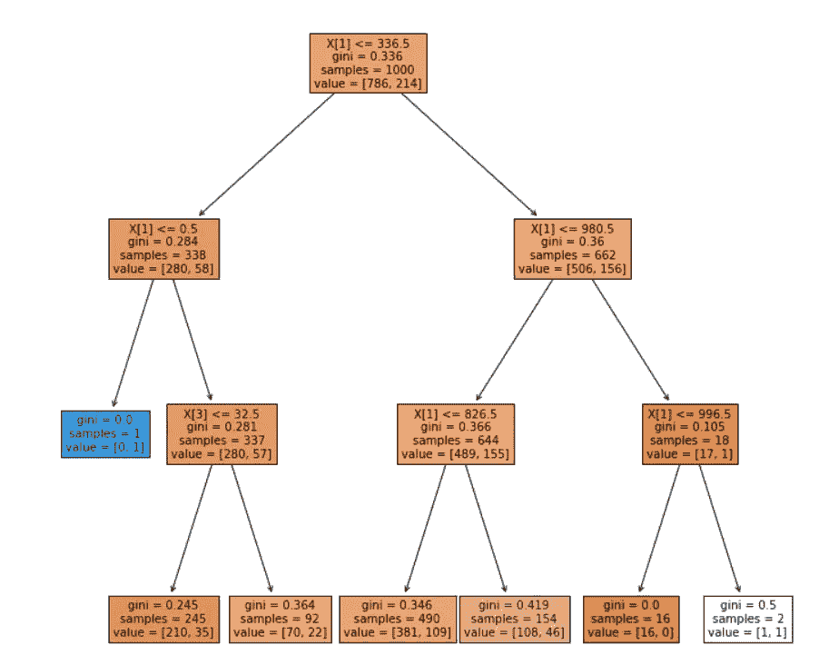
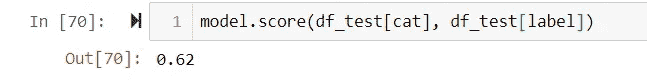

# 掌握随机森林:综合指南

> 原文：<https://towardsdatascience.com/mastering-random-forests-a-comprehensive-guide-51307c129cb1?source=collection_archive---------9----------------------->

## 随机森林是每个数据科学家或机器学习工程师的工具包中应该拥有的最强大的算法之一。在本文中，我们将采用代码优先的方法来理解 sklearn 的随机森林所提供的一切！

库纳尔·辛德在 [Unsplash](https://unsplash.com?utm_source=medium&utm_medium=referral) 上拍摄的照片

## 决策树

为了理解随机森林，有必要了解它们是由什么构成的。决策树是所有基于树的算法的基础构件。其他所有基于树的算法都是复杂的决策树集合。因此，理解决策树的各个方面将是一个很好的起点。

根据“医疗预约数据集”训练的决策树[图片由作者提供]

由于决策树可以是任何深度(如果深度没有被明确指定)，决策树倾向于过度适应每个数据点。这将导致 100%的准确性，但是该模型不会推广到它在训练期间没有看到的数据，因此在训练和验证准确性之间会有很大的差异。

训练数据集上的完美准确性[图片由作者提供]

测试数据集的准确性差[图片由作者提供]

决策树的基本思想是可靠的，但是由于缺乏模型复杂性，它们往往表现不佳。每个基于树的算法都试图通过增加额外的复杂性来解决这个问题。

## 随机森林

就像森林是树的集合一样，随机森林只是决策树的集合。在我们深入研究随机森林在机器学习中的相关性之前，让我们简单地讨论一下随机森林是如何工作的。

假设我们正在用 15 棵树构建一个随机的森林分类器。随机森林通过所有 15 棵树运行数据点。

每棵树的预测可以认为是一个‘投票’，投票数最多的类就是随机森林的预测。听起来很简单，对吗？？这是最强大的机器学习算法之一，它的潜力是无穷的。

**如何提高随机森林的性能:**

sklearn 库提供的随机森林模型有大约 19 个模型参数。超参数调整时，我们需要调整的最重要的参数是:

*   **n_estimators** :随机森林中决策树的数量。
*   **max_depth** :每个决策树允许进行的分裂次数。如果分割数太低，模型会对数据进行欠拟合，如果分割数太高，模型会过拟合。一般来说，我们的最大深度是 3、5 或 7。
*   **max_features** :显示给每个决策树的列数。传递给每个决策树的特定特征在每个决策树之间会有所不同。
*   **Bootstrap**:Bootstrap 模型只需要选择列和行的子集来训练每个决策树。因此，模型变得不容易过度拟合数据。

注:通过应用 bootstrap，数据集被分为袋内和袋外(OOB)数据集。这消除了创建验证数据集的需要。

*   **max_samples** :如果 bootstrap 设置为 true，可以传递给每个决策树的最大行数由 max_samples 参数控制。

可用于超参数调整的建议参数网格:

好了，现在我们知道了如何建造一个随机森林，让我们来看看如何充分发挥它们的潜力！

## **随机森林的用途:**

与许多其他机器学习算法不同，随机森林不仅可以用于预测能力。

*   **易于构建:**

随机森林没有基于回归的算法或支持向量机那么多的模型假设。这使我们能够快速建立随机森林，以建立一个基础分数。

此外，即使没有超参数调整，随机森林也能提供一流的精度。与 XGBoost 等大型模型相比，超参数调整的过程要简单得多。

*   **特征重要性**

sklearn 库提供的 Random Forest 类允许您获得数据集中每个列的特性重要性。这在与商业客户打交道时尤其有用。让我们通过考虑一个例子来进一步研究这个问题:

让我们假设我们的客户是一个虚构的房地产公司(XYZ 公司)。这家公司向我们提供了一个相对较小的数据集，记录了过去 5 年他们所在城市的所有销售情况，请求帮助他们将营销活动集中在正确的区域，并非常确定地预测房地产价格。他们提供的数据集中的要素是-买家的年龄、房产的位置、房产的土地面积、房屋/结构的年龄和房产的成本(因变量)

一个很好的方法是通过随机森林。我们必须从建立一个随机森林开始，然后调整上面提到的超参数。

接着，我们可以通过随机森林计算特征重要性，我们可以很容易地找出哪个特征对模型预测贡献最大。假设随机森林告诉我们最重要的特征是买家的年龄。有了这些信息，房地产公司现在就可以根据人们的年龄有针对性地开展营销活动。

[来源](https://scikit-learn.org/stable/auto_examples/ensemble/plot_forest_importances.html)

对于随机森林来说，整个过程需要几个小时才能完成，而对于其他特征选择算法(如 Boruta)或通过比较回归模型的单个斜率来说，同样的过程会非常乏味。

*   **功能选择**

这可以认为是上一点的延伸。通过计算特征重要性，我们可以丢弃不太重要的特征，从而降低模型的维度，提高准确性并减少训练时间。

执行特征选择的另一种方式是递归地混洗数据集中的各个特征，使得它们丢失由该列提供的信息。在这个修改的数据集上评估该模型，以查看分数是如何被影响的。特征越重要，它对分数的影响就越深远。

## 结论

在本文中，我们广泛地研究了随机森林参数、超参数调优，以及在一个示例的帮助下，随机森林在业务用例中仍然非常重要的原因。

了解随机森林的其他来源:

*   [Sklearn 文档](https://scikit-learn.org/stable/modules/generated/sklearn.ensemble.RandomForestClassifier.html)
*   YouTube:[Josh Stammer 的 StatsQuest】(个人最爱)](https://www.youtube.com/watch?v=J4Wdy0Wc_xQ&ab_channel=StatQuestwithJoshStarmer)
*   [FastAI 课程](https://course18.fast.ai/lessonsml1/lesson1.html)