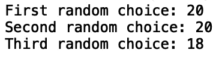
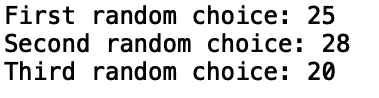
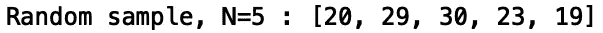
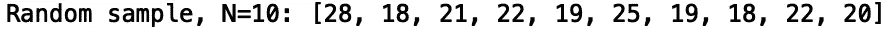
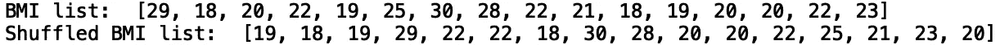
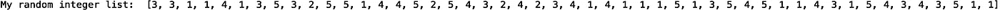
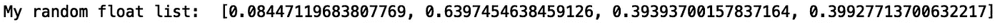
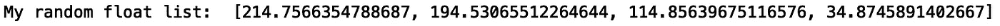
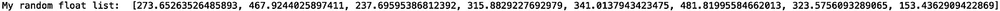
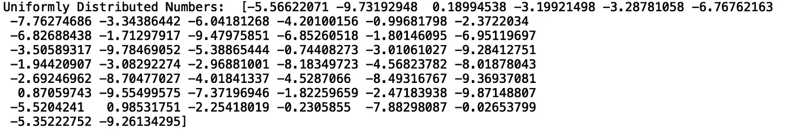

# 掌握 Python 中的随机采样

> 原文：<https://towardsdatascience.com/mastering-random-sampling-in-python-ac2df84b7d3f?source=collection_archive---------15----------------------->

## 在 Python 中使用随机模块


在[的](https://www.pexels.com/photo/woman-selecting-beaded-jewelry-896018/)上由 [Artem Beliaikin](https://www.pexels.com/@belart84) 拍照

Python 提供了许多有用的随机采样工具以及生成随机数的函数。随机抽样在统计学中有应用，在统计学中经常观察到人口的随机子集，并用于对整个人口进行推断。此外，随机数生成在科学中有许多应用。例如，在化学和物理中，蒙特卡罗模拟需要生成随机数。在本帖中，我们将讨论如何从列表中随机抽取项目，以及如何在 python 中生成伪随机数。

我们开始吧！

python 中的 random 模块有许多用于生成随机数和随机采样的函数。

## 使用“random.choice()”在列表中选择随机项目

考虑一下生活在农村地区的人们的身体质量指数价值观列表:

```
bmi_list = [29, 18, 20, 22, 19, 25, 30, 28,22, 21, 18, 19, 20, 20, 22, 23]
```

让我们使用' random.choice()'方法从列表中随机选择单个身体质量指数值:

```
import random 
print("First random choice:", random.choice(bmi_list))
print("Second random choice:", random.choice(bmi_list))
print("Third random choice:", random.choice(bmi_list))
```



如果我们再次运行这段代码，我们应该会得到另一组随机选择的 BMI:



## 使用“random.sample()”在列表中选取随机项目

“random.sample()”方法对于从列表中随机抽取 *N* 个项目非常有用。例如，如果我们想从我们的身体质量指数列表中抽取 *N* =5 个项目，我们执行以下操作:

```
print("Random sample, N = 5 :", random.sample(bmi_list, 5))
```



让我们试着对 10 件物品进行取样:

```
print("Random sample, N = 10:", random.sample(bmi_list, 10))
```



## 使用“random.shuffle()”随机排列列表中的项目

除了随机选择和采样之外，random 模块还有一个在列表中混排项目的功能。让我们打印我们的身体质量指数列表，然后打印改组我们的身体质量指数列表的结果:

```
print("BMI list: ", bmi_list)
random.shuffle(bmi_list)
print("Shuffled BMI list: ", bmi_list)
```



## 使用“random.randint()”生成随机整数

随机模块具有在给定值范围内生成随机整数的功能。让我们生成一个范围从 1 到 5 的随机整数:

```
print("Random Integer: ", random.randint(1,5))
```


使用这个函数，我们可以很容易地在 for 循环中生成一个随机整数列表:

```
random_ints_list = []
for i in range(1,50):
    n = random.randint(1,5)
    random_ints_list.append(n)
print("My random integer list: ", random_ints_list)
```



## 生成随机浮点值

随机模块还具有用于生成 0 和 1 之间的随机浮点值的功能:

```
print("Random Float: ", random.random())
```


我们还可以生成一个 0 到 1 之间的随机浮点数列表:

```
random_float_list = []
for i in range(1,5):
    n = random.random()
    random_float_list.append(n)
print("My random float list: ", random_float_list)
```



此外，我们可以缩放随机浮点数。如果我们想要 0 到 500 之间的随机数，我们只需将随机数乘以 500:

```
random_float_list = []
for i in range(1,5):
    n = random.random()*500
    random_float_list.append(n)
print("My random float list: ", random_float_list)
```



如果我们想添加一个下界，我们可以在追加之前添加一个条件语句。例如，为了生成 100 到 500 之间的随机数，我们执行以下操作:

```
random_float_list = []
for i in range(1,10):
    n = random.random()*500
    if n>=100.0:
        random_float_list.append(n)
print("My random float list: ", random_float_list)
```



## 用“random.uniform()”计算均匀分布的数

随机模块具有计算均匀分布数的功能。例如，要生成 50 个介于-10 和 1 之间的均匀分布的数，我们执行以下操作:

```
import numpy as np
uniform_list = np.random.uniform(-10,1,50)
print("Uniformly Distributed Numbers: ", uniform_list)
```



## 用“random.gauss()”计算正态分布数

最后，random 模块有一个计算正态分布数的函数。例如，要生成 50 个介于-50 和 0 之间的正态分布数，我们执行以下操作:

```
normal_list = np.random.uniform(-50,0,50)
print("Normally Distributed Numbers: ", normal_list)
```


我就讲到这里，但是我鼓励你自己去研究代码。

## 结论

总之，我们讨论了如何在 python 中从列表中随机选择和采样项目。我们展示了如何使用' random.choice()'方法从列表中随机选择一个条目。我们还使用了“random.sample()”方法，它允许您从列表中随机选择 *N* 个项目。我们还讨论了如何使用“random.shuffle()”方法对列表中的项目进行排序。此外，我们展示了如何使用 random 模块生成随机数。我们使用“random.randint()”生成随机整数，使用“random.random()”生成随机浮点值。最后，我们讨论了如何分别用“random.uniform()”和“random.gauss()”生成均匀分布和正态分布的数字。我希望你觉得这篇文章有用/有趣。这篇文章中的代码可以在 [GitHub](https://github.com/spierre91/medium_code/upload) 上找到。感谢您的阅读！