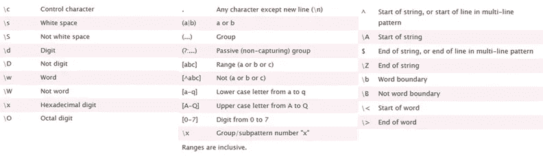

# 掌握日常任务的正则表达式(Regex)

> 原文：<https://towardsdatascience.com/mastering-regular-expressions-for-your-day-to-day-tasks-b01385aeea56?source=collection_archive---------51----------------------->

可以应用正则表达式(Regex)的用例数量是巨大的。无论您是收集数据的数据科学家、自动化业务流程的白领还是旨在从更大规模的学术期刊中提取数据的学生，Regex 都可能成为您最好的朋友。

想想万维网是一个难以置信的全面的(结构化的、半结构化的或相当非结构化的)数据来源，有趣的事实和数字经常保存在网页上，你可能会发现自己处于想要访问这些数据的情况。在大多数情况下是网页、软件提供商等。没有提供一个简单的 API 来访问或下载数据(免费)，这就是为什么您可能想要找到一个定制的解决方案来自己获取数据。


这都是关于我的模式

## 这就是我们在快速阅读中处理正则表达式的方式

我经常发现阅读涉及正则表达式的文章，其中有简短的不相关的例子和解释，很难理解。我将尝试用不同的方式来处理这个话题:

1.  提供一个非常简短和方便的**正则表达式备忘单**
2.  快速浏览一下**组**和他们如何完美地**增强我们的模式**
3.  **问题的定义，而不是给定模式的描述**，例如“作为一个用户，我想找到所有数据，直到点”。“是达成了

为了让您对几个简单的正则表达式示例有个印象，我们将浏览一个丰富多彩的用例组合——无论我们去哪里，正则表达式都将允许我们掌握所有的请求。

我们为什么要这么做？数据分析和数据科学学科的进一步发展在很大程度上依赖于准确和干净的数据，正因为如此，清理和组织以及收集数据大约占数据科学专业的 80%! **对正则表达式的正确理解会让你的工作变得更容易。**


涵盖大部分数据科学日常业务— [福布斯](https://www.forbes.com/sites/gilpress/2016/03/23/data-preparation-most-time-consuming-least-enjoyable-data-science-task-survey-says/#5e9871a36f63)

你会在网上找到详尽的备忘单——我更喜欢在需要的时候准备好最常用的字符。如果你对这些很精通，你应该很容易就能适应写作模式:



感谢 [cheatography](https://cheatography.com/davechild/cheat-sheets/regular-expressions/)

[](https://rumorscity.com/2014/08/21/best-regular-expressions-cheat-sheet/) [## 最佳正则表达式备忘单

### 如果您处理文本，正则表达式是有用的，并且您将会体会到在 Linux 中通过锁定…

rumorscity.com](https://rumorscity.com/2014/08/21/best-regular-expressions-cheat-sheet/) 

**我们将重点介绍两个例子:**

1.  [茶的历史](https://en.wikipedia.org/wiki/Tea) (tea_text)
2.  足球成绩表

在我们开始之前，让我们先看看下面的小抄，然后是**对团队**的简短介绍。

# 组( )

在处理(部分)模式结果时，组是必不可少的。我经常避免使用组，但是这使得很难只提取相关数据。通过在模式中使用'('和')'定义组**。组允许显式定位一组字符，即使该组嵌入在另一个模式中。
编程语言允许查询这些特定的组，然后**直接寻址它们**。要概述分组的一般目的，请遵循以下示例，并确保您理解了这个想法:**

```
“This is the day you will always remember as the day ***you almost caught***Captain Jack Sparrow”
“This is the day you will always remember as the day ***you have not caught*** Captain Jack Sparrow”
“This is the day you will always remember as the day ***you have caught*** Captain Jack Sparrow”
“This is the day you will always remember as the day ***you certainly have caught*** Captain Jack Sparrow”
```

杰克·斯派洛，抱歉，杰克·斯派洛船长或多或少经常被抓，但是我们想知道用了哪些确切的词。所以我们通过一个组来定义我们模式中的相关词。

通过我们的模式‘you \ s***(\ w * \ s *？\ w *)***【scat ed】我们能够提取位于我们确定的模式之间的值。
根据您使用的编程语言(我将使用 Python)，实现正则表达式的语法会有所不同，但是思想总是相同的。如果您的模式找到一个匹配，您可以提取整个匹配，但也可以只提取单个组。方便！
现在，我们已经掌握了小组知识，让我们来看一下例子。

首先，我们从茶文开始。

```
Chinese small-leaf-type tea was introduced into India in 1836 by the British in an attempt to break the Chinese monopoly on tea.[57] In 1841, Archibald Campbell brought seeds of Chinese tea from the Kumaun region and experimented with planting tea in Darjeeling. The Alubari tea garden was opened in 1856 and Darjeeling tea began to be produced.[58] In 1848, Robert Fortune was sent by the East India Company on a mission to China to bring the tea plant back to Great Britain. He began his journey in high secrecy as his mission occurred in the lull between the Anglo-Chinese First Opium War (1839–1842) and Second Opium War (1856–1860).[59] .....
[57] Tea was originally consumed only by anglicized Indians; however, it became widely popular in India in the 1950s because of a successful advertising campaign by the India Tea Board.[57]
```

假设我们想从 tea 摘录中提取注释。为此，我们使用分组逻辑，只提取值，不提取括号——但是我们认为括号是识别注释所必需的，而不是接收任何一位或两位数。

```
pattern = “\[(\d{1,2})\]”
annotations = re.findall(pattern,tea_text)
**[‘57’, ‘58’, ‘59’, ‘57’, ‘57’]**
```

如果我们忽略组的用法，我们将获得文本中出现的注释——用括号括起来。

```
pattern = “\[\d{1,2}\]”
annotations = re.findall(pattern,tea_text)
**['[57]', '[58]', '[59]', '[57]', '[57]']**
```

可能需要提取所有时间跨度，因此我们不想提取例如 1836，但我们希望获得 1839–1842。

```
pattern = “\(\d*.\d*\)” # . could also be explicitly '-'
years = re.findall(pattern,tea_text)
**[’(1839–1842)’, '(1856–1860)’]**
```

更具体地说，我们可能希望提取已经能够定位的时间跨度的年份。为此，我们将极大地依赖于前面概述的群体观念。

```
pattern = “\((\d*).(\d*)\)” # year range
first_years = re.search(pattern,tea_text)
first_years.group(0) # **'(1839–1842)'**
first_years.group(1) # **'1839'**
first_years.group(2) # **'1842'**
first_years.groups() # **('1839', '1842')****## Iterating over all year spans is the easy part:**
single_years = []
for match in re.finditer(pattern,tea_info):
    if match:
        for i in range(len(match.groups())):
            single_years.append(match.group(i+1))single_years # **['1839', '1842', '1856', '1860']**
```

# 替换值

Regex 不仅是查找模式的好方法，也是替换模式的好方法。根据您使用的语言，regex 可用于通过您想要的字符串替换模式。当您希望避免替换为可能影响其他单词的多个值时，这一点特别有用，例如，将“is”替换为“was”可能会产生类似 Thwas…的单词

```
pattern = "(First.*\(\d{4}.\d{4}\))\s*and.(Second.*\(\d{4}.\d{4}\))" # using \s and . to show that results are the same here# Provides the following elements:
**[('First Opium War (1839–1842)', 'Second Opium War (1856–1860)')]**pattern = "First\sOpium\sWar"
replace_word = "1st Opium War"
re.sub(pattern,replace_word, tea_text) **# inplace modification !**#[..] between the Anglo-Chinese **1st Opium War** (1839–1842) and **Second Opium War** (1856–1860).
```

# 计数值

经常发生的次数是一个有趣的事实。可能出现的问题是，值可能是大小写组合的混合，这使得很难将这些值组合在一起。

```
pattern = “[Cc]hinese.(?=[tT]ea)” **# positive lookahead**
occ = len(re.findall(pattern,tea_text)) 
**# normally we would use re.IGNORECASE to achieve this result**
print(‘There are {} occurrences of "Chinese Tea"’.format(occ))**# There are 3 occurrences of "Chinese Tea"**
```

在第二个例子中，最近几场足球比赛的比分被捕获为一个字符串。目的是能够提取球队和他们的进球，一半和全部时间。一个潜在的用例可能是，应计算一个最终表。

鉴于以下比赛结果:

```
game_day = """
Juventus F.C.     -    Napoli                 4:1 (2:0)
A.C. Milan        -    Internazionale F.C.    2:2 (1:0)
A.C. Fiorentina   -    Torino                 1:0 (0:0)
Lazio             -    Atalanta               0:3 (0:2)
Lazio             -    Juventus F.C.          0:4 (0:2)
"""
```

有许多方法来提取球队名称和分数，标点空格和特殊字符，但更复杂的是找到一个适合所有人的解决方案。

想想这两种模式——或者想出一个更好的！

```
**# A more generic approach**
pattern = "
([A-Za-z][\w\.\s]*)-
([a-zA-Z\.\s]*)
(\d):(\d)\s*
\((\d):(\d)"**# A very tailored approach**
pattern = "(\w*\s?\w\.\w\.**|**\w\.\w\.\s*?\w*|\w*) **# note the OR |**
\s*-\s*
(\w*\s?\w\.\w\.|\w\.\w\.\s*?\w*|\w*)\s*
(\d):(\d)\s*\
((\d):(\d)"
```

乍一看，上面的陈述似乎很复杂，但事实并非如此。我使用了两种方法来实现几乎相同的结果，但是一种模式旨在反映我们的示例数据中指出的确切模式，另一种模式遵循一种更通用的方法。

在关注字母、括号和数字之前，让我们先看看图案的整体结构。
通过 **'('** 和 **')'** 可以看出，有几个组允许我们从每个组中提取和寻址数据。如果我们只想使用一个队的名字和比分，或者只是半场比分，等等，这是特别方便的。我们进一步看到' **-** '和'**:【T10]'，它们根据给定的数据让我们清楚地了解正则表达式的结构。**

```
**Pattern 1 (group 1 and 2):**
**#generic:**
[a-zA-Z0–9\.\s]* **#or more precise:**
(\w*\s?\w\.\w\.|\w\.\w\.\s*?\w*|\w*)\s*
```

括号为我们提供了我们允许的字母和字符，这些可以是字母和点。在另一种情况下，我们指的是任何单词字符(\w)，显式点(\。)和空格(\s)。
然后首先接近【a-zA-Z0–9】。\s]*读起来很棒，但是有一个警告，**尾随空格将包含在我们的结果中—** 所以要确保你的程序可以处理这些。第二种方法更加具体，完美地覆盖了我们的测试数据点——这里的警告是，确保没有团队可能没有被模式覆盖。
请注意，我们通过 OR (|)来分隔第二种方法中的模式，这是必要的，因为俱乐部名称中不包含 F.C .或 A.C.。虽然“更丑”，但我更喜欢更具体的版本。
下一组又是同样的模式，因为我们又在寻找足球队了。

```
Pattern 2 - the score:
(\d):(\d)\s*\ **# note: groups!**
```

简单地查询小数(数字)，所以为最终分数。我们没有考虑出现次数的限制，但是为了避免问题，我们也可以使用量词:

```
(\d{,2}):(\d{,2})\s*\ 
# we don’t expect any team to score higher than 99 goals a game.Pattern 3:
\((\d):(\d)# Just repeats the second pattern, however excludes 
# the first bracket ‘\(‘.
```

为了提供一个可以用提取的值做什么的想法，我在下面创建了一个简单的“表格计算器”。这个计算器使用输入的球队和分数，并分配他们的分数。
如果我们在所有给定的比赛中使用这个正则表达式，我们最终可以计算出整个排行榜——只是一个想法:

还有更多的东西有待发现，我希望这几行文字能够激发您对 regex 的兴趣。

下次见，注意安全！

## # Regex # Python #数据科学#6040 #CS6040