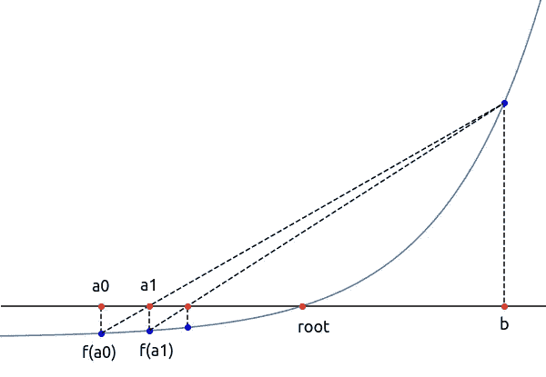
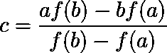
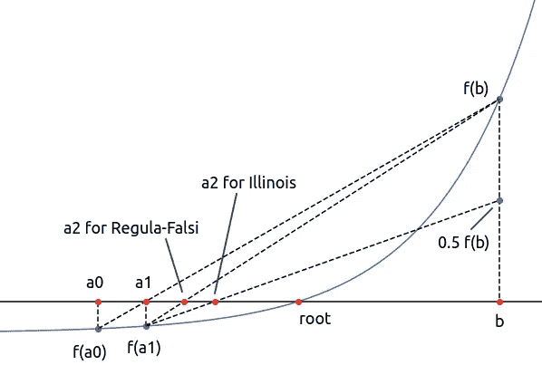
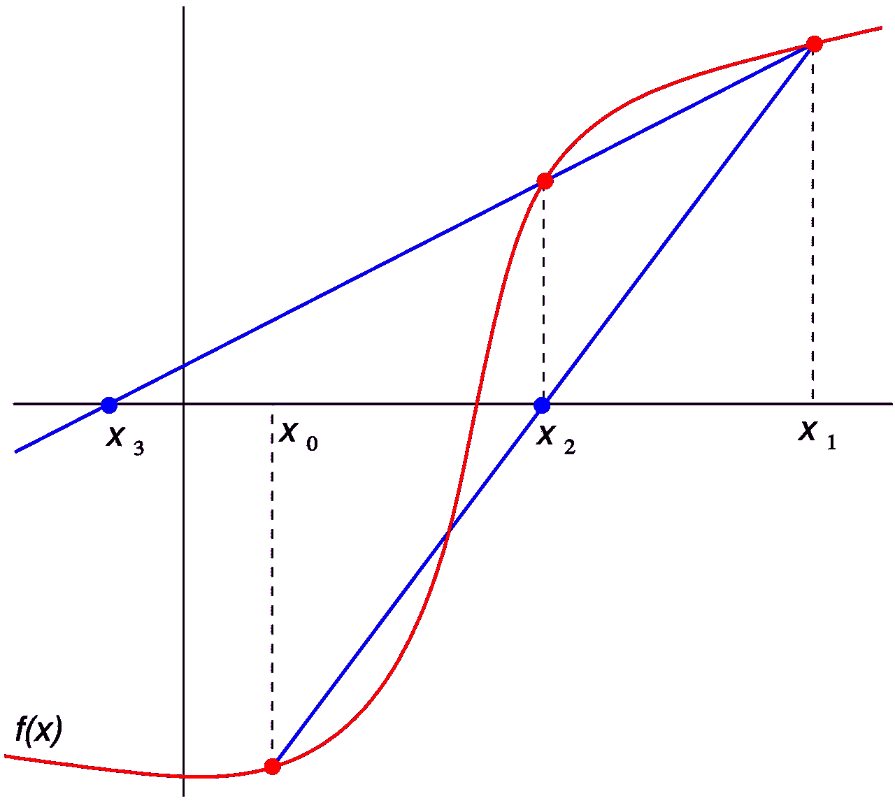
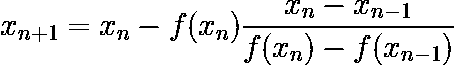
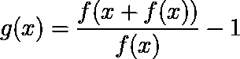
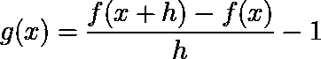
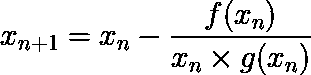
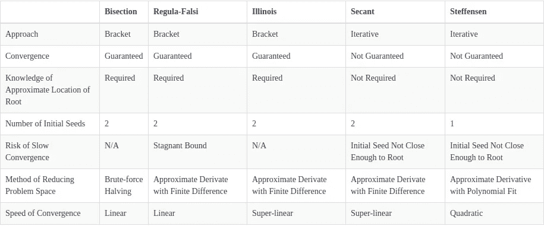

# Python 中高效的根搜索算法

> 原文：<https://towardsdatascience.com/mastering-root-searching-algorithms-in-python-7120c335a2a8?source=collection_archive---------25----------------------->

## 在 Python 中实现高效的寻根和优化搜索算法

照片由 [Matteo Grando](https://unsplash.com/@mang5ta?utm_source=medium&utm_medium=referral) 在 [Unsplash](https://unsplash.com?utm_source=medium&utm_medium=referral) 上拍摄

作为数据科学家/计算机科学家，我们经常在日常生活中处理求根算法，不管我们是否意识到这一点。这些算法设计用于有效地**定位特定值、局部/全局最大值或最小值**的附近。

> 我们使用求根算法来搜索特定值、局部/全局最大值或最小值的近似值。

在数学中，当我们说求根时，通常意味着我们试图解一个方程组，使得`f(X) = 0`。这也使得求根算法成为非常有效的搜索算法。我们所要做的就是定义`g(X) = f(X) — Y`，其中`Y`是我们的搜索目标，然后求解`X`，使得`g(X) = f(X) — Y = 0`。

主要有两类不同的方法:**包围法**(如二分法)和**迭代法**(如牛顿法、割线法、Steffensen 法等。).在这篇博客中，我们将探讨如何用 python 实现这些算法，并对它们进行相互比较(随意点击算法名称跳转到不同的部分):

1.  [二分法算法](#7baa)
2.  [雷古拉-法尔西算法](#98f0)
3.  [伊利诺伊算法](#fcc0)
4.  [割线算法](#5f39)
5.  [斯蒂芬森算法](#6c81)

在我们开始之前，让我们假设我们有一个**连续函数** `f`，并且我们想要搜索一个值`y`。也就是说，我们正在求解`f(x) — y = 0`。

# 1.二分法

对分算法，或者更著名的是它的离散版本(二分搜索法)或树变体(二叉查找树)，是一种在界限内搜索目标值的有效算法。正因为如此，这个算法也被称为寻找算法的根的**包围法。**

**关键强度:**

*   保证以合理的速度收敛到目标值的鲁棒算法

**关键弱点:**

*   需要了解根的近似面积，例如 3 ≤ π ≤ 4
*   工作良好在近似区域中只有一个根

假设我们知道`x`在`f(a)`和`f(b)`之间，这就形成了搜索的括号。该算法将检查`x`是大于还是小于`f((a + b) / 2)`，后者是支架的中点。

需要一个**误差范围**来检查支架的中点。当搜索一个连续函数时，我们可能永远无法定位精确的值(例如定位π的末端)。当计算值足够接近目标值时，可以将误差幅度视为提前停止。例如，如果误差幅度为 0.001%，则 3.141624 非常接近π，大约为 3.1415926…

如果计算值足够接近目标值，则搜索完成，否则，如果`x < f((a + b) / 2)`，则搜索下半部分的值，反之亦然。

# 2.错误位置算法

就像二分法一样，Regula Falsi 也使用一种包围式方法。然而，与二分法不同，它不使用每次迭代将问题空间一分为二的强力方法。相反，Regula Falsi 迭代地绘制从`f(a)`到`f(b)`的直线，并且**将截距与目标值**进行比较。然而，不能保证搜索效率总是得到提高。例如，下图显示了只有下限以减少的速率增加，而上限仍然是一个**停滞的界限**。

停滞的界限减缓了收敛。图片作者。

**关键强项:**

*   通常比二分法收敛更快

> Regula Falsi 利用了随着括号变小，连续函数将收敛到一条直线。

**关键弱点:**

*   当算法遇到停滞边界时，收敛变慢
*   需要了解根的近似面积，例如 3 ≤ π ≤ 4

Regula Falsi 和等分之间的关键区别在于`c`不再是`a`和`b`之间的中点，而是被计算为:

# 3.伊利诺伊算法(修正的雷古拉-法尔西)

为了通过停滞边界，我们可以添加一个条件规则，当一个边界在两轮中保持停滞时。就拿前面的例子来说，由于`b`已经两轮没有移动，而且`c`还没有靠近根`x`，所以在下一轮，线将被划到`f(b) / 2`而不是`f(b)`。如果下界是停滞的，这同样适用于下界。

Illinois 算法避免了长时间停滞边界，加快了收敛速度。图片作者。

**关键强度:**

*   通常比二分法和正则法收敛得更快
*   通过将停滞边界到目标值的距离减半来避免停滞边界

**关键弱点:**

*   当算法遇到停滞边界时，收敛变慢
*   需要了解根的近似面积，例如 3 ≤ π ≤ 4

# 4.割线法(拟牛顿法)

到目前为止，我们一直在实施支架方法。如果我们不知道括号在哪里，怎么办？那么割线法会非常有用。割线法是一种迭代算法，从两个估计值开始，并试图向目标值收敛。虽然我们可以在算法收敛时获得更好的性能，并且我们也不需要知道根的粗略位置，但是如果两个初始估计值离实际根太远，我们可能会遇到**发散的风险。**

**关键强度:**

*   不需要包含根的括号
*   不需要知道根的大致面积

**关键弱点:**

*   与所有以前的方法不同，割线不能保证收敛

基于 x1 和 x2 定位 x3 的割线法。鸣谢:维基百科

这个方法从检查两个用户定义的种子开始，假设我们想从`x_0=4`和`x_1=5`开始搜索`x² — math.pi=0`的根，那么我们的种子是 4 和 5。(注意，这与搜索`x`相同，因此`x²=math.pi`)

然后，我们像在 Regula-Falsi 中所做的那样，通过画一条穿过`f(x_0)`和`f(x_1)`的直线来定位目标值为`x_2`的截距。如果`f(x_2)`没有足够接近目标值，我们重复该步骤并定位`x_3`。一般来说，下一个`x`可以计算为:

# 5.斯特芬森方法

割线的方法进一步改进了 Regula-Falsi 算法，去掉了对包含根的括号的要求。回想一下，直线实际上只是两个`x`值(或 Regula-Falsi 和 Illinois 算法中的上下限)的切线(即导数)的简单估计。随着搜索的收敛，这种估计将更加准确。在 Steffensen 的算法中，我们将尝试用对导数的**更好的估计来代替直线，以进一步改进割线法。**

**关键强项:**

*   不需要包含根的括号
*   不需要知道根的大致面积
*   如果可能的话，比正割法收敛得更快

**关键弱点:**

*   如果初始种子离实际根太远，则不能保证收敛
*   为了更好地估计导数，连续函数的计算将是正割方法的两倍

为了更好地估计导数，Steffenson 的算法将根据用户定义的初始种子`x_0`计算如下。

这相当于下面的公式，其中 *h = f(x)* :

取 h 的极限为 0，你将得到 f(x)的导数

然后，广义估计斜率函数将用于定位与割线法相似的下一步:

# 结论

在博客中，我们讨论了以下 5 种求根算法的优点、缺点和实现:

1.  二分法
2.  Regula-Falsi 算法
3.  伊利诺伊算法
4.  割线算法
5.  斯特芬森算法

我们已经实现的算法的比较

一旦你熟悉了这些算法，不要止步于此。实际上有更多的求根算法我们没有在这个博客中介绍，例如，牛顿-拉夫森法，逆二次插值法，布伦特法等。继续探索并将这些算法添加到您的工具库中。

注意上面的片段都是我自己写的，没有经过彻底的测试。我强烈建议您尝试一下，并以此为起点来修改您自己的用例。记住！在部署之前进行测试！它能在我的环境中工作并不意味着它能在所有的设置中工作！

再见！

# 在你走之前

您可能还想查看这些中型博客，了解如何改进您的数据科学游戏:

 [## 熊猫数据帧上的高效条件逻辑

### 是时候停止过于依赖。iterrows()和。应用()

towardsdatascience.com](/efficient-implementation-of-conditional-logic-on-pandas-dataframes-4afa61eb7fce)  [## Jupyter 的 Cookiecutter 插件:轻松组织你的数据科学环境

### 一个 Jupyter 扩展，帮助一键组织项目文件夹

towardsdatascience.com](/cookiecutter-plugin-for-jupyter-easily-organise-your-data-science-environment-a56f83140f72) 

如果你从这里学到了新的东西，请告诉我！也请让我知道我是否还遗漏了其他一些巧妙的技巧！

 [## Louis Chan-FTI Consulting | LinkedIn 数据科学总监

### 雄心勃勃的，好奇的和有创造力的个人，对分支知识和知识之间的相互联系有强烈的信念

www.linkedin.com](https://www.linkedin.com/in/louis-chan-b55b9287)