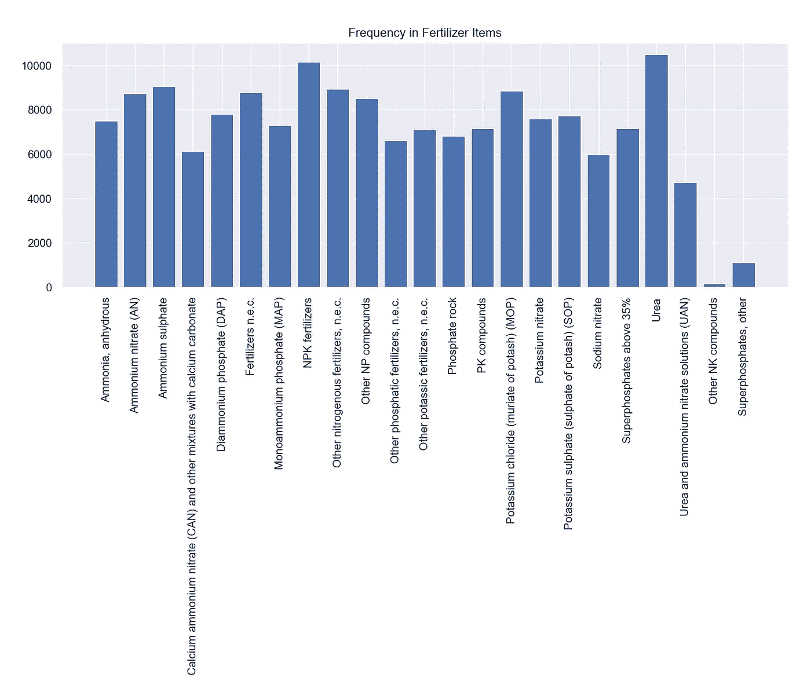

# 用熊猫掌握统计学

> 原文：<https://towardsdatascience.com/mastering-statistics-with-pandas-ce7580971072?source=collection_archive---------24----------------------->

## 用熊猫来生成统计数据


[来源](https://www.pexels.com/photo/analytics-blur-business-close-up-590045/)

Pandas 是一个 python 库，可用于数据操作、数据插补、统计分析等等。具体来说，Pandas 统计函数对于从数据中获得洞察力非常有用。在本帖中，我们将回顾一些从数据中生成统计数据的基本方法。

出于我们的目的，我们将使用粮农组织的*化肥副产品数据，这些数据可以在[这里](https://www.kaggle.com/josehenriqueroveda/fertilizers-by-product-fao)找到。这些数据包含了全世界化学和矿物肥料的生产、贸易和农业使用的信息。*

我们开始吧！

首先，让我们将数据读入熊猫数据框:

```
import pandas as pddf = pd.read_csv("FertilizersProduct.csv",encoding = "ISO-8859-1")
```

接下来，让我们打印一些关于数据的基本信息:

```
print(df.info())
```


我们看到该数据包含 11 个整型、浮点型和分类类型的列。现在，让我们打印前五行数据:

```
print(df.head())
```


我们看到第一行数据对应的是 2011 年阿富汗进口的 4.49 吨无水氨。让我们继续考虑阿富汗的所有数据:

```
df_afghanistan = df[df['Area'] == 'Afghanistan'].copy()
```

接下来，我们可以用'来看数量值的分布。“hist()”方法:

```
import matplotlib.pyplot as plt
import seaborn as sns
sns.set()
plt.title("Distribution in Imported Fertilizer Quantities")
df_afghanistan['Value'].hist(bins=30)
```


此外，使用'查看以吨为单位的平均进口数量。“mean()”方法:

```
print("Average Quantity: ", df_afghanistan['Value'].mean())
```


我们还可以使用'来查看数量的标准偏差。“std()”方法:

```
print("Standard Deviation in Quantity: ", df_afghanistan['Value'].std())
```


我们也可以使用。corr()'方法来计算两个数值列之间的相关性。让我们计算一下阿富汗的化肥数量和年份之间的关系:

```
print("Correlation between Year and Quantity: ", df_afghanistan['Value'].corr(df_afghanistan['Year'])
```


我们还可以看看最小值和最大值:

```
print("Minimum Quantity: " df_afghanistan['Value'].min())
print("Maximum Quantity: " df_afghanistan['Value'].max())
```


接下来，我们可以查看分类列中最频繁出现的值或模式。让我们计算原始数据中“面积”列的模式:

```
print("Mode in Area: ", df['Area'].mode()[0])
```


我们还可以使用“Counter()”方法来可视化分类值出现的频率。让我们将“Counter()”方法应用于原始数据中的“Item”列:

```
from collections import Counter
print(Counter(df['Item']))
```


现在，让我们生成一个柱状图来直观显示这一点:

```
plt.title("Frequency in Fertilizer Items")
plt.bar(dict(Counter(df['Item'])).key(), dict(Counter(df['Item'])).Values())
```



我就讲到这里，但是我鼓励你自己动手处理数据和编写代码。

## 结论

总之，在这篇文章中，我们讨论了如何使用 Pandas 库从数据中生成基本的统计见解。我们看了如何使用 pandas 方法计算平均值、标准差、相关性、最小值和最大值。此外，我们可视化了数值列中的分布，并使用 counter 方法和 Matplotlib 来可视化分类“Item”列中的分布。我希望你觉得这篇文章有用/有趣。这篇文章的代码可以在 [GitHub](https://github.com/spierre91/medium_code/upload) 上找到。感谢您的阅读！