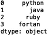
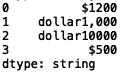

# 掌握熊猫的弦乐方法

> 原文：<https://towardsdatascience.com/mastering-string-methods-in-pandas-8d3cd00b720d?source=collection_archive---------22----------------------->

## 开始时你需要知道的


由[像素](https://www.pexels.com/photo/multi-colored-laces-1571577/)上的[摄影记者](https://www.pexels.com/@skitterphoto)拍摄的照片

Pandas 是一个流行的 python 库，它提供了易于使用的数据结构和数据分析工具。熊猫可以用于读入数据、生成统计数据、聚合、机器学习的特征工程等等。Pandas 库还提供了一套字符串/文本操作工具。

在本帖中，我们将介绍熊猫提供的一些最重要的字符串操作方法。

我们开始吧！

首先，让我们导入熊猫库

```
import pandas as pd
```

现在，让我们定义一个包含字符串的示例熊猫系列:

```
s = pd.Series(['python is awesome', 'java is just ok', 'c++ is overrated'])
```

让我们打印这个系列:

```
print(s)
```


我们注意到该系列有“dtype: object”，这是自动推断的默认类型。一般来说，最好是专用型的。自从熊猫 1.0 发布以来，我们现在能够指定专用类型。通过在终端中执行以下命令来确保 Pandas 得到更新:

```
pip install -U pandas
```

我们可以如下指定“dtype: string ”:

```
s1 = pd.Series(['python is awesome', 'java is just ok', 'c++ is overrated'], dtype='string')
```

让我们打印系列:


我们可以看到系列类型是指定的。最好指定类型，不要使用默认的“dtype: object ”,因为它允许类型的意外混合，这是不可取的。例如，使用“dtype: object ”,您可以拥有一个包含整数、字符串和浮点数的序列。因此,“dtype: object”的内容可能是模糊的。

接下来，我们来看看一些具体的字符串方法。让我们考虑一下“count()”方法。让我们为这个例子修改一下我们的系列:

```
s = pd.Series(['python is awesome. I love python.', 'java is just ok. I like python more', 
                'c++ is overrated. You should consider learning another language, like java or python.'], dtype="string")
```

让我们打印新系列:

```
print(s)
```


让我们统计一下单词“python”在每个字符串中出现的次数:

```
print(s.str.count('python'))
```


我们看到这将返回一系列“dtype: int64”。

我们可以考虑的另一种方法是“isdigit()”方法，该方法根据字符串是否是数字来返回布尔序列。让我们定义一个新系列来演示这种方法的使用。假设我们有一个由字符串数字列表定义的序列，其中缺少的字符串数字的值为“未知”:

```
s2 = pd.Series(['100', 'unknown', '20', '240', 'unknown', '100'], dtype="string")
```

如果我们使用' isdigit()'方法，我们会得到:

```
print(s2.str.isdigit())
```


我们还可以使用“match()”方法来检查特定字符串的存在。让我们检查字符串“100”是否存在:

```
print(s2.str.match('100'))
```


我们甚至可以检查“un”的存在:

```
print(s2.str.match('un'))
```


所有这些都符合我们的预期。我们还可以使用方法来改变我们的系列字符串文本的大小写。让我们回到包含不同编程语言观点的系列，s1:

```
s1 = pd.Series(['python is awesome. I love python.', 'java is just ok. I like python more', 
                'c++ is overrated. You should consider learning another language, like java or python.'], dtype="string")
```

我们可以使用“upper()”方法来大写我们系列中的字符串中的文本:

```
s_upper = s1.str.upper()print(s_upper)
```


我们还使用“lower()”方法:

```
s_lower = s_upper.str.lower()print(s_lower)
```


我们还可以使用' len()'获得每个字符串的长度:

```
print(s1.str.len())
```


让我们考虑几个更有趣的方法。我们可以使用' strip()'方法来删除空白。为此，让我们定义并打印一个新的示例序列，其中包含带有多余空格的字符串:

```
s3 = pd.Series([' python', 'java', 'ruby ', 'fortran '])
print(s3)
```


正如你所看到的，在‘python’的左边和‘ruby’和‘fortran’的右边都有空白。我们可以用“strip()”方法来删除它:

```
print(s3.str.strip())
```

我们也可以用“lstrip”删除左边的空白:

```
print(s3.str.lstrip())
```



右边是“rstrip”:

```
print(s3.str.rstrip())
```


在前两个例子中，我使用的是“dtype=object ”,但是，如果您使用的是字符串，请尽量记住指定“dtype=strings”。

您也可以使用 strip 方法删除文本中不需要的字符。通常情况下，在真实的文本数据中会出现' \n '，它表示新的一行。让我们修改我们的系列，并在这种情况下演示 strip 的使用:

```
s3 = pd.Series([' python\n', 'java\n', 'ruby \n', 'fortran \n'])
print(s3)
```


我们可以用' strip()'删除' \n '字符:

```
print(s3.str.strip(' \n'))
```


在这个具体的例子中，我想指出“dtype=object”和“dtype= strings”之间的行为差异。如果我们指定“dtype= strings”并打印系列:

```
s4 = pd.Series([' python\n', 'java\n', 'ruby \n', 'fortran \n'], dtype='string')
print(s4)
```


我们看到' \n '已被解释。尽管如此，在新指定的系列上使用“strip()”仍然有效:

```
print(s4.str.strip(‘ \n’))
```


我们要看的最后一个方法是“replace()”方法。假设我们有一个新系列，其美元金额的格式很差:

```
s5 = pd.Series(['$#1200', 'dollar1,000', 'dollar10000', '$500'], dtype="string")
print(s5)
```


我们可以使用' replace()'方法去掉第一个元素中不需要的' # ':

```
print(s5.str.replace('#', ''))
```



我们也可以用一个实际的' $ '符号替换文本' dollar ':

```
s5 = s5.str.replace('dollar', '$')
print(s5)
```


最后，我们可以删除第二个元素中的'，':

```
s5 = s5.str.replace(',', '')
print(s5)
```


我将在这里停下来，但是您可以随意使用这些方法。你可以尝试将 Pandas 的一些方法应用于免费的数据集，比如可以在 [Kaggle](https://www.kaggle.com/) 上找到的 [Yelp](https://www.kaggle.com/yelp-dataset/yelp-dataset) 或[亚马逊](https://www.kaggle.com/bittlingmayer/amazonreviews)评论，或者应用于你自己的工作，如果它涉及处理文本数据的话。

总之，我们讨论了一些基本的 Pandas 字符串操作方法。我们回顾了基于特定字符串的存在生成布尔序列，检查字符串中数字的存在，删除不需要的空白或字符，并用选择的字符替换不需要的字符。

还有很多熊猫字符串方法我没有在这篇文章中介绍。这些方法包括连接、索引、提取子字符串、模式匹配等等。我将把这些方法留到以后的文章中。我希望你觉得这篇文章有趣和/或有用。这篇文章中的代码可以在 [GitHub](https://github.com/spierre91/medium_code/blob/master/pandas_string_methods.py) 上找到。感谢您的阅读！