# 掌握 Python 中的字符串方法

> 原文：<https://towardsdatascience.com/mastering-string-methods-in-python-456174ede911?source=collection_archive---------14----------------------->

## 使用本指南，通过应用修改、转换和格式化字符串的方法，增长您对这种编程语言的知识。

照片由 [**克里斯蒂娜·莫里洛**](https://www.pexels.com/@divinetechygirl?utm_content=attributionCopyText&utm_medium=referral&utm_source=pexels) 发自 [**像素**](https://www.pexels.com/photo/person-using-macbook-pro-1181373/?utm_content=attributionCopyText&utm_medium=referral&utm_source=pexels)

> “学习编写程序可以拓展你的思维，帮助你更好地思考，创造一种思考问题的方式，我认为这对所有领域都有帮助。”
> *—比尔·盖茨*

正如**微软**的联合创始人所说，我邀请你继续拓展你的思维，努力拓宽你的编程技能，在许多领域有潜在的应用。这篇文章的目的是作为一个基本 Python 数据类型的内置方法的备忘单。字符串是 Python 编程语言中的一种数据类型，用于表示一段文本。它们非常灵活，并且对于在代码中恰当地表示文本输入是必要的。因此，学习如何充分利用它们是必须的。

一旦学会了这些数据类型的基本语法，你就可以开始增长你的 Python 知识，这将让你对字符串处理进行越来越有趣的操作。永远记住，学习过程的主要目标是**编写干净高效的代码来自动化日常任务**，不需要记忆任何方法，因为一旦你将它们付诸实践，你就会完全理解它们。

# 目录:

> 1.弦乐入门(3 分钟阅读)。
> 
> 2.修改字符串(2 分钟读取)。
> 
> 3.转换字符串(2 分钟读取)。
> 
> 4.格式化字符串(1 分钟读取)。

# 1.弦乐简介

一个**字符串**是一种 Python 数据类型，用于表示一段文本。它写在双引号或单引号之间，可以短到零个字符，也可以是空字符串，也可以是您希望的长度。

字符串可以使用加号**连接**以构建更长的字符串，也可以将它们**乘以**一个数字，这导致字符串连续重复数字指示的次数。此外，如果我们想找出字符串的**长度**，我们只需使用 **len** ()函数，如下例所示:

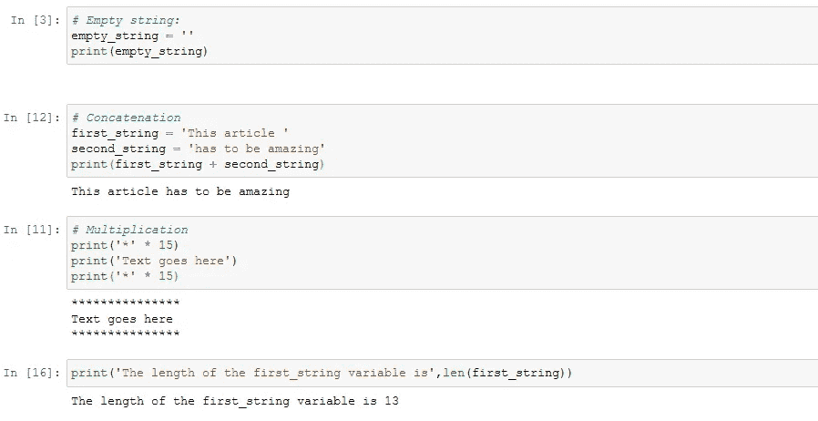

我们可以在脚本中用字符串做很多事情。例如，我们可以通过查看文件名并查看它们是否符合我们的标准来检查文件是否以某种方式命名，或者我们可以通过检查我们系统的用户并连接我们的域来创建电子邮件列表:

电子邮件生成器功能

此外，我们可以**访问字符串中的一个特定字符**或一段字符。例如，如果我们有一个太长而无法显示的文本，并且我们想只显示它的一部分，我们可能想要这样做。或者如果我们想用短语中每个单词的第一个字母来缩写。我们可以通过一个叫做**字符串索引的操作来实现。**该操作让我们使用方括号和我们想要的位置号来访问给定位置或索引中的字符，如下例所示:

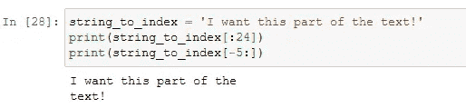

**如果想打印一个字符串的最后一个字符，但不知道它有多长，怎么办？使用**负索引**可以做到这一点。在上面的例子中，我们不知道字符串的长度，但是我们知道单词' text '加上感叹号取五个索引，所以我们调用负五来访问它们。**

> 记住 Python 是从 0 而不是 1 开始计算索引的。就像 range 函数一样，它会考虑第一个数字和比最后一个数字小一的数字之间的值的范围。

# 2.修改字符串:

除了尝试访问字符串中的某些字符之外，我们可能希望更改它们，以防它们不正确并且我们希望修复它，或者万一我们希望传达不同的东西。

**切片对这个**没有用，因为字符串是**不可变的**数据类型，就 Python 而言，这意味着它们不能被修改。我们能做的是基于旧字符串创建一个新字符串:

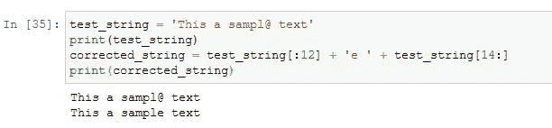

我们不会改变之前分配给它的底层字符串。我们赋予一个全新的字符串不同的内容。在这种情况下，很容易找到要更改的索引，因为字符串中的字符很少。如果字符串变大了，我们怎么知道要改变哪个字符呢？

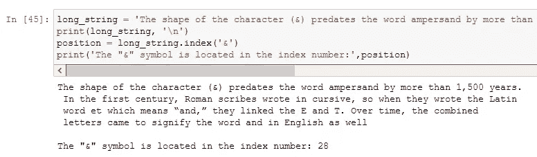

> 为了实现我们的目标，我们将使用 *index* 方法，这是一个与特定类相关联的函数，当附加到一个点后面的变量时，它为某个函数服务。

具体来说， *index* 方法返回给定子串在字符串中的索引。我们传递的子串，可以根据我们的需要长短。如果这个字符串没有我们正在寻找的子字符串，会发生什么呢？index 方法不能返回一个数字，因为子串不存在，所以我们得到一个值错误:

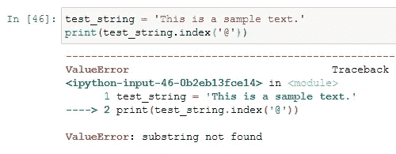

为了避免这种*回溯错误*，我们可以使用中的关键字*来检查一个子串是否包含在一个字符串中。这个关键字也用于*循环的*，正如我在这篇关于 Python 循环的[上一篇文章中所解释的。](/understand-loops-in-python-with-one-article-bace2ddba789?source=your_stories_page-------------------------------------)*

在循环的情况下，它用于迭代，而在这种情况下，它是一个条件，可以是*真*或*假*。**如果子串是字符串的一部分，则为 true，否则为 false**。

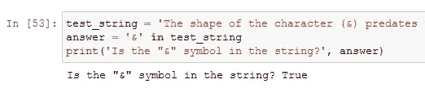

# 3.转换字符串

有很多有趣的方法来转换我们的字符串文本。在那些更重要的方法中，我们可以找到 **lower()** 、 **upper()、strip()、count()** 和 **join()** 方法。

在处理用户输入时， **strip()** 方法很有用，因为它去掉了字符串中的空格。这意味着它不仅删除了空格，还删除了制表符和换行符，这些都是我们通常不希望在用户提供的字符串中出现的字符。

这个方法还有两个版本， **lstrip** 和 **rstrip** ，分别消除字符串左边或右边的空白字符，而不是两边。

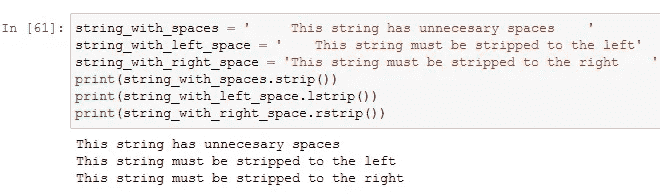

其他方法给你关于字符串本身的信息。方法 **count** 返回给定的子串在一个字符串中出现的次数。方法 **endswith** 返回字符串是否以某个子串结尾，而方法 **startswith** 返回字符串是否以某个子串开头:

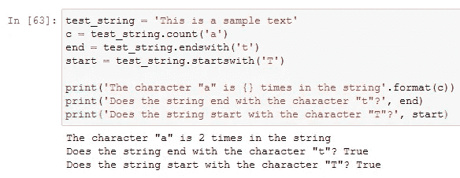

另一种连接形式是应用 **join** 方法。要使用 join 方法，我们必须在将要用于连接的字符串上调用它。在这个例子中，我们使用了一个带有空格的字符串。该方法接收字符串列表，并返回一个字符串，每个字符串由初始字符串连接。让我们用一个简单的例子来检查它的功能:

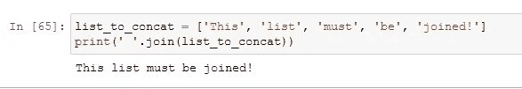

最后，字符串的一个重要应用是 **split** 方法，它返回初始字符串中所有单词的列表，并自动按任何空格进行拆分。它可以选择接受一个参数，并用另一个字符(如逗号或点号)分割字符串:

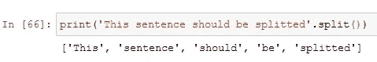

# 4.格式化字符串

String 对象具有进行格式更改的内置功能，其中还包括连接字符串的额外方式。让我们来看看:

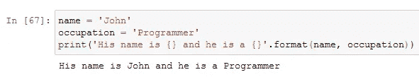

在上面的例子中，我基于两个已经创建的变量的输入值生成了一个新的字符串，通过使用**花括号占位符**来显示变量应该写在哪里。然后，我将变量作为参数传递给 format 方法。

另一方面，我们可能希望格式化浮点变量的数字输出。例如，在含税产品的情况下:

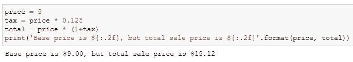

在本例中，在**花括号**之间，我们正在编写一个格式化表达式。当我们想要告诉 Python 以不同于默认的**方式格式化我们的值时，这些表达式是需要的。表达式以冒号开头，以区别于我们之前看到的字段名。在**冒号**后面，我们写“ **.2f** ”。这意味着我们要格式化一个**浮点数**，小数点**后应该有**两位数字。所以不管价格是多少，我们的函数总是打印两位小数。**

您也可以使用大于运算符来指定文本对齐方式: **>** 。例如，表达式 **{: > 3.2f}** 将文本向右对齐三个空格，并指定一个带两位小数的浮点数。

# 结论

在本文中，我提供了大量的字符串数据类型指南，包括一些方法和实际应用，以及相应的理论解释。当然是很多附加的方法！但是没有必要记住它们，因为一旦你把概念付诸实践，你就会完全理解它们。

在未来的系列文章中，我将深入探讨其他 Python 数据类型的更重要的方法。如果你喜欢这篇文章中的信息，不要犹豫，联系我分享你的想法。它激励我继续分享！

# 深入了解 Python 编程的相关文章:

## 理解 Python 中的循环:

 [## 用一篇文章理解 Python 中的循环

### 读完这篇文章后，你将不再有机会被 Loops 抛出。

towardsdatascience.com](/understand-loops-in-python-with-one-article-bace2ddba789) 

## 创建股票价格模拟器:

 [## 用 Python 创建股票价格模拟器

### 几何布朗运动过程的简单应用来模拟股票价格。

towardsdatascience.com](/create-a-stock-price-simulator-with-python-b08a184f197d) 

## 了解如何用 Python 编写令人惊叹的可视化代码:

 [## 用 Python 实现商业智能可视化

### 我准备了一份详尽的指南来展示漂亮的可视化效果，以增强度量、KPI、预测和其他…

towardsdatascience.com](/business-intelligence-visualizations-with-python-1d2d30ce8bd9) 

## 使用 Python 的电子商务数据科学:

 [## 使用 Python 的电子商务数据科学

### 我为电子商务行业准备了一份广泛的数据科学应用指南。

towardsdatascience.com](/data-science-for-e-commerce-with-python-a0a97dd7721d)  [## irbnb 租赁-使用 Python 分析纽约

towardsdatascience.com](/airbnb-rental-analysis-of-new-york-using-python-a6e1b2ecd7dc) 

感谢您花时间阅读我的文章！如果您有任何问题或想法要分享，请随时联系我的[电子邮件](http://herrera.ajulian@gmail.com)，或者您可以在以下社交网络中找到我以了解更多相关内容:

*   [**领英**](https://www.linkedin.com/in/juli%C3%A1n-alfredo-herrera-08531559/) **。**
*   [**GitHub**](https://github.com/Jotaherrer) **。**