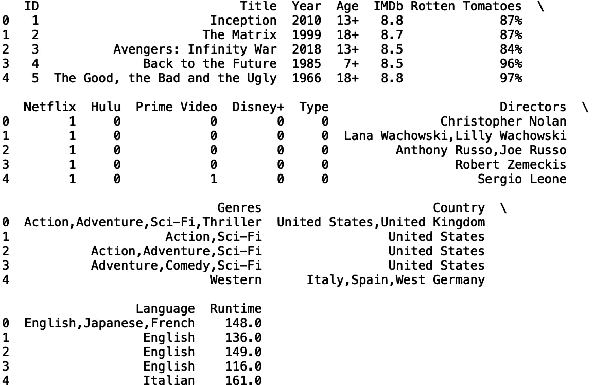
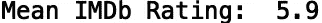
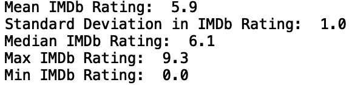
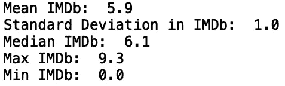
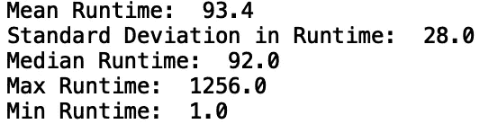
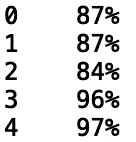
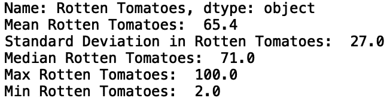
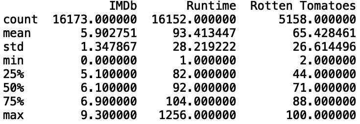
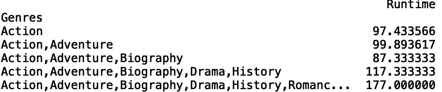
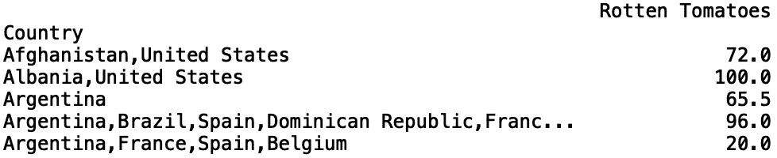

# 用熊猫掌握汇总统计

> 原文：<https://towardsdatascience.com/mastering-summary-statistics-with-pandas-d515e17756be?source=collection_archive---------15----------------------->

## 使用 Pandas 库生成汇总统计数据


照片由[安德鲁·尼尔](https://www.pexels.com/@andrew)在[像素](https://www.pexels.com/photo/macbook-pro-on-brown-wooden-table-2312369/)上拍摄

Pandas 是一个 python 库，用于数据操作和统计分析。这是一个快速易用的开源库，支持多种数据操作任务。这些包括合并、重塑、争论、统计分析等等。在本帖中，我们将讨论如何使用 Pandas 库计算汇总统计数据。

我们开始吧！

出于我们的目的，我们将探索网飞、Prime Video、Hulu 和 Disney Plus 数据集上的*电影。数据可以在[这里](https://www.kaggle.com/ruchi798/movies-on-netflix-prime-video-hulu-and-disney)找到。*

我们开始吧！

首先，让我们将数据读入熊猫数据框:

```
import pandas as pd 
pd.set_option('display.max_columns', None)
pd.set_option('display.max_rows', None)
df = pd.read_csv("MoviesOnStreamingPlatforms_updated.csv")
```

接下来，我们将打印该数据中可用的列:

```
print(df.columns)
```


我们不需要“Unamed: 0”列，所以我们可以用“del”关键字删除它:

```
del df['Unnamed: 0’]
```

现在，让我们使用“head()”方法打印前五行数据:

```
print(df.head())
```



## 计算平均值、标准差、中值、最大值和最小值

我们要看的第一个方法是 Pandas 的“mean()”方法。让我们显示平均 IMDb 评级:

```
print("Mean IMDb Rating: ", df['IMDb'].mean())
```


我们可以使用 Numpy 'round()'方法将平均值四舍五入到最接近的十分之一:

```
import numpy as np
print("Mean IMDb: ", np.round(df['IMDb'].mean(), 1))
```



我们还可以显示“IMDb”列的标准偏差、中值、最大值和最小值:

```
print("Standard Deviation in IMDb Rating: ", np.round(df['IMDb'].std()))
print("Median IMDb Rating: ", np.round(df['IMDb'].median(), 1))
print("Max IMDb Rating: ", df['IMDb'].max())
print("Min IMDb Rating: ", df['IMDb'].min())
```



为了方便起见，我们可以编写一个函数，给出任意数字列的汇总统计信息:

```
def get_statistics(column_name):
    df_copy = df.copy()
    print(f"Mean {column_name}: ", np.round(df_copy[column_name].mean(), 1))
    print(f"Standard Deviation in {column_name}: ", np.round(df_copy[column_name].std()))
    print(f"Median {column_name}: ", np.round(df_copy[column_name].median(), 1))
    print(f"Max {column_name}: ", df_copy[column_name].max())
    print(f"Min {column_name}: ", df_copy[column_name].min())
```

如果我们用“IMDb”调用我们的函数，我们得到如下结果:

```
get_statistics('IMDb')
```



让我们调用“运行时”列中的函数:

```
get_statistics('Runtime')
```



最后，让我们试试“烂番茄”专栏:

```
get_statistics('Rotten Tomatoes')
```

我们得到以下错误:


很明显我们需要分开处理这个案子。如果我们打印“烂番茄”值的前五行，我们会看到这些值是字符串:

```
print(df[‘Rotten Tomatoes’].head())
```



在我们的函数中，我们可以检查“列名”输入是否为“烂番茄”。如果是，我们在计算汇总统计信息之前，删除“%”符号并将字符串转换为浮点型:

```
def get_statistics(column_name):
    df_copy = df.copy()
    if column_name == 'Rotten Tomatoes':
        df_copy[column_name] = df[column_name].str.rstrip('%')
        df_copy[column_name] = df_copy[column_name].astype(float)
        ...
```

现在我们可以用“烂番茄”来调用我们的函数:

```
get_statistics('Rotten Tomatoes')
```



## 使用“describe()”方法

我们可以使用 describe 函数来生成上面的统计信息，并将其同时应用于多个列。它还提供了下限、中间值和上限。让我们将“describe()”方法应用于“IMDb”和“运行时”:

```
print(df[['IMDb', 'Runtime']].describe())
```


如果我们想在这些统计数据中包含“烂番茄”,我们需要像前面一样将其转换为浮点型:

```
df['Rotten Tomatoes'] = df['Rotten Tomatoes'].str.rstrip('%')
df['Rotten Tomatoes'] = df['Rotten Tomatoes'].astype(float)
print(df[['IMDb', 'Runtime', 'Rotten Tomatoes']].describe())
```



## 使用“groupby()”进行聚合

假设我们想知道每个流派的平均运行时间。我们可以使用“groupby()”方法来计算这些统计数据:

```
runtime_genre = df[["Genres", "Runtime"]].groupby("Genres").mean()
print(runtime_genre.head())
```



我们也可以按“国家”来看平均“烂番茄”:

```
rottentomatoes_country = df[["Country", "Rotten Tomatoes"]].groupby("Country").mean().dropna()
print(rottentomatoes_country.head())
```



最后，我们可以编写一个函数，允许我们对任何分类列和数字列重复使用这个逻辑:

```
def get_group_statistics(categorical, numerical):
    group_df = df[[categorical, numerical]].groupby(categorical).mean().dropna()
    print(group_df.head())
```

让我们用“流派”和“运行时”来调用我们的函数:

```
get_group_statistics('Genres', 'Runtime')
```


我就讲到这里，但是我鼓励你自己动手处理数据和编写代码。

## 结论

总之，在这篇文章中，我们讨论了如何使用 Pandas 库生成汇总统计数据。首先，我们讨论了如何使用 pandas 方法生成均值、中值、最大值、最小值和标准差。我们还实现了一个函数，该函数在给定一个数字列名的情况下生成这些统计信息。接下来，我们讨论了“describe()”方法，该方法允许我们为任何数字列生成除平均值、中值、最大值、最小值和标准偏差之外的百分位数。最后，我们展示了如何为分类列生成聚合统计信息。如果你有兴趣学习更多关于熊猫的数据操作、机器学习甚至只是 python 编程的一些基础知识，请查看[*Python for Data Science and Machine Learning:Python 编程、熊猫和 Scikit-初学者学习教程*](https://www.amazon.com/dp/B08N38XW2Q/ref=sr_1_1?dchild=1&keywords=sadrach+python&qid=1604966500&s=books&sr=1-1) *。我希望你觉得这篇文章有用/有趣。这篇文章的代码可以在 [GitHub](https://github.com/spierre91/medium_code/blob/master/pandas_tutorials/pandas_summary_statistics.py) 上找到。感谢您的阅读！*