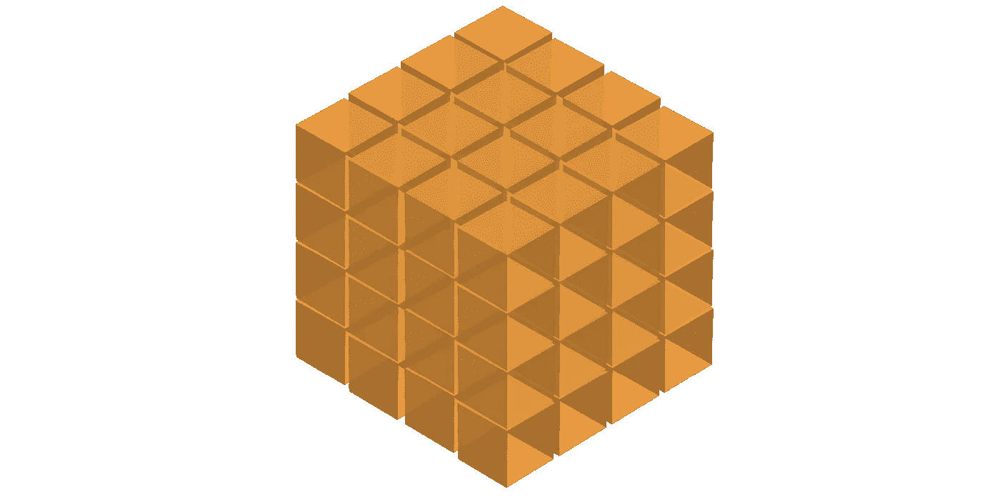
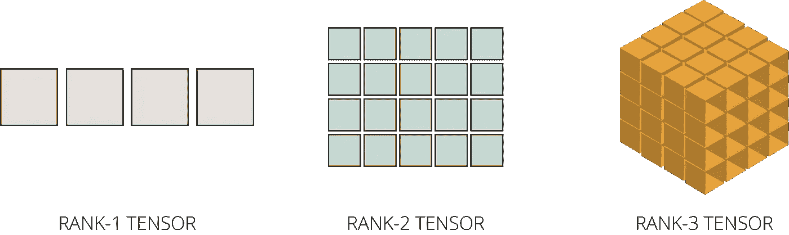
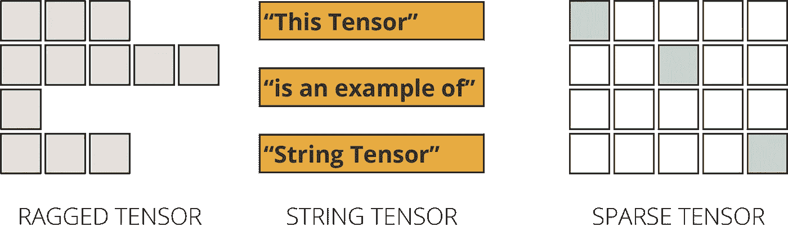

# 通过 5 个简单的步骤掌握 TensorFlow 张量

> 原文：<https://towardsdatascience.com/mastering-tensorflow-tensors-in-5-easy-steps-35f21998bb86?source=collection_archive---------7----------------------->

## [← Part 1](/beginners-guide-to-tensorflow-2-x-for-deep-learning-applications-c7ebd0dcfbee) |深度学习用 TensorFlow 2。X —第 2 部分| [第 3 部分→](/mastering-tensorflow-variables-in-5-easy-step-5ba8062a1756) | [第 4 部分→](/eager-execution-vs-graph-execution-which-is-better-38162ea4dbf6)

## 了解 TensorFlow 的构建模块如何在底层工作，并了解如何充分利用张量对象|使用 TensorFlow 2.x 进行深度学习

如果你正在阅读这篇文章，我确信我们有着相似的兴趣，并且正在/将要从事相似的行业。那么我们就通过[*Linkedin*](https://linkedin.com/in/orhangaziyalcin/)*来连线吧！请不要犹豫发送联系请求！*[*Orhan g . Yal n—Linkedin*](https://linkedin.com/in/orhangaziyalcin/)


照片由 [Esther Jiao](https://unsplash.com/@estherrj?utm_source=medium&utm_medium=referral) 在 [Unsplash](https://unsplash.com?utm_source=medium&utm_medium=referral) 拍摄

在本帖中，我们将深入 TensorFlow 张量的细节。我们将通过这五个简单的步骤涵盖 Tensorflow 中与张量相关的所有主题:

*   **第一步:张量的定义→** 什么是张量？
*   **步骤二:创建张量→** 创建张量对象的函数
*   **第三步:张量的资格→** 张量对象的特性和特征
*   **步骤四:张量运算→** 索引、基本张量运算、形状操作和广播
*   **第五步:特殊张量类型→** 除常规张量以外的特殊张量类型

开始吧！

# 张量的定义:什么是张量？



图一。秩 3 张量的可视化(作者提供图片)

张量是 TensorFlow 的多维数组，类型统一。它们非常类似于 NumPy 数组，并且是不可变的，这意味着它们一旦创建就不能被更改。您只能使用编辑内容创建新副本。

让我们看看张量如何与代码示例一起工作。但是首先，要使用 TensorFlow 对象，我们需要导入 [TensorFlow](http://tensorflow.org) 库。我们经常在 TensorFlow 中使用 [NumPy](http://numpy.org) ，所以我们也用下面几行来导入 NumPy:

# 张量的创建:创建张量对象

有几种方法可以创建一个`tf.Tensor`对象。先说几个例子。您可以使用几个张量流函数创建张量对象，如下例所示:

tf.constant、tf.ones、tf.zeros 和 tf.range 是一些可用于创建张量对象的函数

```
**Output:**
tf.Tensor([[1 2 3 4 5]], shape=(1, 5), dtype=int32)
tf.Tensor([[1\. 1\. 1\. 1\. 1.]], shape=(1, 5), dtype=float32) 
tf.Tensor([[0\. 0\. 0\. 0\. 0.]], shape=(1, 5), dtype=float32) 
tf.Tensor([1 2 3 4 5], shape=(5,), dtype=int32)
```

如你所见，我们用三种不同的函数创建了形状为`(1, 5)`的张量对象，并用`tf.range()`函数创建了形状为`(5, )`的第四个张量对象。注意，`tf.ones`和`tf.zeros`接受形状作为必需的参数，因为它们的元素值是预先确定的。

# 张量的资格:张量对象的特性和特征

TensorFlow 张量是作为`tf.Tensor`对象创建的，它们有几个特征。首先，他们有一个基于维度数量的排名。其次，它们有一个形状，一个由所有维度的长度组成的列表。所有张量都有一个大小，即一个张量中元素的总数。最后，它们的元素都记录在统一的数据类型(data type)中。让我们仔细看看这些特性。

## 等级系统和维度

张量根据其维数进行分类:

*   **Rank-0(标量)张量:**包含单值且无轴的张量(0 维)；
*   **秩-1 张量:**包含单轴(1 维)值列表的张量；
*   **秩-2 张量:**包含 2 轴(2 维)的张量；和
*   **秩 N 张量:**包含 N 轴(N 维)的张量。



图二。秩 1 张量|秩 2 张量|秩 3 张量(图由作者提供)

例如，我们可以通过将一个三级嵌套列表对象传递给`tf.constant`函数来创建一个秩为 3 的张量。对于本例，我们可以将数字拆分成一个三级嵌套列表，每级包含三个元素:

创建秩 3 张量对象的代码

```
**Output:** tf.Tensor( [[[ 0  1  2]   
             [ 3  4  5]]   

            [[ 6  7  8]   
             [ 9 10 11]]],
  shape=(2, 2, 3), dtype=int32)
```

我们可以用`. ndim '属性查看我们的` rank_3_tensor '对象当前拥有的维数。

```
**Output:** The number of dimensions in our Tensor object is 3
```

## 形状

形状特征是每个张量都有的另一个属性。它以列表的形式显示每个维度的大小。我们可以查看用`.shape`属性创建的`rank_3_tensor`对象的形状，如下所示:

```
**Output:** The shape of our Tensor object is (2, 2, 3)
```

如你所见，我们的张量在第一层有 2 个元素，在第二层有 2 个元素，在第三层有 3 个元素。

## 大小

大小是张量的另一个特征，它意味着张量的元素总数。我们不能用张量对象的一个属性来度量大小。相反，我们需要使用`tf.size()`函数。最后，我们将使用实例函数`.numpy()` 将输出转换为 NumPy，以获得可读性更好的结果:

```
**Output:** The size of our Tensor object is 12
```

## 数据类型

张量通常包含数字数据类型，如 floats 和 ints，但也可能包含许多其他数据类型，如复数和字符串。

然而，每个张量对象必须以单一的统一数据类型存储其所有元素。因此，我们也可以使用`.dtype`属性查看为特定张量对象选择的数据类型，如下所示:

```
**Output:** The data type selected for this Tensor object is <dtype: 'int32'>
```

# 张量运算

## 索引

索引是项目在序列中位置的数字表示。这个序列可以引用很多东西:一个列表、一个字符串或者任意的值序列。

TensorFlow 也遵循标准的 Python 索引规则，类似于列表索引或 NumPy 数组索引。

关于索引的一些规则:

1.  索引从零(0)开始。
2.  负索引("-n ")值表示从末尾向后计数。
3.  冒号(":")用于切片:`start:stop:step`。
4.  逗号(“，”)用于到达更深的层次。

让我们用下面的代码行创建一个`rank_1_tensor`:

```
**Output:** 
tf.Tensor([ 0  1  2  3  4  5  6  7  8  9 10 11], 
  shape=(12,), dtype=int32)
```

测试我们的第一、第二和第三条规则:

```
**Output:** 
First element is: 0 
Last element is: 11 
Elements in between the 1st and the last are: [ 1  2  3  4  5  6  7  8  9 10]
```

现在，让我们用下面的代码创建我们的`rank_2_tensor`对象:

```
**Output:** tf.Tensor( [[ 0  1  2  3  4  5]  
            [ 6  7  8  9 10 11]], shape=(2, 6), dtype=int32)
```

用几个例子来测试第四条规则:

```
**Output:** 
The first element of the first level is: [0 1 2 3 4 5] 
The second element of the first level is: [ 6  7  8  9 10 11] 
The first element of the second level is: 0 
The third element of the second level is: 2
```

现在，我们已经介绍了索引的基础知识，所以让我们来看看可以在张量上进行的基本操作。

## 张量的基本运算

您可以轻松地对张量进行基本的数学运算，例如:

1.  添加
2.  逐元素乘法
3.  矩阵乘法
4.  寻找最大值或最小值
5.  寻找 Max 元素的索引
6.  计算 Softmax 值

让我们来看看这些操作的运行情况。我们将创建两个张量对象并应用这些操作。

我们可以从加法开始。

```
**Output:** tf.Tensor( [[ 3\.  7.]  
            [11\. 15.]], shape=(2, 2), dtype=float32)
```

让我们继续逐元素乘法。

```
**Output:** tf.Tensor( [[ 2\. 12.]  
            [30\. 56.]], shape=(2, 2), dtype=float32)
```

我们也可以做矩阵乘法:

```
**Output:** tf.Tensor( [[22\. 34.]  
            [46\. 74.]], shape=(2, 2), dtype=float32)
```

> **注:** Matmul 运算奠定了深度学习算法的核心。因此，尽管您不会直接使用 matmul，但了解这些操作是至关重要的。

我们上面列出的其他操作的例子:

```
**Output:**
The Max value of the tensor object b is: 7.0 
The index position of the Max of the tensor object b is: [1 1] 
The softmax computation result of the tensor object b is: [[0.11920291 0.880797  ]  [0.11920291 0.880797  ]]
```

## 操纵形状

就像在 NumPy 数组和 pandas 数据帧中一样，你也可以改变张量对象的形状。

tf.reshape 操作非常快，因为不需要复制底层数据。对于整形操作，我们可以使用`tf.reshape()`功能。让我们在代码中使用`tf.reshape`函数:

```
**Output:** The shape of our initial Tensor object is: (1, 6) 
The shape of our initial Tensor object is: (6, 1) 
The shape of our initial Tensor object is: (3, 2) 
The shape of our flattened Tensor object is: tf.Tensor([1 2 3 4 5 6], shape=(6,), dtype=int32)
```

正如你所看到的，我们可以很容易地重塑我们的张量对象。但是要注意，在做重塑操作的时候，一个开发者一定要讲道理。否则，张量可能会混淆，甚至会产生错误。所以，小心点😀。

## 广播

当我们尝试使用多个张量对象进行组合运算时，较小的张量可以自动伸展以适应较大的张量，就像 NumPy 数组一样。例如，当您试图将一个标量张量与一个秩为 2 的张量相乘时，该标量被拉伸以乘以每个秩为 2 的张量元素。请参见下面的示例:

```
**Output:** tf.Tensor( [[ 5 10]  
            [15 20]], shape=(2, 2), dtype=int32)
```

多亏了广播，在张量上做数学运算的时候不用担心大小匹配的问题。

# 特殊类型的张量

我们倾向于生成矩形的张量，并将数值存储为元素。但是，TensorFlow 也支持不规则或特殊的张量类型，它们是:

1.  参差张量
2.  弦张量
3.  稀疏张量



图 3。参差张量|弦张量|稀疏张量(作者提供图片)

让我们仔细看看它们分别是什么。

## 参差张量

不规则张量是沿着尺寸轴具有不同数量元素的张量，如图 x 所示。

您可以构建一个不规则张量，如下所示:

```
**Output:** <tf.RaggedTensor [[1, 2, 3], 
                  [4, 5], 
                  [6]]>
```

## 弦张量

字符串张量就是张量，存储字符串对象。我们可以创建一个弦张量，就像你创建一个常规的张量对象一样。但是，我们将字符串对象作为元素传递，而不是数字对象，如下所示:

```
**Output:**
tf.Tensor([b'With this' 
           b'code, I am' 
           b'creating a String Tensor'],
  shape=(3,), dtype=string)
```

## 稀疏张量

最后，稀疏张量是针对稀疏数据的矩形张量。当数据中有空洞(即空值)时，稀疏张量就是要处理的对象。创建稀疏张量有点耗时，应该更主流。但是，这里有一个例子:

```
**Output:**
tf.Tensor( [[ 25   0   0   0   0]
            [  0   0   0   0   0]
            [  0   0  50   0   0]
            [  0   0   0   0   0]
            [  0   0   0   0 100]], shape=(5, 5), dtype=int32)
```

# 恭喜

我们已经成功地介绍了张量流张量对象的基础知识。

> 给自己一个鼓励！

这应该会给你很大的信心，因为你现在对 TensorFlow 框架的构建模块有了更多的了解。

查看本教程系列的第 1 部分:

[](https://link.medium.com/yJp16uPoqab) [## 深度学习应用 TensorFlow 2.x 初学者指南

### 了解 TensorFlow 平台以及它能为机器学习专家提供什么

link.medium.com](https://link.medium.com/yJp16uPoqab) 

继续[系列的第三部分](/mastering-tensorflow-variables-in-5-easy-step-5ba8062a1756):

[](/mastering-tensorflow-variables-in-5-easy-step-5ba8062a1756) [## 用 5 个简单的步骤掌握 TensorFlow“变量”

### 了解如何使用张量流变量，它们与普通张量对象的区别，以及它们何时优于…

towardsdatascience.com](/mastering-tensorflow-variables-in-5-easy-step-5ba8062a1756) 

# 订阅邮件列表获取完整代码

如果你想获得 Google Colab 的全部代码和我的其他最新内容，可以考虑订阅邮件列表:

> [立即订阅](http://eepurl.com/hd6Xfv)

# 喜欢这篇文章吗？

如果你喜欢这篇文章，可以考虑看看我的其他类似文章:

最后，如果你对应用深度学习教程感兴趣，可以看看我的一些文章:

[](/image-classification-in-10-minutes-with-mnist-dataset-54c35b77a38d) [## 使用 MNIST 数据集在 10 分钟内完成图像分类

### 利用 TensorFlow 和 Keras |监督深度学习使用卷积神经网络来分类手写数字

towardsdatascience.com](/image-classification-in-10-minutes-with-mnist-dataset-54c35b77a38d) [](/image-generation-in-10-minutes-with-generative-adversarial-networks-c2afc56bfa3b) [## 利用生成性对抗网络在 10 分钟内生成图像

### 使用无监督深度学习生成手写数字与深度卷积甘斯使用张量流和…

towardsdatascience.com](/image-generation-in-10-minutes-with-generative-adversarial-networks-c2afc56bfa3b) [](/image-noise-reduction-in-10-minutes-with-convolutional-autoencoders-d16219d2956a) [## 使用卷积自动编码器在 10 分钟内降低图像噪声

### 在时尚 MNIST 的帮助下，使用深度卷积自动编码器清洁(或去噪)有噪声的图像

towardsdatascience.com](/image-noise-reduction-in-10-minutes-with-convolutional-autoencoders-d16219d2956a) [](/using-recurrent-neural-networks-to-predict-bitcoin-btc-prices-c4ff70f9f3e4) [## 使用递归神经网络预测比特币(BTC)价格

### 如果你能以某种方式预测明天的比特币(BTC)价格，这不是很棒吗？加密货币市场有…

towardsdatascience.comm](/using-recurrent-neural-networks-to-predict-bitcoin-btc-prices-c4ff70f9f3e4)