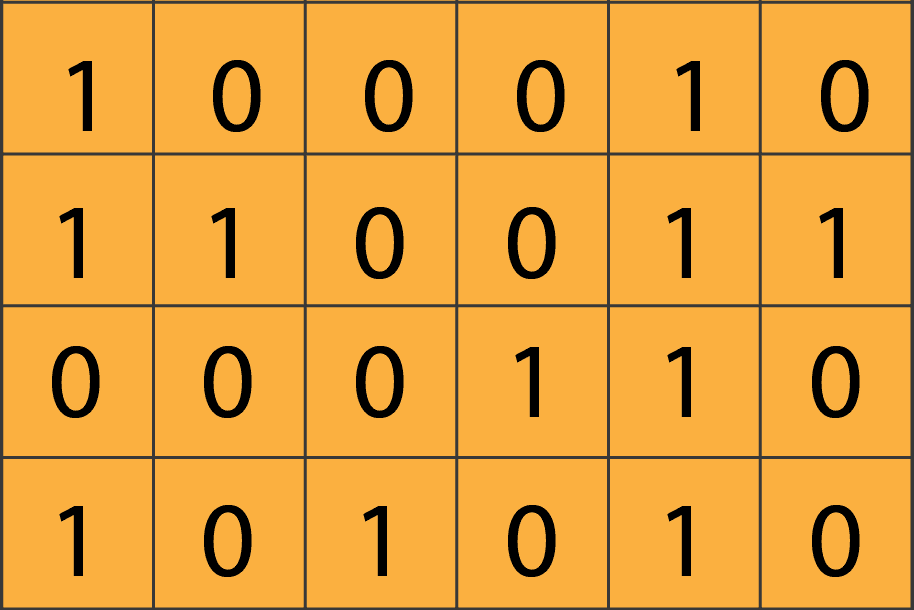

# 通过 5 个简单步骤掌握 TensorFlow“变量”

> 原文：<https://towardsdatascience.com/mastering-tensorflow-variables-in-5-easy-step-5ba8062a1756?source=collection_archive---------11----------------------->

## [←Part 1](/beginners-guide-to-tensorflow-2-x-for-deep-learning-applications-c7ebd0dcfbee)|[←Part 2](/mastering-tensorflow-tensors-in-5-easy-steps-35f21998bb86)|深度学习用 TensorFlow 2。X —第 3 部分| [第 4 部分→](/eager-execution-vs-graph-execution-which-is-better-38162ea4dbf6)

## 了解如何使用 TensorFlow 变量，它们与普通张量对象的区别，以及它们何时优于这些张量对象|使用 TensorFlow 2.x 进行深度学习

> **警告:**不要把这篇文章和[用 5 个简单的步骤掌握 TensorFlow 张量](/mastering-tensorflow-tensors-in-5-easy-steps-35f21998bb86)”混淆！

如果你正在阅读这篇文章，我确信我们有着相似的兴趣，并且正在/将要从事相似的行业。那么我们就通过[*Linkedin*](https://linkedin.com/in/orhangaziyalcin/)*来连线吧！请不要犹豫发送联系请求！*[*Orhan g . Yal n—Linkedin*](https://linkedin.com/in/orhangaziyalcin/)


图一。克里斯·贾维斯在 [Unsplash](https://unsplash.com?utm_source=medium&utm_medium=referral) 上拍摄的照片

在本教程中，我们将重点关注[张量流变量](https://www.tensorflow.org/api_docs/python/tf/Variable)。本教程结束后，您将能够有效地创建、更新和管理[张量流变量](https://www.tensorflow.org/api_docs/python/tf/Variable)。像往常一样，我们的教程将提供带有详细解释和概念性解释的代码示例。我们将通过 5 个简单的步骤掌握[张量流变量](https://www.tensorflow.org/api_docs/python/tf/Variable):

*   **第一步:变量定义**→简单介绍，与张量比较
*   **第二步:创建变量** →实例化 tf。可变对象
*   **第三步:** **变量资格** →特性和特征
*   **步骤 4:变量操作** →基本张量操作、索引、形状操作和广播
*   **步骤 5:变量的硬件选择**→GPU、CPU、TPU

系好安全带，我们开始吧！

# **变量的定义**

在这一步，我们将简要介绍什么是变量，并了解普通张量对象和变量对象之间的区别。

## 简介

TensorFlow 变量是表示共享和持久状态的首选对象类型，您可以用任何操作来操纵该状态，包括 TensorFlow 模型。操纵是指任何值或参数的更新。这个特性是变量相比于`tf.Tensor`对象最显著的特征。TensorFlow 变量记录为`tf.Variable`对象。让我们简单比较一下`tf.Tensor`和`tf.Variable`物体，了解它们的异同。



图二。变量值可以更新(图由作者提供)

## 与张量的比较

所以，变量和张量最重要的区别是**可变性**。与张量相反，变量对象中的值可以更新(*例如，用* `*assign()*` *函数*)。

[*“张量对象的值不能更新，只能用新值创建一个新的张量对象。*](/mastering-tensorflow-tensors-in-5-easy-steps-35f21998bb86)

*变量对象主要用于存储模型参数，由于这些值在训练过程中会不断更新，因此使用变量而不是张量是一种必然，而不是一种选择。*

*可变对象的形状可以用`reshape()`实例函数更新，就像张量对象的形状一样。因为可变对象是建立在张量对象之上的，所以它们有共同的属性，比如`.shape`和`.dtype`。但是，变量也有张量所没有的独特属性，如`.trainable`、`.device`和`.name`属性。*

**

*图 3。一个张量流变量实际上是一个带有附加特征的张量流的包装器(图由作者提供)*

> *让我们看看如何创建`tf.Variable`对象！*

# ***变量的创建***

*我们可以用`tf.Variable()`函数实例化(*即创建* ) `tf.Variable`对象。`tf.Variable()`函数接受不同的数据类型作为参数，比如整数、浮点数、字符串、列表和`tf.Constant`对象。*

*在展示具有这些不同数据类型的不同变量对象示例之前，我希望您[启动一个新的 Google Colab 笔记本](http://colab.research.google.com)并使用以下代码导入 TensorFlow 库:*

*现在，我们可以开始创建`tf.Variable`对象了。*

*1 —我们可以传递一个`tf.constant()`对象作为`initial_value`:*

*2 —我们可以传递一个整数作为`initial_value`:*

*3 —我们可以传递一个整数或浮点数列表作为`initial_value`:*

*4—我们可以传递一个字符串作为`initial_value`:*

*5—我们可以传递一个字符串列表作为`initial_value`:*

*如您所见，`tf.Variable()`函数接受几种数据类型作为`initial_value`参数。现在我们来看看变量的特性和特征。*

# ***变量的资格***

*每个变量都必须有一些属性，比如值、名称、统一数据类型、形状、等级、大小等等。在本节中，我们将了解这些属性是什么，以及如何在 Colab 笔记本中查看这些属性。*

## *价值*

*每个变量必须指定一个`initial_value`。否则，TensorFlow 将引发一个错误，并指出`Value Error: initial_value must be specified.`因此，请确保在创建变量对象时传递一个`initial_value`参数。为了能够查看变量值，我们可以使用`.value()`函数和`.numpy()`函数。请参见下面的示例:*

```
***Output:**
The values stored in the variables:
tf.Tensor( [[1\. 2.]  
            [1\. 2.]], shape=(2, 2), dtype=float32)The values stored in the variables:
[[1\. 2.]
[1\. 2.]]*
```

## *名字*

*Name 是一个变量属性，它帮助开发人员跟踪特定变量的更新。创建变量对象时，可以传递一个`name`参数。如果不指定名称，TensorFlow 会分配一个默认名称，如下所示:*

```
***Output:**
The name of the variable:  Variable:0*
```

## *数据类型*

*每个变量都必须存储统一的数据类型。由于为每个变量存储了一种类型的数据，您也可以使用`.dtype`属性查看这种类型。请参见下面的示例:*

```
***Output:**
The selected datatype for the variable:  <dtype: 'float32'>*
```

## *形状、等级和大小*

*shape 属性以列表的形式显示每个维度的大小。我们可以用`.shape`属性查看变量对象的形状。然后，我们可以用`tf.size()`函数查看变量对象的维数。最后，大小对应于一个变量拥有的元素总数。我们需要使用`tf.size()`函数来计算一个变量中元素的数量。请参见以下所有三个属性的代码:*

```
***Output:**
The shape of the variable:  (2, 2)
The number of dimensions in the variable: 2
The number of dimensions in the variable: 4*
```

# ***变量运算***

*使用数学运算符和张量流函数，您可以轻松执行一些基本运算。除了我们在本系列教程的[第 2 部分中介绍的内容，您还可以使用以下数学运算符进行变量运算。](/mastering-tensorflow-tensors-in-5-easy-steps-35f21998bb86)*

## *基本张量运算*

**

*图 4。你可能会受益于基本的数学运算符(图由作者提供)*

*   ***加减:**我们可以用`+`和`—`符号进行加减运算。*

```
*Addition by 2:
tf.Tensor( [[3\. 4.]  [3\. 4.]], shape=(2, 2), dtype=float32)Substraction by 2:
tf.Tensor( [[-1\.  0.]  [-1\.  0.]], shape=(2, 2), dtype=float32)*
```

*   ***乘除:**我们可以用`*`和`/`符号进行乘除运算。*

```
*Multiplication by 2:
tf.Tensor( [[2\. 4.]  [2\. 4.]], shape=(2, 2), dtype=float32)Division by 2:
tf.Tensor( [[0.5 1\. ]  [0.5 1\. ]], shape=(2, 2), dtype=float32)*
```

*   *Matmul 和 modulo 操作:最后，您还可以使用`@`和`%`符号进行 matmul 和 Modulo 操作:*

```
*Matmul operation with itself:
tf.Tensor( [[3\. 6.]  [3\. 6.]], shape=(2, 2), dtype=float32)Modulo operation by 2:
tf.Tensor( [[1\. 0.]  [1\. 0.]], shape=(2, 2), dtype=float32)*
```

*这些都是基本的例子，但它们可以扩展到复杂的计算中，从而创建我们用于深度学习应用的算法。*

```
***Note:** These operators also work on regular Tensor objects.*
```

## *分配、索引、广播和形状操作*

## *分配*

*使用`tf.assign()`功能，您可以在不创建新对象的情况下给变量对象分配新值。在需要重新赋值的地方，能够赋值是变量的优点之一。下面是一个值重新分配的示例:*

```
***Output:**
...array([[  2., 100.],
          [  1.,  10.]],...*
```

## *索引*

*就像在张量中一样，您可以使用索引值轻松地访问特定元素，如下所示:*

```
***Output:**
The 1st element of the first level is: [1\. 2.]
The 2nd element of the first level is: [1\. 2.]
The 1st element of the second level is: 1.0
The 3rd element of the second level is: 2.0*
```

## *广播*

*就像张量对象一样，当我们试图使用多个变量对象进行组合操作时，较小的变量可以自动扩展以适应较大的变量，就像 NumPy 数组一样。例如，当您试图将一个标量变量与一个二维变量相乘时，该标量将被拉伸以乘以每个二维变量元素。请参见下面的示例:*

```
*tf.Tensor([[ 5 10]
           [15 20]], shape=(2, 2), dtype=int32)*
```

## *形状操作*

*就像在张量对象中一样，你也可以改变可变对象的形状。对于整形操作，我们可以使用`tf.reshape()`功能。让我们在代码中使用`tf.reshape()`函数:*

```
*tf.Tensor( [[1.]
            [2.]
            [1.]
            [2.]], shape=(4, 1), dtype=float32)*
```

# ***变量的硬件选择***

*正如您将在接下来的部分中看到的，我们将使用 GPU 和 TPU 加速我们的模型训练。为了能够看到我们的变量是用什么类型的设备(即处理器)处理的，我们可以使用`.device`属性:*

```
*The device which process the variable:   /job:localhost/replica:0/task:0/device:GPU:0*
```

*我们还可以通过将设备名作为参数传递来设置哪个设备应该使用`tf.device()`函数处理特定的计算。请参见下面的示例:*

```
***Output:**
The device which processes the variable a: /job:localhost/replica:0/task:0/device:CPU:0The device which processes the variable b: /job:localhost/replica:0/task:0/device:CPU:0The device which processes the calculation: /job:localhost/replica:0/task:0/device:GPU:0*
```

*尽管在训练模型时不必手动设置，但在某些情况下，您可能需要为特定的计算或数据处理工作选择一个设备。所以，要小心这个选项。*

# *恭喜*

*我们已经成功地介绍了 TensorFlow 可变对象的基础知识。*

> **拍拍自己的背！**

*这应该给了您很大的信心，因为您现在对 TensorFlow 中用于各种操作的主要可变变量对象类型有了更多的了解。*

*如果这是你的第一篇文章，考虑从这个系列教程的第一部分[开始](/beginners-guide-to-tensorflow-2-x-for-deep-learning-applications-c7ebd0dcfbee):*

*[](/beginners-guide-to-tensorflow-2-x-for-deep-learning-applications-c7ebd0dcfbee) [## 深度学习应用 TensorFlow 2.x 初学者指南

### 了解 TensorFlow 平台以及它能为机器学习专家提供什么

towardsdatascience.com](/beginners-guide-to-tensorflow-2-x-for-deep-learning-applications-c7ebd0dcfbee) 

或者[检查第二部分](/mastering-tensorflow-tensors-in-5-easy-steps-35f21998bb86):

[](/mastering-tensorflow-tensors-in-5-easy-steps-35f21998bb86) [## 通过 5 个简单的步骤掌握 TensorFlow 张量

### 探索 TensorFlow 的构建模块如何在较低的级别工作，并学习如何充分利用张量…

towardsdatascience.com](/mastering-tensorflow-tensors-in-5-easy-steps-35f21998bb86) 

# 订阅邮件列表获取完整代码

如果你想获得 Google Colab 的全部代码和我的其他最新内容，可以考虑订阅邮件列表:

> [现在就订阅](http://eepurl.com/hd6Xfv)

最后，如果你对更高级的应用深度学习教程感兴趣，请查看我的一些其他文章:

[](/image-classification-in-10-minutes-with-mnist-dataset-54c35b77a38d) [## 使用 MNIST 数据集在 10 分钟内完成图像分类

### 利用 TensorFlow 和 Keras |监督深度学习使用卷积神经网络来分类手写数字

towardsdatascience.com](/image-classification-in-10-minutes-with-mnist-dataset-54c35b77a38d) [](/image-noise-reduction-in-10-minutes-with-convolutional-autoencoders-d16219d2956a) [## 使用卷积自动编码器在 10 分钟内降低图像噪声

### 在时尚 MNIST 的帮助下，使用深度卷积自动编码器清洁(或去噪)有噪声的图像

towardsdatascience.com](/image-noise-reduction-in-10-minutes-with-convolutional-autoencoders-d16219d2956a) [](/image-generation-in-10-minutes-with-generative-adversarial-networks-c2afc56bfa3b) [## 利用生成性对抗网络在 10 分钟内生成图像

### 使用无监督深度学习生成手写数字与深度卷积甘斯使用张量流和…

towardsdatascience.com](/image-generation-in-10-minutes-with-generative-adversarial-networks-c2afc56bfa3b) [](/fast-neural-style-transfer-in-5-minutes-with-tensorflow-hub-magenta-110b60431dcc) [## TensorFlow Hub & Magenta 在 5 分钟内实现快速神经风格转换

### 利用 Magenta 的任意图像风格化网络和深度学习，将梵高的独特风格转移到照片中

towardsdatascience.com](/fast-neural-style-transfer-in-5-minutes-with-tensorflow-hub-magenta-110b60431dcc)*