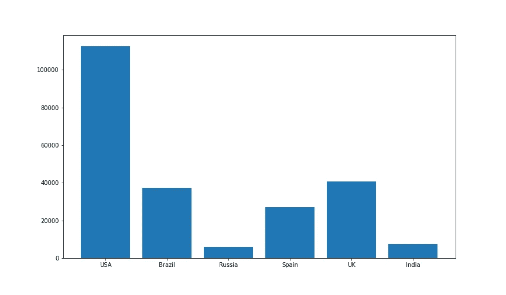
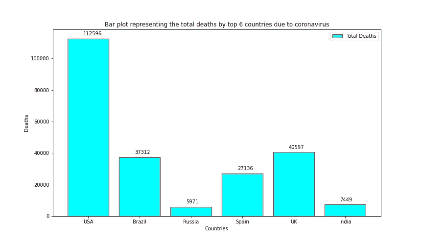
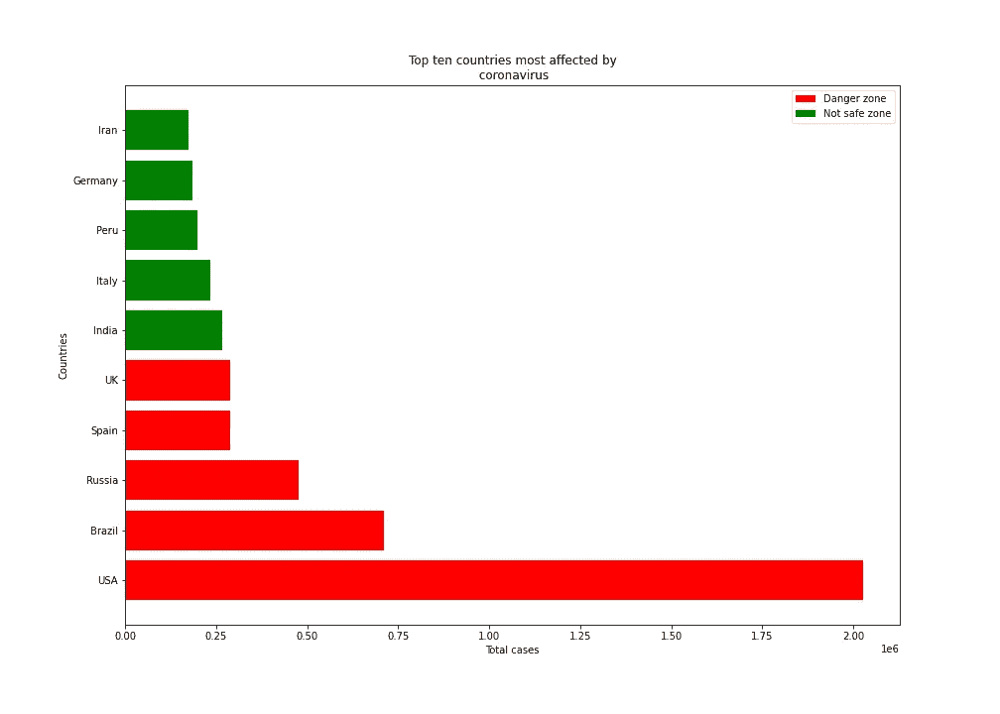
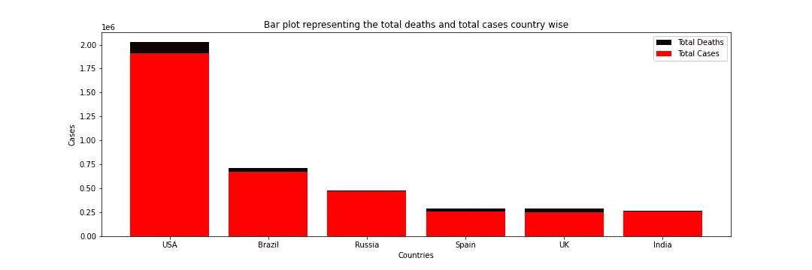
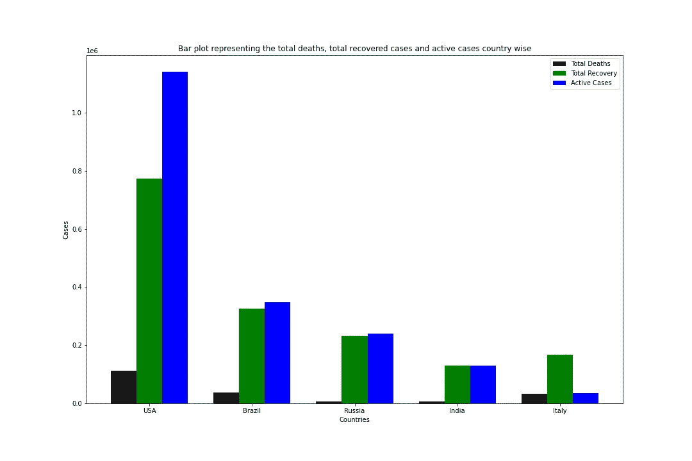

# 在 Python 中掌握条形图

> 原文：<https://towardsdatascience.com/mastering-the-bar-plot-in-python-4c987b459053?source=collection_archive---------4----------------------->

## 在本教程中，让我们借助例子深入学习“条形图”可视化。


**来源:**[**Abhijeet Bhatt**](https://www.scoopwhoop.com/author/abhijeet/?ref=page_article)**via**[**scoop hook**](https://www.scoopwhoop.com/bar-graphs-sum-up-everyday-life/)**(**[**CCO**](https://creativecommons.org/licenses/)**)**

# 介绍

**数据可视化**是数据科学家最重要的基本工具包之一。一个好的视觉效果是很难产生的。通常在演示过程中，人们对数据或涉及的统计数据理解得不够好，但向他们展示良好的可视化效果将有助于他们理解我们试图向他们传达的故事。因此，他们说**一幅图胜过千言万语**。

> 我认为想象是实现个人目标的最有力的手段之一。哈维·麦凯

本教程的全部代码可以在下面给出的我的 [**GitHub 库**](https://github.com/Tanu-N-Prabhu/Python/blob/master/Mastering_the_Bar_Plot_in_Python.ipynb) 中找到。去看看吧:

[](https://github.com/Tanu-N-Prabhu/Python/blob/master/Mastering_the_Bar_Plot_in_Python.ipynb) [## 塔努-北帕布/Python

### permalink dissolve GitHub 是超过 5000 万开发人员的家园，他们一起工作来托管和审查代码，管理…

github.com](https://github.com/Tanu-N-Prabhu/Python/blob/master/Mastering_the_Bar_Plot_in_Python.ipynb) 

# 图书馆

用于可视化的最好和最常用的库之一叫做 **matplotlib** 。这个库产生可出版的高质量的图。在整个教程中，我们将使用 **pyplot** 模块。如果您使用的是 [**jupyter 笔记本**](https://jupyter.org/) 那么您可以直接导入库，否则，您可以使用下面的命令手动安装:

## 安装库

matplotlib 目前的新版本是 **3.2.1** 。这里的 可以参考官方安装文档 [**。**](https://pypi.org/project/matplotlib/)

`**pip install matplotlib**`

如果你用的是 [**jupyter 笔记本**](https://jupyter.org/) 那么你可能要加一个**！”**命令开始时。这只是通知内核正在输入命令。

`**!pip install matplotlib**`

# 条形图

柱状图或条形图是一种用**矩形条**表示**分类数据**的**值**的图表。矩形条可以是**水平**或**垂直**。**分类数据**这里可以是电影、国家、足球运动员等的名字。相应的**值**可以是赢得奥斯卡的电影数量、一个国家的 GDP、进球最多的球员等等。

## 句法

下面是条形图的一般语法:

```
bar(**x**, **height**, **width**, **bottom**, *****, **align**) 
```

## 因素

*   **x** =杆件的' **x** '坐标。
*   **底部** =杆件的' **y** 坐标。默认值为 **0** 。
*   **高度** =横条的'**高度**'。
*   **宽度** =钢条的“**宽度**”。默认值为 **0.8** 。
*   **对齐** =基于“ **x** ”坐标的条对齐。默认值为“**居中**”，使基座在“ **x** 位置居中。类似地，替代值是“ **edge** ”，它相对于“ **x** ”坐标对齐条的左边缘。

## 其他参数

' ***** '代表备选参数，我将只提及最常用的参数，例如:

*   **颜色** =条形图的颜色。这些值必须是' **r** '、 **g** '、 **b** '以及这三个值的任意组合。同样，诸如'**红色**'、**青色**'等颜色也是有效的。
*   **方向** =钢条的方向。这些值是'**水平**和'**垂直**'，它们的工作原理不言自明。

## 返回

bar 函数以条(水平或垂直)的形式返回所有的**容器。**

# 例子

现在，从这里开始，我将通过例子来解释这些概念，以便你能清楚地理解它的用法。

## 不涉及技巧的简单条形图(无特殊参数)

在这里绘制柱状图，我将使用来自 [**worldometer**](https://www.worldometers.info/coronavirus/) 的数据，这是来自**前 6 个国家**的冠状病毒死亡总数。数据拍摄于**8–6–20**上午**10:18(CST)**。

```
**# Importing the matplotlib library** import matplotlib.pyplot as plt**# Categorical data: Country names** countries = ['USA', 'Brazil', 'Russia', 'Spain', 'UK', 'India']**# Integer value interms of death counts** totalDeaths = [112596, 37312, 5971, 27136, 40597, 7449]**# Passing the parameters to the bar function, this is the main function which creates the bar plot** plt.bar(countries, totalDeaths)**# Displaying the bar plot** plt.show()
```

在您的笔记本环境中执行此代码，您将获得一个惊人的条形图，其中包含最少的细节:



**塔努·南达·帕布的简单条形图**

## 通过启用特殊参数绘制条形图

在下面的图中，让我们添加一些香料到图中，香料的意思是添加更多的参数，使图看起来更好，信息更丰富。此外，我们可以使用一些属性来使条形图更具信息性。以下是我想补充的一些内容:

*   `**figsize = (12,7)**` **:** 帮助设置地块的**高度**和**宽度**。但是其中一个扭曲是顺序互换，即(宽度，高度)或(y，x)。
*   `**width= 0.9**` **:** 帮助设置条形的宽度。
*   `**color = ‘cyan’**` **:** 它有助于设置条形的颜色。
*   `**edgecolor = ‘red’**` **:** 它有助于设置条形的边缘颜色。
*   `**annotate = (‘text’, (x, y))**` **:** 有助于标注条，包括文本或字符串以及 x 和 y 坐标的位置。
*   `**legend(labels = [‘Text’])**` **:** 帮助设置条形图的标签。
*   `**title(‘Text’)**` **:** 帮助提供条形图的标题
*   `**xlabel(‘Text’), ylabel(‘Text’)**` **:** 帮助提供绘图的 x 轴和 y 轴的名称。
*   `**savefig(‘Path’)**` **:** 它有助于将情节保存到你的本地机器或任何地方。您可以保存为不同的格式，如“ **PNG** ”、“ **JPEG** ”等。

> 这里的'**文本**可以用你选择的字符串代替，'**路径**代表你要存储地块的路径。

```
**# Importing the matplotlib library** import matplotlib.pyplot as plt**# Declaring the figure or the plot (y, x) or (width, height)** plt.figure(figsize = (12,7))**# Categorical data: Country names** countries = ['USA', 'Brazil', 'Russia', 'Spain', 'UK', 'India']**# Integer value interms of death counts** totalDeaths = [112596, 37312, 5971, 27136, 40597, 7449]**# Passing the parameters to the bar function, this is the main function which creates the bar plot** plt.bar(countries, totalDeaths, width= 0.9, align='center',color='cyan', edgecolor = 'red')**# This is the location for the annotated text** i = 1.0
j = 2000**# Annotating the bar plot with the values (total death count)** for i in range(len(countries)):
    plt.annotate(totalDeaths[i], (-0.1 + i, totalDeaths[i] + j))**# Creating the legend of the bars in the plot** plt.legend(labels = ['Total Deaths'])**# Giving the tilte for the plot** plt.title("Bar plot representing the total deaths by top 6 countries due to coronavirus")**# Namimg the x and y axis** plt.xlabel('Countries')
plt.ylabel('Deaths')**# Saving the plot as a 'png'** plt.savefig('1BarPlot.png')**# Displaying the bar plot** plt.show()
```



**Tanu Nanda Prabhu 的更好的柱状图(信息更丰富)**

## 水平条形图

是的，你没看错。通过添加一个额外的字符' **h** '，我们可以水平对齐这些条。此外，我们可以用两种或更多种不同的颜色来表示条形，这将增加图形的可读性。下面显示的是修改后的代码。

```
**# Importing the matplotlib library** import matplotlib.pyplot as plt**# Declaring the figure or the plot (y, x) or (width, height)** plt.figure(figsize=[14, 10])**# Passing the parameters to the bar function, this is the main function which creates the bar plot
# For creating the horizontal make sure that you append 'h' to the bar function name**
plt.bar**h**(['USA', 'Brazil', 'Russia', 'Spain', 'UK'], [2026493, 710887, 476658, 288797, 287399], label = "Danger zone", color = 'r')plt.bar**h**(['India', 'Italy', 'Peru', 'Germany', 'Iran'], [265928, 235278, 199696, 186205, 173832], label = "Not safe zone", color = 'g')**# Creating the legend of the bars in the plot** plt.legend()**# Namimg the x and y axis** plt.xlabel('Total cases')
plt.ylabel('Countries')**# Giving the tilte for the plot** plt.title('Top ten countries most affected by\n coronavirus')**# Saving the plot as a 'png'** plt.savefig('2BarPlot.png')**# Displaying the bar plot** plt.show()
```



**Tanu Nanda Prabhu 的单杠图**

## 将两个条形图堆叠在一起

有时，您可能想要将两个或多个条形图堆叠在一起。借助于此，您可以直观地区分两个独立的量。要做到这一点，只需遵循。

```
**# Importing the matplotlib library** import matplotlib.pyplot as plt**# Declaring the figure or the plot (y, x) or (width, height)** plt.figure(figsize=[15, 5])**# Categorical data: Country names** countries = ['USA', 'Brazil', 'Russia', 'Spain', 'UK', 'India']**# Integer value interms of death counts** totalCases = (2026493, 710887, 476658, 288797, 287399, 265928)**# Integer value interms of total cases** totalDeaths = (113055, 37312, 5971, 27136, 40597, 7473)**# Plotting both the total death and the total cases in a single plot. Formula total cases - total deaths** for i in range(len(countries)): plt.bar(countries[i], totalDeaths[i], bottom = totalCases[i] -  totalDeaths[i], color='black')
    plt.bar(countries[i], totalCases[i] - totalDeaths[i], color='red')**# Creating the legend of the bars in the plot** plt.legend(labels = ['Total Deaths','Total Cases'])**# Giving the tilte for the plot**
plt.title("Bar plot representing the total deaths and total cases country wise")**# Namimg the x and y axis**
plt.xlabel('Countries')
plt.ylabel('Cases')**# Saving the plot as a 'png'**
plt.savefig('3BarPlot.png')**# Displaying the bar plot**
plt.show()
```



**Tanu Nanda Prabhu 将两个条形图堆叠在一起**

在上图中，我们可以看到两种不同的数据变化，分别是**总死亡数**和**总病例数**。

## 绘制两个相邻的条形图(分组)

很多时候，你可能想把两个或更多的图组合在一起，只是为了表示两个或更多不同的量。同样在下面的代码中，你可以学习用你选择的名字覆盖 x 轴的名字。

```
**# Importing the matplotlib library** import numpy as np
import matplotlib.pyplot as plt**# Declaring the figure or the plot (y, x) or (width, height)** plt.figure(figsize=[15, 10])**# Data to be plotted** totalDeath = [113055, 37312, 5971, 7473, 33964]
totalRecovery = [773480, 325602, 230688, 129095, 166584]
activeCases = [1139958, 347973, 239999, 129360, 34730]**# Using numpy to group 3 different data with bars** X = np.arange(len(totalDeath))**# Passing the parameters to the bar function, this is the main function which creates the bar plot
# Using X now to align the bars side by side** plt.bar(X, totalDeath, color = 'black', width = 0.25)
plt.bar(X + 0.25, totalRecovery, color = 'g', width = 0.25)
plt.bar(X + 0.5, activeCases, color = 'b', width = 0.25)**# Creating the legend of the bars in the plot** plt.legend(['Total Deaths', 'Total Recovery', 'Active Cases'])**# Overiding the x axis with the country names** plt.xticks([i + 0.25 for i in range(5)], ['USA', 'Brazil', 'Russia', 'India', 'Italy'])**# Giving the tilte for the plot** plt.title("Bar plot representing the total deaths, total recovered cases and active cases country wise")**# Namimg the x and y axis**
plt.xlabel('Countries')
plt.ylabel('Cases')**# Saving the plot as a 'png'** plt.savefig('4BarPlot.png')**# Displaying the bar plot** plt.show()
```



**Tanu Nanda Prabhu 对柱状图进行分组**

在上面的图中，我们可以很容易地想象哪个国家在恢复或活跃病例等方面做得很好。

# 结论

条形图是 matplotlib 库中最简单、最有趣的图形之一。学习起来很有趣，希望你们已经完全理解了进出酒吧的情节。下面是我在教程的上一部分中提到的简要目录。去看看，把你脑子里的事情弄清楚，如果不行就回来找我。

## 目录:

*   条形图的一般语法
*   简单的条形图，不涉及任何技巧
*   学习如何使用特殊参数
*   水平绘制条形图
*   将两个条形图堆叠在另一个之上
*   绘制相邻的三条形图(分组)
*   超越 x 轴，学习`**xticks**` 能做什么魔法。
*   最后，将绘图保存为图像(png)。

谢谢各位了本教程就到此为止“**掌握 Python 中的条形图**”。希望你今天学到了一些新东西，随时探索更多创建酷吧的情节。在那之前，敬请关注更多更新**注意安全**。