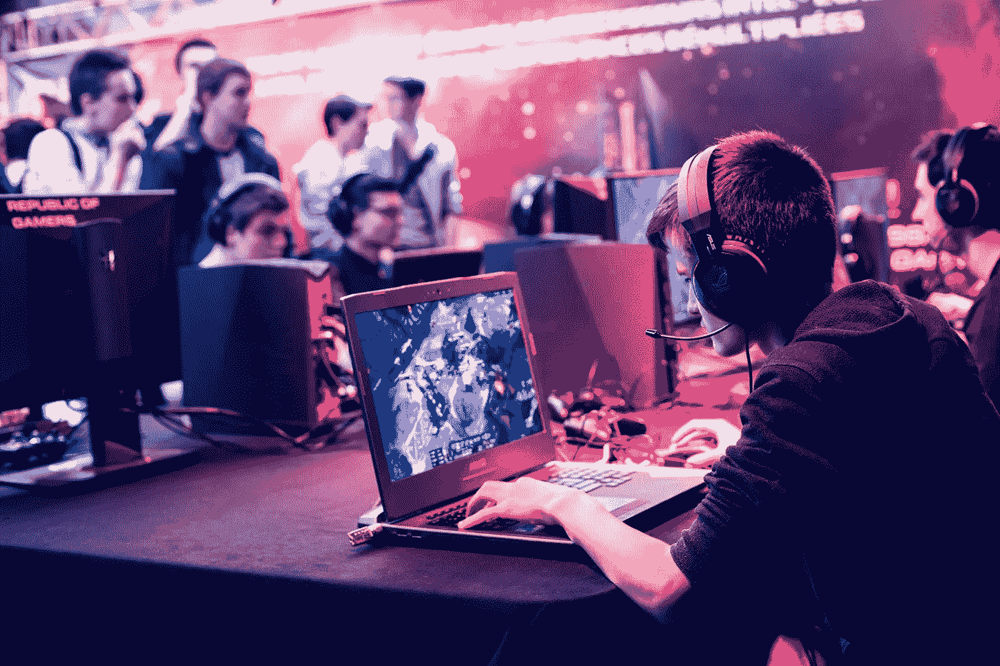

# 基于香草深度神经网络的英雄联盟比赛预测

> 原文：<https://towardsdatascience.com/match-prediction-in-league-of-legends-using-vanilla-deep-neural-network-7cadc6fce7dd?source=collection_archive---------18----------------------->

## 了解英雄联盟比赛预测模型，该模型通过其独特的输入功能显示约 70%的准确性。

马克西姆·罗西诺尔在 [Unsplash](https://unsplash.com/collections/1123297/esports-in-indonesia-(project-startup?utm_source=unsplash&utm_medium=referral&utm_content=creditCopyText) 上的照片

# **为什么要研究电子竞技游戏中的获胜预测？**

公众的第一个反应是钱，的确，也许钱可以通过一个足够成功的预测模型来赚，但也许这只是看着一个小画面。

解剖模型可以看到更大的画面。成功的胜利预测模型准确地告诉我们是什么促成了比赛的胜利。

例如，假设预测模型中使用的数据点之一是*球员身高*。如果通过预测模型显示，球队的平均身高越高，该队赢得比赛的可能性越大，那么我们可以从预测模型中得出与我们的信念相反的结论，*球员身高*实际上在赢得联赛比赛中至关重要！这可能会从根本上改变世界各地职业联赛电子竞技队的球探系统。

你可能会问，为什么要首先关注电子竞技行业。嗯，在 2019 年的英雄联盟世界锦标赛中，**4400 万**人同时观看了 11 月 10 日的决赛， **1 亿**独立观众在线观看了这场赛事。这超过了当年超级碗的观众人数。随着这个行业越来越受欢迎，预计这个数字还会继续增长。

研究电子竞技背后的数字的最后一个原因是**可获得的数据**。关于这个话题存在一些争论，因为 RiotApi(一种用于获取比赛数据的 Api，通过《英雄联盟》的出版商 RiotGames 提供)提供的数据有限且不准确，这可能是大多数关于同一游戏类型的研究论文都基于《英雄联盟》的竞争对手 DotA2 的原因。但是，数据是免费的。与足球等其他传统运动相比，这是一个巨大的优势，在足球等传统运动中，有意义的数据只能通过像 Opta 这样的公司的昂贵订阅才能获得。

# 电子竞技比赛预测的前期研究

如前所述，很少有关于英雄联盟比赛预测的先前研究，但 DotA2 比赛预测的情况相反。由于这两款游戏属于同一类型，游戏玩法相似，这些研究值得探讨。

例如，论文 *Dota 2 获胜预测*提供了一个具有 73%准确性的预测器，使用了诸如偏移、匹配、协同和对抗等特征。
另一篇论文*赢或不赢*提供了一个具有 74%准确率的预测器，使用共现网络来揭示英雄协同数据，并使用逻辑回归来做最后的魔术。

尽管这些结果令人惊讶，但对这些先前的研究有一定的改进，可以应用于获得更好的结果。

首先，两篇论文都将每个英雄视为输入中的一个单独的向量，或者在数据预处理过程中。这让你“考虑每个光芒四射和可怕的英雄对比赛结果的个人影响”，但也有对每个冠军训练预测模型过于狭隘的危险。以⁴为例，预测模型将无法把*或*视为一个拥有坦克和大量魔法伤害的冠军，而只是把*或*视为自己。它将错过定义单个冠军的特征，并且无法与其他类似的冠军进行归纳。

第二，两篇论文都没有考虑到玩家控制英雄的技能。很明显，一个职业玩家控制一个英雄会比一个普通玩家控制同一个英雄对游戏结果产生更大的影响。因此，虽然英雄的影响力、协同效应和反选择都很重要，但玩家的技能也很重要。这可能是提高预测能力的附加特征。

# 数据集

RiotApi 的问题是很难随时获得固定数量的比赛数据。有必要确定一个球员，然后浏览他的比赛历史，然后继续查看出现在他的比赛历史上的球员的比赛历史，以递归地收集比赛数据。

即使采集了数据，也必须经过*过滤*，以确保冠军的泳道位置标记正确。在超过一半的情况下，Riot 错误地标记了冠军的车道位置，在顶车道标记了三个冠军，在中间车道标记了四个冠军，在 bot 车道标记了零个冠军，等等。

RiotApi 还强制执行每 2 分钟 100 个请求的速率限制，加上损坏数据的高概率，这意味着我必须在自定义 AWS EC2 服务器上运行一个脚本几天，无休止地挖掘匹配数据。

在我的研究中，我收集了 1045 个匹配数据，其中 80%作为训练集，10%作为开发集，其余 10%作为测试集。

# 特征

我的模型与之前的研究的真正区别在于我对特征的选择。

我在模型中使用的特征是**胜率**。

关于英雄联盟游戏的一个显而易见的事实是，一个由优秀玩家组成的团队控制强大的冠军将会获胜。在这里，成为一名“好球员”更具体地意味着球员擅长控制特定的冠军，因为球员必须能够匹配冠军的比赛风格，以最大限度地发挥冠军的潜力。

那么问题就变成了，有哪些数据在数字中表现出以下两个特征？

1.  一个球员对某个冠军的控制有多好
2.  当前元中的冠军有多强

第一个特征由玩家与特定冠军的胜率来捕捉。例如，一个只玩名为*奈特利*的冠军的玩家在玩那个冠军时很可能会有很高的胜率。

第二个特征是由当前元/补丁中特定冠军的胜率捕获的。众所周知，一个强有力的冠军有很高的胜率(通常等于或大于 53%，当从所有级别合计时)。

我们为每个队中的每个球员收集这些数据，因此神经网络的每个输入向量将有 20 个数据点大，如下所示:

[0.5114, 0.52, 0.5275, 0.619, 0.5074, 0.727, 0.4999, 0.517, 0.5187, 0.659, 0.5034, 0.0, 0.5005, 0.5, 0.4448, 0.257, 0.5065, 0.286, 0.5199, 0.544]

结果是我有一个只有 20 大的输入特征。与先前研究中使用的输入特征相比，这是非常小的。

> 每一个 *2*i* | 0≤i≤9 元素都是当前元/补丁中的冠军胜率， *1+i* | 0≤i≤9 是玩家控制那个特定冠军时的胜率。

# 模型和结果

## 模型

如题，我用的是香草深度神经网络，意思是有四个隐层的全连接前馈深度神经网络。
我使用了 [tflearn 库](http://tflearn.org)来构建模型，包含了批量训练。尝试了各种参数和超参数，包括隐藏层数。虽然四个隐藏层看起来过多，但它似乎产生了最好的结果，尽管两个或三个隐藏层的性能差别很小。我不会透露确切的参数/超参数，因为通过设置自己的参数应该很容易重现结果。

## 结果

神经网络的性能取决于参数/超参数，但最具代表性的数字如下:

训练精度:0.7255
验证精度:0.6905
测试精度:0.7033

此外，由于在输出层使用了 softmax 激活，输出向量将网络在比赛中获胜或失败的“置信度”显示为大小为 2 的向量(例如，[0.317，0.683]将显示模型认为比赛失败)。输出向量中的数字并不直接转化为赢或输的“概率”,特别是因为使用了批量训练，但它们确实给出了每个事件可能性的一般意义。因此，我收集了所有比赛，其中模型有 0.8 或更多的“信心”认为这场比赛会取得胜利，然后得到了 76.76%的准确率:对于某些比赛，我们可以非常确定它的结果。

# 很大的改进空间

这个模型仍然很有希望的是有很大的改进空间，因此，有可能获得更高的匹配预测准确性。

## 红边/蓝边

当进入英雄联盟比赛时，每个玩家被分配到红方或蓝方。传统上，胜率会因你站在哪一边而有所不同，而在当前的补丁中，胜率没有太大的差异(蓝边的胜率为 50.3%)，这是一个随补丁而变化的数字，可以考虑在内。⁵

## 冠军协同效应

协同是之前研究中包含的特征之一，单独负责*记录的 74%预测准确率赢或不赢。⁵* 想出一种方法来准确反映冠军协同效应，并将其作为输入特征，可以提高模型的准确性。

## 数据的细化

在当前用于培训/开发/测试集的数据中，有些数据是不可能找到的，因此只能靠运气。这些归功于我大量使用 [op.gg](http://op.gg) 和其他英雄联盟分析网站来收集特定玩家的冠军统计数据。
例如，如果在预处理数据时，python 爬行脚本找不到某个玩家的冠军特定胜率，则该胜率会自动分配 0.5 的值。这是一个合理的选择，因为在大多数情况下，特定冠军的胜率不会出现，因为缺乏特定冠军的使用，这意味着玩家不擅长使用冠军的可能性与他/她擅长使用冠军的可能性一样大。
随着数据更加精确，漏洞更少，这种神经网络模型的性能可能会提高。

## 球员的形式

玩家之间的一个普遍现象是，有时候玩家会陷入“翻滚”这意味着当一个球员已经连续赢了几场比赛，他觉得他很可能在下一场比赛中再次获胜，反之亦然。在职业锦标赛中，根据球员的表现，一支球队可能会有非常不同的表现，这几乎是一个既定的事实。例如，2020 年 LCK 之春的 KT Rolster 在本赛季的大部分时间里表现极差，但在比赛的最后两周表现出非凡的实力，这是因为球员和球队的“状态”有所改善。这也可能是影响匹配预测的附加特征。

## 冠军作文

与冠军协同非常相似，但也有一点不同，冠军组合指的是比赛前一支球队的结构。例如，蓝队可能有一个治疗冠军，两个坦克冠军，两个经销商冠军，这取决于补丁/元可以影响该队的胜利可能性。另一个区别可能是“早期”冠军和“后期”冠军。这些标签根据冠军何时对游戏产生最大影响来区分冠军，因此可能是代表团队组成的另一种方式。

# 现在怎么办？

我有信心，用更多的特征和更好的数据来改进预测模型将会增强模型的预测能力，也许会超过先前的一项研究设定的 74%的基线。

希望有了更先进的预测模型，我们可以制定最佳团队构成的指导方针，以及在寻找未来职业球员时具体要寻找什么。通过提出一个成功的模型并检查权重，我们可以潜在地洞察到与团队组成相比，对冠军的掌握有多重要，等等。这不仅会影响职业球队的球探系统，还会影响他们在锦标赛中的策略。

因为我现在在军队服役，所以我能多快/多有效地进行这项研究是有限制的。但我还是会这样做，并继续发布我的收获。

## 后续步骤:

在 AWS 上学习和设置 DynamoDB。
创建脚本文件，在 DynamoDB 上建立我自己的数据库。
为 RiotApi 注册开发 Api 密钥。
学习如何表现冠军协同效应和组合。
等。

[1]裴，安妮，*“这个电竞巨头吸引的观众比超级碗还多，预计会变得更大”，*https://www . CNBC . com/2019/04/14/league-of-legends-gets-more-viewers-than-Super-Bowl whats-coming-next . html
【2】金凯德，尼古拉斯，*“DOTA 2 赢预测。”* (2015)。
【3】卡亚纳拉曼，考希克。*“赢还是不赢？决定 DotA 2 比赛结果的预测模型。”* (2015)。
【4】金凯德。
【5】卡利亚纳拉曼。
【6】红色 vs 蓝色图形(2020 . 04 . 17)[https://www.leagueofgraphs.com/rankings/blue-vs-red/na](https://www.leagueofgraphs.com/rankings/blue-vs-red/na)