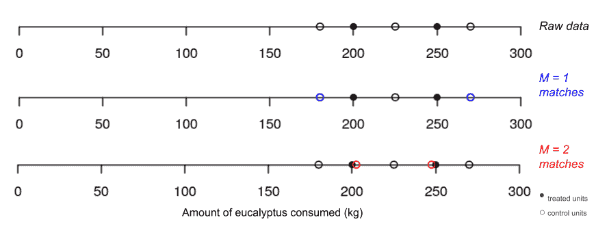
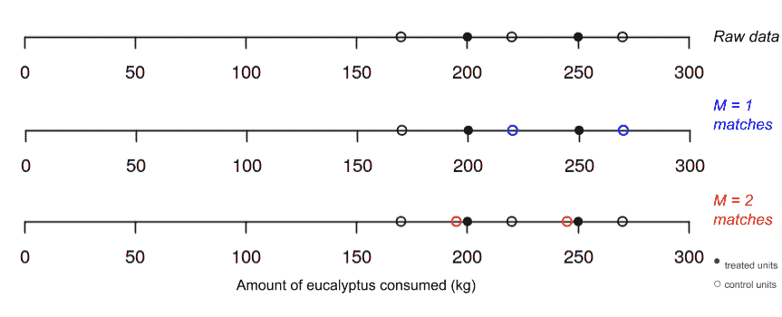
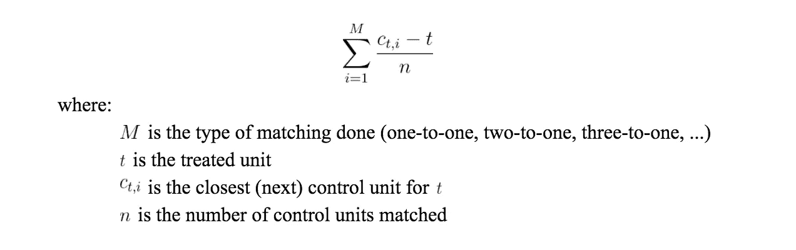
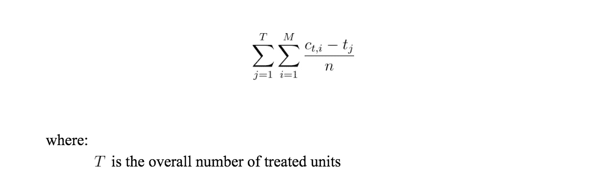
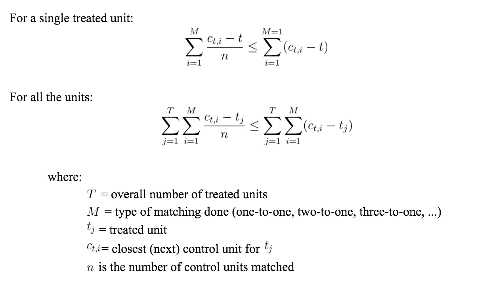
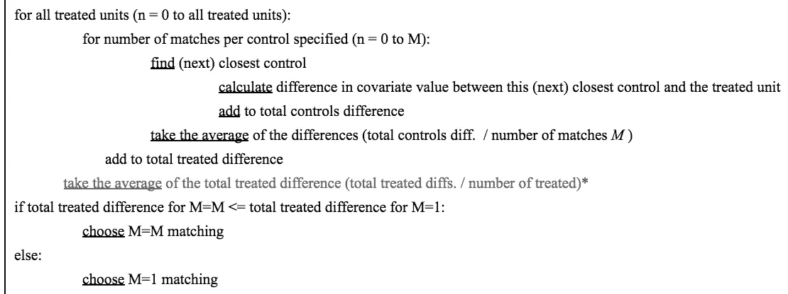
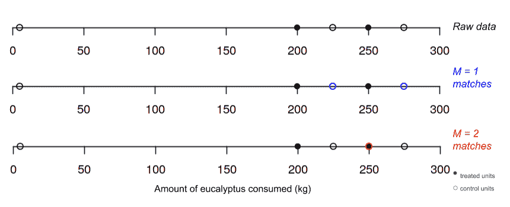
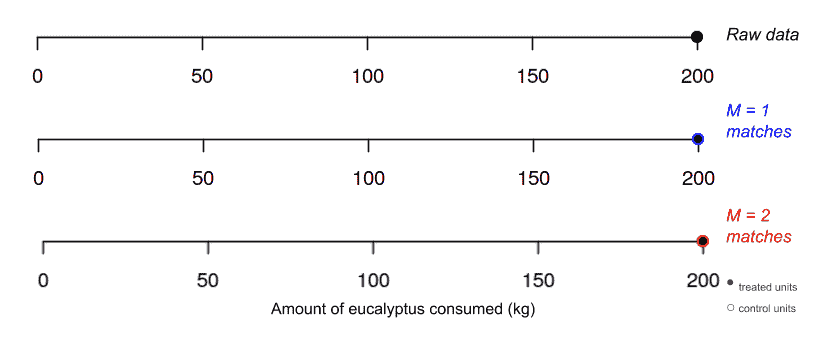
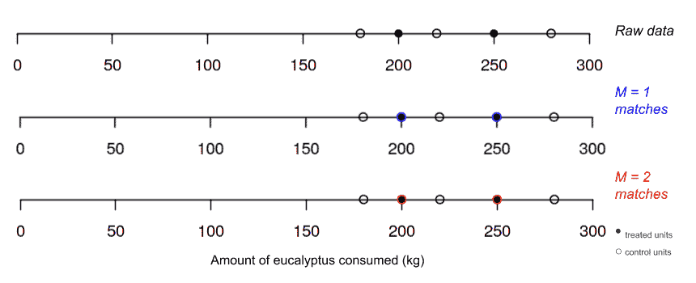
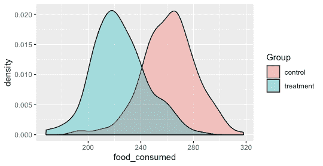

# 配对:着火的考拉——第二部分

> 原文：<https://towardsdatascience.com/matching-koalas-on-fire-part-2-71083b81b50b?source=collection_archive---------43----------------------->

## 最佳匹配比例是多少？1:1 匹配还是 1:多匹配？

## **合著** [**斯维特拉娜**米店科](https://medium.com/u/4f904fbe39bd?source=post_page-----71083b81b50b--------------------------------)

> **此处** **检出零件 1** [**。在这里，我们将告诉您所有关于称为(多重)匹配的工具，并介绍我们的示例数据集——考拉！**](https://medium.com/@svitlana_78975/matching-koalas-on-fire-part-1-17691bb85c23)

由 [David Clode](https://unsplash.com/@davidclode) 在 [Unsplash](https://unsplash.com/) 上拍摄的图像

> ***TL；博士:*** *匹配被认为是因果推理的黄金工具。我们同意这很棒，但我们大多数人默认将匹配比例参数设置为 1:1。每个被处理的数据单元然后与一个且仅一个控制单元配对，而不是多个控制单元。我们会不会因为依赖毫无疑问的违约而错失了一些额外的权力？我们认为我们可能…我们试图通过定量探索来解决这个问题。结果呢？这真的取决于——尤其是数据集的分布。在下面找出匹配和因果推理的所有细节。*

## 酷，那有什么交易？

到目前为止，**该领域的规范是使用一对一匹配( *M* =1)作为默认**和匹配的起点。这放弃了使用多重匹配比率**，假设 1:1 通常提供协变量的最佳平衡**。然而，我们刚刚在之前的帖子中举例说明了情况可能并非如此。那么，我们如何知道对我们的数据集使用哪个匹配比率呢？下面我们用一些例子来探讨这个问题。

# 什么时候应该使用多对一匹配？

我们来分析一下。我们可以开始通过定量研究来寻找答案。现在，让我们把多对一匹配看作二对一匹配。我们还将坚持一维匹配——协变量:考拉吃掉的桉树的千克数。

## **二对一匹配( *M* = 2)什么时候比一对一匹配( *M* = 1)效果更好？**

**图一**。有利于二比一匹配的数据点分布。我们可以看到，当红色的 *M* = 2 时创建的“合成”匹配比当 *M* = 1 (p 值= 0.88)时发现的单个匹配更接近处理的单位(p 值= 0.97)。同时，根本没有匹配实现了比一对一匹配更好但比二对一匹配更差的平衡(p 值= 0.92)。

**图二。**有利于二比一匹配的数据点分布。同样，与 *M* = 1 (p 值= 0)相比， *M* = 2 (p 值= 0.82)的“合成”匹配更接近于处理过的单位。

简而言之，当多个选择的控制单元的*平均值*比*一个*最近的控制单元更接近被处理单元的值时，我们希望使用多重匹配。

理想情况下，控制单元与匹配的处理单元(几乎)在相反方向上等距；如果是这种情况，我们得到一个(几乎)完美的匹配(图 1)。

在实践中，如果控制单位与处理单位的平均距离小于*一个*最近控制的协变量值与处理单位的协变量值之间的差值，则“合成”控制将与协变量更接近。(唷，真拗口！)更简单地说，对照单位与被处理单位的偏差(几乎)“相互抵消”。从数学上讲，我们可以将所选最接近的质控品值与处理过的单位值之间的距离表示如下:

我们刚刚想出了一个定量的方法来衡量什么是最佳的匹配类型！

通过*比较*通过一对一匹配获得的“距离值”和多对一匹配获得的值，我们可以断定哪种匹配类型将为我们提供被处理单元的最接近匹配(见下文)。这可以使我们的决定不那么武断。

我们也可以对此进行编码(并有可能将其作为一个函数合并到与匹配的*库中)。下面是一个伪代码开头:*

*高层解释*

1.  计算对照单位(匹配)和处理单位之间协变量值的差异。
2.  如果进行多重匹配，对指定数量的最接近质控品(匹配)重复(1 ),并取这些差异的平均值。
3.  将一对一匹配获得的值与指定的多对一匹配获得的值进行比较。
4.  如果多对一匹配的值低于一对一匹配，则优先考虑多对一匹配；反之亦然。

*伪代码*

**表 1。**上面的伪代码比较匹配率，并确定单个协变量的最佳匹配率。不同类型的多重匹配比率也可以通过简单地将一对一匹配替换为另一种类型的多重匹配(比如二比一)并计算其各自的“距离值”来进行比较这种算法的进一步发展可以结合使用*测径器*来避免匹配太不相似单元的偏差。其他考虑因素(即控件和多维度的最大使用)将在【T4 考虑因素和进一步发展】一节中进一步讨论。*见脚注。

## **什么时候一对一(M = 1)匹配比二对一(M = 2)匹配效果更好？**

**图三。**有利于一对一匹配的数据点分布。此处，二对一匹配导致最差的平衡(p 值= 0.49)，因为一个处理单位的质控品存在左/右偏斜。M = 1 达到最佳平衡，p 值为 0.74。离群值的存在使得匹配平衡比一对一匹配(p 值 0.57)差，但仍然比 *n M* = 1 匹配好。

如果我们对协变量上的处理单位有*精确匹配*，一对一匹配保证了很大的平衡。如果有“安全的”树袋熊，它们吃 200 和 250 公斤，与我们的两只处理过的树袋熊一样，那么我们将获得 p 值 1，或“完美的”平衡(图 3)。对照组和治疗组的背景特征完全相同。

当除了精确匹配之外的其他控制单元几乎不分布并且仅分布在被处理单元的左侧或右侧时，二比一匹配将执行得更差。例如，如果某个处理过的考拉的所有潜在控制“候选对象”都比它重，那么它们的平均值将大于单个更接近的控制单位(如图 3 所示，当我们对 200 公斤的考拉进行多对一匹配时)。

## **什么时候一对一(M = 1)匹配和二对一(M = 2)匹配也可以工作？**

**图 4。**一对一匹配和二对一匹配时的数据点分布。这里，在对照组和治疗组中绝对缺乏差异导致任何类型匹配的完美平衡(p 值= 1)。

**图 5** 。一对一匹配和二对一匹配时数据点的分布。这里，当进行 M = 1 匹配时，允许使用 ties 类似于 M = 2 匹配，并产生与二对一匹配相同的“合成”控制(p 值分别为 0.98 和 0.97)。没有一种匹配能达到更差但仍然很好的平衡(p 值= 0.92)。

如果我们有*两只*控考拉是精确匹配的，那么，当然，二比一匹配也会达到完美的平衡，就像一对一匹配一样(图 4)。

另一方面，一对一匹配可以采取二对一匹配的形式，并产生同样好的结果。当我们有两个等距控件用于某个单元，并且我们正在*与 ties 匹配时，*匹配功能将取这些控件的平均值进行一对一匹配。这在技术上与我们进行二对一匹配是一样的。

在这些情况下，我们会优先考虑多重匹配，因为它包含更多的观察结果，并创建更大和更具代表性的样本量。

## **这一切意味着什么？**

在对照组中，每一个治疗单位都不可能完全匹配。考虑到这一点，在我们的理想世界中，我们处理过的单元将被两侧附近的控制单元包围，并“坐”在它们的中心；在被处理的单元周围将有相等的控制单元分布。多重匹配在这里会发挥很大的作用，包括许多控制单元，并生成一个“合成”单元，其特征与我们处理的单元非常相似。

然而，如果控制单元的协变量值都远离(在一个方向上)处理单元的协变量值，那么将处理单元与多个远处的控制单元匹配会使情况变得更糟(图 3)。在这里，我们只想将“暴躁”的考拉与最接近的“安全”考拉进行匹配(或者丢弃数据点)。我们不希望创建一个复合对照，其中包含的协变量值与治疗组的值相差甚远。

那么，我们如何才能巩固这两种对立的行动方针呢？我们可以使用*公共支持*(字面意义和象征意义)来分配匹配比率。我们为所有在共同支持范围内的处理过的单元确定多重匹配的优先次序——处理过的单元和控制单元之间的重叠*范围*。这假定在公共支架内控制单元的分布是平衡的。我们知道这些“暴躁”的树袋熊会被一些“安全”的树袋熊包围(就它们的桉树消耗量而言)。

同时，我们希望对协变量值位于边界上或控制单元值的公共支持之外的处理单元使用一对一匹配。这样，饮食模式与任何“安全”考拉明显不同的“暴躁”考拉将只与最接近的食客配对(而不是 2+个非常不同的)。

**图 6。**治疗组和对照组的假设分布。在这里，人们倾向于在共同支持区域(分布重叠的区域)进行多对一匹配，而在共同支持之外的处理单元进行一对一匹配。

这在实践中会是什么样子？当然，我们必须为它编码。可能是类似基因匹配的功能。我们可以在数据集上运行理想匹配率分类，并将公共支持外的处理单元分配给一对一匹配( *M* =1)，将公共支持内的处理单元分配给多对一匹配( *M* =2)。产生的向量然后可以被传递到*匹配*函数中。

酷豆，既然我们调查研究出了一些定量的方法来决定用哪种配比，那就来总结一下吧。

## **总而言之……**

**多重匹配的更好性能是一种异常现象，还是经常发生？**我们希望上面的例子表明，当前默认的一对一匹配可能不像我们假设的那样合理。对更大(非模拟)数据集的更多研究将有助于确定这一规范挑战在实践中是否成立。

这种调查将有助于归纳多重匹配何时更有可能执行得更好(或更差)。值得探索的领域包括弄清楚当我们匹配多个协变量时会发生什么。如果我们试图找到“安全”的考拉，它们吃得一样，但体重一样或年龄一样，多重匹配会怎么样呢？增加维度是否有利于一定的匹配比例？(仔细考虑如何解决维数灾难将是有价值的。)数据的稀缺性呢？它如何影响我们匹配选择的性能？或者天平的优化是否取决于数据的特定分布时刻？

正如你所看到的，尽管这篇博客很长，但仍然有很多探索的空间…匹配是一个很好的工具，它最近的发展意味着仍然有很多问题需要解决。

如果你还没看够，这里还有一些:

## **考虑因素和未来发展**

虽然多重匹配允许我们利用更多的控制单元，但是我们希望确保避免过度使用特定的控制单元。如果我们允许将*与替换*匹配——同一个“安全的”考拉可以被用作多个“暴躁的”考拉的(部分)匹配，我们可能会一次又一次地使用同一个控制单元。这可能会导致我们得到一个不具代表性的对照人群样本，从而扭曲我们的最终分析。我们可以通过限制单个控制单元的最大使用量来减轻这种情况(在实践中，我们将修改库*匹配*并添加一个额外的参数)。

此外，从两个(或多个)与处理单位显著不同的匹配中创建对照也是不公平的。以我们的“火热”考拉科科为例，它每年要吃掉 200 公斤的桉树。如果我们将它与一只每年吃 50 公斤的“安全”小考拉和一只每年吃 350 公斤的异常饥饿的小考拉相匹配，我们将得到一只“合成”考拉，它吃的东西与我们处理过的考拉完全一样。但是我们不能仅仅说科科在其他特征上和我们的小考拉以及我们非常饥饿的考拉加起来是一样的。这可能是不公平的——或者用 CS 术语来说，会产生巨大的*偏差—* ,如果有不可测量的特征会受到这种选择的影响。对于这种情况，我们可以设定匹配的极限(通过*卡尺*参数的扩展),这样非常不同的单元就不会匹配。

卡尺、替换、尺寸、公共支持、分布……有很多因素会影响我们对一对一匹配而不是多对一匹配比率的偏好；也许选择最依赖于数据集本身。不过，有一件事我们可以肯定，那就是我们的树袋熊宁愿有一场(或更少)森林火灾，而不是多场…！

[*链接到上面例子中使用的代码*](https://github.com/magamax/Optimal-Matching-Ratio) *。*

如果我们做出关键的假设，即距离度量是最大化协变量平衡的最佳方式(正如当前普遍的做法)。

*根据强制实施的距离公差和请求的匹配数量，这可能会导致我们丢弃处理过的单位并使用不同的处理过的样本大小。然后，我们需要将“距离值”(所有处理过的单元的匹配差的最终值(“总处理差”)归一化，方法是将它们除以匹配的处理过的单元的数量( *T* )。

## ***致谢***

*感谢*[*vincius Miranda*](https://medium.com/u/1b7d6e4d8fbd?source=post_page-----71083b81b50b--------------------------------)*与我们一起研究我们的思想，分享他关于因果推理和匹配的细致入微的知识，特别是关于共同支持的话题。我们还要感谢 Alexis Diamond 教授鼓励我们将多对一匹配与一对一匹配的分析写在博客上！*