# 线性回归假设背后的数学

> 原文：<https://towardsdatascience.com/math-behind-assumptions-of-linear-regression-451532318e8b?source=collection_archive---------34----------------------->

杰斯温·托马斯在 [Unsplash](https://unsplash.com?utm_source=medium&utm_medium=referral) 上的照片

在对他们的数据应用线性回归时，必须记住某些假设。当我开始阅读线性回归时，我无法理解这些假设背后的必要性。我们在线性回归中所做的就是最小化预测目标变量( **ŷ** )和原始目标变量( **y** )之间的差的平方和，以找到最佳拟合线或平面。在解决这个问题时，为什么下面的假设会出现？为什么要素之间的多重共线性是一个问题。为什么我们要检查残差的分布？为什么我们必须检查观测值之间的自相关性？在理解线性回归的同时，所有这些问题不断出现。所以，我决定在这上面多花些时间，是的，我得到了上述问题的答案。

在这篇博客中，我将通过研究用于解决这个优化问题的数学推导和概念，来解释这些线性回归假设背后的基本原理。

**琐碎的假设:**

1.  **特征和目标变量之间的线性:**

考虑一下这个表达

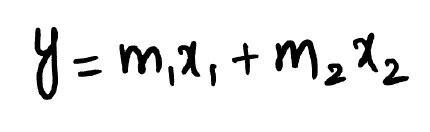

这里，如果 m1 和 m2 都是实数，那么我们可以说 x1 和 x2 与目标变量(y)线性相关。如果 m1 和 m2 不是实数，那么我们可以说 x1 和 x2 与目标变量 y 没有线性关系。

> 例如，如果 m1 = **√** x1 和 m2 = **√** x2，那么 y = x1**3/2 + x2**3/2，这里 x1 和 x2 都不线性依赖于 y。

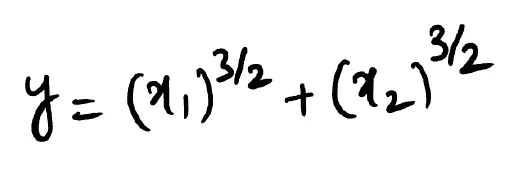

**2。同方差**:同方差意味着从数据中提取的样本的方差应该保持不变，也就是说，我们需要我们的数据点(观察值)更接近我们预测的平面(如果在空间上绘制的话)。

在下图中，您可以看到在第一种情况下方差保持不变(同方差行为)，而在第二种情况下方差保持不变(异方差行为)。

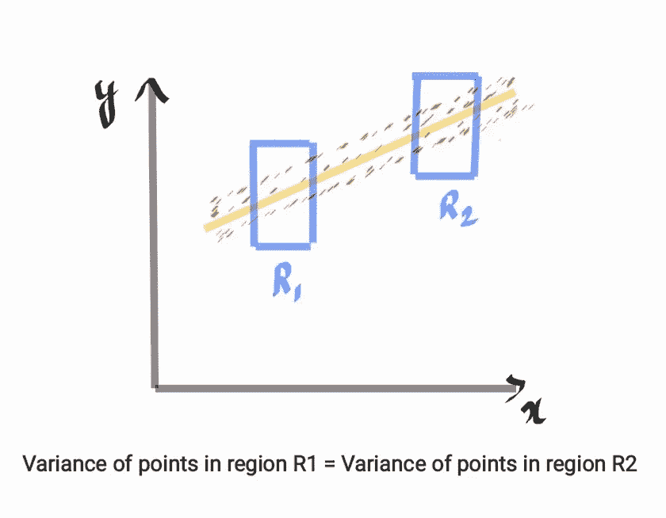

同性恋行为

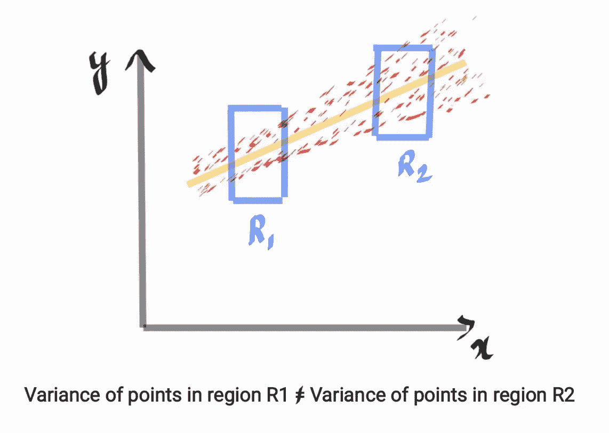

异方差行为

**3。没有异常值**:因为我们正在处理欧几里德距离，任何异常值都会显著影响我们预测的回归平面。去除异常值，然后执行任何机器学习算法(不仅仅是线性回归)总是更好。

**非平凡的假设**:

为了理解其他假设背后的原因，有必要进行一些推导。

**选择成本函数:**

选择***【OLS】***作为我们的代价函数是有代价的。为了最终确定 OLS 作为我们的成本函数，我们必须处理某些假设。下面的推导将使事情更加清楚。

任何线性方程都可以写成这样的形式，

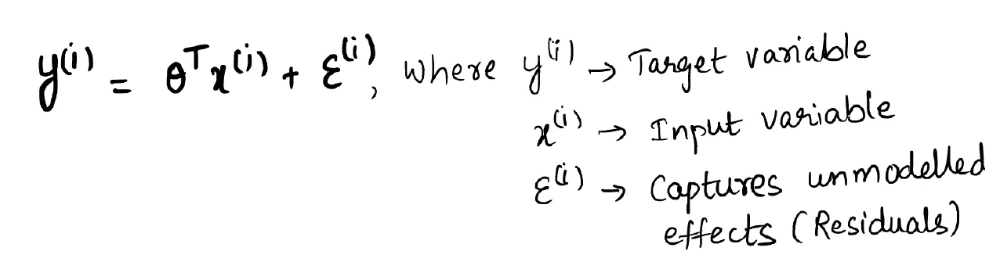

引入术语 ***ε(i)*** 是为了捕捉给定θ(***θ***)引起的未建模效应和误差。换句话说，它可以被称为误差项或残差。

我们假设 ***ε*** 服从高斯分布(均值为零且有一些方差)***ε(I)’****s*独立同相关((i.i.d .)。

页（page 的缩写）D.F 的 ***ε(i)*** 可以写成

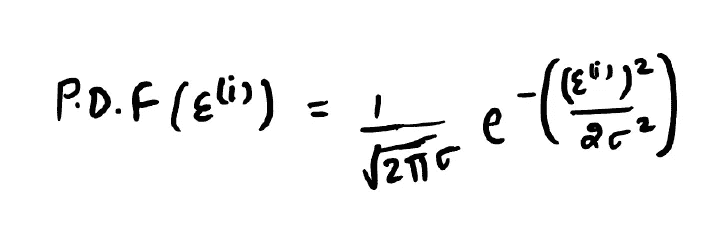

***的概率密度函数ε(i)***

也可以写成，

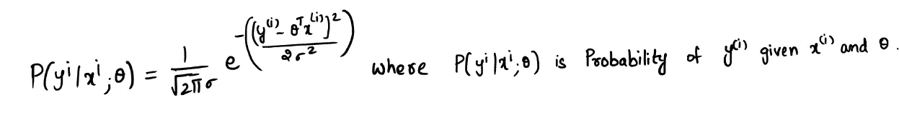

我们的目标是在给定数据的情况下获得最高概率的***y(I)***，也就是说，我们需要最大化每个点的 pdf 的可能性。

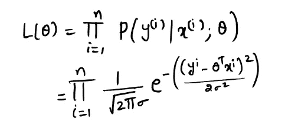

我们知道对数是一个单调函数。所以，***【L(θ)***在 ***log(L(θ))*** 最大时最大。

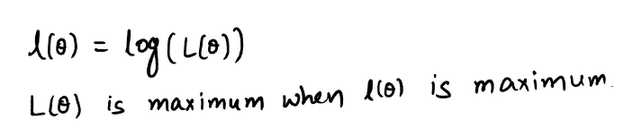

利用对数属性展开 ***log(L(θ))***

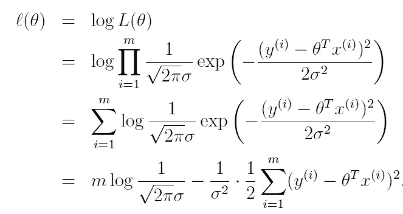

来源:[http://cs229.stanford.edu/notes2020spring/cs229-notes1.pdf](http://cs229.stanford.edu/notes2020spring/cs229-notes1.pdf)，第 10-12 页

***l(θ)*** 在下式最小时最大。

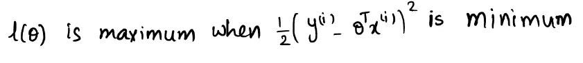

这个表达式就是我们的 OLS(普通最小二乘)成本函数。

注:这是证明选择 OLS 作为成本函数的一种方法。可能有其他方法可以推断出相同的最终结果。

**我们选择 OLS 作为成本函数的假设:**

在上述推导中，我们假设残差( ***ε*** )具有正态分布，因此残差具有**正态性。**

还有，正如我们假设 ***ε(i)的*** 是独立同相关的((i.i.d)，残差也应该是独立同分布的。这基本上意味着，残差和时间之间不应该有任何关系。= > **无自相关。**

**最小化成本函数:**现在我们知道了我们的成本函数，我们的下一个目标就是最小化它。有多种方法可以最小化它。我们可以使用迭代算法，如梯度下降，牛顿法等。或者我们可以使用线性代数技术来寻找最优θ。与其他算法相比，后一种算法花费的计算时间少得多，收敛速度也快得多。

**使用线性代数最小化成本函数:**

在矩阵形式中，成本函数可以写成

应用适当的技术后，表达式最终简化为

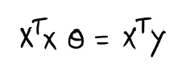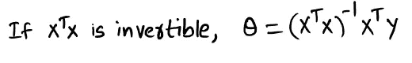

**推论:**

显然，从上面的表达式可以看出，如果 xtx 可逆，则θ(***θ***)存在。为了使 **X** T **X** 可逆，X 应该具有线性独立的列。为了有独立的列，X 不应该有重复的列，因此**没有多重共线性**。

> Sklearn 的线性回归使用 LAPACK(用 FORTRAN 和 C 语言编写)进行矩阵的逆运算(XTX)。它根据 LAPACK 中使用的驱动程序，使用 LQ 或 QR 或奇异值分解来求逆。矩阵分解技术用于寻找 XTX 的逆矩阵，即使 XTX 不是满秩矩阵**，即** X 没有独立列。

让我们来看一个解释这一点的例子

现在，让我们从 sklearn 的数据集模块加载一个玩具数据集

定义 x，y，然后添加虚拟列(重复列)来检查其性能

运行 sklearn 的线性回归

正如您所看到的，即使在添加了重复的列之后，它仍然工作得很好。

现在，让我们实现一个定制的线性回归模型

这里，由于 **xTx** 不是奇异矩阵，所以它不能执行**逆**运算。

**结论**

在这篇博客中，我们已经通过一些推导看到了线性回归假设背后的原因。我们也看到了为线性回归实现定制代码的缺点，而如果从 sklearn 的库中取出，它工作得很好，因为它使用了高级矩阵技术。

希望这篇博客能帮助你更好地理解线性回归。

**参考文献:**

cs-229 课程讲义二，[http://cs229.stanford.edu/syllabus-spring2019.html](http://cs229.stanford.edu/syllabus-spring2019.html)

 [## 线性最小二乘(LLS)问题

### 下一页:广义线性最小二乘法上一页:驱动程序上一页:线性方程内容索引…

www.netlib.org](https://www.netlib.org/lapack/lug/node27.html) 

请点击这里查看我的其他博客:

 [## 卷积神经网络(CNN)——实用的观点

### 深入了解卷积神经网络的主要操作，并使用 Mel 光谱图对心跳进行分类…

towardsdatascience.com](/convolutional-neural-networks-cnns-a-practical-perspective-c7b3b2091aa8)  [## 端到端案例研究:自行车共享需求数据集

### 大家好！！

towardsdatascience.com](/end-to-end-case-study-bike-sharing-demand-dataset-53201926c8db)