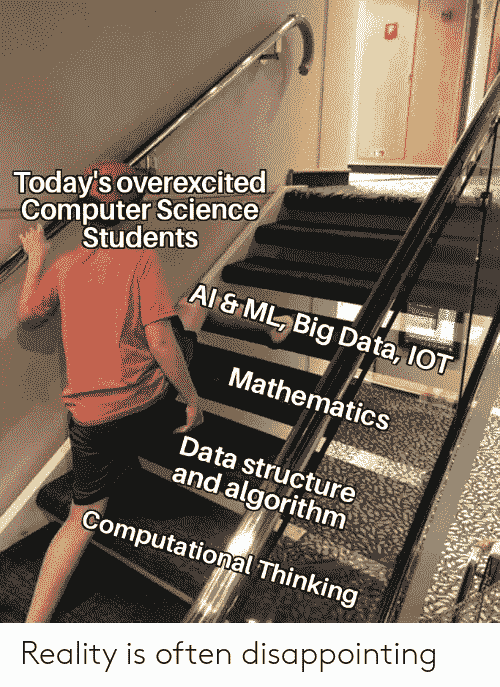

# 机器学习的数学:动机

> 原文：<https://towardsdatascience.com/math-for-machine-learning-motivation-25ebbbebff09?source=collection_archive---------13----------------------->

## 我对为什么我们应该钻研机器学习的数学的看法

# 一些介绍

大家好！我希望你在这个疫情期间保持安全和理智(在目前世界各地发生的其他前所未有的情况中)。这将是我在 Medium 上的第一篇文章，所以我会尽量简短(即没有真正深入的技术讨论或数学问题)。

简单介绍一下我:我是哥伦比亚大学计算机科学专业二年级的学生，主修应用 ML/NLP。我来自印度尼西亚的雅加达，之前是印度尼西亚 Bukalapak 的一名 ML 工程师，主要从事 NLP 项目，以增强其搜索和问题回答系统。

# 序言

这里有一个有趣的(在我看来)迷因:

来源:[https://medium . com/lets prep/how-to-be-a-data-scientist-in-2019-BCD 64 c0a 1627](https://medium.com/letsprep/how-to-become-a-data-scientist-in-2019-bcd64c0a1627)

如标题所示，这篇文章将讨论理解这个有点被夸大的领域背后的数学的重要性，这样你就不会像上面那个孩子一样跳过重要的基本面。这篇文章是为那些对这个领域相当陌生的人准备的，例如，刚从其他领域转移过来的人，所以当你读完这篇文章的时候，你(希望)有动力去钻研数学。我不会为这篇文章引用任何参考资料，这都是我自己的观点(我希望你会多少同意)，基于个人经历。

如果你来自这些背景中的一个或多个(比较科学、数学、统计、运筹学)，或者如果你正在从事 ML 工作，你必须意识到 ML 工作现在变得相当容易。有很多工具，每一个都有其特定的用途，都是现成的(Scikit-Learn、Tensorflow、Keras 和 PyTorch 等等)。几行代码就能让你创造出一些新奇的东西(预测模型、聊天机器人、物体探测器等等)。).越来越多的工具出现了，这会让我们更没有动力去钻研数学吗？

答案是有也有没有(我喜欢给出模糊的答案供大家参考)。

如果你是一个被动用户，并且你想保持被动，答案是肯定的。作为一个被动的用户，我的意思是你在使用软件包的时候没有试图去理解那些神奇的软件包背后的数学，或者至少是逻辑。这基本上适用于计算机科学的几乎每个领域，事实上，甚至适用于一般的工程。我能想到的一个有趣的例子是，为什么印度尼西亚在拥有原材料的同时进口如此多有用的商品。我们从来没学过，是吗？

回到主题，如果你属于这些部落之一，答案是否定的:

1.  你是个用户，但很聪明。这与我在前一段中提到的有关。一个测试你这方面知识的基本问题:“当你使用 Scikit-Learn 时，提及两个内核 PCA 优于标准 PCA 的真实用例！一个用例应该强调结果的有效性，而另一个用例应该强调过程的效率”。
2.  你想实际上建立自己的 ML 产品。它不一定是顶级的全面研究，在一所著名的大学进行，在 ICML、ACL 等机构发表。事实上，它甚至不一定是什么大事。即使为 Tensorflow 贡献三到五行代码，如果它有助于优化以前效率低下的计算，也可能非常重要。稍后会有更多的介绍。

# 具体是哪种数学？

我认为这是个大问题，但是相信我，答案相当简单。虽然正确的答案应该是更全面的，但为了简单起见，我只想提到这两个:

## 1.概率统计(ProbStat)

我想，这是你们大多数人所期待的。当然，你必须掌握所有那些分布的东西(随机变量，期望，插入原理，最大似然法，偏差，等等。)，包括传说中的贝叶斯推断(先验分布、后验分布、贝叶斯估计、共轭先验等。).然而，我想强调的是，你们中的一些人(关于你的职业目标)可能不需要深入研究这个话题，高层次的理解就足够了。据我所知，需要对这个主题有一个相当好的理解的人是那些作为(适当的)数据科学家或作为 Quant 工程师工作的人。

当然，数据科学家需要深入了解 ProbStat，因为他们日复一日地为问题定义正确的指标，设计和执行实验/模拟(这包括定义正确的样本)，并最终根据某个测试方案(例如 A/B 测试)的结果定义要采取的行动。对于你们中不熟悉的人来说，量化工程师是开发和实现复杂数学模型的人，金融公司用这些模型来做出风险管理、投资和定价的决策。在印度尼西亚，这种工作可能不那么受欢迎。但是，我相信确实有一些，尽管它们可能有不同的名字。事实上，我认为精算工作可以归类为定量工作。我有一个熟人是精算师，他精通这个数学领域。每次我有关于 ProbStat 的问题时，他总能在几分钟内解决，这让我觉得很有趣。

## 2.线性代数和微积分

我想，这是很少有人会想到的。但是，相信我，如果你像我一样来自计算机科学背景(而不是数学)，你可能会比 ProbStat 更喜欢这个主题。我一会儿会讲到的。

由于这个主题非常广泛，我猜你会问 LinAlg & Calc 到底哪一个与 ML 相关。因此，下面我向你展示一些你需要理解的最重要的话题(或者至少简单地了解一下)，按照我认为最重要的排序:

*   向量和矩阵运算/操作
*   特征值和特征向量
*   奇异值分解和谱定理
*   函数凸性
*   偏导数和链式法则
*   优化算法(例如梯度下降系列)
*   内核技巧
*   矩阵近似

如果以上话题你听起来不熟悉，那也没关系。当我第一次在哥大开始我的旅程时，我很难满足机器学习课程的先决条件(COMS W 4771)。教授是 Daniel Hsu，他是一位出色的讲师和理论上的 ML 研究者，去找他吧()！我大概花了一个月左右的时间才真正适应听课，因为我需要在上课的同时掌握一些先决条件。

也就是说，上述主题在你如何看待机器学习中扮演着非常重要的角色。机器学习经常被说成是“被美化的统计学”。我不是不同意，事实上，我有点同意。但是，我觉得与 ProbStat 相比，ML 对 LinAlg 和 Calc 的重视程度较低。我甚至认为，如今，LinAlg & Calc 对机器学习(或深度学习)的进步贡献更大。一个例子是导致深度学习复兴的优化算法。优化算法(如 SGD)使计算变得轻得多，同时仍然试图在一定程度上保持准确(即，如果您还记得这个概念，试图获得最佳的局部最小值)。因此，我宁愿说机器学习是“被美化的数学”,如果这对你有任何意义的话。

关于实际工作，我还想指出，LinAlg & Calc 更重要，特别是在一定程度上保持正确性的同时尽可能提高计算效率。让我们不谈 ML，而只谈矩阵乘法。像我这样的菜鸟肯定会在立方时间内完成。对于熟悉算法的人来说，他们可能知道并实现了一些更有效的方法，例如 Strassen 算法，它比立方时间(确切地说是 n 的 2.8 次方，n 是输入的大小)快一点。

从这个简单的例子中，我相信你能明白我的意思。关于数值计算有太多的问题。其中的一部分(或者我应该说是大部分)被 Numpy 解决了，Numpy 是一个为优化数值运算而构建的 Python 包。Numpy 然后被 Scikit-Learn 和 Tensorflow 这样的大公司使用。这只是纯粹的数值计算，可能是机器学习层次的最低层(这是我自己编的，所以请不要引用我的话)。诸如以下问题:

*   我们如何有效地计算大型稀疏矩阵或矩形矩阵的特征向量(例如 PCA)
*   当矩阵不是满秩的(即解是无穷多的)或者当我们处理的矩阵是不可逆的时，我们如何有效地找到最简单的线性解
*   我们如何设计一个有效的优化算法，使我们能够在资源不足的情况下处理大量的数据(参见批处理优化)
*   给定神经网络的特定结构，我们如何得出最佳的初始化参数
*   我们应该如何设计一个神经网络(特别是关于它的激活函数)，以使梯度不会很大程度上消失(见 LSTM 和 GRU 建筑入门)

都在更高的层次上(再说一遍，这是我瞎编的)。有太多的事情需要研究，解决方案通常围绕着 LinAlg & Calc。

如果你渴望成为一名(合适的)ML 工程师，我也渴望成为，在那里你为你的产品构建一个有效的 ML 相关的代码(或者通过仔细选择正确的包和算法，或者甚至当你开始从头编写算法时，哎呀)，那么你应该考虑学习我上面提到的 LinAlg & Calc 主题。我想中等水平的理解应该足够了，通过这些因素来衡量(同样，这是我编造的):

*   您能够为某个问题确定正确的解决方案(预处理、特征表示、建模、后处理)，同时考虑正确性(意味着您的解决方案在您的机构/公司期望的程度上是最优的)和效率(意味着您的解决方案可以在某个时间限制内进行推断)
*   你能够发现某个 ML 产品中的数学瓶颈
*   当需要时，你可以稍微调整某些 ML 框架(例如 Tensorflow ),使其符合你的需求，例如使用 Tensorflow 子类 API

如果你有很多空闲时间，想更深入地了解，直到你有一个高级的理解水平，你应该去做。在这个水平上，你应该能够为复杂的问题手工编写证明或导出解决方案(例如，证明某个优化算法可以在一定数量的步骤内给出特定问题的解决方案，误差不超过某个ε)。但是，那是在一个完全不同的水平上，我看不到自己在不久的将来能够接近那个水平。通常，拥有机器学习或相关领域(数学、统计学、物理学)博士学位的人是你可以一直依赖的人。

我希望上面的解释对有计算机科学和/或数学背景的人来说是清晰易懂的。我为那些背景之外的人们道歉，因为我需要使用许多技术术语，否则我认为这篇文章的深度会太浅。

## 结束语

我想现在就这样吧。在 2020 年的最后 3-4 个月里，如果我有时间和资源，我希望我能创造更多的职位，最好是一些更具技术性的职位。请在下面的评论区告诉我，关于机器学习的数学，你想看什么主题！

我想我甚至可以谈谈我在哥伦比亚大学所学课程中的一些 ML 问题集，这对于那些有兴趣看到 ML 中经常涉及的数学例子的人(以及它们是多么的严谨)或者那些计划在未来学习一些关于 ML 的研究生课程的人来说是很有趣的。同时，保持安全，并关心他人！

干杯，

热拉尔