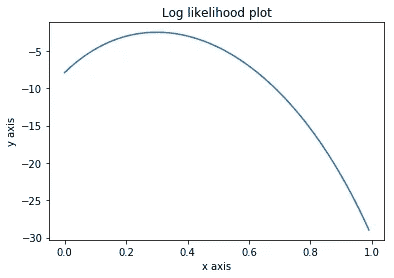

# 机器学习的数学:概率和统计的先决条件

> 原文：<https://towardsdatascience.com/math-for-machine-learning-prerequisites-7eb1e3faeb3e?source=collection_archive---------67----------------------->

## 复习一些问题集，包括机器学习的基本概率和统计(ProbStat)

大家好，欢迎来到我的第二篇帖子！这将是我第一篇文章的延续。这里我们要讲技术，或者我应该说有点“数学”。因此，对于已经远离动手数学一段时间的你，我建议你复习概率、统计和微积分方面的内容。你可以在阅读这个故事的过程中这样做，这样你就可以轻松地理解我的解释。

这个故事是受我在哥伦比亚大学所学课程的启发。课程的教学大纲和高级细节可以通过此链接访问:[*【COMS w 4771 机器学习 2019 秋季由 Daniel Hsu*](https://www.cs.columbia.edu/~djhsu/coms4771-f19/) *。*

正如你可能意识到的，你不能访问作业文件(这是教授想要的)。因此，我要讲的习题集也会有些不同，我会说它会是我在课程中所做的一些变化。这不会完全不同，我会尽我最大的努力，这样我就能给出同样水平的东西。

我将在这个故事中给你三个不同的问题，我觉得它们涵盖了你开始学习机器学习(特别是贝叶斯 ML)所需了解的所有基本概念。由于大多数解决方案都不是微不足道的，我要警告你，这个故事将会很长，所以请耐心等待！

最后，在我们开始之前，我想让你知道这个帖子包含了乳胶配方。为了正确地渲染它们，在阅读这篇文章时，安装[*Math Anywhere*](https://chrome.google.com/webstore/detail/math-anywhere/gebhifiddmaaeecbaiemfpejghjdjmhc/)*插件，并在你的浏览器(我建议使用谷歌 Chrome)上激活它。*

## *问题 1:描述*

*首先，掌握你的基本概率！*

*我们将使用 k-最近邻(kNN)算法作为我们的背景故事。如果你不熟悉它，或者如果你需要一些新鲜的东西，我建议你看一看这个惊人的 [*故事*](/a-simple-introduction-to-k-nearest-neighbors-algorithm-b3519ed98e) 来自 fellow toward Data Science(TDS)作者。*

*让我们将范围限制为$k=1$,即我们将只找到一个最近的邻居。假设我们有$n$个训练示例，那么这个算法的复杂度是$O(n)$因为我们只需迭代$n$个示例，每个示例计算$L_2$个差异，然后最后挑选具有最小$L_2$个距离的邻居。*

*假设你在一家公司工作，你的老板要求你加快这个 1-NN 过程的计算速度。他不在乎结果是不是寸寸完美，只要落到最少 10%的邻居身上。例如，如果有 100 万个数据，您挑选的邻居必须在 100k 个数据内，并且具有最小的$L_2$距离。*

*让我们称这个问题为“近似最近邻”，我们应该有下面的数学定义:*

> *给定\mathbb{R}^d$的测试点$x，我们说 10%近似的最近邻点是$ x _ { I(x)} s . t . | | x _ { I(x)} | | _ 2 $是到训练点$ | | x x1 | | _ 2、…，| | x xn | | _ 2 $的最小 10%距离之一，其中$n$是训练样本的数量*

*当然，从训练示例中抽取样本$\lceil{0.9n}\rceil + 1$就可以简单地解决上述问题。换句话说，如果您有一百万个数据，只需采样 900k + 1 个数据，无需替换，就可以了。然而，这并没有加快计算的速度，这是相当无用的。*

*所以，让我提出一些相当出乎意料的东西，至少这是我在处理与这个问题类似的问题时的感受。如果我说，通过精确地采样 50 个例子，称之为$T=50$,我们可以确保，从数学上讲，我们得到具有最小$ L2 $距离的 10%例子之外的邻居的概率非常小，最多 0.5%。这与数据量($n$)无关。你能证明吗？*

## *问题 1:解决方案*

*问题 1 的解决方案实际上非常简单，尽管问题的描述有点让人不知所措。看到这基本上只是一个没有更换问题的抽样。我处理这个问题的方法是:既然我们在寻找所有采样数据不在前 10%的概率，那么这与计算所有采样数据(其中 50 个)在其余 90%的数据中的概率是一样的。*

*因此，我们可以把概率，比如说$p$写成:*

*$ $ p = \ frac { \ text {从 0.9n 个数据中选取 50 个样本的组合数} } { \ text {从 n 个数据中选取 50 个样本的组合数}}$$*

*$ $ p = \ frac { \ binom { \ lce il { 0.9n } \ rce il { 50 } } { \ binom { n } { 50 } } = \ frac { \ frac { \ lce il { 0.9n } \ rce il！}{(\lceil{0.9n}\rceil-50)！\:50!} } { n！}{(n-50)！\:50!} } = \ frac { \ lce il { 0.9n } \ rce il \:(n-50)！}{n！\:(\lceil{0.9n}\rceil-50)！}=(\frac{(n-50)！}{n！})(\frac{\lceil{0.9n}\rceil！}{(\lceil{0.9n}\rceil-50)！})$ $
$$p=\frac{\lceil{0.9n}\rceil(\lceil{0.9n}\rceil-1)(\lceil{0.9n}\rceil-2)…(\lceil{0.9n}\rceil-49)}{n(n-1)(n-2)…(n-49)}=\prod_{i=0}^{49}\frac{\lceil{0.9n}\rceil-i}{n-i}$$*

*不管数据大小如何，我们都有兴趣看看上述概率的值。因此，我的方法是我们取$n \to \infty$。由此得出的概率值将是最高的(试着解释为什么会这样)。因此，我们可以证明这种可能性至多是 0.5%。*

*$$p_{n\to\infty}=\lim_{n\to\infty}\prod_{i=0}^{49}\frac{\lceil{0.9n}\rceil-i}{n-i}$$*

*使用乘法法则求极限:*

*$$p_{n\to\infty}=\prod_{i=0}^{49}\lim_{n\to\infty}\frac{\lceil{0.9n}\rceil-i}{n-i}$$*

*这很容易解决，如果不是天花板函数的话。我将把如何解决如果$0.9n$不是整数的问题留给读者作为练习。在这里，我将只讨论更简单的情况，即当$0.9n$是整数时:*

*$$p_{n\to\infty}=\prod_{i=0}^{49}\lim_{n\to\infty}\frac{\lceil{0.9n}\rceil-i}{n-i}=\prod_{i=0}^{49}\lim_{n\to\infty}\frac{0.9n-i}{n-i}=\prod_{i=0}^{49}\lim_{n\to\infty}\frac{0.9-i/n}{1-i/n}$$
$$p_{n\to\infty}=\prod_{i=0}^{49}\frac{0.9–0}{1–0}=\prod_{i=0}^{49}0.9={0.9}^{50}= 0.000 美元。20121.868686866667*

*我们可以从上面看到，我们没有从前 10%的例子中得到哪怕一个样本的机会(不管数据大小)最多是 0.5%左右。*

*这相当了不起，我们可以将复杂度从$O(n)$降低到$O(50)$这是常数！然而，在现实中，情况并非总是如此。在下面的评论部分，让我知道你是否知道为什么会这样！*

*PS:您可能会发现另一个问题，请注意，$n \to\infty$的无替换问题抽样可能会被视为(或被视为)有替换问题的抽样！*

## *问题 2:描述*

*这将是一个标准的教科书问题，当你学习统计学时，你可能会发现到处都是，这是为了推导最大似然估计(MLE)的公式。但是知道这一点意味着你有一个很好的基础去钻研 ML 的一些子领域，特别是贝叶斯推理。*

*如果你不熟悉这个话题，可以考虑看看这篇很酷的文章，也是 TDS 的作者之一。你可能也想熟悉我下面要用到的术语(独立同分布，随机变量，概率密度函数，可能性，等等。).所以，我们开始吧！*

> *考虑一个独立同分布随机变量$X_1，X_2，…，X_n$的统计模型，由\ theta \ in \ Theta $参数化。参数空间是 R:\ Theta > 0 \ }＄中的正实数\ Theta = \ { \ theta。*
> 
> *$X_1$的分布$P_\theta$如下:*
> 
> *$ X _ 1 \ ~ P _ \有一个概率密度函数(P . d . f .)$ f _ \θ$满足:*
> 
> *$ $ f _ \ theta \ propto 1 \ text { for all } 0 \ leq x \ leq \ theta $ $*
> 
> *$ $ f _ \ theta = 0 \ text { for } x< 0 \text{ and } x >\ theta $ $*
> 
> *给定数据$(X_1，X_2，…，X_n) = (x_1，x_2，…，x_n)$，推导出一个简单的最大似然估计公式！*

## *问题 2:解决方案*

*我们将考虑 p.d.f 的两种定义:*

1.  *对于$x <0$ and $x> \theta$，f_{\theta}(x)=0$。因此，在这种情况下，可能性总是为零，MLE 也将为零。*
2.  *对于$0\leq{x}\leq{\theta}美元，$f_{\theta}(x)\propto1 美元。记住$\propto$意味着 p.d.f .与 1 成比例，但它并不完全是 1，而是某个常数。这意味着$f_{\theta}(x)=c$对于某个常数 c: $0 <c>使用 p.d.f 应该积分为 1 的性质，我们可以确定 c:
    $c\int_{0}^{\theta}dx=1$
    $cx\big|_0^{\theta}=1$
    $ $ c[\ theta-0]= 1 $ $
    $ $ c = 1/\ theta $ $
    因此，$\{x_1，x_2，x_3，…，x_n\}$的可能性将是:
    $l(\theta|x)=\prod_{i=1}^{n} f _ { \ theta }(x _ I 因为我们知道$0\leq{x}\leq{\theta}$，所以最小的$\theta$可能是集合中最大的$x$。因此，MLE 公式将是:
    $\boldsymbol{\max(\{x_1，x_2，x_3，…，x_n\})}$由于$0\leq{x}\leq{\theta}$和$\theta > 0$，此 MLE 公式将总是大于或等于情况 1 的 MLE($ \ geq { 0 })$。因此，我们可以选择它作为我们的 MLE 公式。</c>*

## *问题 3:描述*

*在这个问题中，你将看到一些模型来收集数据，确保某种程度的隐私保证，这是一个你可能会感兴趣的话题。*

*由于一些国家的选举日即将到来，我认为在这里把它作为背景故事会很有趣。假设其中一个国家有两个总统候选人，称之为国家$U$，即 Murpt 先生和 Nebid 先生。将 Murpt 先生称为$M$而将 Nebid 先生称为$N$。*

*想象一下，你是一名独立的数据科学家，一些团体雇用你来估计该国选择其中一名候选人的人口比例。你当然可以很容易地直接问人们他们会投谁的票，但有些人可能会觉得与你直接分享他们的信息很不舒服，因为你基本上什么都不是。*

*在这里，我给大家介绍一个概念，叫做“随机化回答”。基本上，它试图通过不直接询问他们的选择来解决隐私问题。相反，您需要对每个被调查的个人进行以下操作:*

> *让他/她扔两次硬币，告诉他/她不要让你知道结果*
> 
> *如果至少有一次投掷是正面，告诉他/她如实回答(例如，如果他/她投了$M$那么他/她会告诉你$M$)*
> 
> *如果两次投掷都是反面，告诉他/她给出相反的回答(例如，如果他/她投了$M$，那么他/她会告诉你$N$)*

*我认为上面的方案保证了高度的隐私保证，当然，除非硬币被操纵了。*

*现在我们来看主要问题。*

> *考虑使用上述方案收集的$n$响应的统计模型，其中响应被视为 iid {0，1}值的随机变量$Y_1，Y_2，…，Y_n$，并且所有投掷硬币都是独立的。设[0，1]$中的$ \ theta \表示模型的参数，该参数等于人口中投票给$M$的个体比例。*

*然后，回答这三个问题:*

> *$Y_1=1$的概率是多少？答案应该以$\theta$的形式给出。*
> 
> *给定数据$y_1，y_2，…，y_n \in {0，1}$的对数似然是多少？答案应该以$\theta$和$y_1，y_2，…，y_n$的形式给出*
> 
> *假设$n=100$，也就是说，我们只从国家的每个州抽取几个人，等于 1 的$y_i$的数量是 40，也就是$\sum_{i=1}^n{y_i}=40$.用[0，1]$绘制对数似然作为$ \ theta \的函数。最有可能出现的$\theta$是什么？*

## *问题 3.1:解决方案*

*设 X 是随机变量，表示在两次掷硬币中出现的正面数量($X=[0，1，2]$)。那么，我们可以在下面定义两个概率:
$$P(X=0)=P(尾)。P(tails)=(1/2)(1/2)= 1/4 $ $
$ $ P(X \ ge Q1)= 1-P(X = 0)= 1-(1/2)(1/2)= 3/4 $ $*

*使用这些概率，$Y_1=1$发生在当一个人选择$M$得到至少一个人头$P(X\geq1)$或当一个人选择$N$没有人头$P(X=0)$时。另外，请记住，选择$M$的概率为$\theta$，选择$N$的概率为$1-\theta$。因此，$P(Y_1)=1$是:*

*$ $ P(Y _ 1 = 1)= P(X = 0)(1-\ theta)+P(X \ ge Q1)\ theta $
$ $ P(Y _ 1 = 1)=(1/4)(1-\ theta)+(3/4)\ theta $
$ \ bold symbol { P(Y _ 1 = 1)=(1/2)\ theta+(1/4)} $ $*

## *问题 3.2:解决方案*

*因为这个问题涉及到离散的随机变量，我们可以用与建模概率相同的函数来建模可能性。为了计算概率，我们需要定义两个部分:*

1.  *$\binom{n}{\sum_{i=1}^{n}y_i}$.说，事件(值为 y_i$)有多少种组合比如$n=2$有四种可能:[0，0]，[0，1]，[1，0]，[1，1]。*
2.  *对于每一个事件，如果$y_i=1$，概率将是$P(y_i=1)$，否则如果$y_i=0$，概率将是$P(y_i=0)$。这可以表述为$p(y_i=1)^{y_i}p(y_i=0)^{1-y_i}$，它基本上是一个二项分布。*

*因此，可能性是:*

*$$l(\theta|n,\sum_{i=1}^{n}y_i)=p(\sum_{i=1}^{n}y_i)|n,\theta)$$
$$l(\theta|n,\sum_{i=1}^{n}y_i)=\binom{n}{\sum_{i=1}^{n}y_i}\prod_{i=1}^{n}p(y_i=1)^{y_i}p(y_i=0)^{1-y_i}$$
$$l(\theta|n,\sum_{i=1}^{n}y_i)=\binom{n}{\sum_{i=1}^{n}y_i}\prod_{i=1}^{n}p(y_i=1)^{y_i}(1-p(y_i=1))^{1-y_i}$$
$$l(\theta|\sum_{i=1}^{n}y_i)=\binom{n}{\sum_{i=1}^{n}y_i}\prod_{i=1}^{n}({\frac{1}{2}\theta+\frac{1}{4}})^{y_i}({-\frac{1}{2}\theta+\frac{3}{4}})^{1-y_i}$$
那么，对数似然将是:
$$\ln{l(\theta|\sum_{i=1}^{n}y_i)}=\ln{\binom{n}{\sum_{i=1}^{n}y_i}\prod_{i=1}^{n}({\frac{1}{2}\theta+\frac{1}{4}})^{y_i}({-\frac{1}{2}\theta+\frac{3}{4}})^{1-y_i}}$$
$$\ln{l(\theta|\sum_{i=1}^{n}y_i)}=\ln{\binom{n}{\sum_{i=1}^{n}y_i}}+\ln{\prod_{i=1}^{n}({\frac{1}{2}\theta+\frac{1}{4}})^{y_i}({-\frac{1}{2}\theta+\frac{3}{4}})^{1-y_i}}$$
$$\ln{l(\theta|\sum_{i=1}^{n}y_i)}=\ln{\binom{n}{\sum_{i=1}^{n}y_i}}+\sum_{i=1}^{n}\ln({\frac{1}{2}\theta+\frac{1}{4}})^{y_i}+\sum_{i=1}^n\ln({-\frac{1}{2}\theta+\frac{3}{4}})^{1-y_i}$$
$$\ln{l(\theta|\sum_{i=1}^{n}y_i)}=\ln{\binom{n}{\sum_{i=1}^{n}y_i}}+\sum_{i=1}^{n}y_i\ln({\frac{1}{2}\theta+\frac{1}{4}})+\sum_{i=1}^n(1-y_i)\ln({-\frac{1}{2}\theta+\frac{3}{4}})$$
$ $ \ bold symbol { \ ln { l(\ theta | \ sum _ { I = 1 } { n } y _ I)} = \ ln { \ binom { n } { \ sum _ { I = 1 } { n } y _ I } }+\ sum _ { I = 1 } { n } y _ I \ ln({ \ frac { 1 } { 2 })*

## *问题 3.3:解决方案*

**

*问题 3.3 的对数似然图*

*上面是给定 n=100 和$\sum_{i=1}^{n}y_i=40$.时，对数似然作为＄\ theta \ in[0，1]＄的函数的曲线图我用来生成这样的图的代码片段在这个 GitHub Gist 中: [log likelihood plot.ipynb](https://gist.github.com/geraldzakwan/ec67ca4d36c124c80002eb383e4d7aa8) 。*

*我们可以看到，可能性最大的$\theta$似乎在$0.2$和$0.4$左右。让我们通过推导以下对数似然的最优$\theta$来验证，即$\hat{\theta}_{MLE}$。*

*对应于该图的函数通过代入给定值而导出如下:*

*$$l(\theta|n=100,\sum_{i=1}^{n}y_i=40 )=\ln{\binom{100}{\sum_{i=1}^{100}y_i}}+\sum_{i=1}^{100}y_i\ln({\frac{1}{2}\theta+\frac{1}{4}})+(100-\sum_{i=1}^{100}(y_i))\ln({-\frac{1}{2}\theta+\frac{3}{4}})$$
$$l(\theta|n=100,\sum_{i=1}^{n}y_i=40)=\ln{\binom{100}{40}}+40\ln({\frac{1}{2}\theta+\frac{1}{4}})+(100–40)\ln({-\frac{1}{2}\theta+\frac{3}{4}})$$
$$l(\theta|n=100,\sum_{i=1}^{n}y_i=40)=\ln({\frac{100！}{60!40!} })+40 \ ln({ \ frac { 1 } { 2 } \ theta+\ frac { 1 } { 4 } })+60 \ ln({-\ frac { 1 } { 2 } \ theta+\ frac { 3 } { 4 } })$
$$\boldsymbol{l(\theta|n=100,\sum_{i=1}^{n}y_i=40)=64.7906+40\ln({\frac{1}{2}\theta+\frac{1}{4}})+60\ln({-\frac{1}{2}\theta+\frac{3}{4}}})$$
为了确定可能性最大的$\theta$，我们可以对$L(\theta)$求一阶导数，然后求出$\theta$使其等于零。
$ $ \ frac { d } { d \ theta } L(\ theta)= 0 $ $
$ $ \ frac { d } { d \ theta } \ ln({ \ frac { 100！}{60!40!} })+\ frac { d } { d \ theta } 40 \ ln({ \ frac { 1 } { 2 } \ theta+\ frac { 1 } { 4 } })+\ frac { d } { d \ theta } 60 \ ln({-\ frac { 1 } { 2 } \ theta+\ frac { 3 } { 4 } })= 0 $ $
$ \ frac {(40)(\ frac { 1 } { 2 })} { 1 } { 2 } \ theta*

*我们可以看到，这与我们在图中看到的一致。*

## *结束语*

*我想这就是这个故事的全部内容。很抱歉，我要求你安装[*Math Anywhere*](https://chrome.google.com/webstore/detail/math-anywhere/gebhifiddmaaeecbaiemfpejghjdjmhc/)*附件来阅读这个故事，因为我找不到任何更方便的方法来在介质上编写 LaTeX。**

**我不喜欢上传数学符号的图像，而且 [*Tex 到 Unicode*](https://chrome.google.com/webstore/detail/tex-to-unicode) 对我来说不太好。在下面的评论区，如果你知道任何更好的在媒体上展示数学符号的方法，请告诉我，我会非常感激。**

**此外，请让我知道你是否对这个话题感兴趣，解释是否清晰简洁，因为我觉得我在这里有点罗嗦。**

**干杯，**

**热拉尔**