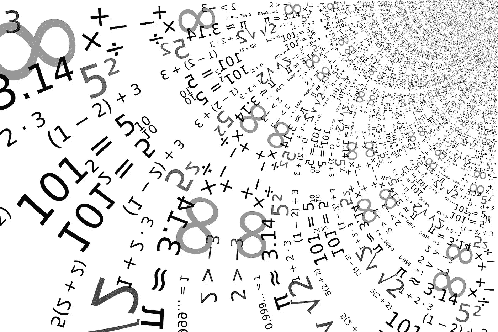
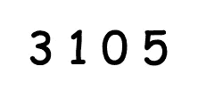
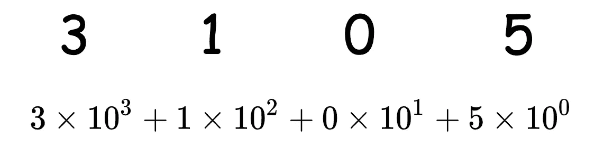
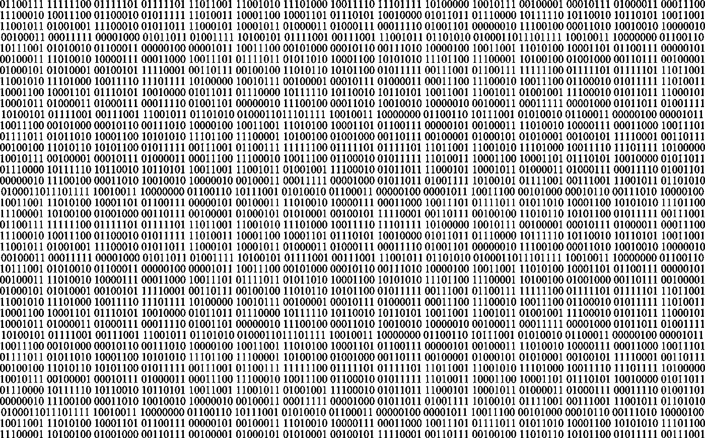
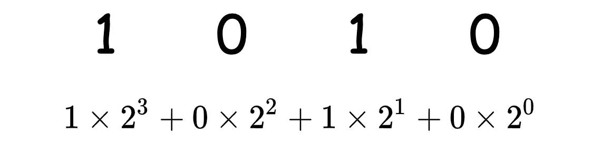
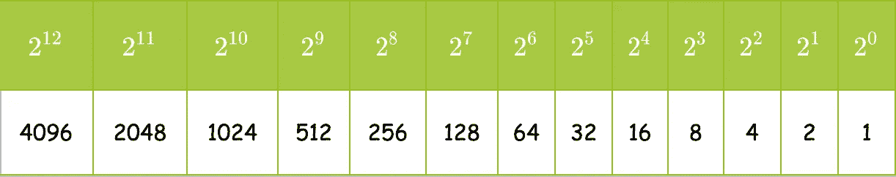
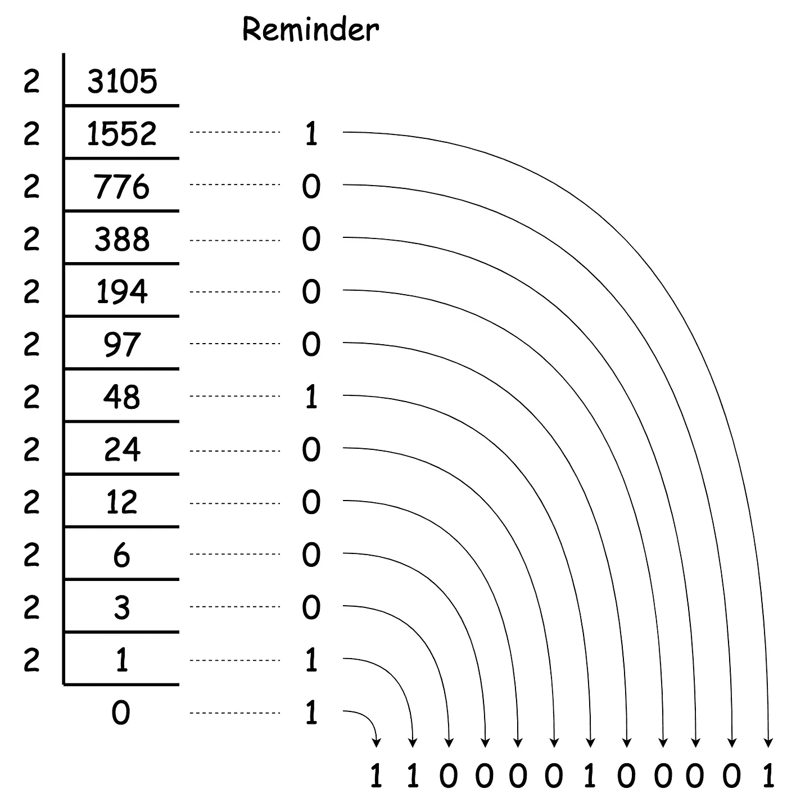
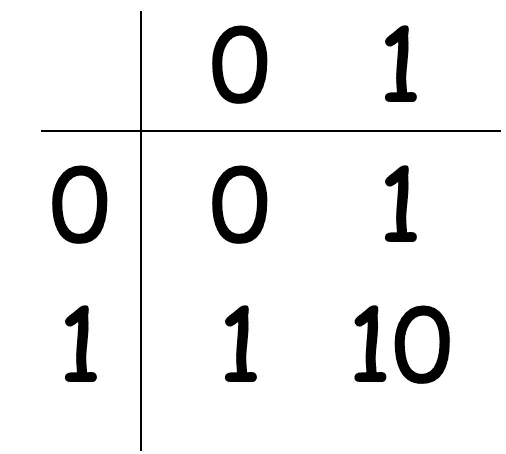
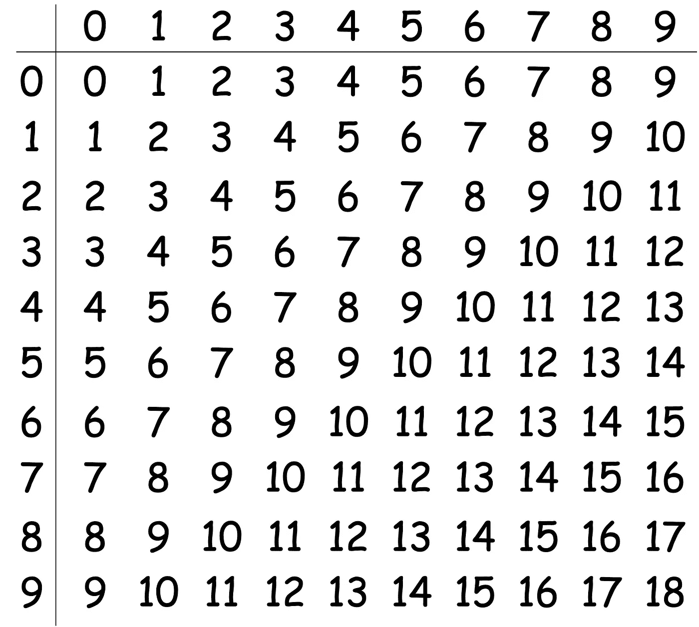

# 程序员数学——从十进制到二进制的考虑

> 原文：<https://towardsdatascience.com/math-for-programmers-considerations-from-decimal-to-binary-10a21ab980ee?source=collection_archive---------27----------------------->

照片由[拉尔姆奇](https://pixabay.com/users/lalmch-1026205/)在 [Pixabay](https://pixabay.com/photos/computer-macbook-tablet-editing-767781/) 上拍摄

## 为什么计算机使用二进制数字系统？

众所周知，二进制数是约翰·冯·诺依曼构建的经典计算机世界的基础。是的，当我说经典计算机时，它是你此刻正在使用的设备，除非你是量子计算领域的研究人员。

两种不同的数制之间有什么考虑？还有为什么用二进制而不用十进制？作为计算机科学的基础知识，并不难，但很重要。在本文中，我将分享一些关于十进制和二进制数字系统的注意事项。

# 十进制数字系统

照片由 [geralt](https://pixabay.com/users/geralt-9301/) 在 [Pixabay](https://pixabay.com/illustrations/pay-numbers-infinity-digits-fill-937884/) 上拍摄

我还记得小时候，老师开始教我们一些大于 10 的数字。当她提到 11 时，我在纸上写下了“101 ”,并认为这应该是正确的。与英语中“十”和“一”不同于“十一”的“十”和“一”不同，在我的母语中，10 的发音后跟 1 的发音正是 11 的发音。

那堂课之后，我意识到某个地方的数字有它自己严格的含义:)然而，如果我们使用罗马数字，写十个“X”后面跟着一个“I”正好是 11->“Xi”。

当然，数字的位置在阿拉伯数字中起着重要的作用。在十进制数字系统中，我们有 10 个不同的数字，分别是 0、1、2、3、4、5、6、7、8 和 9。

考虑上面显示的数字 3105，它可以写成如下形式。

你一定已经找到了模式:

*   所有指数的基数都是 **10** ，因为数字是十进制数**。**
*   **指数从右到左是 0，1，2，3，因为这个十进制数有 4 个数字。分别是**个**位、**十个**位、**百个**位、**千个**位。**

**因此，我们可以使用 10 的指数来重写每个十进制数，它们必须遵循如上所示的模式。**

**那么，二进制数字系统怎么样？**

# **二进制数字系统**

****

**照片由 [GDJ](https://pixabay.com/users/gdj-1086657/) 在 [Pixabay](https://pixabay.com/vectors/binary-0-1-background-3322478/) 上拍摄**

**你还记得十进制中有 10 个不同的数字吗？在二进制数字系统中，我们只有两个数字:0 和 1。**

**类似地，我们也可以使用相同的技术重写一个二进制数，遵循类似的模式，但不完全相同。**

****

*   **所有指数的底数都是 **2** ，因为这个数是一个**二进制数**。**
*   **指数从右到左是 0，1，2，3，因为这个十进制数有 4 个数字。分别是**一**位、**二**位、**四**位、**八**位。**

**二进制数的差异在上面以粗体文本显示。**

**知道了这些，我们就可以用我们找到的模式把二进制数转换成十进制数。例如，我们想将 3105 从十进制数转换成二进制数。我们可以首先准备 2 的指数列表如下。**

****

**然后，我们可以选择小于最接近我们要转换的数字的最大数字。4096 大于 3105，所以我们必须选择 2，也就是 2048。**

**然后，我们用 3105 减去 2048，还剩 1057。在那之后，2 ⁰，也就是 1024，是下一个最接近的被选择的，所以我们有 1057 减去 1024 等于 33。最接近 33 的指数是 2⁵的 32，然后我们只剩下一个 2⁰.**

**所以，我们选择了⁰、2⁵和 2 ⁰.回想一下，指数 11、10、5 和 0 表示位置，所以我们只需要在这些位置上对 1，在其他位置上对 0。**

****

**3105 的二进制数是 110000100001。**

**如果不想准备指数列表或者数量太大，有一个简单的方法。下面的方法可以通过每次将数字除以 2 来确定 1。**

****

**每当我们将数字除以 2 时，提醒必须是 0 或 1。提醒的反面将是由十进制数转换而来的二进制数。**

# **为什么计算机使用二进制数？**

****

**由 [blickpixel](https://pixabay.com/users/blickpixel-52945/) 在 [Pixabay](https://pixabay.com/photos/board-electronics-computer-453758/) 上拍摄的照片**

**为了理解为什么计算机系统中使用二进制而不是十进制，我们需要从我们需要的数字类型的数量开始。**

**如上所述，十进制数字系统需要 10 个不同的数字来表示一个数。换句话说，每个地方有 10 种不同的可能性。但是，在二进制数系统中，我们只需要 2。**

**假设你有一个开关，它很容易有两种不同的状态:开和关。是的，这就是我们在计算机世界中表达 1 和 0 的方式。有没有可能设计这样一个可以有 10 种不同状态的开关？我不是电子工程师。我想说这是可能的，但是复杂性会高得多。**

**我们以加法运算为例，因为它是乘法等其他运算的基础。在二进制中，加法表如下。**

****

**但是，如果坚持使用十进制数系统，我们必须让 CPU 理解如下的加法表。**

****

**二进制数字系统有什么缺点吗？当然，想想我们刚刚转换成二进制数的数字 3105，也就是 110000100001。假设你和我，我们所有人都能读二进制数，我们需要写 12 位数来表示这样一个数。当你想告诉我三千一百零五这个数字的时候，你得说一一零零零零一零零零零一。我想我跟不上…**

**因此，二进制数的缺点是，它必须使用太多的数字来表示一个并不那么大的数。**

**然而，这个缺点并不适用于计算机。不管我们有多少位数，它们都将被存储在 CPU 缓存中。所以，计算机不在乎有多少位数字。相反，他们不擅长处理太多的规则，比如上图所示的加法表。因此，二进制系统成为计算机的完美选择。**

# **摘要**

****

**由 [Pixabay](https://pixabay.com/photos/computer-laptop-work-place-mouse-2982270/) 上的 [Skitterphoto](https://pixabay.com/users/skitterphoto-324082/) 拍摄**

**在这篇文章中，我已经解释了我理解中的不同数制，十进制和二进制。我们人类使用十进制是因为它有更多类型的数字，但我们不必使用太多的数字来表示一个数。此外，我们都有 10 个手指，直观地用于计数。换句话说，十进制在位数和位数类型数之间有着近乎完美的平衡。计算机使用二进制系统，因为它们不需要这样的平衡。相反，他们需要尽可能少的规则，他们不关心数字的数量。所以二进制走在“规则少”的极端一边，成为计算机的完美选择。**

** [## 通过我的推荐链接加入 Medium 克里斯托弗·陶

### 作为一个媒体会员，你的会员费的一部分会给你阅读的作家，你可以完全接触到每一个故事…

medium.com](https://medium.com/@qiuyujx/membership) 

**如果你觉得我的文章有帮助，请考虑加入灵媒会员来支持我和成千上万的其他作家！(点击上面的链接)****