# 强化学习的数学分析——贝尔曼最优方程

> 原文：<https://towardsdatascience.com/mathematical-analysis-of-reinforcement-learning-bellman-equation-ac9f0954e19f?source=collection_archive---------2----------------------->

## 度量空间，柯西序列，压缩映射和 Banach 不动点定理

强化学习在玩星际争霸(AlphaStar)和围棋(AlphaGO)这样的游戏中取得了显著的效果。所有这些成功项目的核心在于——马尔可夫决策过程(MDPs)的贝尔曼最优方程。

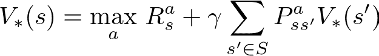

贝尔曼最优方程

贝尔曼最优方程是一个递归方程，可以使用动态规划(DP)算法来求解，以找到最优值函数和最优策略。在本文中，我将尝试解释为什么贝尔曼最优方程可以通过提供最优策略来解决每个 MDP，并对其进行简单(希望如此)的数学分析。

# 记号

*   `S`是状态空间。
*   `V`是价值函数。
*   `V*`是最优值函数。
*   `V(s)`是状态`s`的值。
*   `π`是政策。
*   `π*`是上策。
*   `π(s)`返回策略`π`下状态`s`的动作。
*   `P`是转移概率矩阵。
*   `A`是动作空间。

# 先决条件

尽管我尽了最大努力，但分析还是相当严谨的，我认为读者应该熟悉以下附加条件:

1.  马尔可夫决策过程(MDP)
2.  贝尔曼方程及其如何使用迭代法求解。
3.  RL 基础——价值函数、奖励、政策、折扣系数等。
4.  线性代数
5.  向量演算

# 概观

如果您研究过 RL 和 MDP，您一定遇到过这样的说法: ***“对于每个 MDP，总有至少一个策略优于或等于所有其他策略。”这既出现在萨顿和巴尔托的书中，也出现在大卫·西尔弗的系列讲座中。阅读/听到这些使这种说法变得非常直观，然而，我不得不更深入地挖掘并以更具体的方式理解这一点。因此，在本文中，我将从数学上证明以下定理:***

> **定理:**对于任何有限的 MDP，都存在一个最优策略π*，使得它优于或等于其他所有可能的策略π。

在找到最佳策略之前，我们需要了解策略的排序。什么时候一种政策(`π1`)被认为比另一种(`π2`)更好？

如果对于环境中的每个状态，使用`π1`导出的状态的值好于或等于使用`π2`导出的状态的值，则称策略π1 优于策略`π2`。从数学上讲，这可以写成如下形式:

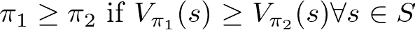

政策比较

既然我们知道如何比较政策，我们需要证明总有一个政策比所有其他政策更好。

我们将使用 **Banach 不动点定理**来证明这一点，通过表明 **Bellman 最优算子**是具有度量**L-无穷范数**的实数的**完全度量空间**上的**收缩**。为此，我们将首先讨论关于**柯西序列**的**不动点问题**和**完备度量空间**。

上面的段落听起来很吓人，但是一旦我们掌握了基本的术语，它实际上会变得非常简单和直观。我们将讨论以上段落中用粗体字表示的所有内容。让我们遵循自下而上的方法，学习每个概念并克服我们的恐惧:

## 1.不动点问题

我相信我们大多数人都熟悉求方程根的问题。我们求解`x`使得函数`f(x) = 0`。然而，在定点问题中，我们对`x`进行求解，使得`f(x) = x`。顾名思义，`x`是一个固定点，它即使在函数的应用上也不会改变。一个不动点问题可以通过形成另一个函数`g(x) = f(x)-x = 0`转化为一个求根问题。事实上，即使是求根问题也可以转换回不动点问题。然而，解决不动点问题真的很容易(对于特殊情况)，这就是为什么它们非常有趣和有用(没有计算开销)。

> 解决一个不动点问题，选择一个随机的起始值 x，重复应用 f(x)无限次。如果**函数收敛**并且你很幸运，你会找到解决方案。

从数学上讲，这很简单，让我们首先描述一个符号:

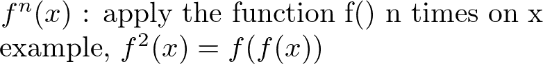

f^n(x)符号

现在，如果函数是收敛的，那么它一定会收敛到某个值，比如说，`x*`。这个值，`x*`确实是不动点问题的解，如下所示:

让我们选择任意值`x0`并对`x0`应用函数`f(.)`无限次以得到`x*`，然后用它来解决不动点问题:

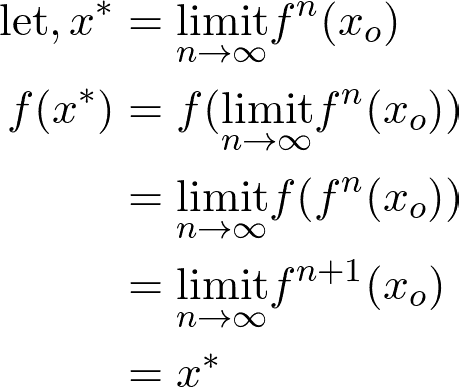

解决不动点问题

这背后的直觉很简单，如果一个函数在某个点收敛，那么这个函数在这个点的值就是这个点本身。所以，收敛点就是不动点本身。

这也可以从下面的笔记本中观察到:

## 2.度量空间

度量空间就是一个集合，其中定义了度量来度量该集合中任意两个元素之间的距离。例如，欧几里得空间是一个度量空间，其距离被定义为实数集合中的欧几里得距离。因此，度量空间`M`被表示为`(X, d)`，其中`X`是集合而`d`是某种度量。度量标准`d`必须满足以下特性:

1.  **识别** `d(x,x) = 0`
2.  **非否定性**
3.  **对称性** : `d(x,y) = d(y,x)`
4.  **三角形不等式** : `d(x,z) ≤ d(x,y)+d(y,z)`

## **3。柯西序列**

对于度量空间`(X, d)`，集合`X`，`(x1, x2, x3…. xn)`的元素序列是柯西序列，如果对于每个正实数`*ε*`，*，*存在一个整数`N`，使得以下等式成立:

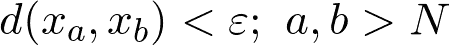

柯西序列

这里的数学解释不是很直观，也没有必要复杂。简而言之，度量空间的元素序列是柯西的，如果这个序列收敛于某点(它们之间的距离变成常数)。关于这一点，另一个很好的解释是由本网站给出的，内容如下:*“对于任何小的距离，都有一个特定的指数，超过这个指数，任何两个术语都在彼此的距离之内，这抓住了术语变得接近的直观想法。”*“项变得接近”的思想是级数收敛或极限背后的基本直觉。

## 4.完全度量空间

如果集合`X`中元素的每个可能的柯西序列收敛到也属于集合`X`的元素，则度量空间`(X, d)`是完备的。也就是说，集合的元素的每一个柯西序列的收敛极限都在于集合本身。这就是为什么它被称为“完整”。

## 5.收缩

如果存在某个常数`γ∈[0,1)`使得对于度量空间`x1`和`x2`的任意两个元素，以下条件成立，则定义在度量空间`(X, d)`的元素上的函数(或算子或映射)是收缩函数(或收缩函数):

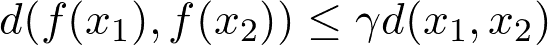

收缩映射

这意味着在元素`x1`和`x2`上应用了映射`f(.)`之后，它们至少通过因子`γ`和*彼此更加接近。*还有，这样一个常数`*γ*` 的最小值叫做 Lipschitz 常数(这是一个对于生成式对抗性网络很重要的常数)。同样，如果`*γ=*1`，映射不再是收缩而是短映射。直观地，可以观察到在应用收缩映射之后，元素的顺序值越来越接近。

## 6.Banach 不动点定理

这是我们证据的核心。非正式地，这个定理说，对于一个完全的度量空间，在集合的元素上一次又一次地应用收缩符，将最终使我们得到一个最优的、唯一的值。我们知道:

1.  承包商将布景的元素组合在一起。
2.  一次又一次地使用这个承包商，会得到一个序列。(柯西？)
3.  完备度量空间中的柯西序列总是收敛于度量空间中的一个值。

形式上，这个定理可以表述为:

> 定理:设(X，d)是完备度量空间且函数 f: X->X 是收缩子那么，f 有一个**唯一的**不动点 x*∈ X(即 f(x*)=x*)使得序列 f(f(f(…f(x)))) **收敛**到 x*。

现在，为了从数学上证明这一点，我们需要证明`x*`的唯一性和存在性。

1.  **唯一性**:我们用矛盾来证明这一点。假设收敛值不是唯一的，并且`x1*`和`x2*`是承包商序列收敛的两个值，那么我们将有:

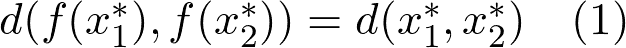

x1*和 x2*是最佳值，承包商已收敛于此，距离不再改变

另外，请注意`f`是一个承包商，因此它必须持有以下财产:

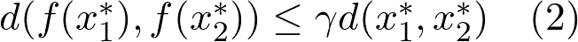

承包商财产

现在由于`γ∈[0,1)`，不可能同时满足等式 1 和 2。因此，我们的假设一定是错误的。因此，通过矛盾，`x*`一定是独特的。

2.存在:现在我们已经证明了`x*`是唯一的，我们需要证明`x*`存在。设`(x1, x2, x3, …. xn)`为重复申请承包人形成的序列。

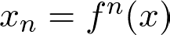

我们度量空间的一个元素

如果我们**假设**序列`(x1, x2, x3, …. xn)`是柯西，我们肯定知道这个序列会收敛到某个点，比如说`x*`。同样，由于度量空间是完整的，这个收敛点`x*`将属于度量空间`(X,d)`。现在，我们只需要证明这个序列是柯西序列。我们将这样做:取集合中的两个元素`xn`和`xm`，使得`m>>n` 和`m`非常大，然后通过重复应用度量`d`的三角不等式属性，我们得到:

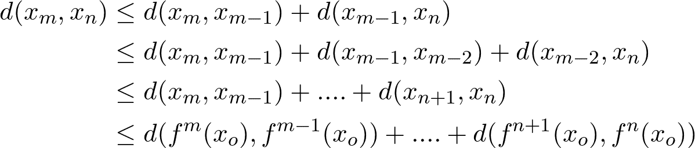

度量 d 的三角不等式的推广

现在，由于 f 是承包商，我们知道:

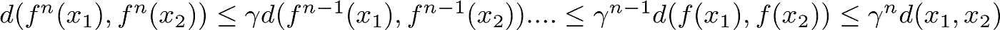

重复的承包商不等式

我们可以进一步简化`d(xm, xn)`如下:

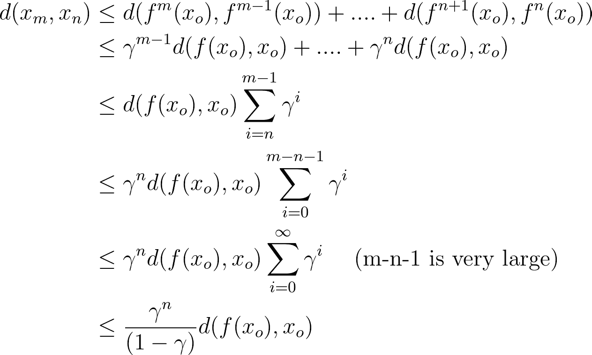

现在，通过选择足够大的`n`，我们可以使上述等式的 RHS 小于任何正实数`*ε*` *。因此，序列`(x1, x2, x3, …. xn)`是柯西的，并且存在一个最优的`x*∈X`。这就结束了 Banach 不动点定理的证明。*

# 回到贝尔曼最优方程

对于价值函数，`V(s)`我们定义了一个新的算子，最优贝尔曼算子，`B`，它接受一个价值函数并返回另一个价值函数。我们将该运算符定义如下:

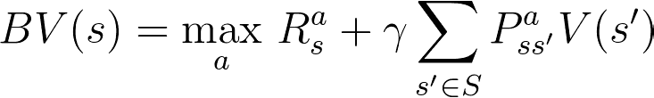

行李员接线员

很容易观察到，`B`是一个递归运算符。因此，这将产生一系列的价值函数。如果我们可以证明`B`确实是某个度量空间`(X,d)`的收缩者，那么通过 Banach 不动点定理，我们可以得出结论:最优 Bellman 算子的重复应用将最终给出唯一的最优值函数，使用该函数可以导出最优(最佳)策略。因此，我们现在所有的工作都归结为证明`B`是一个承包商。首先，让我们如下定义度量空间:

**度量空间** `(X,d)`:集合`X`是实数的集合，定义如下:

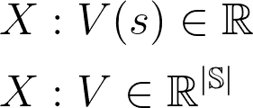

价值函数属于实数集。底部的 X 表示完整值函数的集合，而顶部的 X 表示单一状态的值集合。

对于度量，我们使用定义如下的[L-无穷大](https://en.wikipedia.org/wiki/L-infinity)范数:

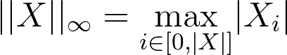

l-无穷范数

根据这个度量，两个值函数之间的距离将等于两者之间的最高元素绝对差。此外，对于具有有限回报的有限 MDP，价值函数将总是停留在实空间中。价值函数不可能不在实空间，因此，这个有限空间永远是完备的。

> **定理** : Bellman 算子`B`是有限空间中的压缩映射`(R, L-infinity)`

证明:设`V1`和`V2`是两个值函数。然后:

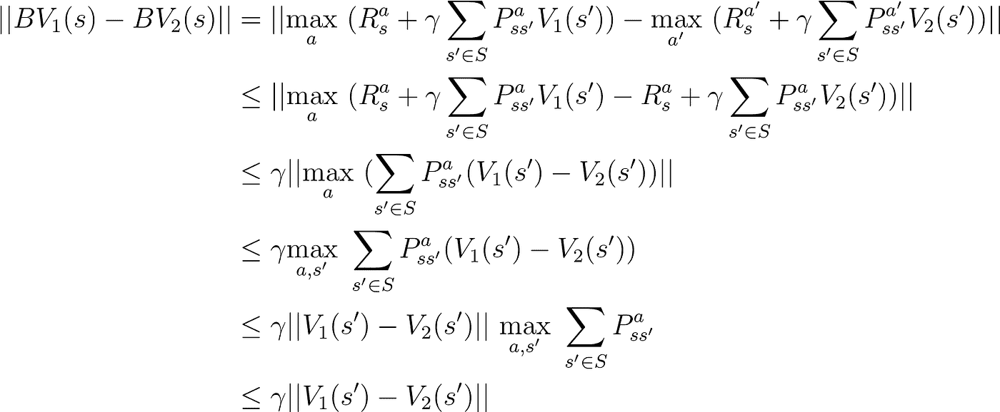

B 是收缩的证明

*   在上面的第二步中，我们通过将第二个值函数的`a’`替换为`a`来引入不等式。这是因为通过用一些其他动作`a`替换它的最优动作`a’`，我们减少了它的总价值，从而引入了一个不等式。
*   在第四步中，我们通过在`s’`上取最大值来移除 L-无穷范数(回想一下我们设置中关于值函数的 L-无穷的定义)
*   在最后一步，我们删除了 sigma，因为概率之和总是`1`。

最后，对于贝尔曼最优方程，由于`γ∈[0,1)`(让我们暂时忽略`γ=1`的可能性)，因此，贝尔曼算子是一个承包商。

现在我们知道:

1.  `(R, L-infinity)`是一个完备的度量空间
2.  行李员操作员`B`是承包商

因此，通过 Banach 不动点定理，我们得出结论，对于每个 MDP，存在唯一的最优值函数`V*`。利用这个`V*`，我们可以得出最优策略`π*`。

因此证明了，对于任何有限的 MDP，存在一个最优策略`π*`，使得它优于或等于所有其他可能的策略`π`。

现在，如何找到这个最优政策和价值函数？一种方法是将 Bellman 算子反复应用于随机初始值函数，以获得最优函数。但是，这在计算上非常昂贵，并且通常完全不可行。因此，我们使用迭代方法，如值和策略迭代，或时间差分方法，如 Q-Learning 或 SARSA。有关这方面的更多信息，请参考我的博客[强化学习:时态差异，SARSA，Q-Learning &预期的 python 中的 SARSA](/reinforcement-learning-temporal-difference-sarsa-q-learning-expected-sarsa-on-python-9fecfda7467e#eccc)或者只是在我的 Github 上查看这些算法: [RL_from_scratch](https://github.com/TimeTraveller-San/RL_from_scratch) 。

# 结论

我们学习了一些基本的数学工具，如度量空间，完全度量空间，柯西序列，压缩映射和 Banach 不动点定理。在所有这些的基础上，我们从数学上证明了每个 MDP 的贝尔曼最优方程的唯一最优性。

# 参考文献和致谢

*   我使用[https://latex.codecogs.com/eqneditor/editor.php](https://latex.codecogs.com/eqneditor/editor.php)为 LaTeX 生成图像。(但愿介质允许乳胶)
*   维基百科提供了所有的正式定义和定理。
*   CMU 15–781 号[赛道](https://www.cs.cmu.edu/~ninamf/courses/401sp18/prev.shtml)
*   丹尼尔·默菲特博士的[笔记](http://therisingsea.org/notes/mast30026/lecture14.pdf)和[视频](https://www.youtube.com/watch?v=gsM7PPBx16k)
*   巴拉拉曼·拉温德兰博士和 IIT·马德拉斯教授的免费网络电话课程

# 尾注

我试图用尽可能简单的语言解释一切。如果我不清楚或者我犯了一些错误，请在回复中告诉我。此外，在乳胶方程中可能会有一些错误。如果你找到他们，请让我知道。最后但同样重要的是，感谢阅读！