# 数学营销:一块可以改变广告方式的微积分

> 原文：<https://towardsdatascience.com/mathematical-marketing-one-piece-of-calculus-that-can-change-the-way-you-advertise-5b861bbbbd70?source=collection_archive---------16----------------------->

当我接受数字营销职位的面试时，有一个问题我很想问:

假设你在营销一种产品，每次转化的利润是 10 美元。你的目标是每次转换的成本是多少？

对于市场营销来说，这是一个相当基本的问题，也是我们在经营市场营销时都会含蓄地回答的一个问题，不管我们喜欢与否。这似乎也是一个非常简单的问题，但是完整地回答这个问题可以教会我们很多关于如何有效地进行营销的知识。

# 那么，你的目标是什么样的每次转换成本呢？

为了简单起见，我假设每个客户的终身价值与每次转换的利润相同。这实际上是说，每个客户可以转换一次产品，而且只能转换一次。这种假设是大量垂直行业的标准；例如在金融业，客户一生中只购买一次特定品牌的金融产品，如信用卡或保险。

假设不存在，让我们回到问题上来。让我们从问另一个问题开始回答这个问题，为什么你最终要营销这个产品？你想达到什么目的？

对此的回答通常是*利润*。你推销产品是因为你想获利。

在市场营销的背景下，利润是产生一次转化的成本(每次转化的成本)和转化的利润(毛利)之间的差额。

既然我们清楚自己想要什么，那么我们如何得到它呢？

我们必须意识到的是，利润和我们的目标转化成本之间存在关系。它通常看起来像这样:

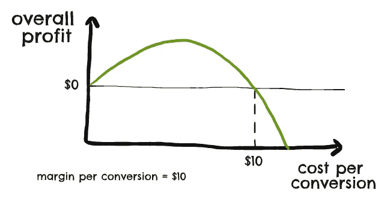

在图表的左侧，利润为**低**，每次转换的成本为**低**。发生这种情况是因为，虽然每次转换的低成本可能意味着我们每次转换的高利润，但如此低的每次转换成本阻止了我们实际带来任何大量的转换。因此，我们的整体盈利能力较低。

在图表的右侧(每次转换的成本接近 10 美元)，利润为**低**，每次转换的成本为**高**。发生这种情况是因为，虽然我们每次转化的高成本使我们能够带来大量的转化，但每次单独转化的盈利能力非常低。虽然我们可能会带来大量的转化，但每次转化的利润和广告成本之间的差异是如此之低，以至于我们没有产生多少实际利润。

在图表的中间，我们有一个利润高于左边或右边的区域。在这里，我们的每次转换成本既不太低也不太高。这意味着，虽然我们不能以更高的每次转换成本产生尽可能多的转换，但我们仍然产生了一个不错的数字。事实上，我们比上面的最后一个场景产生了更少的转化，这被我们从每个单独的转化中获得更好的利润这一事实所抵消。

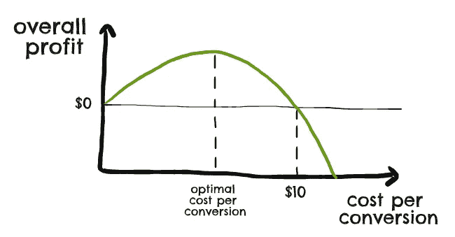

因此，与上述两种情况相比，我们能够带来更多的总体利润。

我上面写的在理论上听起来应该是正确的，但是我们实际上如何将这种见解付诸实践可能并不明显。

很容易理解在光谱的两个极端之间有一些中间地带，但是我们实际上如何找到它呢？更简洁地说，什么样的每次转换成本能给我们带来最高的总体利润？

要回答这个问题，我们需要回到什么是利润:

这里的毛利是收入和销售成本之间的差额，所以当广告支出为零时，毛利等于利润。

像大多数数学方程一样，如果我们替换方程中使用的一些术语，我们可以开始更好地理解这个方程。我们知道总利润在某种程度上是我们花费多少的函数，所以我们可以将上面的等式改写为:

为了进一步简化这个等式，我们需要了解毛利到底是什么。特别是，我们需要能够准确理解它与支出的关系。

在我的另一篇文章中，我介绍了几个解决这个问题的方法。为了简单起见，我将只介绍那篇文章中概述的一种方法，这种方法适用于使用智能竞价的谷歌广告活动。

# 投标模拟器

如果你以前运行过谷歌智能竞价活动，你可能会熟悉一个叫做竞价模拟器的工具。

Bid simulator 可以让您估计如果您改变目标，您的指标会是什么样子。

例如，你可能目前每周带来 **60** **的转化，每次转化成本为 5 美元**；出价模拟器可能会告诉你，如果你的目标是每转换 6 美元，你可以每周带来 **63 次转换。**

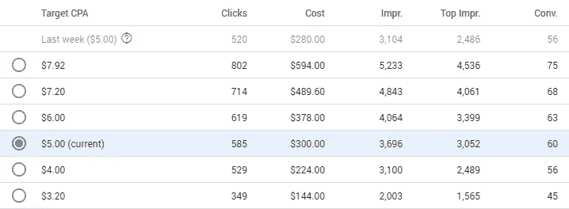

投标模拟器往往会给你一些不同的数据点看。除了您当前每次转换成本的指标之外，它通常会为您提供每次转换成本较低的 2 或 3 次模拟的指标，以及每次转换成本较高的几次模拟的指标。

来自 bid simulator 的数据是非常宝贵的，因为它可以让你准确地了解你的毛利如何依赖于成本。如果您从 bid simulator 复制数据并将其放入 Google Sheets，您可以创建一个如下所示的表格:

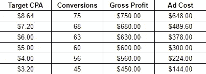

在这里，我通过将所有转换数乘以 10 美元(其中 10 美元是我们每次转换的毛利)来计算毛利。我通过将前两列相乘来计算广告成本。

投标模拟器已经基本上告诉我们，多少毛利，我们可以为每一个水平的支出。但是它只告诉我们一些可见的数据点，那么我们如何在更基本的层面上理解这种关系呢？

# 寻找关系

我们可以尝试找到一个方程来拟合 bid simulator 提供的数据。要做到这一点，让我们根据数据制作一个散点图，并添加一条最佳拟合线。

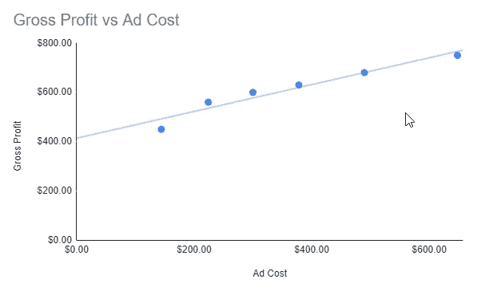

上图显示了最佳拟合的线性线。显然，我们可以看到上面的数据不是线性的，最佳拟合的线性线没有意义。

如果我们将最佳拟合线的设置切换到对数，看起来这条线更接近数据:

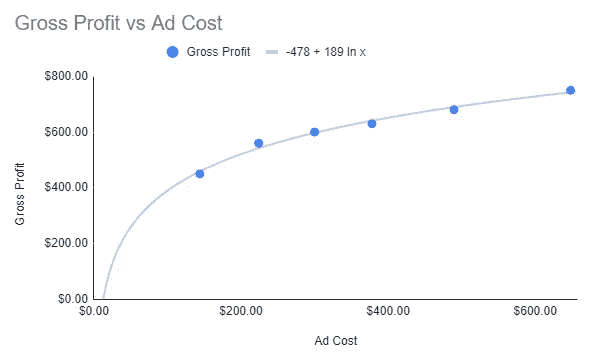

你会注意到在图表的顶部，我设置了 Google Sheets 来显示这条线的等式:

对于那些不熟悉“ln”术语的人来说，它代表一个自然对数。这与指数相反，如果你以前遇到过的话。

现在我们有了一个总利润的等式，我们可以把它代入前面的总利润等式，得到:

这看起来可能有些武断，但是如果我们把它绘制成图表，我们可以看到它向我们展示了一个有趣的形状:

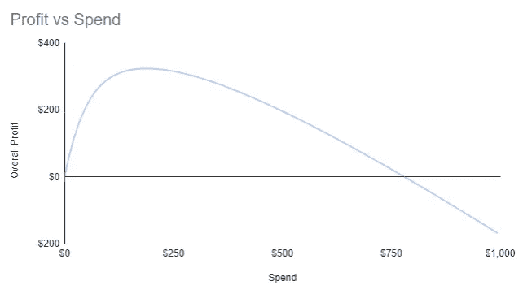

这个图表很有用，因为它告诉我们两件重要的事情:

*   它告诉我们，有一个大约值 800 美元的花费点，如果我们超过这个点，我们将在营销上赔钱。这是因为每次转换的成本，我们的目标是花费这么多，将等于或大于我们每次转换的毛利，10 美元。
*   更重要的是，图中有一个大约 200 美元的点，在这个点上我们的利润最大。

这第二点是关键；如果我们能找出多少支出对应于那个峰值，那么这就是我们的最佳支出水平。这是产生最大整体利润的支出水平，因此是我们活动的理想支出金额。

# 找到最高消费水平

为了找到这个花费水平，我们必须做一点计算。我们之前说过，上图对应于以下等式:

我们知道在图的顶点，图的线是平的。这相当于说，当你处于高峰期时，支出的微小变化对利润的影响很小(如果有的话)。

我们可以通过谈论利润相对于广告支出的**导数来数学地表达这一点。这表示广告支出的变化会带来多少利润变化:**

*   在图的左边，导数是正的。这意味着广告支出的**增加导致利润**的**增加，也就是说，图表指向上方。**
*   在图的右边，导数是负的。这意味着广告支出的**增加导致利润**的**减少，也就是说，图表指向下方。**

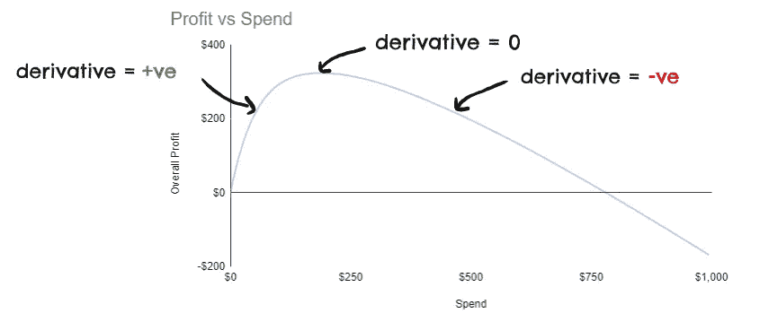

你可能已经猜到了，图的顶点处的导数等于零。正如我前面所说的，这是因为在高峰期，支出的微小变化对利润没有影响；图表在那一点是平的。

# 这对我们有什么帮助？

如果你在学校或大学学过微积分，你可能会记得你可以计算方程的导数。如果我们的利润等式是:

然后我们可以算出利润对广告支出的导数是:

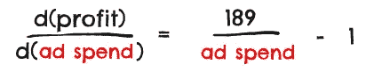

现在我们说等式的左边(利润相对于广告支出的导数)当我们在图的顶点时等于零。我们可以这样写:

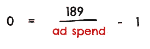

然后我们可以如下求解:

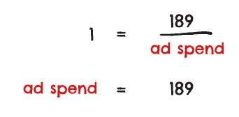

这告诉我们的是，对应于之前图表峰值的广告支出值是 189 美元。回头看看图表，你会看到这条线。

因此，我们计算出可能给我们带来最大利润的支出水平是 189 美元。

我们可以利用这些信息，将我们的活动预算限制在每周 189 美元，或者我们可以将其转化为每次转化的目标成本。

要完成第二个选项，我们可以回到我们之前提取的投标模拟器数据，它为我们提供了每次转换的成本和支出的数据点:

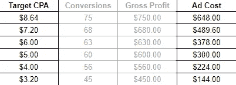

我们可以像之前一样找出毛利和广告成本之间的关系，也就是找到两者之间的最佳匹配线:

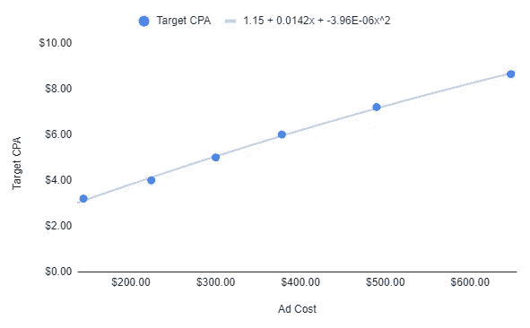

这和我们之前所做的唯一区别是，这次我用多项式方程来拟合图表，而不是对数方程。

你可以在图表的顶部看到这一点。它告诉我们:

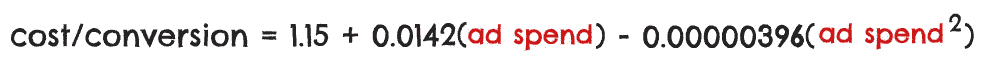

如果我们插入之前得到的**广告花费**的值(189 美元)，我们最终得到的成本/转换为**3.69 美元**。

这是我们对初始问题的最佳回答。假设出价模拟器数据在这种情况下是正确的，则使毛利为 10 美元的产品的利润最大化的每次转换成本是 3.69 美元。

*   如果我们每次转化的成本稍微低一点，那么我们每次转化肯定会带来更多的利润*，但这将被更少的转化所抵消。*
*   如果我们的每次转换成本稍微高一点，那么我们肯定会带来更多的转换，但这将被较低的每次转换利润所抵消。

如果我们的每次转换成本在这个范围内，我们带来的利润就会减少:

简单地说，在这种情况下，3.69 美元是每次转换的最佳成本。每次转换的成本不同，不可能产生更多的利润。

‍

*最初发表于*[*【https://mackgrenfell.com】*](https://mackgrenfell.com/blog/mathematical-marketing-one-piece-of-calculus-that-can-change-the-way-you-advertise)*。*