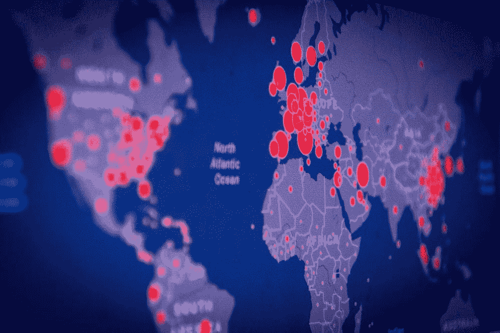

# 用于研究传染病及其传播率的数学模型

> 原文：<https://towardsdatascience.com/mathematical-models-used-to-study-infectious-disease-and-their-transmission-rate-234267d2714b?source=collection_archive---------40----------------------->

## 不同建模技术之间的比较

研究感染率的模型【来源:图片由[贾科莫·卡拉](https://unsplash.com/@giacomocarra?utm_source=unsplash&utm_medium=referral&utm_content=creditCopyText)在[Unsplash](/s/photos/disease-spread?utm_source=unsplash&utm_medium=referral&utm_content=creditCopyText)上提供】

我们经常听说数据科学家引用不同的数学模型来分析理论传染率。然而，尽管这些模型在本质上有些复杂，并且包括限制和挑战；然而，在研究任何传染病的传播和感染率时，它们仍然经常被提及。

我们将比较不同的*数学模型*，以了解它们在正确预测传染病传播率方面的性质和贡献。

1.  ***SIR*** (易感、传染、康复)是一种数学建模技术，早期曾用于研究任何传染病的传播率。该模型特别用于研究疾病的传播及其在人群中的感染率。
2.  另一个研究传染病传播的现实模拟是 ***GLEaM*** (全球流行与流动模型)。然而，这个模型提供了一个传染病全球传播的真实模拟。
3.  ***TRANSIMS (*** 运输分析模拟系统)已被用于研究【参考文献 4】中，以模拟由于个人或团体在全球不同地点的旅行或移动而产生的物理接触模式。
4.  ***IBM*** (基于个人的模型)(参考。5)辅以 ***SIR 模型*** 也被用于跨杂数据建模研究传染病传播率。

# ***爵士型号***

SIR 模型是一个常微分方程，用于预测流行病期间的疾病传播和感染率。

*S* 代表可从传染者处感染疾病的易感个体群体。

*I* 代表传染个体。

*R* 代表群体中免疫和死亡个体的“恢复”或“抗性”。

所有这些参数都是函数，可以用线性代数表示为:

**S(t) +I(t)+R(t)= N，**其中 N 代表总体，t 代表作为时间函数的参数。

***S(t)*** 也可以写成-kIS。它是由于易感者和感染者之间的接触而导致的疾病传播率。

***R(t)*** 可以写成 bI。就是被感染后恢复的速度。

aI 是由于感染导致的死亡率。

因此，从数学上讲，感染率可以写成:

***I(t) =kIS-bI-aI。***

**该型号的局限性**

*   它没有考虑潜伏期(即疾病发作和出现症状之间的时间线)。
*   其次，在整个建模技术中，假设人口 N 为常数，并且不应用全球旅行的影响。
*   它没有考虑隔离期。

因此，Volpert 等人(2020 年)开发了一个模型，其中包括隔离的影响，以研究传染病传播率:

***I(t)= kI(t)S(t)-kI(t-I)S(t-I)。*** 其中 I 是潜伏期。

同样，由于隔离而导致的新感染人数 Ro 可以假定为 Ro<1.

Wash your hands and stay safe [Source of Photo :by [Allie](https://unsplash.com/@acreativegangster?utm_source=unsplash&utm_medium=referral&utm_content=creditCopyText)on[Unsplash】](/s/photos/disease-spread?utm_source=unsplash&utm_medium=referral&utm_content=creditCopyText)

# **GLEaM (** 全球流行病和流动模型)

这是一个计算流行病模型。这是一个大规模的元种群模型，它认为系统被划分为多个区域，这些区域之间的连接是由于移动基础设施引起的个体流入和流出而产生的。

GLEaM 计算模型考虑了跨地理区域发生的每日人口迁移。它由三个不同的层组成。

(1)人口层

(2)移动层

(3)疾病模型

**人口层**

地球表面被分成具有适当分辨率的 n×n 平方公里的网格单元。它们还有一个估计的人口值 n。

*注*:为了简化建模，亚人群以机场为中心。同一城市区域中的多个机场的组在分割(分割)之前被聚集。

**移动层**

这由移动性数据层组成，用于表示上述子群体之间发生的交通或通信。它包括从短程到洲际飞行的不同类型的移动过程。

**疾病模型**

亚群体 k 中易感个体获得感染的速率用 I (t)表示。然而，与 SIR 模型不同，I(t)的大小受两个因素的影响。

*(i)来自其宿主亚群体中另一个个体的感染，k.*

*(ii)来自通信网络中的个体的相互作用的感染，l.*

# ***TRANSIMS (*** 运输分析模拟系统)

大多数研究关注的是在疾病爆发期间子人群中个体的均匀混合。然而，该模型利用动态二分图来模拟子群体之间移动期间的物理接触模式。它利用实际的人口普查移动性进行建模，通过在疫情爆发区域放置传感器可以有效地检测到这种移动性。

模拟生成动态接触图，而不是利用前面讨论的经典微分方程。

一个重要的参数是*聚集系数*，它对疾病传播的速度和程度有影响。它是通过子群体的边连接邻居的范围的度量。

# ***IBM*** (基于个人的模型)

IBM 模型是基于个体有机体的表示。当在数学模型中使用家庭亚群体相互作用中的*个体可变性*时，使用它们。它们有多种模式，提供关于*“家”*亚种群动态的信息。

IBM 与 SEIR 模型相结合来研究意大利流行病[参考文献。5].由于该模型基于单个国家特定的人口统计数据，因此该数据可用于实时评估针对特定人口统计数据采取的措施，以缓解传染病的传播。

例如，*国 A* 采取的措施在*国 B* 应用时可能无效。

该模型与中的 SIR 模型(如参考文献 2 中所述)相结合，可以解释为什么减轻全球疫情的中心措施可能无效。

然而，这最后的评论是作者的唯一意见，并开放讨论。

# 结论

然而，所有这些模型都是理论模型，可能并不总是反映实际统计数据，因为有几个**假设**用于简化这些模型中的大部分。

**参考文献**

[1]奇纳齐，m .，戴维斯，J. T .，阿杰利，m .，焦安尼尼，c .，利特维诺娃，m .，默勒，s .，… &维布，C. (2020)。旅行限制对 2019 年新型冠状病毒(新冠肺炎)爆发传播的影响。科学，368(6489)，395–400。

[2]Volpert，v .，Banerjee，m .，& Petrovskii，S. (2020)。冠状病毒感染的隔离模型及数据分析。自然现象的数学模型，15，24。

[3]Balcan，d .，Colizza，v .，Gonç alves，b .，Hu，h .，Ramasco，J. J .，& Vespignani，A. (2009 年)。多尺度移动网络与传染病的空间传播。美国国家科学院学报，106(51)，21484–21489。

[4]尤班克，s .，古奇卢，h .，阿尼尔·库马尔，v .等人,《模拟现实城市社会网络中的疾病爆发》。《自然》杂志 2004 年第 429 期，第 180-184 页。[https://doi.org/10.1038/nature02541](https://doi.org/10.1038/nature02541)

[5]德格利·阿蒂，M. L. C .，默勒，s .，里索，c .，阿杰利，m .，马萨里，m .，曼弗雷迪，p .，…，伊安内利，M. (2008 年)。意大利疫情流感的缓解措施:考虑不同情景的基于个体的模型。PloS one，3(3)。

[6]Balcan，d .，Gonç alves，b .，Hu，h .，Ramasco，J. J .，Colizza，v .，& Vespignani，A. (2010 年)。模拟传染病的空间传播:全球流行病和流动性计算模型。*计算科学杂志*， *1* (3)，132–145。

[7]格林，沃尔克。"生态模型:基于个体的模型."(2019): 65–73.