# Word2vec 模型训练背后的数学

> 原文：<https://towardsdatascience.com/mathematics-behind-the-training-of-word2vec-model-62d7e0ff76e4?source=collection_archive---------15----------------------->

## 在本文中，我们将了解 Word2Vec 算法训练背后涉及的数学。

在我的上一篇文章中，我们介绍了单词嵌入的基本思想及其使用 genism 库的实现。不了解单词嵌入基础知识的人，我强烈建议他们看看我之前的文章。

 [## 基于 Gensim 和 PCA 的单词嵌入向量可视化

### 在本文中，我们将学习如何使用单词嵌入来训练文本数据，并进一步使用…

towardsdatascience.com](/visualization-of-word-embedding-vectors-using-gensim-and-pca-8f592a5d3354) 

Word2Vec 模型的训练可以使用两种算法来完成

单跳格模型

2-连续单词包(CBOW)

在本文中，我们将涉及 SG 模型背后的数学。

约翰·莫塞斯·鲍恩在 [Unsplash](https://unsplash.com?utm_source=medium&utm_medium=referral) 上拍摄的照片

# **跳格模型:**

该模型假设在文本语料库中，一个单词可以用来预测其周围的单词。该算法背后的主要思想是，给定一个中心词( **Vc** )，它试图预测相邻词( **Vw** )的条件概率，并进一步试图最大化该出现概率。要考虑的相邻单词的数量取决于窗口大小 m。下图使用窗口大小=2 来解释这一想法。

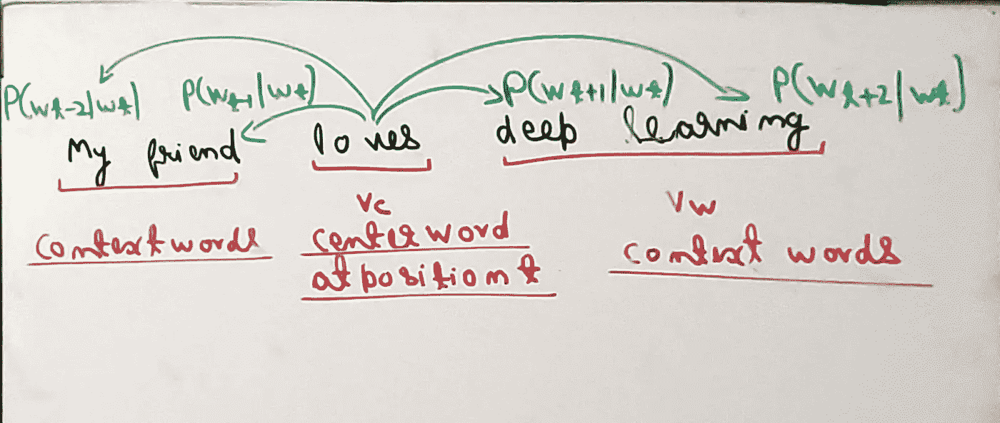

我们假设，给定中心单词，上下文单词彼此独立地生成。在这种情况下，所有单词同时出现的概率公式如下

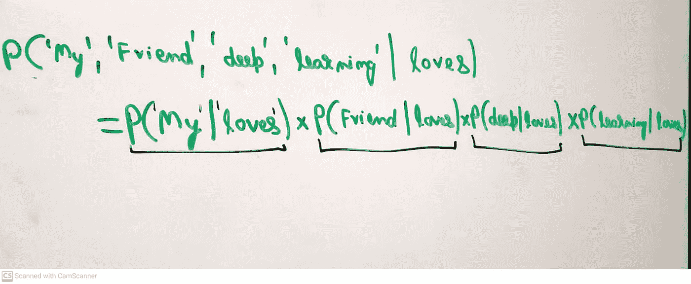

# **定义损失函数:**

上面的概率计算只是在整个语料库中以某个随机词为中心。但是我们将不得不遍历整个语料库 **(T)** 以一次一个地将所有单词视为中心单词，并针对 m 的窗口大小来预测其各自的周围单词。最大似然函数可以写成如下

正如我们所知，在梯度计算方面使用对数似然函数总是很容易的，因此我们在两边取对数，并将其转换成对数形式。

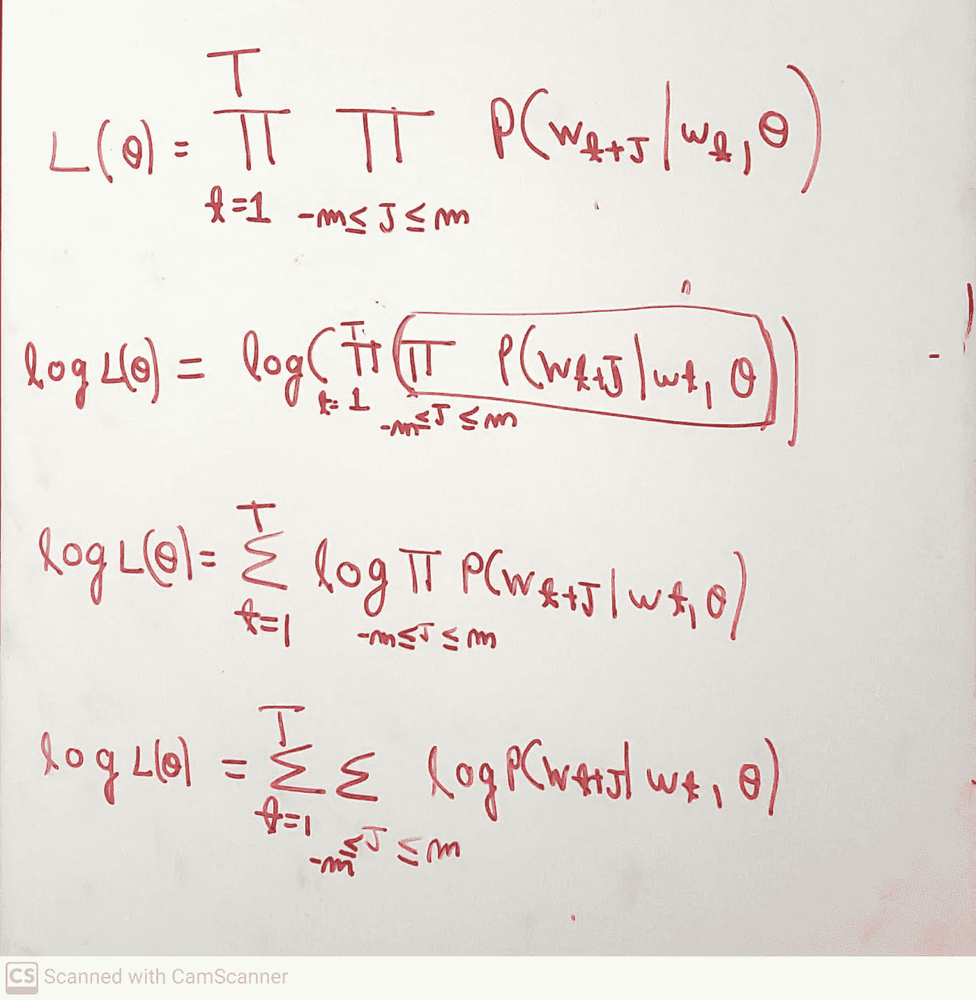

现在让我们定义一些符号，因为我们将从这里开始使用它们-

**Vc**——中心词的向量表示。

**Uo**-上下文单词的矢量表示。

# **概率计算:**

可以使用 softmax 函数来获得为给定的中心目标单词 **c** 生成上下文单词 **o** 的条件概率。为了说服你自己，你可以认为如果两个词是相同的，那么相似度是 1，概率是 1。

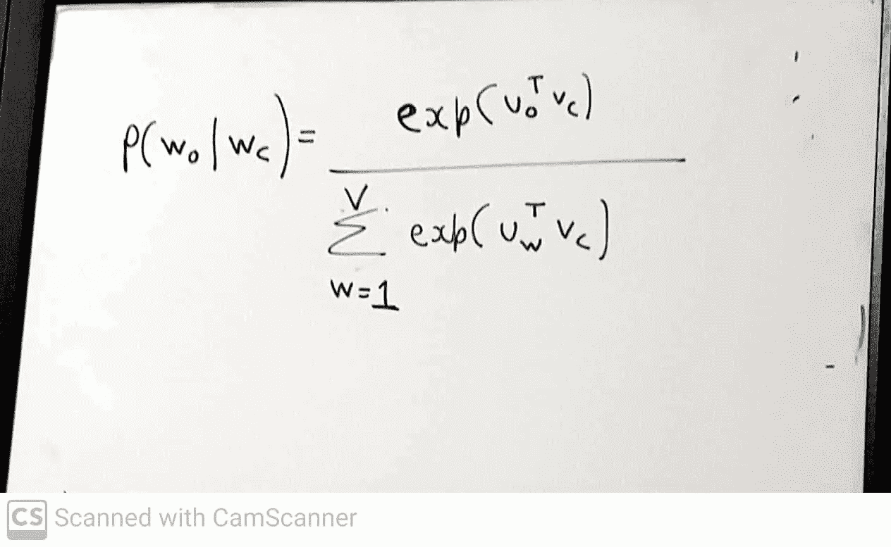

softmax 通过对整个词汇 v 进行归一化，将其转换为概率。点积表示两个单词向量之间的相似度。

现在让我们在将表达式代入概率后，写出最终的成本函数。

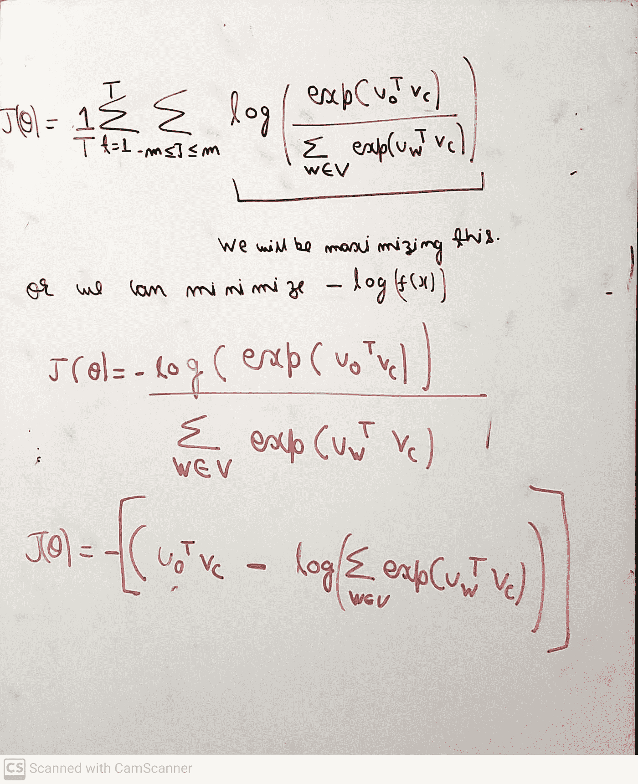

# **梯度计算:**

我们的主要目标是在一个**降维空间**中找到文本中每个单词的向量表示。这里的诀窍是每个单词 **w** 将有两种不同的表示，当单词 w 是中心单词时有一个 **Vw** ，当单词 w 是上下文单词时有另一个 **Uw** 。因此，我们之前讨论过的参数**θ**将是 **2V x d 维向量**，其中每行代表词汇表中的一个不同单词，其跨列的 d 维向量表示。

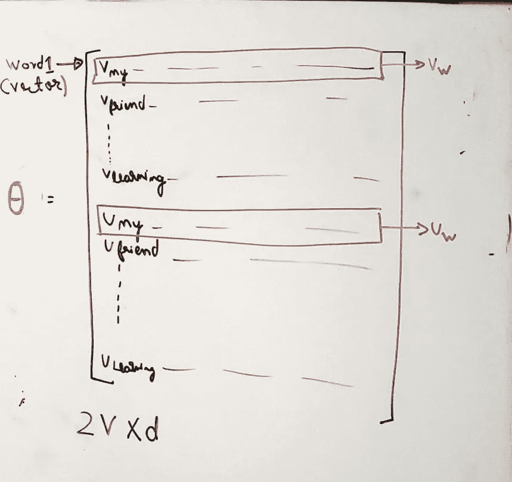

现在每个单词有两个向量表示。为了训练我们的模型，我们将对 **Vw 和 Uw 求导，并使用梯度下降更新这些向量。** Vc 和 Vw 基本相同。我们刚刚改变了符号，以避免任何混淆。根据矩阵**θ，我们只有两个参数 Vc 和 Uw。**

# **相对于 Vc 的梯度:**

**第一步:**

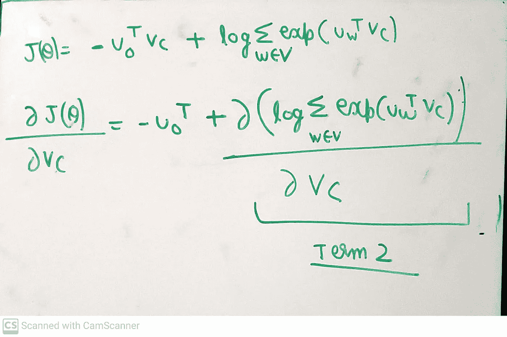

第二步:对第二项应用链式法则。

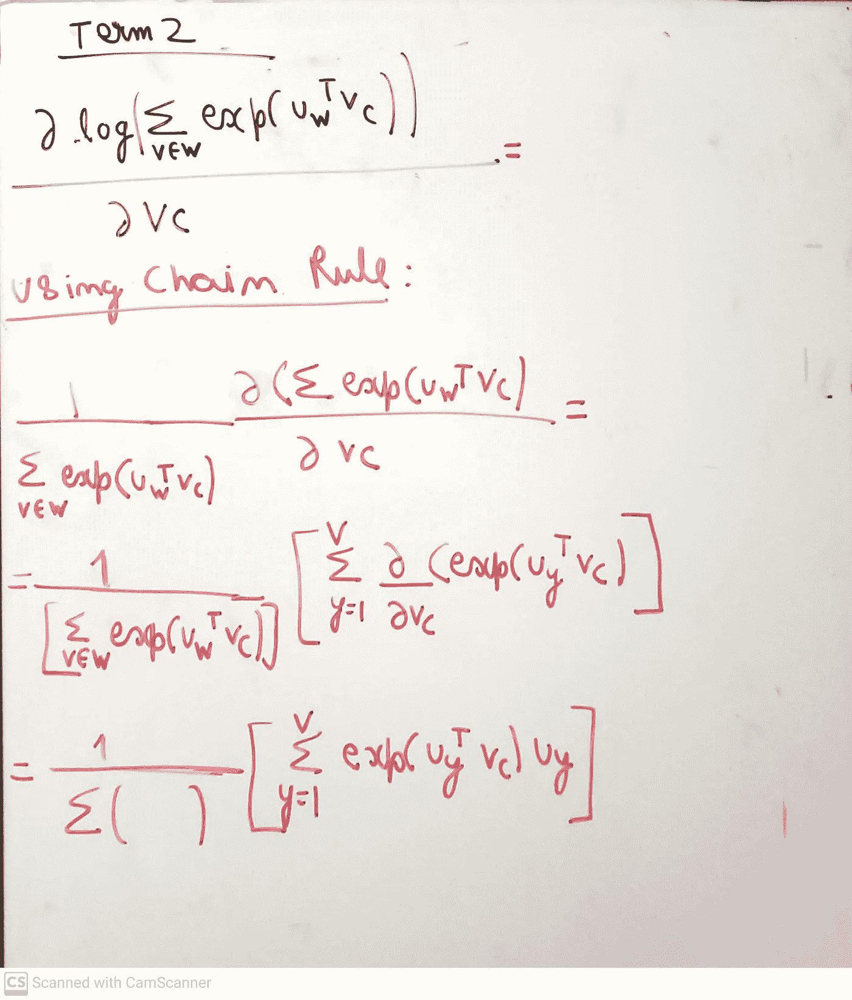

**第三步:**

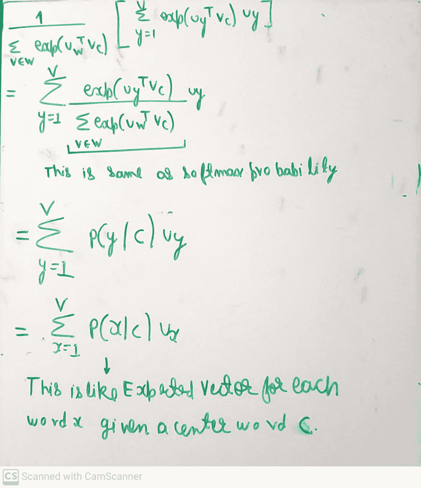

**第四步:**

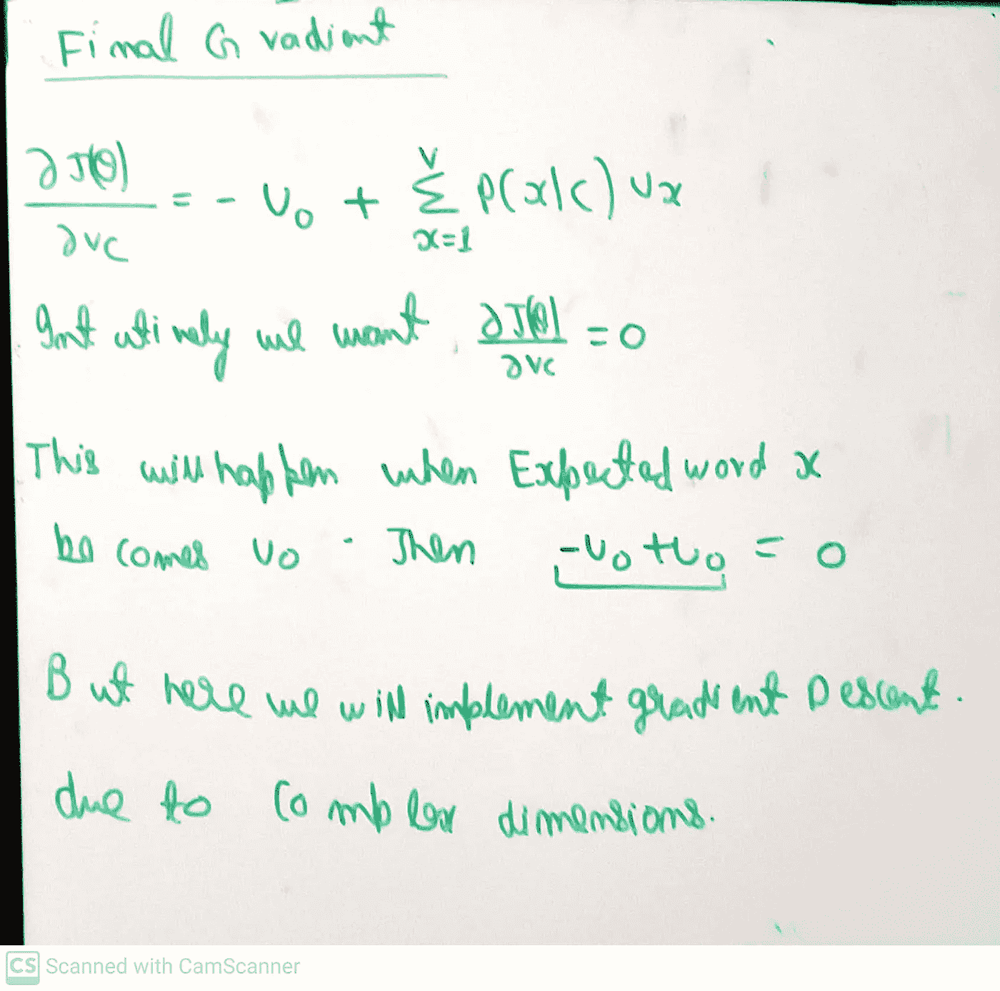

# 相对于 Uw 的梯度:

这里 w 是上下文词。因此，可能有两种情况，o 是上下文单词 w，而 o 不是上下文单词 w。因此，我们将梯度分成两部分来计算相对于 Uw 的梯度。按照和上面 Vc 一样的计算方法，我们可以用对称性写出梯度 w.r.t Uw。

什么时候，

## O ≠ W:

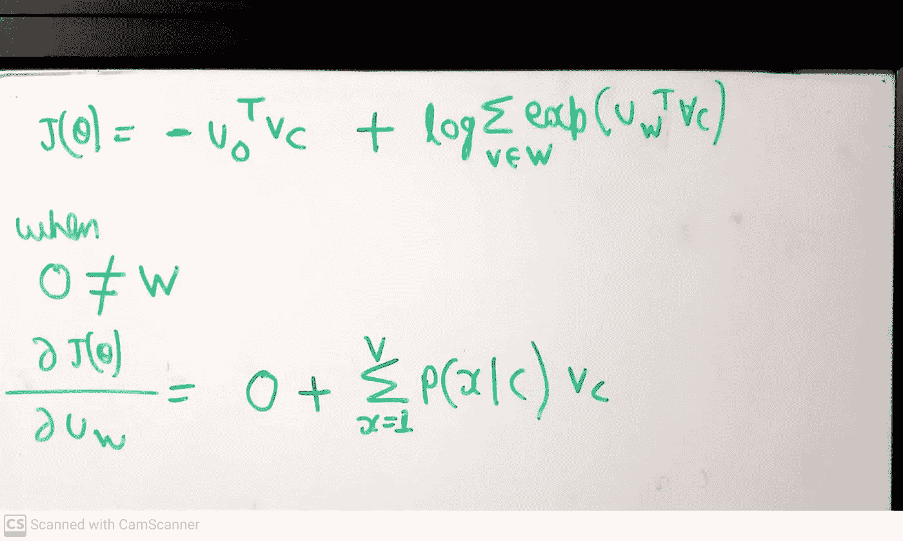

## O = W:

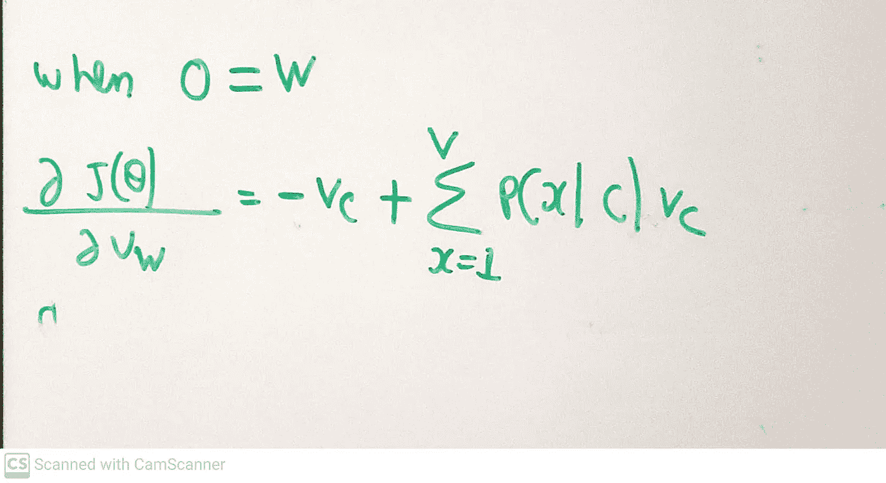

# **梯度下降:**

现在，我们将使用梯度下降算法更新整个语料库的计算梯度。该算法的伪代码如下所示

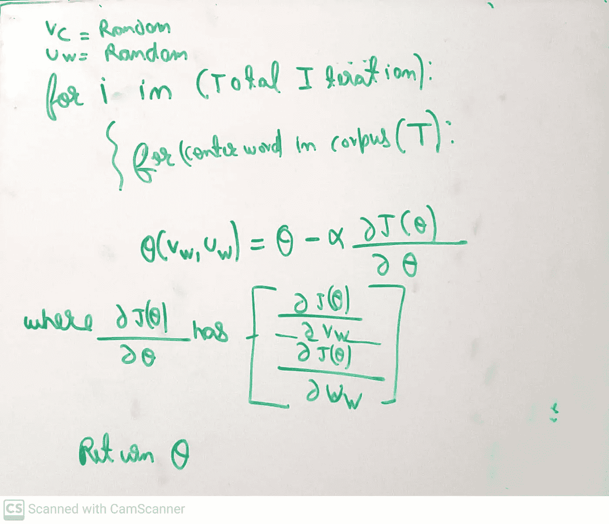

然而，这种方法有一个问题。正如我们所见，在梯度的分母中，我们必须取所有单词点积的指数，当我们有大量词汇时，这非常耗时。我们将需要训练数十亿个权重，这在计算上是昂贵的。因此，我们使用一种叫做负采样的技术来解决这个问题。在这种技术中，我们只从基于单字母分布的随机选择的词汇表中抽取少量单词。我不打算在这篇文章中讨论这些细节。

# **结论:**

我希望这篇文章能让您对 Word2vec 模型背后的数学有一个基本的了解。由于嵌入了太多的图片，这篇文章可能看起来有点令人沮丧，但是如果你一步一步地去做，我相信它会非常有帮助。如果你们能给我一些反馈，那就太好了，这样我下次就能以更好的方式展示了。

# **参考文献:**

[1-https://papers . nips . cc/paper/5021-单词和短语的分布式表示及其组成性. pdf](https://papers.nips.cc/paper/5021-distributed-representations-of-words-and-phrases-and-their-compositionality.pdf)

# 感谢您的阅读！！！！

如果你喜欢我的工作并想支持我:

1-支持我的最好方式是跟随我上 [**中**](https://medium.com/@saketthavananilindan) **。**

2-在[**LinkedIn**](https://www.linkedin.com/in/saket-thavanani-b1a149a0/)**上关注我。**