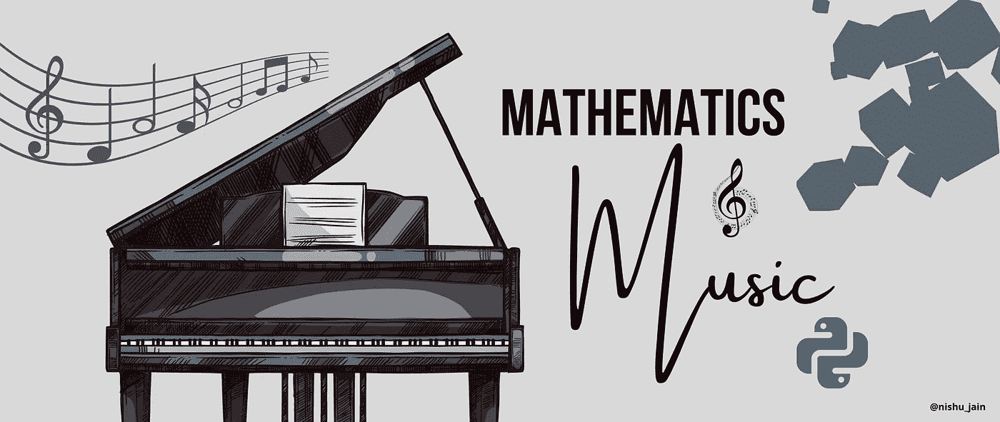
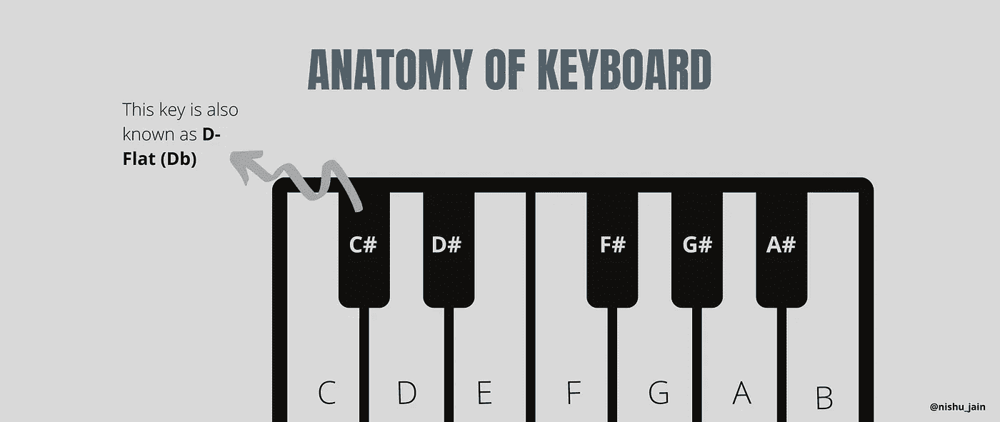
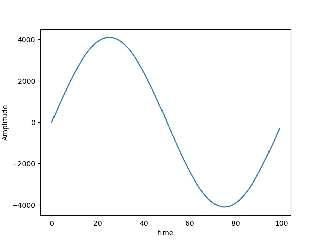
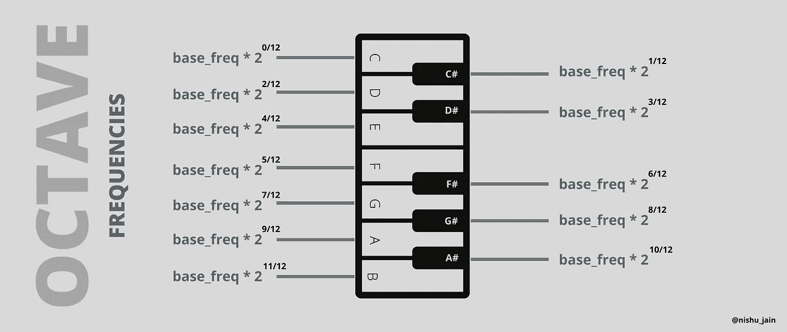

# 如何在 Python 中使用数学来演奏音乐

> 原文：<https://towardsdatascience.com/mathematics-of-music-in-python-b7d838c84f72?source=collection_archive---------6----------------------->

## 编程；编排

## 音乐数学



来源:图片由作者提供(使用 Canva 制作)

为什么一些音符在一起听起来很和谐？而其他人就是不知道。如果你是聋子，你能创作一首音乐吗？哪种声音的“物理结构”使旋律变得优美？

听这段音频，告诉我你听到了什么:

来源:作者视频

我喜欢弹钢琴，我喜欢编程和数学。所以今天我想，为什么不把它们融合在一起，创造出一些很棒的东西。

> 我的音乐会告诉你比我更多的关于我的事情

音频(上图)仅使用 ***Numpy*** 和****Scipy****合成！如果您不熟悉这些 Python 包，也不用担心。它们并不难理解。**

**在本文中，我们将看到如何生成不同频率的波，构建我们自己的虚拟钢琴，并演奏一首歌曲。所有这些，使用我们最喜欢的编程语言，Python。**

**所以让我们从一些基础开始。**

# **音符只不过是频率**

> **你知道吗？贝多芬，有史以来最著名的作曲家之一，他的大部分职业生涯都是在失聪中度过的！他完全依靠自己对模式的直觉，他发现这些模式对他的观众有效。他将自己的创造力与数学的逻辑(下意识地)混合在一起，谱写出了我们至今仍珍藏的音乐。**

**为了简单起见，我们将用钢琴作为我们的参考乐器。所以在开始之前，这里有一些基础知识。**

## **钢琴基础**

**键盘(钢琴/乐器)的构造非常简单。它由多个八度音阶组成。一个*八度音阶*是一组 ***12 个键——7 个白键和 5 个黑键*** 。**

**每个键在按下时都会产生不同频率的声音，我们同时按下多个键来演奏和弦。就是这样！**

## **纳米斯**

**白键被命名为 **C、D、E、F、G、A、B** ，而黑键则使用两个术语来命名——**平(** b **)和尖(** # **)** 。**

**如果一个黑键在任何一个白键的右边，它被称为相应白键的升半音。如果它在左边，它就被称为相应白键的降半音。**

**比如 C 和 D 之间的黑键有两个名字: ***C#*** (C 调)和***Db****(D 调)。这是因为它在 C 的右边，也在 d 的左边。***

******

***来源:图片由作者提供(使用 Canva 制作)***

***为了避免混淆，我们将在本文中使用“尖锐”的术语。此外，“笔记”和“钥匙”这两个词可以互换使用。***

***记住这一点，让我们开始吧！***

# ***理解波浪——快速复习***

***你一定在物理课上听说过波。像电磁波、机械波、声波等波在某一给定的频率下围绕平衡反复振荡。***

***从数学上来说，波浪可以用一个波动方程来描述，比如—***

> ***g(f) = A sin(2πft)***

***在哪里，***

> *****A** =振幅或峰值***
> 
> *****f** =频率***
> 
> *****=时间*****

*****我们可以轻松地在 Python 中创建一个函数，生成一个关于时间的波的 NumPy 数组，如以下代码所示:*****

*****来源:作者的代码(在 Github 上)*****

*****您也可以使用一些库(如 *matplotlib* )来绘制这个数组，以清楚地了解正在发生的事情。*****

****440 赫兹的频率意味着波在一秒钟内完成 440 个完整的周期。换句话说，它在 1/440 秒内完成一个周期。****

****由于我们将 1 秒钟分成了 44100 个部分，根据 sample_rate，我们可以通过打印从 **0 到 int(44100/440)** 的元素来绘制一个周期****

```
****import matplotlib.pyplot as pltplt.plot(a_wave[0:int(44100/440)])
plt.xlabel('time')
plt.ylabel('Amplitude')
plt.show()****
```

********

****来源:图片由作者提供(使用 Matplotlib 制作)****

> ******注意:**如你所见，图中的循环是**而不是**完全完成。理想情况下，这个周期在 100.227 完成，但是由于我们使用的是离散时间间隔(在 100)，它稍微偏离初始值(即 0)。****

# ****用 Python 制作你自己的钢琴****

****如前所述，一架钢琴由 ***多个*** 八度音阶组成。虽然每个八度音程在物理上是相同的，但它听起来可能相对于另一个有点高或低。****

****如果我们想创造一个单一的八度音阶(12 个键的集合)，那么我们必须知道每个键是如何相对于另一个键被校准的。之后，我们可以将所有键的频率加倍(或减半)，以获得下一个八度。****

****钢琴使用“**平均律系统**调音。这意味着键(音符)的频率之间的关系是这样的—****

> ****注意频率=基本频率* 2^(n/12)****

****其中 **n** 是远离基础音符的音符数。****

****例如，如果我们认为 c 是我们的基音，那么 C#的频率= *base_freq * 2^(1/12)*****

********

****来源:图片由作者提供(使用 Canva 制作)****

****我们可以用 python 中的一个 for 循环轻松构建这个逻辑(无需使用任何特殊的库)。****

****来源:作者的代码(在 Github 上)****

****现在我们已经准备好了虚拟钢琴，是时候弹奏一些东西了。****

# ****播放我们的第一首歌****

****你在本文开头听到的那首歌叫“*啊！你好，妈妈。这是一首流行的法国儿童歌曲，配上简·泰勒的童谣“ ***一闪一闪的小星星*** ”。*****

***显然，我演奏了最简单的版本——最少的步骤如下:***

*****第一步:**获取你要演奏的歌曲的音符。***

```
***music_notes = 'C-C-G-G-A-A-G--F-F-E-E-D-D-C--G-G-F-F-E-E-D--G-G-F-F-E-E-D--C-C-G-G-A-A-G--F-F-E-E-D-D-C'***
```

*****第二步:**做一个函数把所有的音符串联起来。***

*****第三步:**使用 ***Scipy*** 将歌曲写入文件并播放。***

```
***from scipy.io.wavfile import writewrite('twinkle-twinkle.wav', samplerate, data.astype(np.int16))***
```

# ***结束语***

***显然,“音乐的数学”比我在这里描述的要多得多。许多问题仍未得到解答，如和声与不和声的理论、和弦与音阶的弹奏、钢琴的调音等等。***

***希望我稍后会介绍它们。***

***你可以在我的 Github[***repo***](https://github.com/weeping-angel/Mathematics-of-Music)上找到完整的源代码。***

> ***“难道音乐不能被描述为感觉的数学，数学不能被描述为理性的音乐吗？音乐家感受数学，数学家思考音乐:音乐是梦想，数学是工作生活”——*詹姆斯·约瑟夫·西尔维斯特，数学家****

***编程快乐！***

***如果你喜欢阅读这些故事，那么我相信你会很乐意成为一名中等付费会员。每月只需 5 美元，你就可以无限制地接触成千上万的故事和作家。你可以通过 [***支持我，使用此链接***](https://nishu-jain.medium.com/membership) ，*注册，我将赚取一小笔佣金，这将帮助我成长并出版更多这样的故事！****

*****您可能喜欢的其他一些文章—*****

***[](https://medium.com/geekculture/medium-api-documentation-90a01549d8db) [## 中等 API —文档

### 中型 API 入门

medium.com](https://medium.com/geekculture/medium-api-documentation-90a01549d8db) [](https://medium.com/towards-artificial-intelligence/why-its-super-hard-to-be-an-ml-researcher-or-developer-67fa62fc1971) [## 为什么做一个 ML 研究员或者开发者超级难？

### 这一认识彻底改变了我的生活

medium.com](https://medium.com/towards-artificial-intelligence/why-its-super-hard-to-be-an-ml-researcher-or-developer-67fa62fc1971) [](/how-i-won-a-national-level-ml-competition-with-my-unique-informal-approach-e86fd95532fd) [## 我是如何用我独特的“非正式方法”赢得国家级 ML 比赛的

### 像数据科学黑客一样思考——你不需要遵守规则就能获胜

towardsdatascience.com](/how-i-won-a-national-level-ml-competition-with-my-unique-informal-approach-e86fd95532fd) [](https://medium.com/datadriveninvestor/machine-learning-is-becoming-a-joke-automl-downsides-c7634ce0572c) [## 为什么机器学习正在成为一个笑话？

### 这个被过度宣传的职业令人不安的真相

medium.com](https://medium.com/datadriveninvestor/machine-learning-is-becoming-a-joke-automl-downsides-c7634ce0572c)***