# Matplotlib 备忘单

> 原文：<https://towardsdatascience.com/matplotlib-cheat-sheet-f441c43971c4?source=collection_archive---------14----------------------->

## 基本情节，包括代码样本。


照片由[乔治·特罗瓦托](https://unsplash.com/@giorgiotrovato?utm_source=medium&utm_medium=referral)在 [Unsplash](https://unsplash.com?utm_source=medium&utm_medium=referral) 上拍摄

Matplotlib 是 Python 编程语言的绘图库。Matplotib 最常用的模块是 Pyplot，它提供了一个类似 Matlab 的接口，但它使用 Python，并且是开源的。

在本笔记中，我们将重点介绍基本的 Matplotlib，以帮助我们可视化数据。这不是一个全面的列表，但包含了常见类型的数据可视化格式。让我们开始吧！

这张纸条的结构是:

1.  Matplotlib 图形剖析
2.  从 Pyplot 开始
3.  图表类型

# Matplotlib 图形剖析

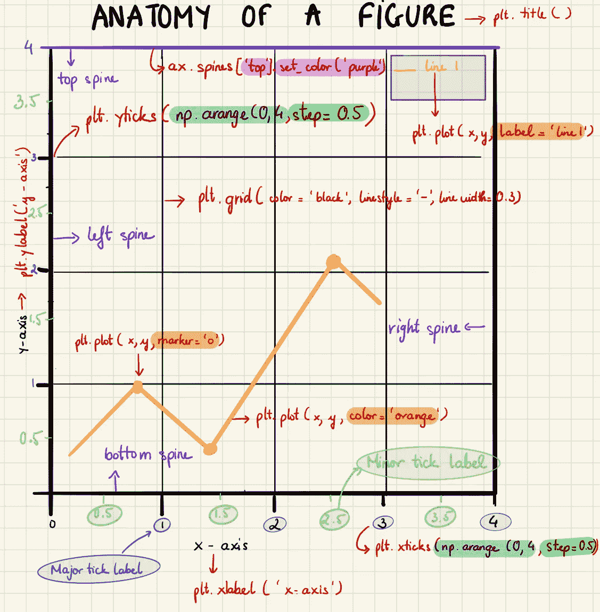

人物剖析(作者图片)

一个**图**包含发生绘图的整个窗口。

**轴:**就是我们一般认为的剧情。每个轴都有一个标题、一个 x 标签和一个 y 标签。

注意:我们可以在一个图形中有多个轴，这有助于构建多个图。

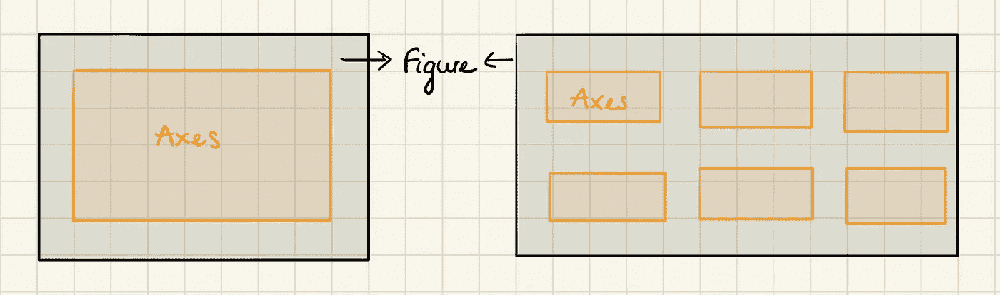

一个图形中可以有多个轴，这有助于构建多个图。(图片由作者提供)

**轴**是类似数字线的对象，有助于生成图形界限。每个轴都有一个 x 轴和 y 轴用于绘图。

**记号**是表示轴上数据点的标记，即用来表示坐标轴上特定点的值。这些值可以是数字或字符串。每当我们绘制图形时，轴会调整并采用默认刻度。Matplotlib 的默认刻度在一般情况下足够了，但绝不是对每个图都是最佳的。

一个图的**脊线**就是这个图的边。它连接轴刻度线并标注数据区的边界。

# 从 Pyplot 开始

Pyplot 是 Matplotlib 的一个模块，它提供了简单的功能来添加绘图元素，如线条、图像、文本等。当前图形中的当前轴。

首先，我们设置了用于绘制和导入我们将使用的包的笔记本:

```
import numpy as np
import matplotlib.pyplot as plt
plt.style.use('seaborn-whitegrid') # Set the aesthetic style of the plots
```

可以按如下方式创建图形和轴:

```
fig, ax = plt.subplots()print(type(fig))
print(type(ax))
```

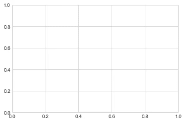

创建图形和轴

我们通常使用变量名`fig`来指代一个图形实例，使用`ax`来指代一个轴实例或一组轴实例。

一旦我们创建了一个轴，我们可以使用`plt.plot`功能来绘制一些数据。先说一个简单的情节。也许所有图形中最简单的是单个函数`y = 2x`的可视化。

```
fig, ax = plt.subplots()
x = np.random.randint(1,10, size=10)
y = 2*x 
plt.plot(x,y) # same as ax.plot(x,y)
plt.show()
```

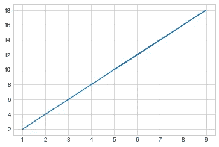

y=2x

如果我们想用多行创建一个图形，我们可以简单地多次调用`plot`函数:

```
# Multiple lines
fig, ax = plt.subplots()
x = np.random.randint(1,10, size=10)
y = 2*x 
plt.plot(x,y)
plt.plot(x,x+3)
plt.show()
```

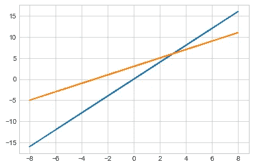

多行

## 线条颜色和样式

`plt.plot()`函数接受可用于指定线条颜色和样式的附加参数。为了进行调整，我们可以使用`color` `linestyle`关键字，它接受一个表示几乎任何可以想象的颜色/样式的字符串参数。可以通过多种方式指定颜色和样式:

```
fig, ax = plt.subplots()
x = np.linspace(0,10,1000)
y = 2*x# set of default color and style
plt.plot(x, np.cos(x))# RGB tuple, values 0 to 1, solid style
plt.plot(x, np.sin(x), color=(1.0,0.2,0.3),linestyle='-')# specify color by name, dashed style
plt.plot(x, y, color='blue', linestyle='--')# short color code (rgbcmyk), dotted style   
plt.plot(x, x+3, color='g',linestyle=':')# Grayscale between 0 and 1, dashdot style    
plt.plot(x, np.log(x), color='0.75',linestyle='-.')# Hex code (RRGGBB from 00 to FF), dashed style  
plt.plot(x, x, color='#FFDD44',linestyle='--')
```

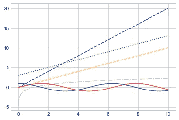

颜色和样式

## 轴限制

Matplotlib 在为我们的绘图选择默认轴限制方面做得很好，但有时更好的控制也不错。调整轴极限的最基本方法是使用`plt.xlim()`和`plt.ylim()`方法:

```
plt.xlim(0, 11)
plt.ylim(-1.5, 10)
```

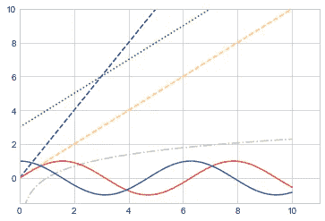

设置限制

## 标签图

作为本节的最后一部分，我们将简要地看一下图的标签:标题、轴标签和简单的图例。

```
plt.plot(x, np.sin(x), label='y=sin(x)')
plt.plot(x,np.cos(x), label='y=cos(x)')
plt.title('Sine and Cosine Functions ')
plt.xlabel("x-axis")
plt.ylabel("y-axis")
plt.legend() # Describing the element of the graph
plt.show()
```

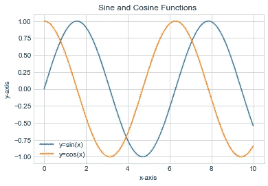

给图标上标签

# 地块类型

使用 python Matplotlib 可以创建各种绘图。在本节中，我们将讨论最常用的数据可视化图。

我们使用来自 [Kaggle](https://www.kaggle.com/unsdsn/world-happiness) 的[世界幸福报告](https://worldhappiness.report/)数据集。我清理了数据，将所有文件合并到`happiness_rank.csv`文件中。您可以下载并清理数据，或者只需在此处下载最终结果。我推荐你在 [Github](https://github.com/Nothingaholic/The-World-of-Happiness/blob/master/MLR.ipynb) 上查看我的数据清理代码。

# 散点图

散点图是一种常用于统计和数据科学的图表。它由跨两个轴绘制的多个数据点组成。散点图中描绘的每个变量都有多个观察值。每当我们想要查看两组数据之间是否有任何关系时，这是一种非常有用的图表类型。

## 何时使用散点图

我们使用散点图来确定数据与每个变量的关系(即相关性或趋势模式)。)它还有助于检测图中的异常值。

在机器学习中，散点图常用于回归，其中 x 和 y 是连续变量。它们也用于聚类分散点或离群点检测。

## 何时避免散点图

如果我们对观察时间模式感兴趣，散点图是不合适的。

散点图用于数字数据或数字。因此，如果我们有三个部门、五个产品等类别，散点图不会揭示太多。

## Python 实现

```
fig, ax = plt.subplots(figsize = (12,6))
x = df['GDP']
y = df['Score']
plt.scatter(x,y)
plt.title('GDP vs Happiness Score')
plt.xlabel('GDP')
plt.ylabel('Score')
```

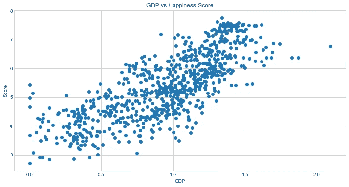

散点图

**三维散点图**

3D 散点图有助于在三维图中显示三个数值变量。

```
from mpl_toolkits.mplot3d import Axes3D
fig = plt.figure(figsize=(10,6))
ax = fig.add_subplot(111, projection='3d')
ax.scatter(df['Year'],df['GDP'],df['Score'], s=30)
ax.set( xlabel='Year', ylabel='GDP',zlabel='Score')
plt.xticks(np.arange(2015,2020,step =1))
plt.show()
```

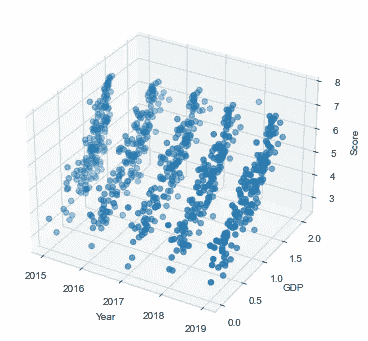

三维散点图

**散点图，带有最佳拟合的线性回归线**

我们将使用`LinearRegression`用 Scikit-learn 实现线性回归。创建线性回归对象后，我们可以通过调用 fit 方法来获得最适合我们的数据的直线。

```
x = df['GDP'].values.reshape(-1,1).astype('float32')
y = df['Score'].values.reshape(-1,1).astype('float32')# Split the data to train and test data
X_train, X_test, y_train, y_test = train_test_split(x, y, test_size=0.2, random_state=0)# Apply Linear Regression Algorithms
h = LinearRegression()  
h.fit(X_train,y_train)y_pred = h.predict(X_test)fig,(ax1) = plt.subplots(1, figsize = (12,6))
ax1.scatter (X_test, y_test, s = 8)
plt.plot(X_test,y_pred, color = 'black', linewidth = 2)
plt.show()
```

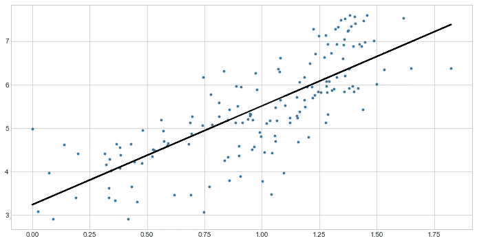

带有最佳拟合线性回归线的散点图

# 分叉棒线

发散条形图是一种条形图，其中某些维成员的标记指向上方或右侧，而其他维成员的标记指向相反的方向(分别为下方或左侧)。

N 注:

*   向下或向左流动的标记不一定代表负值。
*   发散线可以表示零，但也可以用于简单地分隔二维成员的标记。

## **何时使用分叉棒线**

我们使用分叉棒线来查看项目如何基于单个指标变化，并直观显示这种变化的顺序和数量。如果我们的主要目标是比较每个维度成员的趋势，那么发散条形图是一个不错的选择。

## 何时避免分叉棒线

使用发散条形图的缺点是不像使用分组条形图那样容易比较维成员之间的值。

## Python 实现

我们仅以 2019 年的数据为例。

```
# Data processing
top_economies = ['United States', 'China','Japan', 'Germany','United Kingdom','India', 'France','Brazil', 'Canada']
df_top = df_19[(df_19['Country'].isin(top_economies))].sort_values(['Country'])
df_top.reset_index(drop=True)x = df_top.loc[:, ['Score']]
df_top['Score_z'] = (x - x.mean())/x.std()
df_top['colors'] = ['red' if x < 0 else 'blue' for x in df_top['Score_z']]
df_top.sort_values('Score_z', inplace=True)
df_top.reset_index(inplace=True)# Draw plot
plt.figure(figsize=(8,6), dpi= 50)
plt.hlines(y=df_top.index, xmin=0, xmax=df_top.Score_z, color=df_top.colors, alpha=0.5, linewidth=20)# Decorations
plt.gca().set(ylabel='Country', xlabel='Happiness_Score')
plt.yticks(df_top.index, df_top.Country, fontsize=15)
plt.title('Happiness Score for Top Economies in 2019', fontdict={'size':20})
plt.grid(linestyle='--', alpha=0.5)
plt.show()
```

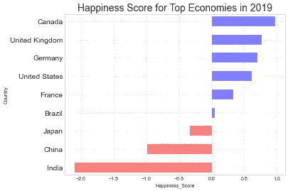

# 对比图

面积图的概念是基于折线图。彩色区域向我们展示了每个变量随时间的发展。

面积图有三种类型:常规面积图、堆积面积图和百分比堆积面积图。

## 何时使用面积图

我们用面积图来显示一个完整的部分是如何随时间变化的。例如，幸福分数有六个生成分区；我们希望看到每个分部的贡献。

此外，如果我们感兴趣的是每个分部产生的部分，而不是分部本身的总量，我们可以使用 100%堆积面积图。这将显示一段时间内每个部门的百分比贡献。

## 何时避免面积图

如果我们想比较不同股票的大小，面积图不是最好的选择。如果你想证明一股超越了另一股；或者，如果我们的值之间的差异非常小，考虑折线图。

**Python 实现**

```
# Regular Area Chart
# Create data
x = df_top['Score']
y = df_top['GDP']# Change the color and its transparency
plt.fill_between( x, y, color="skyblue", alpha=0.2)
plt.xlabel('Score')
plt.ylabel('GDP')
plt.plot(x, y, color="Slateblue", alpha=0.6)
```

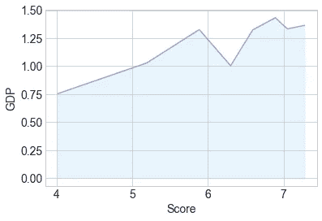

规则面积图

```
# Stacked Area Chart
plt.stackplot(df_top.index,
              [df_top['GDP'], df_top['Health'],
               df_top['Support'], df_top['Freedom']],
              df_top['Generosity'], df_top['Corruption'],
              labels=['GDP', 'Health', 'Support', 'Freedom','Generosity','Corruption'],
              alpha=0.8)plt.legend(loc=2, fontsize='large')
plt.show()
```

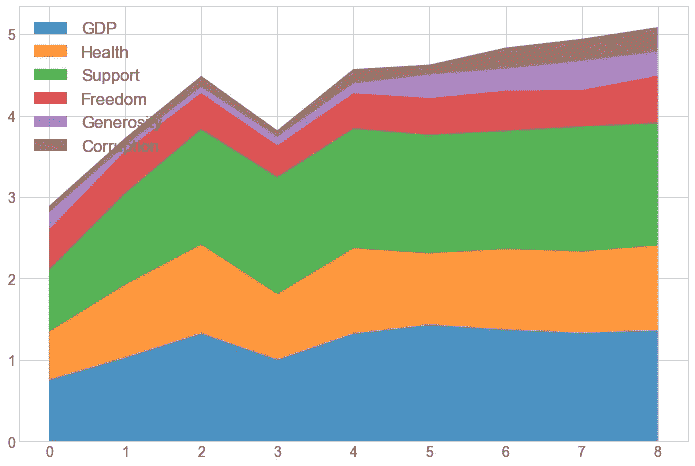

堆积面积图

```
# 100% Stacked Area Chart
data_perc = df_top[['GDP', 'Health', 'Support', 'Freedom','Generosity','Corruption']]
data_perc = data_perc.divide(data_perc.sum(axis=1), axis=0)plt.stackplot(data_perc.index,
              [data_perc['GDP'], data_perc['Health'],
               data_perc['Support'], data_perc['Freedom']],
              data_perc['Generosity'], data_perc['Corruption'],
              labels=['GDP', 'Health', 'Support', 'Freedom','Generosity','Corruption'],
              alpha=0.8)plt.legend(loc=2, fontsize='large')
plt.show()
```

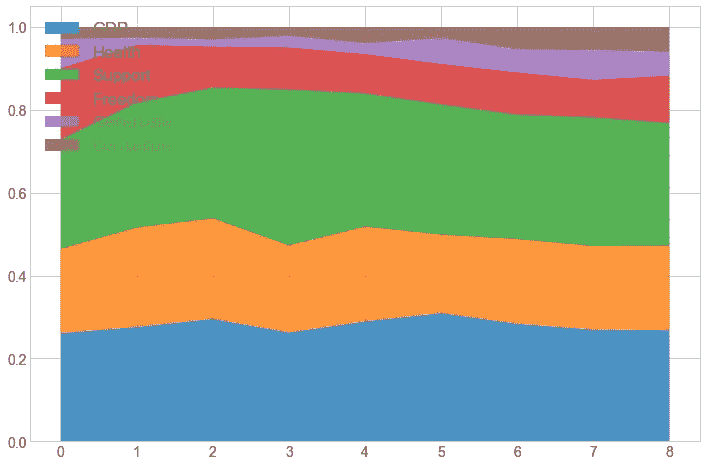

百分比堆积面积图

# 条形图

条形图是最常用的图表类型之一。顾名思义，条形图是由一系列显示变量发展的条形组成的。

条形图有四种类型:常规条形图、水平条形图、组条形图和堆积条形图。

## 何时使用条形图

当我们想要跟踪一个或两个变量随时间的发展时，条形图非常有用。图表的一个轴显示正在比较的特定类别，另一个轴代表测量值。

## 何时避免条形图

当我们有一个变量的单周期分解时，简单的条形图是不合适的。例如，如果我想描绘对公司收入有贡献的主要业务线，我不会使用条形图。相反，我会创建一个饼图或其变体。

## `Python Implementation`

```
# Bar Chartcountries = ['United States','Japan', 'Germany','Brazil', 'India']
y_pos = np.arange(len(countries))
data = df_19[(df_19['Country'].isin(countries))].sort_values(['Country'])
data.sort_values('GDP', inplace=True)
data.reset_index(drop=True)plt.bar(y_pos, data['GDP'], align='center', alpha=0.5)
plt.xticks(y_pos, data['Country'])
plt.ylabel('GDP')
plt.title('Bar Chart')
plt.show()
```

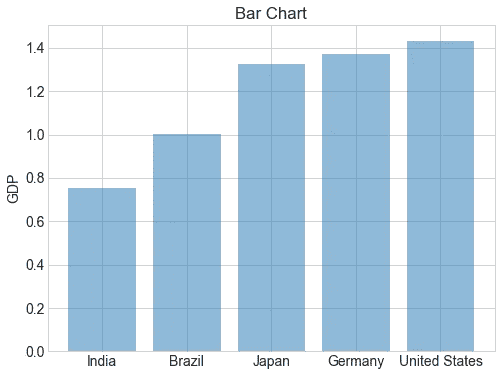

条形图

```
# Horizontal bar chartdf_19[(df_19['Country'].isin(countries))].sort_values(['Country'])
data.sort_values('Score', inplace=True)
data.reset_index(drop=True)plt.barh(y_pos, data['Score'], align='center', alpha=0.5)
plt.yticks(y_pos, data['Country'])
plt.xlabel('Score')
plt.title('Horizontal Bar Chart')
plt.show()
```

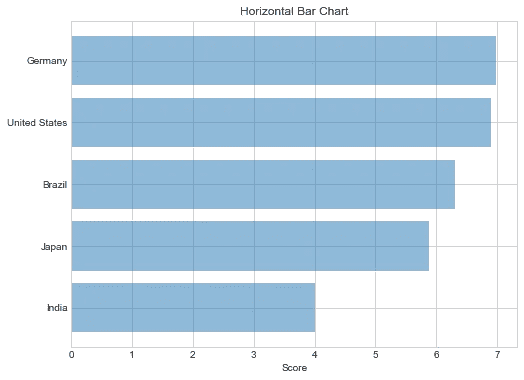

```
# Group bar chart
index = np.arange(5)
width = 0.35fig, ax = plt.subplots(figsize=(9, 6))
rects1 = ax.bar(index - width / 2, data['GDP'],
                width, color='#1f77b4', alpha=0.5)
rects2 = ax.bar(index + width / 2, data['Health'],
                width, color='#1f77b4')
plt.xticks(index, gdp['Country'])
plt.legend((rects1[0], rects2[0]), ('GDP', 'Health'))plt.show()
```

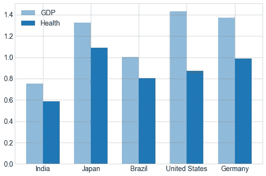

组条形图

```
# Stacked bar chart
fig = plt.figure(figsize=(14,10))
rect1 = plt.bar(np.arange(5), data['Support'],
                width=0.5, color='lightblue')
rect2 = plt.bar(np.arange(5), data['Freedom'],
                width=0.5, color='#1f77b4')
plt.xticks(index, data['Country'])
plt.legend((rect1[0], rect2[0]), ('Support', 'Freedom'))plt.show()
```

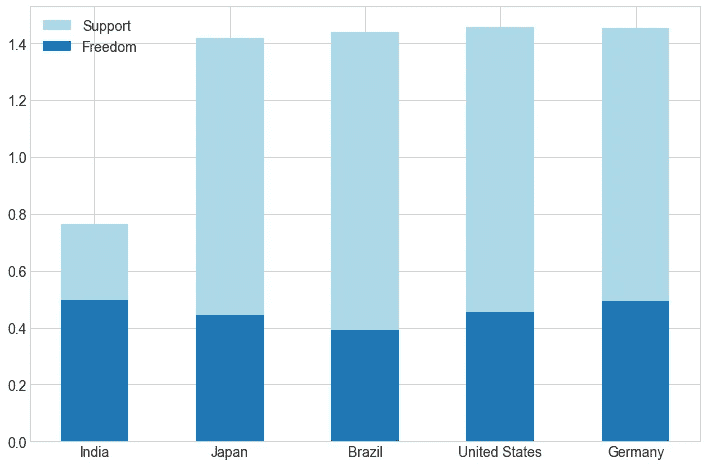

堆积条形图

# 棒棒糖图表

棒棒糖图以一种视觉愉悦的方式提供了与有序条形图相似的用途。我们使用棒棒糖图来显示一个数值变量和另一个数值变量或分类变量之间的关系。

## 何时使用棒棒糖图表

如果我们要处理大量的值，并且这些值都很高，例如在 80–90%的范围内(100%之外)，棒棒糖图通常被认为比普通的条形图有用。那么一大套高大的柱子就可以在视觉上咄咄逼人。

## 何时避免棒棒糖图表

如果我们的数据中有长度非常相似的未分类棒棒糖——比较两个非常相似的棒棒糖的长度比比较标准棒棒糖的长度更困难。

**Python 实现**

```
(markerline, stemlines, baseline) = plt.stem(data['Country'],
                                             data['GDP'])
plt.setp(markerline, marker='o', markersize=15,
         markeredgewidth=2, color='lightblue')
plt.setp(stemlines, color='lightblue')
plt.setp(baseline, visible=False)plt.tick_params(labelsize=12)
plt.ylabel('GDP', size=12)
plt.ylim(bottom=0)plt.show()
```

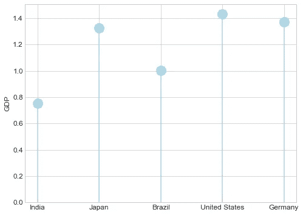

棒棒糖图表

# 柱状图

直方图是描述一组数据分布的垂直条形图。直方图用于显示变量的分布，而条形图用于比较变量。直方图绘制定量数据，将数据范围分组为箱或区间，而条形图绘制分类数据。

N 注意:条形图在列之间有间隔，而直方图没有。

当我们想要显示我们正在处理的数据的分布时，直方图非常有用。这允许我们将连续数据分组到箱中，从而提供观察集中的有用表示。

**Python 实现**

```
# Histogram
fig = plt.figure(figsize=(8,6))
plt.hist(df_19['Corruption'], bins=6, density=True)
plt.grid(alpha=0.2)
plt.show()
```

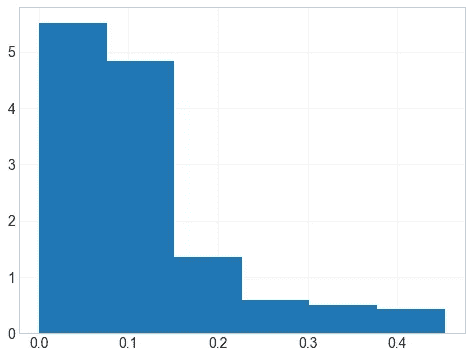

# 箱形图(须状图)

箱形图或须状图是一种总结一组区间尺度上测量的数据的方法。这种类型的图形用于显示分布的形状、中心值及其可变性。

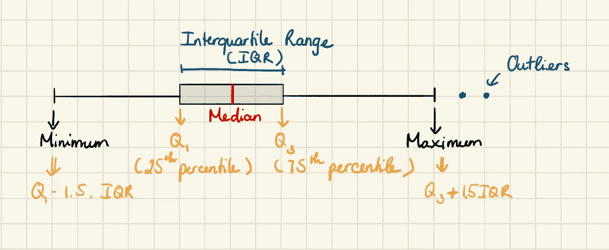

箱线图(图片由作者提供)

## 何时使用箱线图

我们在解释性数据分析中使用箱线图，表明分布是否偏斜，以及数据集中是否存在潜在的异常观察值(异常值)。

当涉及到大量的观察数据和比较两个或多个数据集时，箱线图也非常有用。

## 何时避免盒状图

箱线图不像茎和叶图或直方图那样详细地显示分布。

## Python 实现

假设我们有一个包含 2020 年前六个月媒体成员阅读文章数量的数据集。

```
# Create dataset
user_1 = [10, 3, 15, 21, 17, 14]
user_2 = [5, 13, 10, 7, 9, 12]
data = [user_1, user_2]
fig = plt.figure(figsize =(8, 6)) 

# Create axes instance 
ax = fig.add_axes([0, 0, 1, 1]) 

# Create plot 
bp = ax.boxplot(data) 

# Show plot 
plt.xticks([1,2],['user_1','user_2'])
plt.show()
```

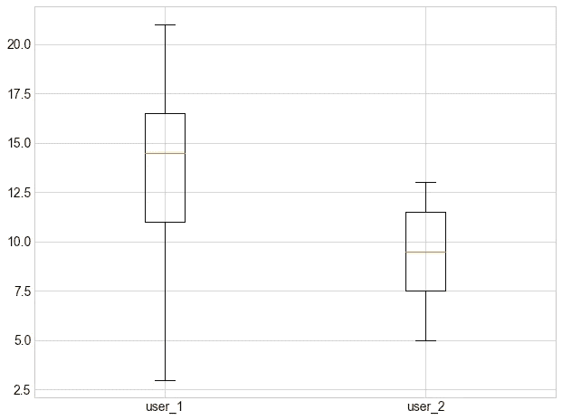

箱形图

# 饼图

饼图是显示群体构成的经典方式。饼图是一个分成若干部分的圆形图。一块越大，它所代表的总量就越大。

然而，现在一般不建议使用，因为饼图部分的面积有时会产生误导。因此，在使用饼图时，强烈建议明确写下饼图每个部分的百分比或数字。

## 何时使用饼图

饼图最适合描绘整体的各个部分。

## 何时避免饼图

当我们想要显示一个或多个变量如何随时间发展时，我们不能使用饼图。

## Python 实现

假设我们有一个包含中等成员信息的数据集。我们希望看到 2020 年前六个月的文章阅读率。

```
# Pie Chart
fig = plt.figure(figsize=(8,8))
labels = 'Jan', 'Feb', 'March', 'April', 'May', 'June'
user_1 = [10, 3, 15, 21, 17, 14]
p = plt.pie(user_1, labels=labels, explode=(0.07, 0, 0, 0, 0, 0),
            autopct='%1.1f%%', startangle=130, shadow=True)
plt.axis('equal')for i, (Jan, Feb, March, April, May, June) in enumerate(p):
    if i > 0:
        Jan.set_fontsize(12)
        Feb.set_fontsize(12)
        March.set_fontsize(12)
        April.set_fontsize(12)
        May.set_fontsize(12)
        June.set_fontsize(12)
plt.show()
```

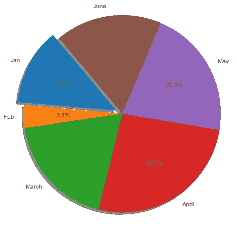

# 树形图

树状图类似于饼状图，它在不误导每个小组的贡献的情况下工作得更好。树形图允许我们将整体的总和分成层次，然后显示每个层次的内部分解。

## 何时使用树形图

树形图通常用于销售数据，因为它们捕获数据类别的相对大小，允许对一个类别内以及多个类别之间的相似性和异常性进行快速、高层次的总结。

## 何时避免树形图

当我们的数据不能分成类别和子类别时，树形图就不适合了。

此外，当我们用颜色的面积和强度对数据进行编码时，我们的眼睛并不能很好地察觉这些维度中相对较小的差异。如果我们的数据是这样的，我们的受众需要在类别之间进行精确的比较，当类别没有与公共基线对齐时，就更加麻烦了。我们不应该让我们的观众做不必要的工作来理解一个图表！

## Python 实现

例如，我们使用一个树形图来显示本月的新用户和文章浏览量。

```
import squarify
fig = plt.figure(figsize=(10,10))
articles = [17, 22, 35, 41, 5, 12, 47]
labels = ['User_1:\n 17 articles',
          'User_2:\n 22 articles',
          'User_3:\n 35 articles',
          'User_4:\n 41 articles',
          'User_5:\n 5 articles',
          'User_6:\n 12 articles',
          'User_7:\n 47 articles']color_list = ['#0f7216', '#b2790c', '#ffe9a3',
              '#f9d4d4', '#d35158', '#ea3033']
plt.rc('font', size=14)        
squarify.plot(sizes=articles, label=labels,
              color=color_list, alpha=0.7)plt.axis('off')plt.show()
```

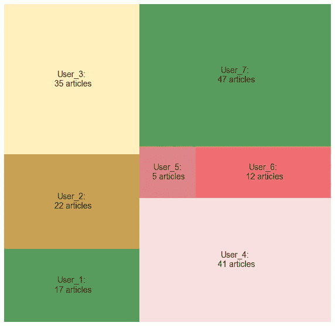

# 时间序列图

时序图可用于直观显示计数或数值随时间变化的趋势。因为日期和时间信息是连续的分类数据(表示为值的范围)，所以点沿着 x 轴绘制，并由连续的线连接。

时间序列分析的目标是发现数据中的模式，并使用数据进行预测。时序图可以回答关于我们的数据的问题，例如:趋势如何随时间变化？

## Python 实现

```
# Time Series Plot
plt.figure(figsize=(8,6))
ts = pd.Series(np.random.randn(100), index = pd.date_range( 
                                '1/1/2020', periods = 100)) 
# Return the cumulative sum of the elements.
ts = ts.cumsum() 
ts.plot() 
plt.show()
```

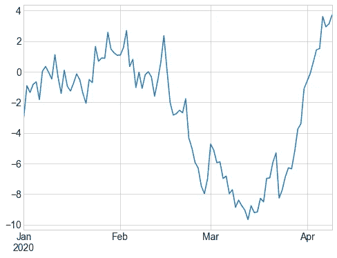

时间序列

本笔记中的代码可在 [Github](https://github.com/Nothingaholic/Python-Cheat-Sheet/blob/master/matplotlib/matplotlib.ipynb) 上获得。

# 就是这样！

在本笔记中，我们学习了如何使用 Matplotlib 构建数据可视化绘图。我们现在可以很容易地构建图表，通过可视化直观地理解我们的数据。

学习愉快！


来源: [xkcd](https://xkcd.com/539/)

# 资源:

我的笔记涵盖了所有我认为是 Matplotlib 的基本必需品。掌握一项技能需要几个月，有时几年，所以，不要停止学习！如果你渴望了解更多关于 Matplotlib 的知识，从下面的链接开始吧。

1.  [定制勾](https://jakevdp.github.io/PythonDataScienceHandbook/04.10-customizing-ticks.html) s
2.  [Matplotlib 教程](https://www.tutorialspoint.com/matplotlib/index.htm)
3.  [Matplotlib 图库](https://matplotlib.org/3.1.1/gallery/index.html)
4.  [Matplotlib 用户指南](https://matplotlib.org/3.2.2/users/index.html)