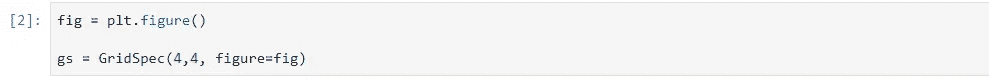
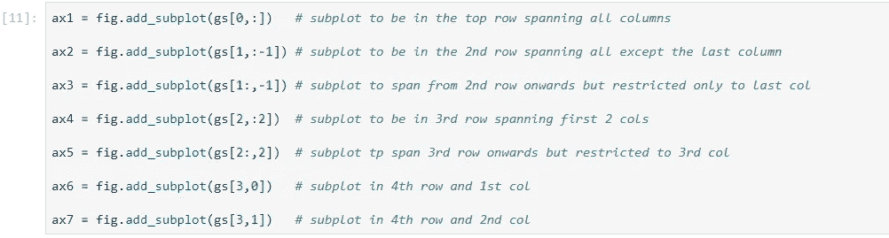
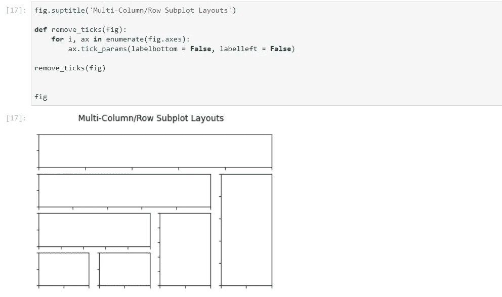

# Matplotlib 多列、多行布局

> 原文：<https://towardsdatascience.com/matplotlib-multi-column-row-spanning-layouts-f026eb7c3c27?source=collection_archive---------42----------------------->

## ..超越支线剧情中的标准网格布局

图片由 [Gerd Altmann](https://pixabay.com/users/geralt-9301/?utm_source=link-attribution&utm_medium=referral&utm_campaign=image&utm_content=663997) 提供，来自 [Pixabay](https://pixabay.com/?utm_source=link-attribution&utm_medium=referral&utm_campaign=image&utm_content=663997)

对于 Python 中的可视化来说，Matplotlib 库是相当长一段时间以来的主力。即使在更灵活、代码接口更简单、功能更强大的竞争对手(如 seaborn、plotly、bokeh 等)之后，它也保持了自己的优势。已经到达现场。尽管 Matplotlib 可能缺乏新用户的交互能力，但它在探索性数据分析(EDA)中将我们的数据探索任务可视化方面做得绰绰有余。

在 EDA 过程中，我们可能会遇到这样的情况，我们希望显示一组相关的图，作为一个更大的图片的一部分，以推动我们的洞察力。matplotlib 的`subplot`函数为我们完成了这项工作。然而，在某些情况下，我们可能想要组合几个支线剧情，并希望每个支线剧情有不同的长宽比。我们怎样才能实现这种布局，其中，本质上一些支线剧情跨越了整个图形的几行/几列？

进入 Matplotlib 的`gridspec`子模块。

我们首先需要创建一个`GridSpec`的实例，它允许我们在整个图中指定行数和列数作为参数，以及一个`figure`对象。

我们将`GridSpec`实例存储在一个名为`gs`的变量中，并指定我们希望在整个图形中有 4 行 4 列。

现在，我们需要指定每个子情节如何跨越整个图中的行和列的细节。在纸上画一个草图是很有用的，这样你就可以知道如何安排支线剧情，这样它们就不会重叠。一旦完成，我们就通过我们创建的`GridSpec`对象传递这个信息。行/列跨度信息以相同的索引符号传递，我们使用该符号对数组/数据帧进行子集化，行和列的索引号从零开始，并使用`:`指定范围。带有索引的`GridSpec`对象被传递给`figure`对象的`add_subplot`函数。

我们为该图添加了一个总标题，并删除了勾号，以便更好地可视化布局，因为这里的目标是演示我们如何实现跨越多行/多列的支线剧情。当你实现这个的时候，很明显你会想要添加你的轴刻度，标签等等。并调整间距和图形大小以适应这些绘图元素。

嘣！这在多变量时间序列图中可能会很方便，在这种情况下，我们可能希望在顶行显示跨列的时间序列图，并在下面的其他子图中显示其他单变量、多变量可视化。你可以自定义拼图的外观，方法是在整体图形中指定你的行/列，以及各个支线剧情的跨度。

在 R 中，用一行代码中的`patchwork`包实现上述目标非常简单，除了`+`和`/`操作符和`( )`，如果你想发疯的话，甚至可以嵌套支线剧情。点击下面的链接，看看如何在 r。

 [## 拼凑——下一代 ggplots

### 进一步扩展 ggplot2 的多功能性..

towardsdatascience.com](/patchwork-the-next-generation-of-ggplots-1fcad5d2ba8a) 

感谢阅读。如果你喜欢这篇文章，你可能也会喜欢下面这篇关于如何用最少的代码行实现最大输出的文章。

 [## 使用 SmartEDA 开发的 EDA

### 探索性数据分析——更智能、更快速的方式..

towardsdatascience.com](/eda-in-r-with-smarteda-eae12f2c6094) 

希望听到您的反馈和意见。谢谢！