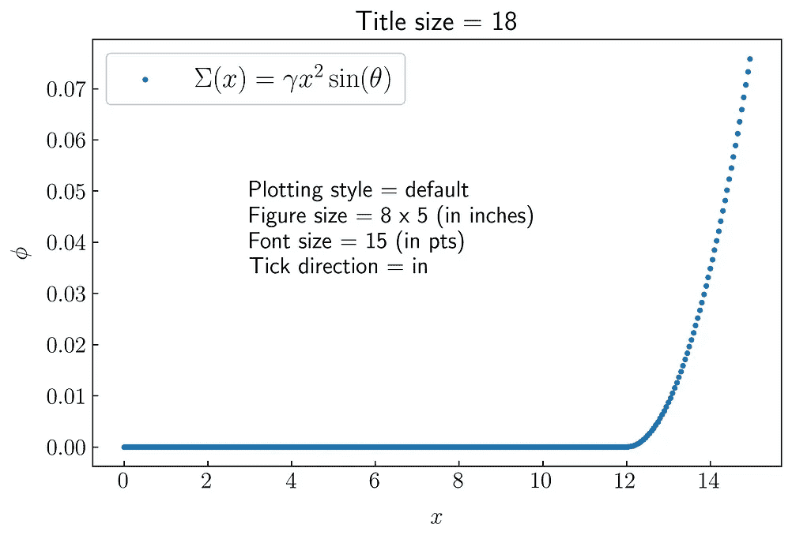
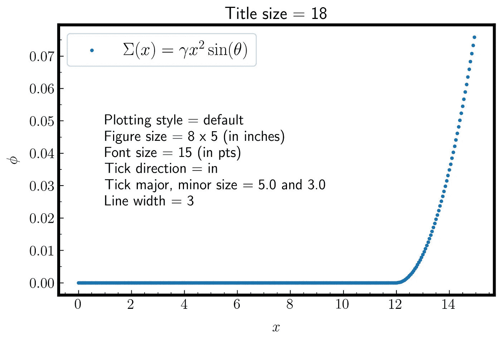

# 用于科学绘图的 Matplotlib 样式

> 原文：<https://towardsdatascience.com/matplotlib-styles-for-scientific-plotting-d023f74515b4?source=collection_archive---------6----------------------->


由[莱斯利·克罗斯](https://unsplash.com/@crossingtheline?utm_source=medium&utm_medium=referral)在 [Unsplash](https://unsplash.com?utm_source=medium&utm_medium=referral) 拍摄的照片

## MATPLOTLIB 简介

## 为您的科学数据可视化定制 Matplotlib

写这个故事至少有两个灵感。第一个灵感来自我参加的星系和宇宙学暑期学校(SSGC 2020)。它有三个部分:公开讲座，讲座和研讨会。其中一个研讨会使用 Oguri 等人(2012 年)作为主要参考，分析了弱引力透镜现象。Oguri-san 给了参与者他的代码来分析透镜，包括 Maptlotlib 参数设置。我就不说引力透镜了，而是说如何用 Matplotlib 生成一个专业的图，就像小谷三论文里说的那样。

另一个来自于我在阅读[总说明](https://academic.oup.com/mnras/pages/General_Instructions)时向皇家天文学会*月报 [MNRAS](https://academic.oup.com/mnras) 提交的一篇文章，这是世界领先的天文学和天体物理学的主要研究期刊之一。说明书中有一部分是如何在 MNRAS 中嵌入数字。建议作者确保他们的图片中使用的颜色是色盲友好的。在这里，我引用说明。*

> 在可能的情况下，请确保您的数字是色盲友好的。在同一张图中使用红色和绿色对一些读者来说尤其成问题(来自 MNRAS 的一般说明)

我对这个指令感到惊讶。我没有意识到我们需要在我的图/图中提供色盲友好，因为我对颜色没有问题。在理解它之后，我建议你(所有的读者)在你的图形/情节中执行色盲友好。我将在下一部分解释更多关于色盲的内容。

## 主要目标

这个故事将指导你如何:

1.  使用绘图样式和 rcParams 自定义 Matplotlib 参数
2.  选择色盲友好

这个故事对于提高数据可视化技能的你来说意义重大，因为我将分享如何基于前面提到的主要目标生成专业的绘图。那么，我们开始吧。

## 1 .自定义 Matplotlib 绘图风格

Matplotlib 为用户提供了自定义绘图样式的样式包。如果您不改变样式，您将得到一个默认的样式，如图 1 所示。


**图一。**Matplotlib 中默认的绘图风格(图片由作者/ Rizky MN 提供)。

默认情况下，背景颜色是白色，绘图的第一种颜色是蓝色。您可以使用 ***样式*** 语法来更改它，如下面的代码所示。

```
import matplotlib as plt
plt.style.use('fivethirtyeight') # fivethirtyeight is name of style
```

应用它之后，您将得到如图 2 所示的结果。


**图二。**Matplotlib 中的绘图风格 **fivethirtyeight** (图片作者/ Rizky MN)。

我觉得这很酷。其他款式怎么样？Matplotlib 提供了多少样式？你可以用这个代码来检查。

```
print(plt.style.available)
```

您将获得 Matplotlib 提供的所有可用样式，如图 3 所示。


**图三。**Matplotlib 中的绘图风格(图片由作者/ Rizky MN 提供)。

你会数数吗？:d .在 Matplotlib 中有 26 种不同的样式可以使用。我已经使用所有的绘图样式生成了绘图，但是我将只向您展示其中的四种，如图 4 所示。


**图 4。**Matplotlib 中的两种出图风格( **seaborn** 和**gg plot**)(图片作者/ Rizky MN)。

建议你检查一下 Matplotlib 中所有的绘图样式，选择你喜欢的样式，并将其设为你的默认样式。如果您想要重置绘图样式，可以使用此代码。

```
plt.style.use('default')
```

## 1.b 使用 rcParams 自定义 Matplotlib 参数

回到这个故事的灵感，我将展示 Oguri-san 在他的论文中使用的图形示例，如图 5 所示。


**图 5。**两个数字的例子见[小谷等人(2012)](https://academic.oup.com/mnras/article/420/4/3213/973116)

使用 rcParams 自定义 Matplotlib 参数我将在 Matplotlib 中使用 rcParams 与您分享七个设置。它们是使用 LaTeX 字体、自定义字体大小、调整图例文本长度、自定义轴线宽度、更改 x 轴和 y 轴刻度方向，最后是调整 x 轴和 y 轴刻度的主要和次要大小。我们一个一个来讨论吧。

*   **使用乳胶字体**

如图 5 所示，Oguri-san 使用 LaTeX 进行绘图。对于许多人来说，他们需要一些被 Matplotlib 隐藏的特殊符号。在 Matplotlib 中，LaTeX 字体在默认情况下是禁用的。要激活它，您可以使用此代码。

```
plt.rcParams['text.usetex'] = True
```

你可以点击这个链接访问我的另一个故事，它解释了更多关于在 Matplotlib 中使用 LaTeX 字体的细节。

[](/5-powerful-tricks-to-visualize-your-data-with-matplotlib-16bc33747e05) [## 使用 Matplotlib 可视化数据的 5 个强大技巧

### 如何使用 LaTeX 字体，创建缩放效果，发件箱图例，连续错误，以及调整框填充边距

towardsdatascience.com](/5-powerful-tricks-to-visualize-your-data-with-matplotlib-16bc33747e05) 

如果我在图 4 中应用 LaTeX 字体，我将得到不同的结果，如图 6 所示。您可以比较图 4 和图 6 中的标题、轴、刻度和文本中使用的字体。


**图 6。**在 **seaborn** 和**gg plot**绘图风格中应用 LaTeX 字体(图片由作者/ Rizky MN 提供)。

*   **调整字体大小**

您可以使用此代码调整字体大小。

```
plt.rcParams[‘font.size’] = 15
```

Matplotlib 给你 10，以磅为单位，作为默认字体大小。在上面的代码中，我将它从 10 点改为 18 点。参数 font.size 控制所有文本大小，包括标题、x 轴和 y 轴标签、x 轴和 y 轴刻度、图例、文本和注释。您可以使用另一个代码来更改每个元素(例如，标题)的字体大小。例如，您想将所有文本大小调整为 18，但图例将为 20。你可以用这个代码来调整。

```
plt.rcParams[‘font.size’] = 15
plt.rcParams['legend.fontsize'] = 18
```

即使您有相同的字体大小，如果您声明了不同的图形大小，您也会得到不同的字体大小表示。这种情况如图 7 所示。


**图 7。**相似字体大小在不同图形大小中的不同表现(图片由作者/ Rizky MN 提供)。

图 7 中两个图之间的差异来自于以 pts 为单位的字体大小的校准。

*   **改变 x 轴和 y 轴的刻度方向**

如果您更详细地查看 Oguri-san 图(图 5 ),您会看到 x 轴和 y 轴上的刻度方向是在轴内，而不是在轴外。可以对比一下图 5 和图 7，特别是在 tick 方向。

默认情况下，记号的方向(x 轴和 y 轴)在轴上。您可以通过键入以下代码来更改它。

```
plt.rcParams['xtick.direction'] = 'out'
plt.rcParams['ytick.direction'] = 'out'
```

有三个选项可供使用:in、out 和 inout。您可以在图 8 中看到它们的不同结果。



**图 8。**Matplotlib 中的 Tick 方向设置(图片作者/ Rizky MN)。

*   **调整主要和次要刻度大小**

在图 8 中，我认为你看不出三个图之间的区别，因为分笔成交点的尺寸太小了。怎么把它做大？您可以使用此代码对 x 轴和 y 轴进行更改。

```
plt.rcParams['xtick.major.size'] = 5.0
plt.rcParams['xtick.minor.size'] = 3.0plt.rcParams['ytick.major.size'] = 5.0
plt.rcParams['ytick.minor.size'] = 3.0
```

Matplotlib 给出的 xtick 和 ytick 主要大小为 3.5，次要大小为 2.0。要显示次要刻度，可以使用以下代码。

```
from matplotlib.ticker import MultipleLocatorax.xaxis.set_minor_locator(MultipleLocator(.5))
ax.yaxis.set_minor_locator(MultipleLocator(.005))
```

当然，你需要定义*的使用*

```
*fig, ax = plt.subplots(figsize=(xsize, ysize))*
```

*或者*

```
*ax = plt.gca()*
```

*下面是配置次要刻度的代码*

*配置主要和次要刻度的代码。*

*如果您运行代码，您将得到一个图，如图 9 所示。*

**

***图九。**调整 Matplotlib 中的大小刻度(图片作者/ Rizky MN)。*

*   ***调整线宽***

*在这一部分，我将与你分享如何调整轴的线宽。你可以用这个代码来调整。*

```
*plt.rcParams['axes.linewidth'] = 3.0*
```

*默认情况下，线宽设置为 0.8，以磅为单位。我在 3.0 设置的，感受一下默认设置和更新版本的区别。如果您添加上面图 9 中的代码，它将给出如图 10 所示的结果。*

**

***图 10。**在 Matplotlib 中调整线宽(图片作者/ Rizky MN)。*

*如图 10 所示，现在次刻度不可见，因为次刻度的大小小于线宽。*

*   ***调节手柄长度***

*在最后一部分中，我将演示如何调整句柄长度以及文本图例与其符号之间的距离。我想如果您运行下面的代码并分析结果，您会知道更多，如图 11 所示。*

```
*plt.rcParams['legend.handlelength'] = 5.0*
```

**

***图 11。**在 Matplotlib 中调整图例句柄长度(图片由作者/ Rizky MN 提供)。*

*您可以在图例框中看到不同之处。我把它设置为 5.0，这样你就可以清楚地看到不同之处。*

*这是为数据可视化创建科学图的完整样式*

```
*fsize = 15
tsize = 18tdir = 'in'major = 5.0
minor = 3.0lwidth = 0.8
lhandle = 2.0plt.style.use('default')
plt.rcParams['text.usetex'] = True
plt.rcParams['font.size'] = fsize
plt.rcParams['legend.fontsize'] = tsize
plt.rcParams['xtick.direction'] = tdir
plt.rcParams['ytick.direction'] = tdir
plt.rcParams['xtick.major.size'] = major
plt.rcParams['xtick.minor.size'] = minor
plt.rcParams['ytick.major.size'] = 5.0
plt.rcParams['ytick.minor.size'] = 3.0
plt.rcParams['axes.linewidth'] = lwidth
plt.rcParams['legend.handlelength'] = lhandle*
```

## *2.创建一个色盲友好的调色板*

*色盲(或色盲——或更具体的色觉缺乏症(CVD))是众所周知的，但如果你没有遭受痛苦，很难想象。在我知道来自 https://www.color-blindness.com/的数据之前，我没有意识到色盲的人数并不小，大约每 12 名男性中就有 1 人(8%)，每 200 名女性中就有 1 人(0.5%)。所以，如果你想生成图形/图，请确保它是色盲友好的。*

*有四种类型的色盲，它们是色盲、色盲、色盲和色盲。每种类型的详细信息可在[这里](https://enchroma.com/pages/types-of-color-blindness)访问。*

*对付色盲最安全的方法之一是避免同时使用红色和绿色。简单来说，你可以使用 https://gka.github.io/palettes 的 Gregor Aisch 提供的服务。您可以生成许多调色板，这是色盲友好的。要使用它，首先，您需要选择想要创建的调色板类型。有两个选项，顺序和发散，如图 12 所示。*

**

*图 12。生成色盲友好调色板([https://gka.github.io/palettes](https://gka.github.io/palettes))。*

*之后，在同一个部分(第 1 部分)，您需要声明想要生成多少种颜色。在这个故事中，我将选择发散的颜色，颜色的数量是 5。*

*在第二部分，你可以用你想要的十六进制颜色代码填充它。如果你只知道你想要的 RGB 颜色，你可以用这个[链接](https://html-color-codes.info/convert-color-format/)来转换它。我为左侧面板选择这些颜色。*

```
*#0051a2, #10542c, #ffd44f*
```

*这些颜色用于右边的面板。*

```
*lightyellow, #ff005e, #93003a*
```

*在第 3 部分，检查正确的亮度和贝塞尔插值。如果您选择的颜色是色盲友好的，您将在第 3 部分的右侧面板中获得信息“**调色板是色盲安全的”**，如图 13 所示。*

**

***图十三。**来自 https://gka.github.io/palettes[的色盲友好调色板](https://gka.github.io/palettes)。*

*然后，向下滚动到第 4 部分“以各种格式导出颜色代码”您可以从第 3 部分的颜色中选择要生成的颜色代码。这是我得到的颜色代码。*

```
*['#0051a2', '#97964a', '#ffd44f', '#f4777f', '#93003a']*
```

*如何应用？只要在你的情节中声明它是你的颜色。这是我的图的例子，如图 14 所示。*

**

***图 14。**在 Matplotlib 中应用色盲友好(图片由作者/ Rizky MN 提供)。*

*它仍然很漂亮，当然，对色盲也很友好。您可以改变想要生成的颜色。请确保您收到通知，告知第 2 部分中的**调色板是色盲安全的**。*

*你可以看到我选择的颜色不是色盲友好的例子。*

**

*图 15。不友好的色盲调色板([https://gka.github.io/palettes](https://gka.github.io/palettes))。*

*如果你收到这样的通知，请改变颜色来帮助色盲的人。*

*如果您想将色盲安全调色板应用到您的色彩映射表，您需要构建自己的色彩映射表。你可以在下面的链接中学习如何使用我的另一个故事来创建你自己的色彩映射表。*

*[](/creating-colormaps-in-matplotlib-4d4de78a04b8) [## 在 Matplotlib 中创建色彩映射表

### 从颜色列表中创建和定制自己的色彩映射表的指南

towardsdatascience.com](/creating-colormaps-in-matplotlib-4d4de78a04b8) 

## 结论

为了提高使用 Matplotlib 进行数据可视化的技能，您需要制作一个绘图模板。它可以通过选择正确的绘图风格，使用 rcParams 调整一些基本参数，并选择色盲友好调色板来构建。希望这个故事能帮助你考虑到我之前提到的一些信息，创作出科学专业的剧情。

## 如果你喜欢这篇文章，这里有一些你可能喜欢的其他文章:

[](/visualizations-with-matplotlib-part-1-c9651008b6b8) [## 使用 Matplotlib 实现 Python 数据可视化—第 1 部分

### 完成了从基础到高级的 Python 绘图的 Matplotlib 教程，包含 90 多个示例

towardsdatascience.com](/visualizations-with-matplotlib-part-1-c9651008b6b8) [](/5-powerful-tricks-to-visualize-your-data-with-matplotlib-16bc33747e05) [## 使用 Matplotlib 可视化数据的 5 个强大技巧

### 如何使用 LaTeX 字体，创建缩放效果，发件箱图例，连续错误，以及调整框填充边距

towardsdatascience.com](/5-powerful-tricks-to-visualize-your-data-with-matplotlib-16bc33747e05) [](/customizing-multiple-subplots-in-matplotlib-a3e1c2e099bc) [## 在 Matplotlib 中自定义多个子情节

### 使用 subplot、add_subplot 和 GridSpec 在 Matplotlib 中创建复杂 subplot 的指南

towardsdatascience.com](/customizing-multiple-subplots-in-matplotlib-a3e1c2e099bc) [](/introduction-to-big-data-a-simple-code-to-read-1-25-billion-rows-c02f3f166ec9) [## Vaex 大数据简介—读取 12.5 亿行的简单代码

### 用 Python 高效读取和可视化 12.5 亿行星系模拟数据

towardsdatascience.com](/introduction-to-big-data-a-simple-code-to-read-1-25-billion-rows-c02f3f166ec9) [](https://medium.com/datadriveninvestor/how-can-i-customize-jupyter-notebook-into-dark-mode-7985ce780f38) [## 如何将 Jupyter 笔记本定制为黑暗模式

### 一个关于自定义 Jupyter 笔记本主题和轻松调整 Maptlotlib 参数的故事

medium.com](https://medium.com/datadriveninvestor/how-can-i-customize-jupyter-notebook-into-dark-mode-7985ce780f38) 

仅此而已。感谢您阅读这个故事。喜欢就评论分享。我还建议您关注我的帐户，以便在我发布新故事时收到通知。

## 参考

[1] Oguri，M 等人，(2012 年)MNRAS 第 420 卷，第 4 期，2012 年 3 月，第 3213-3239 页，[https://doi.org/10.1111/j.1365-2966.2011.20248.x](https://doi.org/10.1111/j.1365-2966.2011.20248.x)

[2] MNRAS，MNRAS 中提交的一般说明【https://academic.oup.com/mnras/pages/General_Instructions 

【3】色盲【https://www.color-blindness.com/的 

[4]色盲友好调色板[https://gka.github.io/palettes](https://gka.github.io/palettes)

[5]色码转换[https://html-color-codes.info/convert-color-format/](https://html-color-codes.info/convert-color-format/)*