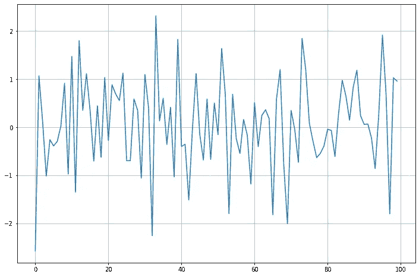
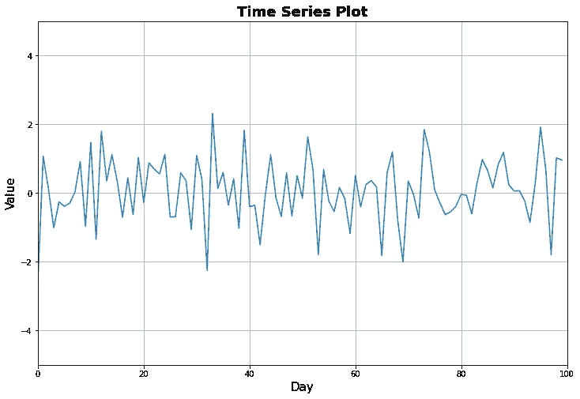
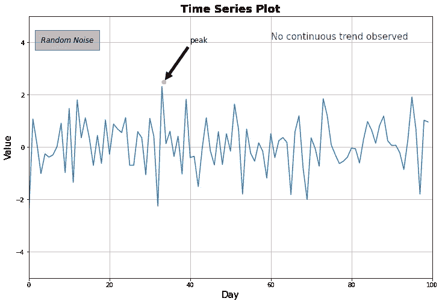

# Matplotlib 提示:如何在绘图上添加文本

> 原文：<https://towardsdatascience.com/matplotlib-tips-how-to-add-text-on-plots-33a87bdd7605?source=collection_archive---------11----------------------->

## 使用智能文本创建更多信息性的情节。


在 [Unsplash](https://unsplash.com/s/photos/writing?utm_source=unsplash&utm_medium=referral&utm_content=creditCopyText) 上由 [Neven Krcmarek](https://unsplash.com/@nevenkrcmarek?utm_source=unsplash&utm_medium=referral&utm_content=creditCopyText) 拍摄的照片

Matplotlib 是一个广泛使用的 python 数据可视化库。它的语法可能比 seaborn 或 plotly 稍微复杂一点，但这种语法带来了灵活性的优势。我们可以在 matplotlib 图上做任何事情。

图由两个主要部分组成:

*   **身材**:身材是维系一切的东西。它就像一个容器，我们把构成情节的其他组件放进去。
*   **轴**:我们绘制数据的区域。绘图的其他元素，如标签、图例、刻度都放在轴上。

> **注意**:一个图形可能有多个轴，但是一个轴只能在一个图形上。

关于 matplotlib 有很多内容需要介绍。它提供了我们能想到的几乎任何一种情节。在本帖中，我们将关注一个更具体的主题，即在地块上添加文本。我们将首先创建一个基本的时间序列数据，然后在图上添加一些信息性的文本对象。

让我们从导入我们需要的库开始。

```
#For generating time series data
import numpy as np#matplotlib
import matplotlib.pyplot as plt
%matplotlib inline
```

> 需要%matplotlib 内联魔术命令来渲染 jupyter 笔记本中的绘图。

我们现在可以生成一个基本的绘图。

```
ser = np.random.randn(100) #time series datafig = plt.figure(figsize=(12,8)) 
ax = fig.add_subplot(111)
plt.grid()
ax.plot(ser)
```

变量“ser”是保存我们将要绘制的随机时间序列数据的 numpy 数组。在下一行中，我们创建一个大小为(12，8)的**图形**。然后，我们在图上添加一个**轴**。Plt.grid 向绘图添加网格线。最后一行是在轴上实际绘制数据的命令。我们制作的情节是:



看起来是那么的平淡简单。在情节上添加文字之前，让我们使它更有吸引力。我们可以添加一个标题，还可以指定 x 轴和 y 轴的名称。我认为最好调整 y 轴上的范围，这样我们可以有一些空间来添加文本。

```
ser = np.random.randn(100) #time series datafig = plt.figure(figsize=(12,8)) 
ax = fig.add_subplot(111)
plt.grid()
ax.plot(ser)#title
ax.set_title('Time Series Plot', fontsize=18, fontweight='bold')#axis title
ax.set_xlabel('Day', fontsize=15)
ax.set_ylabel('Value', fontsize=15)#axis limits
ax.axis([0,100, -5, 5])
```

**Set_title** 用于添加标题。第一个论点是标题。其余的参数是可选的，用于格式化文本。同样， **set_xlabel** 和 set_ylabel 用于给 x 轴和 y 轴添加标题。Ax.axis 允许指定数值范围(前两个用于 x 轴，另外两个用于 y 轴)。我们更新的图看起来像:



比之前的版本好看。现在是给我们的情节添加文本的时候了。我们需要指定文本的位置，当然还有文本是什么。例如，下面的代码将添加“随机噪声”文本。它将根据指定坐标的点定位(本例中为[3，4])。参数 **bbox** 用于捕捉带框的文本。作为 bbox 参数的参数，我们传递一个包含格式样式的字典。

```
ax.text(3, 4, 'Random Noise', style='italic', fontsize=12, 
        bbox={'facecolor': 'grey', 'alpha': 0.5, 'pad': 10})
```

我们不必将文本装箱。下面的代码添加不带框的指定文本。

```
ax.text(60, 4.1, 'No continuous trend observed', fontsize=15,      color='red')
```

我们还可以添加带注释的文本。例如，我们可以用标记和注释来标记时间序列数据的峰值:

```
ax.plot([33.5], [2.5], 'o')ax.annotate('peak', xy=(33.5, 2.5), xytext=(40, 4), 
             fontsize=12,      
             arrowprops = dict(facecolor='black', shrink=0.05))
```

我们首先添加一个圆形标记，然后添加带有指向该标记的箭头的文本。 **xy** 参数包含箭头的坐标， **xytext** 参数指定文本的位置。 **Arrowprops** 顾名思义，是用来给箭头做样式的。

让我们把所有这些放在一起，看看我们剧情的最终版本。

```
ser = np.random.randn(100) #time series datafig = plt.figure(figsize=(12,8)) 
ax = fig.add_subplot(111)
plt.grid()
ax.plot(ser)#title
ax.set_title('Time Series Plot', fontsize=18, fontweight='bold')#axis title
ax.set_xlabel('Day', fontsize=15)
ax.set_ylabel('Value', fontsize=15)#axis limits
ax.axis([0,100, -5, 5])#text
ax.text(3, 4, 'Random Noise', style='italic', fontsize=12,
        bbox={'facecolor': 'grey', 'alpha': 0.5, 'pad': 10})ax.text(60, 4.1, 'No continuous trend observed', fontsize=15,  color='red')#annotation
ax.plot([33.5], [2.5], 'o')ax.annotate('peak', xy=(33.5, 2.5), xytext=(40, 4), fontsize=12,
            arrowprops=dict(facecolor='black', shrink=0.05))
```



感谢您的阅读。如果您有任何反馈，请告诉我。