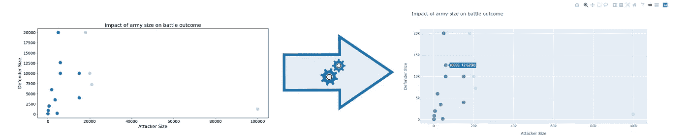
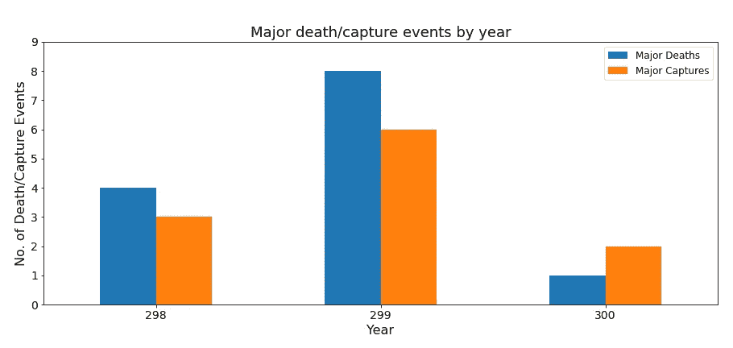
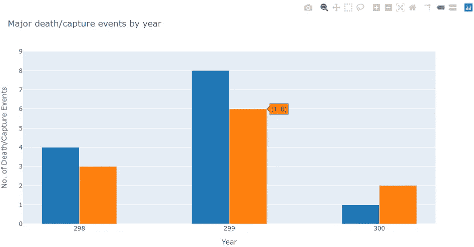
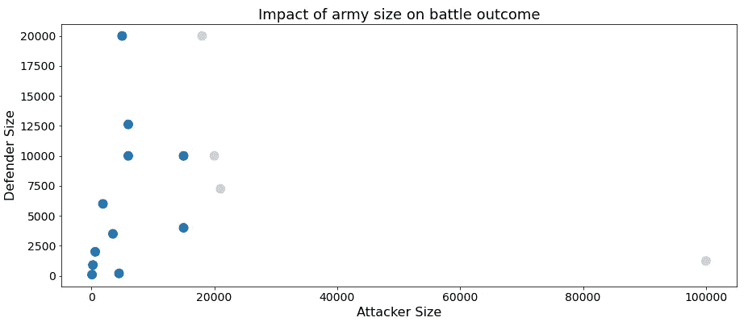
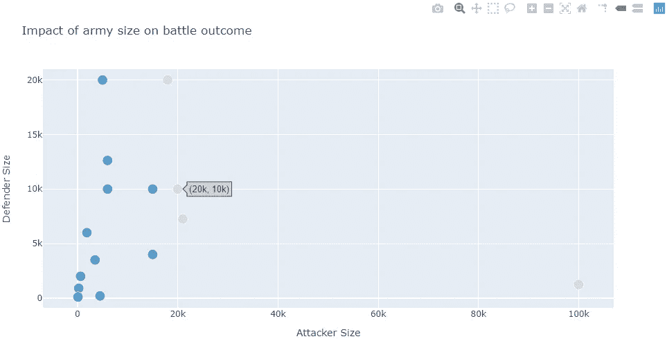

# Matplotlib 到 Plotly 图表转换

> 原文：<https://towardsdatascience.com/matplotlib-to-plotly-chart-conversion-4bd260e73434?source=collection_archive---------17----------------------->

## 将使用熊猫创建的 Matplotlib 图转换为 Plotly 图的实验



将 Matplotlib 图转换为 Plotly 图

# 介绍

你有没有想过从数据帧中直接创建 [Plotly](https://plotly.com/python/) 图表？

Pandas 目前使用 Matplotlib 作为默认的绘图后端。从 0.25 版本开始，[还支持其他后端](https://pandas.pydata.org/pandas-docs/stable/development/extending.html#plotting-backends)如[散景](https://pypi.org/project/pandas-bokeh/)。但是，目前不支持 Plotly。因此，我决定看看是否有可能将 Matplotlib 图表转换成它的 Plotly 等价物。

如果您想继续阅读本文，这里有完整的代码。

# 窥视引擎盖下

第一步是检查每个库如何在内部表示图。

两个库的内部工作是如此的抽象，以至于对于大多数常见的绘图目的，我们几乎不需要修补内部。将绘图提升到一个更高的抽象层次。您只需在数据帧上调用`plot()`,可选地指定绘图种类，进行即时绘图——不需要创建空图形、设置轴标签、图例等等。例如，

```
data = df.groupby('year').sum()[["major_death", "major_capture"]]
ax = data.plot.bar(rot=0)
```

## Matplotlib 轴属性

我从检查由`data.plot`返回的`AxesSubplot`对象`ax`开始。快速搜索后，我发现`AxesSubplot`对象有一个`[properties()](https://matplotlib.org/3.1.1/api/_as_gen/matplotlib.axes.Axes.properties.html#matplotlib.axes.Axes.properties)`方法，将它们的属性作为一个字典返回。

以下是来自[我的 Kaggle 笔记本](https://www.kaggle.com/shaildeliwala/exploratory-analysis-and-predictions/#Major-death/capture-events-by-year)的条形图，其中包含关于《权力的游戏》战斗和死亡数据的 EDA。

图表下方是由`ax.properties()`返回的属性片段。



Matplotlib 剧情:《权力的游戏》中按年份划分的主要死亡/俘获事件

`children`属性包含呈现为条形的`Rectangle`对象。自然地，`Rectangle`封装了大部分绘图信息(x 坐标、高度和宽度)。`title`是图的标题，`xlabel`和`ylabel`分别是 x 轴和 y 轴标题。

```
{
  'adjustable': 'box',
  'axes_locator': None,
  '**children**': [
    <matplotlib.patches.Rectangle at 0x1f7aa154608>,
    ...
    <matplotlib.legend.Legend at 0x1f7ab154ac8>
  ],
  'data_ratio': 3.0,
  'facecolor': (1.0, 1.0, 1.0, 1.0),
  'figure': <Figure size 1080x432 with 1 Axes>,
  ...,
  'title': 'Major death/capture events by year',
  'xlabel': 'Year',
  'xticklabels': <a list of 3 Text major ticklabel objects>,
  'ylabel': 'No. of Death/Capture Events',
  'yticks': array([0., 1., 2., 3., 4., 5., 6., 7., 8., 9.]),
}
```

## Plotly 图形属性

下面是上面条形图的示意图。它的属性在它下面。



《权力的游戏》中按年份划分的主要死亡/俘获事件

`data`是包含上述绘图所需的几乎所有信息的属性。在`layout`属性下，`title`、`xaxis.title`和`yaxis.title`包含图标题和轴标题。

```
{
  "**data**": [
    {
      "marker": {
        "color": [
          "rgb(31.0,119.0,180.0,255.0)",
          ...
          "rgb(255.0,127.0,14.0,255.0)"
        ]
      },
      "type": "bar",
      "width": [0.25, ..., 0.25],
      "x": [-0.25, 0.75, 1.75, 0, 1, 2],
      "y": [4, 8, 1, 3, 6, 2]
    }
  ],
  "layout": {
    "barmode": "group",
    "template": {
      "data": {
        "bar": [
          {
            "error_x": {"color": "#2a3f5f"},
            "error_y": {"color": "#2a3f5f"},
            "marker": {...}
          }
        ], ...
        "table": [...]
      }, ...
    },
    "title": {"text": "Major death/capture events by year"},
    "xaxis": {"title": {"text": "Year"}, ... },
    "yaxis": {
      "range": [0, 9],
      "title": {"text": "No. of Death/Capture Events"}
    }
  }
}
```

## Matplotlib 图与 Plotly 图

请注意，虽然 Plotly 图形是 Matplotlib 图形的顶级对应物，但 [Plotly 图形](https://plotly.com/python-api-reference/generated/plotly.graph_objects.Figure) 与 [Matplotlib 图形](https://matplotlib.org/3.2.1/api/_as_gen/matplotlib.figure.Figure.html#matplotlib.figure.Figure)是不同的概念。

然而，我们直接反映了`AxesSubplot`的属性，即使它是包含在图形中的[。这是因为`AxesSubplot`包含了我们所有感兴趣的对象。](https://matplotlib.org/3.1.1/tutorials/introductory/usage.html#parts-of-a-figure)

然而，如果图中包含如下所示的支线剧情，我们必须反映每个支线剧情的属性。注意图`fig`中包含的四个`AxesSubplot`对象。

```
fig, axes = plt.subplots(2, 2)
print(fig.properties())**# Output**
{
    "agg_filter": null,
    ...,
    "axes": [
        <matplotlib.axes._subplots.AxesSubplot at 0x1f...>,
        <matplotlib.axes._subplots.AxesSubplot at 0x1f...>,
        <matplotlib.axes._subplots.AxesSubplot at 0x1f...>,
        <matplotlib.axes._subplots.AxesSubplot at 0x1f...>
    ],
    ...
}
```

# 构建 Matplotlib 到 Plotly 的转换器

从这里开始，我们将把`plotly.graph_objects`简称为`go`。

## 条形图转换器

根据上一节的理解，我编写了下面的函数，将一个给定的 Matplotlib 条形图转换成一个`Plotly`条形图。它采用类型为`AxesSubplot`的单个参数。

将 Matplotlib 条形图转换为 Plotly 条形图的函数

它执行以下步骤。

1.  从轴中提取所有矩形对象。
2.  构建矩形的 x 坐标、宽度、高度和颜色的列表。请注意，它将颜色转换为 Plotly 可以理解的格式。
3.  构建刻度位置和标签的列表。
4.  创建一个包含单个`go.Bar`的`go.Figure`对象。
5.  添加标题和记号。

## 散点图转换器

以下函数获取包含散点图的 Matplotlib `AxesSubplot`，并返回包含相应散点图的 Plotly `go.Figure`。

将 Matplotlib 散点图转换为 Plotly 散点图的函数

考虑下面的 Matpotlib 散点图。



Matplotlib 散点图

如果你把它传递给上面的函数，你会得到下面的散点图。



Plotly 散点图

## 限制

虽然这种方法适用于小范围的绘图用例，但它很粗糙，不适合更大范围的用例。通过转换函数运行各种图并观察输出，很容易看出这一点。其他限制如下。

1.  图[图例](https://matplotlib.org/3.2.1/api/_as_gen/matplotlib.pyplot.legend.html)未映射。如果使用`go`或`plotly.express`在 Plotly 中创建一个分组条形图，分组信息将被保留。然而，与 Plotly 不同的是，条形分组信息并没有显式地存储在 Matplotlib 中。因此，要在 Plotly 中实现“真正的”分组条形图，我们必须以某种方式从 Matplotlib 图中推断分组信息。此外，我找不到一个直接的方法给一个复杂的图形添加图例，除了[添加带有名字的轨迹](https://plotly.com/python/creating-and-updating-figures/#adding-traces)和`show_legend=True`。
2.  悬停标签显示最少的信息。如果使用`plotly.express`创建图表，悬停标签会自动填充有用的信息，这是 Plotly 最酷的特性之一。无论如何，你仍然可以[定制悬停标签](https://plotly.com/python/hover-text-and-formatting)，以显示更多信息。
3.  内部属性可能会发生变化。如果在其中一个库中引入了向后不兼容的更改，转换代码可能会中断，并且需要更新。

# 可供选择的事物

Checkout [袖扣](https://plotly.com/python/cufflinks/)，一个第三方库，为 dataframes 添加了一个`iplot()`方法。`df.iplot()`之于 Plotly，正如`df.plot()`之于 Matplotlib。

Bokeh 是一个很酷的交互式绘图库。你可以通过运行`pd.set_option('plotting.backend', 'pandas_bokeh')`将它设置为你的熊猫[绘制后端](https://github.com/PatrikHlobil/Pandas-Bokeh)。

同时，[Nicolas Kruchten](https://medium.com/u/bfab5e323657?source=post_page-----4bd260e73434--------------------------------)(Plotly 产品副总裁)[最近评论](https://github.com/plotly/plotly.py/issues/2005#issuecomment-615850935)Plotly 可能会在下一个版本中作为绘图后端选项添加到 pandas！

我希望你觉得我的周末实验很有趣！此外，请查看我关于 [Streamlit](/streamlit-101-an-in-depth-introduction-fc8aad9492f2) 的教程。