# matplotlib:Python 强大的数据可视化工具教程

> 原文：<https://towardsdatascience.com/matplotlib-tutorial-with-code-for-pythons-powerful-data-visualization-tool-8ec458423c5e?source=collection_archive---------22----------------------->

## 通过代码示例解释 Matplotlib 库的基础知识和基本功能

**数据可视化**是通过图形或图表等可视化工具，以可访问的方式呈现数据。这些可视化有助于交流数据中的见解和关系，是数据分析的重要组成部分。在本文中，我们将讨论 Matplotlib，这是 Python 编程语言中最流行的数据可视化库。

# **内容**

1.  **准备工作**
2.  **散点图**
3.  **条形图**
4.  **直方图**
5.  **箱线图**

# **1。准备工作**

Matplotlib 是一个文档非常丰富的包。为了使绘图更容易，我们使用了 **pyplot** 模块，这使得 Matplotlib 像 MATLAB 一样工作。本质上，它的所有功能都可以在[这里](https://matplotlib.org/3.2.1/api/pyplot_summary.html)找到。本文的重点是陈述它的主要和最重要的功能，并举例说明如何使用 pyplot，因为文档有时很难浏览。

为了调用包模块，我们以`import matplotlib.pyplot as plt`开始我们的代码。下面，我们陈述一些使用 pyplot 时最重要的函数:

*   `plt.title`:设置标题，出现在剧情上方。
*   `plt.grid`:配置图中的网格线。使用`plt.grid(True)`启用绘图中的网格线。
*   `plt.legend`:在图中放置一个图例。
*   `plt.xlabel`和`plt.ylabel`:设置轴的标签。例如，`plt.xlabel(“Age”)`将“年龄”设置为 x 轴的标签。
*   `plt.xlim`和`plt.ylim`:设定各轴的极限范围。因此，例如，`plt.xlim([-50, 50])`将绘图限制为仅显示-50 和 50 之间的 x 值。
*   `plt.show`:用在最后，显示图中的一切。

为了演示这些函数的用法，让我们考虑一个简单的例子，我们想画两条简单的线。这可以通过使用`plt.plot`功能来实现。通过使用下面的代码

```
import matplotlib.pyplot as pltx = [1, 2, 3]
x2 = [1, 3, 3.5]
y = [-4, 0, 8]
y2 = [-2, 3, -1]

plt.plot(x, y, label='Line 1')
plt.plot(x2, y2, label='Line 2')

plt.title("Plotting two simple lines")
plt.grid(True)
plt.xlabel("X-label")
plt.ylabel("Y-label")
plt.xlim([0, 4])
plt.ylim([-5, 10])
plt.legend()
plt.show()
```

我们得到了下图:

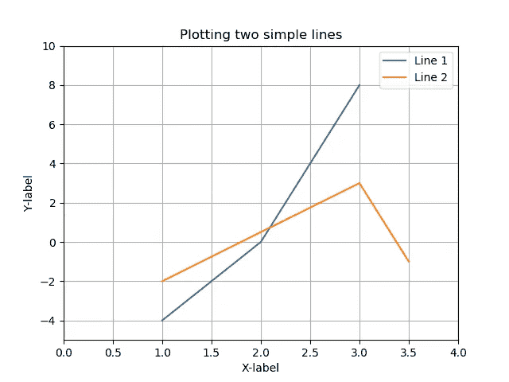

# 2.散点图

现在我们已经看到了基本的 pyplot 函数，我们将从第一种类型的绘图开始。**散点图**通常显示一组数据的两个变量的值。当弄清楚变量对之间的关系时，这种图可以提供很多信息。

考虑下面的工资[数据集](https://www.kaggle.com/rohankayan/years-of-experience-and-salary-dataset)(来自 Kaggle)，它包含 30 个由多年工作经验和年薪(美元)组成的观察值。为了创建散点图，我们使用了`plt.scatter`函数。然后，我们可以将这些数据点绘制如下:

```
import matplotlib.pyplot as plt
import pandas as pddata = pd.read_csv("Salary_data.csv")  # load dataset
X = data["YearsExperience"]
Y = data["Salary"]plt.scatter(X, Y)
plt.title("Scatter Plot")
plt.xlabel("Working Experience (years)")
plt.ylabel("Annual Wage (dollars)")
plt.show()
```

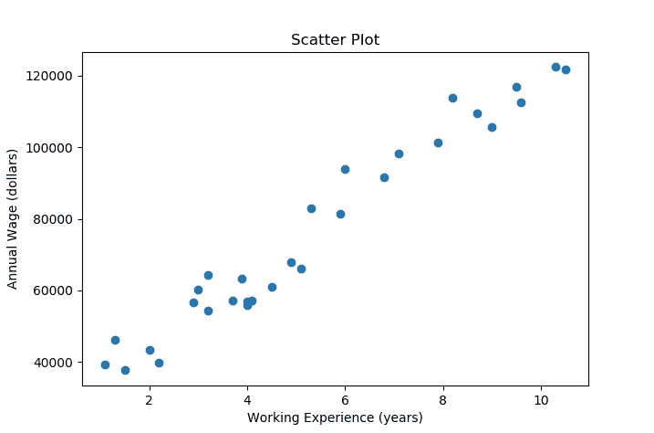

例如，我们还能够通过使用不同的颜色来区分具有超过 5 年工作经验的观察和具有不到 5 年工作经验的观察。为此，我们通过使用相关数据分割创建两个散点图，并在一个图中显示它们。以下代码会产生所需的绘图:

```
X_1 = X[X > 5]
X_2 = X[X <= 5]
Y_1 = Y[X > 5]
Y_2 = Y[X <= 5]plt.scatter(X_1, Y_1, label='Years of experience > 5')
plt.scatter(X_2, Y_2, label='Years of experience <= 5')
plt.title("Scatter Plot (split)")
plt.legend()
plt.xlabel("Working Experience (years)")
plt.ylabel("Annual Wage (dollars)")
plt.show()
```

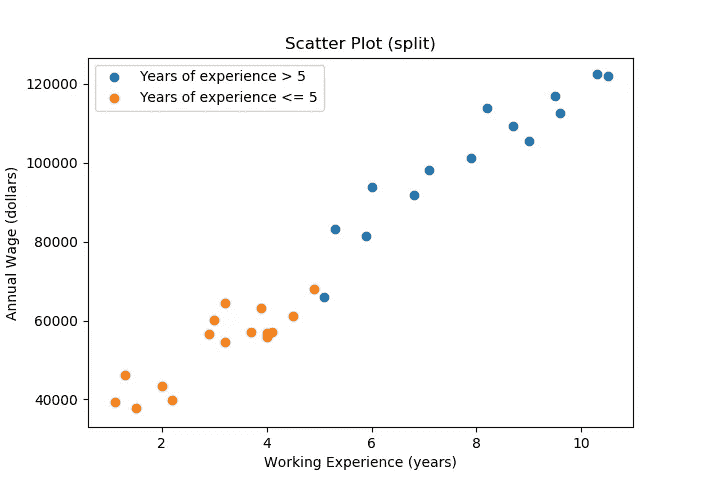

在这里，我们利用图例函数来很好地区分这两个组。

我们还能够在**分类**应用中使用散点图。当我们处理属于不同类别的数据时，我们可以绘制一个数据点，并根据其所属的类别对其进行相应的着色。举个例子，我们使用 Iris 数据集，它可以通过 Python 中的 sklearn 包获得。在这个数据集中，观测值可能属于三个不同的 flower (iris)类。在这个例子中，我们只考虑两个特征，因此图像是 2D 的。这两个感兴趣的特征是萼片长度和萼片宽度(以厘米为单位)。然后，通过使用下面的代码，我们可以为属于不同 iris 类的不同观察值绘制一个漂亮的图:

```
from sklearn import datasets
import matplotlib.pyplot as plt
import numpy as npiris = datasets.load_iris()  # load dataset
X_iris = iris.data[:, :2]  # only take the first two features
Y_iris = iris.target
n_classes = 3for i in range(n_classes):
    index = np.where(Y_iris == i)
    plt.scatter(X_iris[index, 0], X_iris[index, 1],  
    label=iris.target_names[i])
plt.legend()
plt.xlabel(iris.feature_names[0])
plt.ylabel(iris.feature_names[1])
plt.show
```

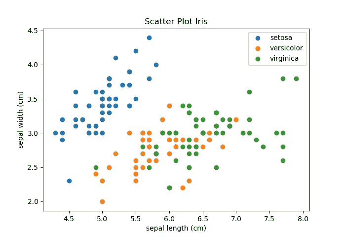

请注意，为了获得该图，我们必须制作三个不同的散点图(通过循环的*)以使用不同的颜色区分不同的类别。*

# 3.条形图

一个**条形图**用不同高度的矩形条以图形方式显示分类数据，其中矩形条的高度或长度代表相应度量**的值。**

让我们再次考虑 iris 数据集，其中观察值属于三个 Iris 花类中的任何一个。假设我们想要可视化 Setosa iris 类的每个特性的平均值。我们可以通过使用条形图来实现这一点，需要使用`plt.bar`函数。以下代码会生成所需的条形图:

```
from sklearn import datasets
import matplotlib.pyplot as pltiris = datasets.load_iris()
X_iris = iris.data
Y_iris = iris.targetaverage = X_iris[Y_iris == 0].mean(axis=0)

plt.bar(iris.feature_names, average)
plt.title("Bar Chart Setosa Averages")
plt.ylabel("Average (in cm)")
plt.show()
```

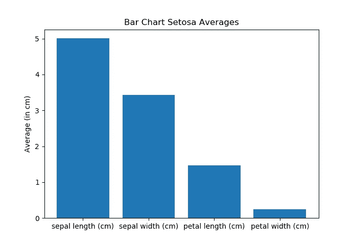

此外，我们还能够很好地显示所有三种鸢尾花的特征平均值，方法是将条形相邻放置。这比标准的条形图需要更多的努力。通过使用以下代码，我们获得了所需的绘图:

```
from sklearn import datasets
import matplotlib.pyplot as plt
import numpy as npiris = datasets.load_iris()
X_iris = iris.data
Y_iris = iris.target
n_classes = 3averages = [X_iris[Y_iris == i].mean(axis=0) for i in range(n_classes)]
x = np.arange(len(iris.feature_names))

fig = plt.figure()
ax = fig.add_subplot()
bar1 = ax.bar(x - 0.25, averages[0], 0.25, label=iris.target_names[0])
bar2 = ax.bar(x, averages[1], 0.25, label=iris.target_names[1])
bar3 = ax.bar(x + 0.25, averages[2], 0.25, label=iris.target_names[2])
ax.set_xticks(x)
ax.set_xticklabels(iris.feature_names)

plt.legend()
plt.title("Bar Chart Iris Averages")
plt.ylabel("Average")
plt.show
```

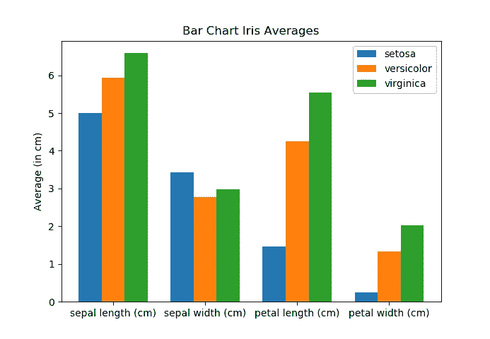

# 4.直方图

根据手头的样本数据，使用**直方图**给出数据分布的近似表示。直方图是通过使用大小相等的“箱”(区间)，并计算属于每个箱的数据点的数量来构建的。在新项目开始时创建直方图对于熟悉数据和粗略了解底层分布的密度非常有用。为了创建直方图，我们使用了`plt.hist`函数。

为了使用 20 个等长的箱创建所有鸢尾花的萼片长度的基本直方图，我们使用以下代码:

```
from sklearn import datasets
import matplotlib.pyplot as pltbins = 20
iris = datasets.load_iris()
X_iris = iris.data
X_sepal = X_iris[:, 0]

plt.hist(X_sepal, bins)
plt.title("Histogram Sepal Length")
plt.xlabel(iris.feature_names[0])
plt.ylabel("Frequency")
plt.show
```

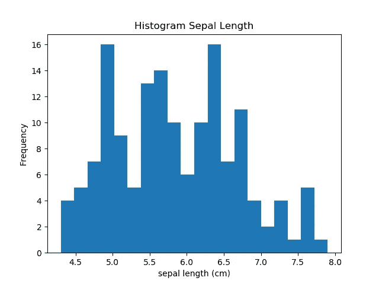

我们可以绘制所有特征的直方图，而不是绘制单个特征的直方图。这可以通过创建单独的图来完成，但在这里，我们将利用子图，以便所有直方图都显示在一个单独的图中。为此，我们使用了`plt.subplots`函数。通过使用以下代码，我们获得了包含四个直方图的图:

```
from sklearn import datasets
import matplotlib.pyplot as pltbins = 20
iris = datasets.load_iris()
X_iris = iris.datafig, axs = plt.subplots(2, 2)
axs[0, 0].hist(X_iris[:, 0])
axs[0, 1].hist(X_iris[:, 1], color='orange')
axs[1, 0].hist(X_iris[:, 2], color='green')
axs[1, 1].hist(X_iris[:, 3], color='red')

i = 0
for ax in axs.flat:
    ax.set(xlabel=iris.feature_names[i], ylabel='Frequency')
    i += 1

fig.suptitle("Iris Histograms")
```

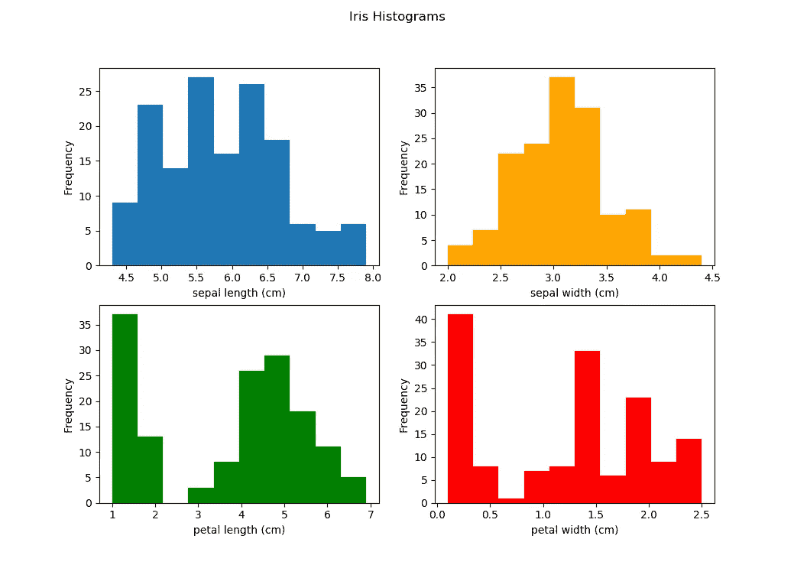

# 5.箱线图

一个**箱线图**是一种通过不同的统计以图形方式描绘数字数据组的便捷方式。下图显示了箱线图的解释:

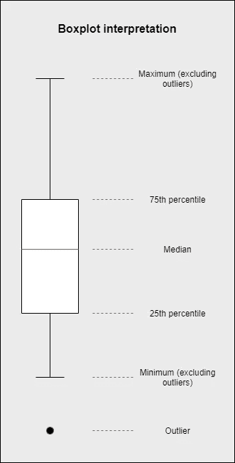

这里的**中位数**是数据集的中间值(不要和均值混淆)；**第 25 百分位**是数据集下半部分的中值，而**第 75 百分位**是数据集上半部分的中值。未包含在须状物之间的数据点被绘制为带点的**异常值**。

再次考虑鸢尾花数据集。使用`plt.boxplot`功能创建一个箱线图。我们将为所有鸢尾花的萼片长度绘制一个箱线图:

```
from sklearn import datasets
import matplotlib.pyplot as pltiris = datasets.load_iris()
X_iris = iris.data
X_sepal = X_iris[:, 0]

plt.boxplot(X_sepal, labels=[iris.feature_names[0]])
plt.title("Boxplot Sepal Length")
plt.ylabel("cm")
plt.show
```

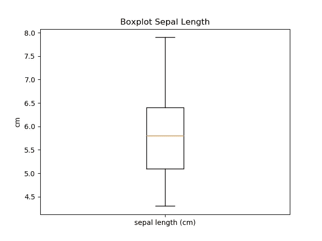

由于所有要素的测量值相同(即以厘米为单位)，我们可以在一个单独的图中绘制所有要素的相邻箱线图:

```
from sklearn import datasets
import matplotlib.pyplot as pltiris = datasets.load_iris()
X_iris = iris.dataplt.boxplot(X_iris, labels=[iris.feature_names[0], iris.feature_names[1], iris.feature_names[2], iris.feature_names[3]])
plt.title("Boxplots Iris features")
plt.ylabel("cm")
plt.show
```

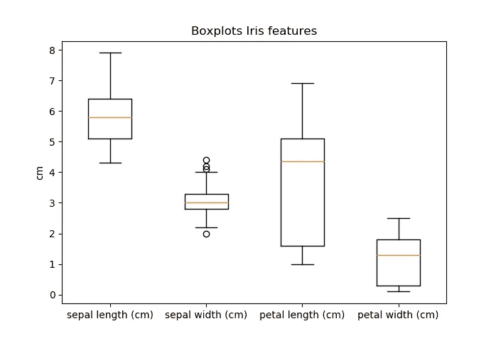

# 感谢阅读

这篇文章包含了 Matplotlib 库中 pyplot 模块的基本函数。当然，当使用 Matplotlib 和 pyplot 绘图时，存在更多的可能性。我希望这篇文章是有用的！

# 薪资数据集来源:

[https://www . ka ggle . com/rohankayan/years-of-experience-and-salary-dataset](https://www.kaggle.com/rohankayan/years-of-experience-and-salary-dataset)