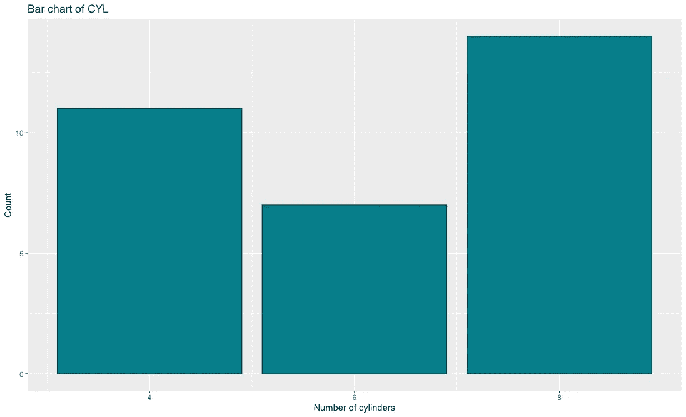

# matplotlib vs . gg plot 2:2020 年及以后选择哪个？

> 原文：<https://towardsdatascience.com/matplotlib-vs-ggplot2-which-to-choose-for-2020-and-beyond-ced5e294bfdc?source=collection_archive---------15----------------------->

## 深入比较两个最流行的可视化库

2020 年即将结束，数据可视化变得前所未有的重要。呈现一个看起来像 5 岁小孩做的东西不再是一个选项，因此数据科学家需要一个有吸引力且易于使用的数据可视化库。我们今天将比较其中的两个——Matplotlib 和 T2。


照片由[安德鲁·布坎南](https://unsplash.com/@photoart2018?utm_source=unsplash&utm_medium=referral&utm_content=creditCopyText)在 [Unsplash](https://unsplash.com/s/photos/plot?utm_source=unsplash&utm_medium=referral&utm_content=creditCopyText) 上拍摄

*那么，为什么是这两个呢？根据编程语言的选择，我会碰碰运气，说这些是你将学习的第一批可视化库。我越来越喜欢 ggplot2，但今天我们将在两个库中重新创建五个相同的情节，看看事情会如何发展，从代码角度和美学角度都是如此。*

*数据呢？*我们将使用两个众所周知的数据集:地铁车辆和飞机乘客。您可以通过导出 CSV 功能获得第一个到 *RStudio* ，第二个可在[这里](https://raw.githubusercontent.com/jbrownlee/Datasets/master/airline-passengers.csv)获得。

以下是针对 *R* 和 *Python* 的库导入:

```
**R:** 
library(ggplot2) **Python:** 
import pandas as pd 
import matplotlib.pyplot as plt 
import matplotlib.dates as mdates 
mtcars = pd.read_csv('mtcars.csv')
```

# 直方图

我们使用直方图来可视化给定变量的分布。这就是我们要对 mtcars 数据集做的事情-可视化 MPG 属性的分布。

下面是 *R* 的代码和结果:

```
ggplot(mtcars, aes(x=mpg)) + 
  geom_histogram(bins=15, fill='#087E8B', color='#02454d') +
  ggtitle('Histogram of MPG') + xlab('MPG') + ylab('Count')
```


这里同样适用于 *Python* :

```
plt.figure(figsize=(12, 7)) 
plt.hist(mtcars['mpg'], bins=15, color='#087E8B', ec='#02454d')
plt.title('Histogram of MPG') 
plt.xlabel('MPG') 
plt.ylabel('Count');
```


默认情况下，两者非常相似。甚至我们需要写的代码量也或多或少是一样的，所以在这里很难挑一个喜欢的。我喜欢 *Python 的* x 轴如何从 0 开始，但这可以在 *R* 中很容易地改变。另一方面，我喜欢在 *R* 中没有边框，但同样，这在 *Python* 中也很容易实现。

**赢家:平局**

# 条形图

条形图由不同高度的矩形组成，其中高度代表给定属性段的值。我们将使用它们来比较不同数量的气缸(属性 cyl)的计数。

以下是 *R* 的代码和结果:

```
ggplot(mtcars, aes(x=cyl)) + 
  geom_bar(fill='#087E8B', color='#02454d') + 
  scale_x_continuous(breaks=seq(min(mtcars$cyl), max(mtcars$cyl), by=2)) + 
  ggtitle('Bar chart of CYL') + 
  xlab('Number of cylinders') + ylab('Count')
```



这里同样适用于 *Python* :

```
bar_x = mtcars['cyl'].value_counts().index 
bar_height = mtcars['cyl'].value_counts().values plt.figure(figsize=(12, 7)) 
plt.bar(x=bar_x, height=bar_height, color='#087E8B', ec='#02454d') 
plt.xticks([4, 6, 8]) 
plt.title('Bar chart of CYL') 
plt.xlabel('Number of cylinders') 
plt.ylabel('Count');
```


毫无疑问， *R* 的代码更加整洁简单，因为 *Python* 需要手动计算高度。从审美角度来说，他们非常相似，但是我更喜欢 T42 的版本。

**获胜者:ggplot2**

# 散点图

散点图用于可视化两个变量之间的关系。我们的想法是，当第一个变量发生变化(上升或下降)时，观察第二个变量会发生什么变化。我们还可以通过对其他属性值的点进行着色，为二维绘图添加另一个“维度”。

我们将使用散点图来形象化 HP 和 MPG 属性之间的关系。

下面是 *R* 的代码和结果:

```
ggplot(mtcars, aes(x=hp, y=mpg)) + 
  geom_point(aes(size=cyl, color=cyl)) + 
  ggtitle('Scatter plot of HP vs MPG') + 
  xlab('Horse power') + ylab('Miles per gallon')
```


这里同样适用于 *Python:*

```
colors = [] 
for val in mtcars['cyl']: 
    if val == 4: colors.append('#17314c') 
    elif val == 6: colors.append('#326b99') 
    else: colors.append('#54aef3') plt.figure(figsize=(12, 7)) 
plt.scatter(x=mtcars['hp'], y=mtcars['mpg'], s=mtcars['cyl'] * 20, c=colors) 
plt.title('Scatter plot of HP vs MPG') 
plt.xlabel('Horse power') 
plt.ylabel('Miles per gallon');
```


在代码方面，R 和 ggplot2 显然会胜出。Matplotlib 没有提供一个简单的方法来通过第三个属性给数据点着色，所以我们必须手动完成这个步骤。尺寸也有点奇怪。

**获胜者:ggplot2**

# 箱线图

箱线图用于通过四分位数可视化数据。它们通常有从盒子延伸出来的线(胡须),这些线在上下四分位数之外显示出可变性。中间的线是中间值。显示在顶部或底部(胡须之后)的点被认为是异常值。

我们将使用箱线图来显示不同 CYL 值的 MPG。

以下是 *R* 的代码和结果:

```
ggplot(mtcars, aes(x=as.factor(cyl), y=mpg)) + 
  geom_boxplot(fill='#087E8B', alpha=0.6) + 
  ggtitle('Boxplot of CYL vs MPG') + 
  xlab('Number of cylinders') + ylab('Miles per gallon')
```


这里同样适用于 *Python* :

```
boxplot_data = [ 
    mtcars[mtcars['cyl'] == 4]['mpg'].tolist(), 
    mtcars[mtcars['cyl'] == 6]['mpg'].tolist(), 
    mtcars[mtcars['cyl'] == 8]['mpg'].tolist() 
] fig = plt.figure(1, figsize=(12, 7)) 
ax = fig.add_subplot(111) 
bp = ax.boxplot(boxplot_data, patch_artist=True) for box in bp['boxes']: 
    box.set(facecolor='#087E8B', alpha=0.6, linewidth=2) for whisker in bp['whiskers']: 
    whisker.set(linewidth=2) for median in bp['medians']: 
    median.set(color='black', linewidth=3) ax.set_title('Boxplot of CYL vs MPG') 
ax.set_xlabel('Number of cylinders') 
ax.set_ylabel('Miles per galon') 
ax.set_xticklabels([4, 6, 8]);
```


有一点是显而易见的——Matplotlib 需要如此多的代码来生成一个看起来不错的箱线图。而 ggplot2 就不是这样了。到目前为止，R 显然是这里的赢家。

获胜者:ggplot2

# 折线图

我们现在将从 mtcars 数据集转移到航空乘客数据集。我们将使用它来创建一个带有日期格式的 x 轴的简单折线图。这并不像听起来那么简单。

以下是 *R* 的代码和结果:

```
ap <- read.csv('https://raw.githubusercontent.com/jbrownlee/Datasets/master/airline-passengers.csv') 
ap$Month <- as.Date(paste(ap$Month, '-01', sep='')) ggplot(ap, aes(x=Month, y=Passengers)) + 
  geom_line(size=1.5, color='#087E8B') + 
  scale_x_date(date_breaks='1 year', date_labels='%Y') + 
  ggtitle('Line chart of Airline passengers') + 
  xlab('Year') + ylab('Count')
```


这里同样适用于 *Python* :

```
ap = pd.read_csv('https://raw.githubusercontent.com/jbrownlee/Datasets/master/airline-passengers.csv') 
ap['Month'] = ap['Month'].apply(lambda x: pd.to_datetime(f'{x}-01')) fig = plt.figure(1, figsize=(12, 7)) 
ax = fig.add_subplot(111) 
line = ax.plot(ap['Month'], ap['Passengers'], lw=2.5, color='#087E8B') formatter = mdates.DateFormatter('%Y')
ax.xaxis.set_major_formatter(formatter) 
locator = mdates.YearLocator() 
ax.xaxis.set_major_locator(locator) 
ax.set_title('Line chart of Airline passengers') ax.set_xlabel('Year') ax.set_ylabel('Count');
```


从美学角度来看，这两个图几乎完全相同，但是在代码量方面，ggplot2 又一次击败了 Matplotlib。在 *R* 中格式化 x 轴来显示日期也比在 *Python* 中容易得多。

**获胜者:ggplot2**

# 在你走之前

在我看来，在简单美观的数据可视化方面，ggplot2 是一个明显的赢家。几乎总是归结为非常相似的 3-5 行代码，这与 *Python* 的情况不同。

我们还没有触及一点点的情节定制，因为这个想法是比较“默认”可视化库的“默认”风格。你可以自由探索。

感谢阅读。

## 加入我的私人邮件列表，获得更多有用的见解。

喜欢这篇文章吗？成为 [*中等会员*](https://medium.com/@radecicdario/membership) *继续无限制学习。如果你使用下面的链接，我会收到你的一部分会员费，不需要你额外付费。*

[](https://medium.com/@radecicdario/membership) [## 通过我的推荐链接加入 Medium-Dario rade ci

### 作为一个媒体会员，你的会员费的一部分会给你阅读的作家，你可以完全接触到每一个故事…

medium.com](https://medium.com/@radecicdario/membership) 

*原载于 2020 年 9 月 29 日 https://betterdatascience.com**的* [*。*](https://betterdatascience.com/matplotlib-vs-ggplot2/)