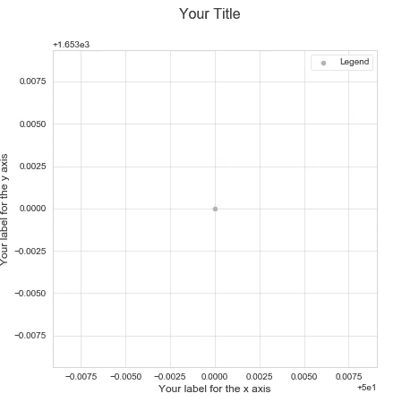
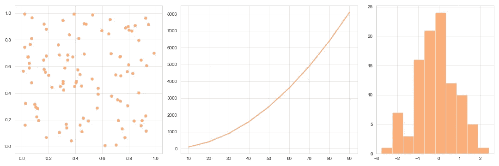
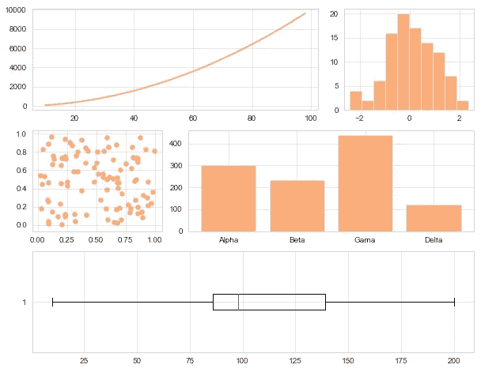
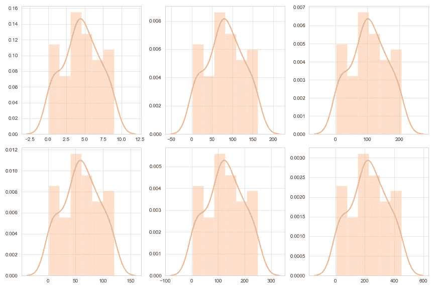
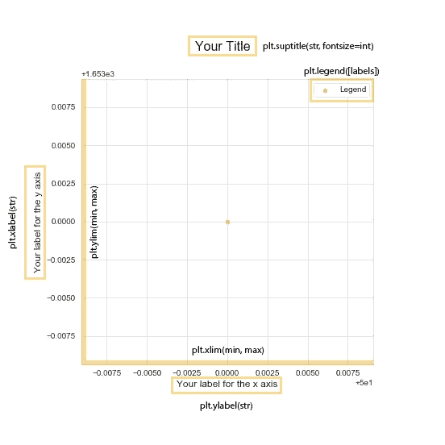

# matplotlib——谁说它需要简单？

> 原文：<https://towardsdatascience.com/matplotlib-who-said-it-needs-to-be-simple-7156df7c827b?source=collection_archive---------30----------------------->

## 当有更多可以探索的时候，为什么要抓住简单的数字不放呢？让我们来学习如何使用支线剧情部分！

安德里亚·皮亚卡迪奥——[派克斯](https://www.pexels.com/pt-br/foto/homem-pessoa-sentado-frustracao-3752834/?utm_content=attributionCopyText&utm_medium=referral&utm_source=pexels)拍摄的照片

# 介绍

虽然是一个相对简单的库，但 Matplotlib 不断给新人带来一些困惑；有些功能似乎不太好学，网上的解释也不太友好。

与数字打交道总是一团糟。我们需要一段时间来学习如何在一个图形中创建多个图形，然后我们意识到我们可以做得更多。

# 你是新来的吗？

如果您现在开始接触数据可视化，我强烈推荐您阅读我的文章“**数据可视化终极指南**”。在那里，我教如何创建不同的情节类型，以及如何定制你的数字！

 [## 数据可视化的终极指南

### 没有人喜欢丑陋的东西，对吗？如果他们猜不出我们的期望，那就更糟了。所以让我们来学习如何生成…

towardsdatascience.com](/the-ultimate-guide-for-data-visualization-c98de0d3158d) 

# 今天你将学到什么

我们将涵盖 Matplotlib 数据的一些重要方面，例如:

*   如何将您的绘图应用于特定的轴；
*   添加标签、标题，改善填充；
*   用支线剧情工作；

还有更多！在本教程结束时，你将能够理解你在做什么与你的数字！我们开始吧。

# 这个数字

图片由雷南·洛里科拍摄——中号

每个人都习惯于一个标准的 Matplotlib 图形，你可以只放一个图；这对任何人来说都不再是个谜了，对吗？

第一，你总是从塑造你的身材开始；然后，选择地块类型，并开始调整信息和样式。有用的技术。

当您需要一起创建几个图表时，问题就出现了；创造独特的人物并希望他们看起来很棒是没有意义的，那么你会怎么做呢？

## 使用 gridspec

图片由雷南·洛里科拍摄——中号

Matplotlib 有一个很棒的处理多个图的工具，叫做 gridspec 这样，您可以在一个图形中插入多个图形。让我们看一下代码。

首先，我用一行三列开始了 GridSpec。因为有不止一列，所以还需要传递参数 **width_ratios** ，它需要一个整数列表，该列表将是每一列的宽度。想要更简单的选择吗？所以我会推荐 subplot2grid。

## 使用子图 2 网格

任何人的正确选择！使用起来并不困难，方便了整个过程。先看看我们能做些什么。

图片由雷南·洛里科拍摄——中号

subplot2grid 在引擎盖下使用 GridSpec 这就是为什么它工作得这么好。两者的区别在于 GridSpec 创建了一个新的子情节，并将位置作为参数传递；Subplot2grid 一起完成所有这些工作，所以您用配置实例化它。哪一个是最好的？两者都有？你需要知道哪一个？GridSpec。

## 使用支线剧情

如果您正在寻找一种更简单的方法来绘制多个图形，并且不想因为不同的宽度而变得过于复杂，请尝试 subplot。让我们看一个例子。

图片由雷南·洛里科拍摄——中号

**通常用于探索性数据分析，因其易于绘制各种图形**。我们将绘图代码放在一个循环中，这个循环负责将每个图形附加到它的位置上。

# 你的数据中的信息

现在您知道了如何改进数据可视化，所以让我们深入了解标签的重要性。

图片由雷南·洛里科拍摄——中号

所有数据都必须有标题、x 轴和 y 轴上的标签，以及解释数据差异的图例。这总是必要的，没有例外。

团队内部的信息量可以减少，因为每个人都已经意识到他们试图解决的问题。**然而仍然需要某种方式来指定这些情节。**

让我们看看我是如何在上图中添加所有这些标签的。

# 要记住的事情

有一些你不能忘记的重要信息，让我们检查一下:

*   每当你想创建一个新的图像时，从一个 plt.figure()开始；
*   注意不要颠倒 x 轴和 y 轴；
*   质量胜于数量；

永远把你的图表当成一件艺术品；你需要不断思考谁会看到它，他们会有什么反应。

> 对我们来说，我们花在解释事情上的时间越少，我们就越需要推销我们的想法。

# 就这样，伙计们！

我希望你喜欢这个内容，并能熟练运用你的新知识！如果你想每天学习有趣的东西，我很乐意与你分享精彩的内容！

另外，你可以在 Github 上查看我的个人资料。我从事一些数据科学项目已经有一段时间了。所有的关键概念都可以学习和重用！

 [## 雷南·洛利科-吉图布

### 在 GitHub 上注册你自己的个人资料，这是托管代码、管理项目和构建软件的最佳地方…

github.com](https://github.com/renfelo)