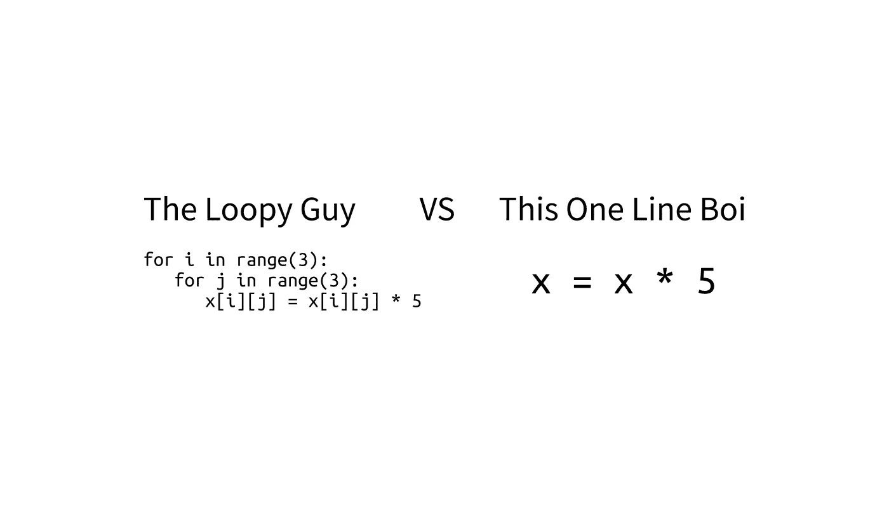
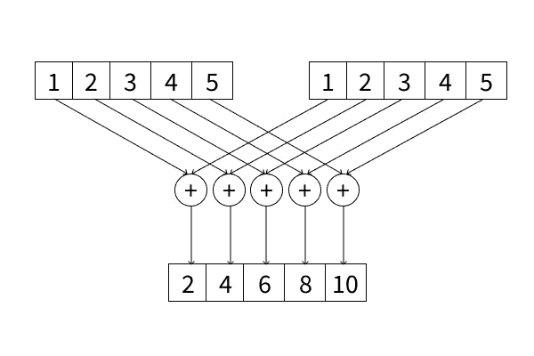
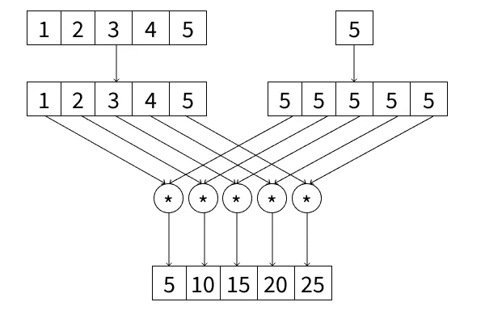

# NumPy 矩阵计算

> 原文：<https://towardsdatascience.com/matrix-computation-with-numpy-a865ebaf2005?source=collection_archive---------60----------------------->



来自我在 [Figma](https://www.figma.com/file/a2u5vu9ub0TBsS9bpmU3Mv/Untitled?node-id=0%3A3) 上的设计

## NumPy 如何简化您的代码，同时提高其性能。广播和 SIMD 来救援了！

# **简介**

当我们使用机器学习，尤其是深度学习来解决问题时，性能确实是一个重要的方面。使用神经网络来计算事物可能会成为复杂的计算，因为它涉及矩阵和向量。

假设我们想计算一个乘以 5 的 25 x 25 的矩阵。第一次向您介绍编程时，您将会计算这样的向量或矩阵，

```
for i in range(25):
    for j in range(25):
        x[i][j] *= 5
```

如果我们使用这种方法，它将使我们的计算时间更长，我们将不会在我们期望的时间得到结果。谢天谢地，在 Python 中，我们有 NumPy 库来解决这个矩阵和向量计算。

通过使用 NumPy 库，我们可以将 3 行代码变成 1 行代码，如下所示，

```
import numpy as np**# Make it as NumPy array first** x = np.array(x)x = x * 5
```

如果我们比较时间，在这种情况下，传统方法大约需要 0.000224，而 NumPy 方法只需要 0.000076。NumPy 比传统的快 3 倍，但同时也简化了你的代码！

想象一下，当你想计算一个比这个例子更大的矩阵时，你会节省多少时间。这种计算被分类为矢量化，其中计算发生在矩阵或矢量表示上。因此，用这种计算方法，同样的结果会节省你的时间。

这是怎么回事？NumPy 有什么魔力让它可以更简单更快速的计算矩阵？本文将向您介绍单指令多数据(SIMD)和广播的概念。没有进一步的，让我们开始吧。

# 单指令多数据(SIMD)



来自我在 [Figma](https://www.figma.com/file/a2u5vu9ub0TBsS9bpmU3Mv/Untitled?node-id=0%3A3) 上的设计

什么是单指令多数据(SIMD)？基本上，SIMD(读作“sim-dee”而不是用字母表拼写它)是一种并行计算方法，使计算机内部的数据可以由硬件同时(并发地)计算。

例如，我们有两个输入向量，我们想用算术方法计算每个元素的向量。硬件会，因此每个数据将被分配到硬件的不同组件(即，GPU 核心)并同时计算两个向量的每个元素。正因为如此，向量可以计算得更快。

# 广播

在 NumPy 中，当满足这些要求时，计算会起作用，它们是:

1.  两个对象的尺寸相同，或者
2.  其中一个维度的值为 1

如果对象不符合上述要求，则不能计算。如果有一些对象满足第二个要求，那么该对象将被广播。

广播基本上是用在形状不同的向量上。回想一下上面矩阵和标量元素(5)之间的计算，标量将被广播，因此标量将具有与矩阵相同的形状。例如，当你有了这些东西，

*   例 2 中的 5×1 个矢量[1 2 3 4 5]
*   示例中的 1 x 1 标量为 5

为了实现这一点，标量将具有与向量相同的形状，并且该值将在新向量中传播。所以我们可以得到[5 5 5 5 5]向量。有了这个矩阵，我们就可以利用 SIMD 原理，计算出要转换成矢量的矢量和标量。因此，结果将是如下所示的[5 10 15 20 25]，



来自我在 [Figma](https://www.figma.com/file/a2u5vu9ub0TBsS9bpmU3Mv/Untitled?node-id=0%3A3) 上的设计

# 结论

总之，机器学习的计算没有从向量和矩阵中分离出来。如果你想从头开发一些机器学习模型，特别是在矢量化部分，理解线性代数将是有用的。通过这样做，由于 SIMD 和广播的概念，我们可以使我们的计算更加有效和简单。

## 参考

[1]若昂 M.P 卡多佐，何塞·加布里埃尔·f·库蒂尼奥和佩德罗·c·迪尼茨，[面向高性能的嵌入式计算(2017)](https://www.sciencedirect.com/book/9780128041895/embedded-computing-for-high-performance#book-info) ，爱思唯尔公司
【2】斯特芬·范德沃特，s·克里斯·科尔伯特和加尔·瓦洛夸。[NumPy 数组:高效数值计算的结构](http://dx.doi.org/10.1109/MCSE.2011.37) (2011)，《科学计算&工程》，第 13 卷，第 2 期，第 22–30 页。

## 感谢您阅读我的文章，您也可以在下面查看我以前的文章:

[](/introduction-to-time-series-analysis-with-r-a2f97650baa3) [## R 时间序列分析导论

### 从探索，到预测。使用印度尼西亚 2002 年 12 月至 2020 年 4 月的消费者价格指数(CPI)数据

towardsdatascience.com](/introduction-to-time-series-analysis-with-r-a2f97650baa3) [](/do-this-additional-step-you-have-made-a-generalize-machine-learning-model-9d85b7e09313) [## 做这个额外的步骤，你就做了一个一般化的机器学习模型

### 只是一个额外的步骤，它可以增加我们对预测未知数据的模型的信心。

towardsdatascience.com](/do-this-additional-step-you-have-made-a-generalize-machine-learning-model-9d85b7e09313) [](/greater-accuracy-does-not-mean-greater-machine-learning-model-performance-771222345e61) [## 更高的准确性并不意味着更好的机器学习模型性能

### 我们可以定量地衡量机器学习模型的性能，但不仅仅是准确性，还有很多…

towardsdatascience.com](/greater-accuracy-does-not-mean-greater-machine-learning-model-performance-771222345e61)