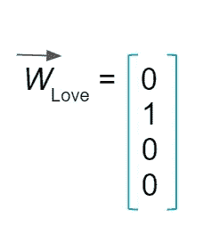
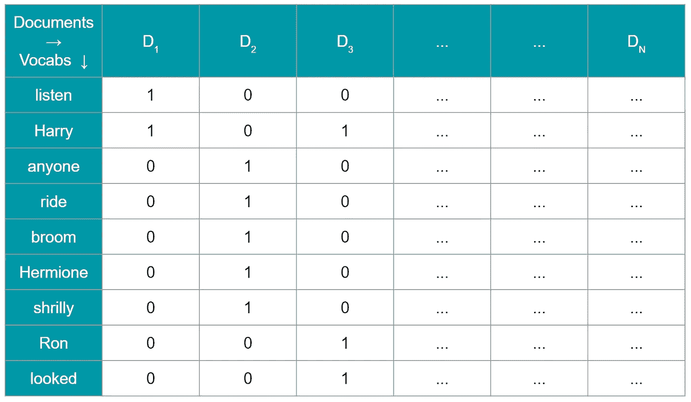
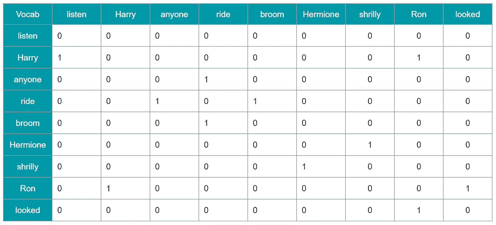

# 自然语言处理中向量空间模型的矩阵设计

> 原文：<https://towardsdatascience.com/matrix-design-for-vector-space-models-in-natural-language-processing-fbef22c10399?source=collection_archive---------31----------------------->

## NLP 知识表示的简要原理和矩阵设计的简明指南&分布式单词表示的维数灾难。

乔恩·泰森在 [Unsplash](https://unsplash.com?utm_source=medium&utm_medium=referral) 上的照片

我记得当我第一次学习代数的时候，我有一种奇怪的冲动，想把这些字母用文字表达出来。我有一些随机字母的涂鸦被用作数字，然后只是玩玩。

嗯，事实证明，当我学习信息论和单词向量时，我就像“我就知道！！!"

计算机科学的一个基础是用数字甚至更好的数字来表示你的知识——用 0 和 1 的组合。机器学习模型也不例外，因此，将文本转换为数字表示(或者像我的教授所说的——代理)是任何类型的文本分析任务的构建模块。

# 自然语言处理的知识表示哲学

理解人类语言的人类知识有两个主要来源:

1.  字典
2.  我们从阅读书籍和人工制品中收集的信息

我会把字典称为一种结构化的学习工具，旨在帮助自然的人类学习，而从阅读书籍中收集的知识是一种非结构化的甚至不可预见的过程。这是理解自然语言的两种关键方法，自然语言已经被系统地数字化，以供人工生物学习(我指的是计算机😅).

照片由[石页康让](https://unsplash.com/@omgitsyeshi?utm_source=medium&utm_medium=referral)在 [Unsplash](https://unsplash.com?utm_source=medium&utm_medium=referral) 上拍摄

字典被实现为 WordNet 丰富的知识就像一个随时可以被 NLP 程序使用的数字字典，就像我们如何通过查阅字典来学习特定单词的意思一样。

另一种获取知识的方式是通过从书籍、小说、物品评论、短信、推文等人工制品中学习。这种知识可以使用向量来有效地表示，以捕获嵌入其中的语义知识。这就是我要在这里简要讨论的所有大惊小怪的事情。

# 关于向量的一个注记

向量是一维矩阵，用于表示一维空间中的数字集合。在机器学习中，特征向量是用于表示一个特定数据实例的特征的所有数字编码的一维向量。随着实例数量的增加，矩阵也会增长。类似地，在推荐系统中，矩阵用于在用户和购买或观看的项目之间建立联系，其中每个向量代表每个用户的选择。在心理学中，向量用于评估心理测量特征，并且特征向量将包括每个人被评估的每个心理测量特征的点数。

因此，使用向量和矩阵将数据量化成机器可解释的格式是相当普遍的。在自然语言处理中，单词也在向量空间中表示，其中每个向量对应于特定单词的分布。这使得通过概化来计算预测变得非常类似于监督分类问题，概化主要通过计算向量相似度来解密。

# 单词表示的矩阵设计

> “从一个人交的朋友，你就可以知道他说的是什么”
> 
> ~ J. R. Firth 1957: 11

正如我们已经建立的，我们将把文本转换成它们的数字表示，我们将把它们表示成实数的密集向量。这些向量共同形成了一个矩阵，可以通过这样的方式设计，让我们保留我们期望从文本中获得的意义。

例如，一个句子——“我喜欢文本分析。”单词‘love’的出现可以被转换成 4×1 的向量，其中 4 是词汇量(由 *V 表示)*。

数学上，代表“爱”的向量可以写成:

“爱”这个词的一键编码词向量

这是**一键编码**的一种形式。

如果有多个句子，那么最简单的方法是将词汇添加到向量的词汇维度中，并继续扩展这个“出现”向量。

然后，如果有 *M* 个标记，您可以创建一个 *V x M* 矩阵，对词汇表中标记的存在和不存在进行编码。

现在，让我们回顾一下这种编码方式，并记下注意事项。语言中最重要的一点是，一个词本身不会发出预测信号，直到它被放到一个语境中进行整体理解。例如，如果我说“好”——是的，好是一个积极的词，但什么是好呢？还是在“好”之前有一个“不”？这就是为什么我把它标为“发生”向量。这是一个简单的是或不是的情况。这与上下文无关。

第二个问题是，如果单词向量表示不受控制，可能会产生大量词汇。这将导致昂贵的计算和耗时的过程。

对于某些捕捉一起出现的一组单词的含义的人来说，我们有两种最广泛使用的矩阵设计，讨论如下:

1.  **Word x 文档矩阵**

在这种向量表示方法中，每个单词被表示为它在每个文档中出现的频率。因此，向量大小将是|V|x D，其中 D 是文档的数量。这个向量由实数组成，并且随着更多文档的添加而扩大。换句话说，对于第 *i* 个单词，该单词在第 *j* 个文档中的词频(tf)被放置在矩阵的第 *ij* 个元素处。

为了证明这一点，请考虑以下三个文档:

文件 1:“听着，哈里，我能试试吗？我可以吗？”

文件 2:“我认为任何人现在都不应该骑那把扫帚！”赫敏尖声说道。

文件 3:哈利和罗恩看着她。

word-document 向量表示看起来像这样:

**2。基于窗口的 Word x Word 矩阵:**

这也被称为共现矩阵，其中测量一个单词在另一个单词附近出现的次数。例如，如果评估窗口大小为 3，则测量词汇表中的单词( *i)* 在词汇表中第 *j* 个单词的范围 *j+3 到 j-3* 内出现了多少次，并将其放置在共现矩阵的位置 *ij* 处。如果词汇表的大小是| *V* |那么最终的矩阵将是| *V* | x | *V* |。

为了证明窗口大小为 3 的这一点，前一示例的共生矩阵将是:

如果我使用更多的例子，哈利、罗恩和赫敏在频率计数方面会比其他人更突出，因为他们的名字会更频繁地出现在一起(在 3 个单词的跨度内，向前和向后)，这在这些独立的单词中建立了语义。

# 单词向量的维数

由[法尔汉·阿扎姆](https://unsplash.com/@paan_azam13?utm_source=medium&utm_medium=referral)在 [Unsplash](https://unsplash.com?utm_source=medium&utm_medium=referral) 上拍摄的照片

定义向量的维数与使用 NLP 技术解决的问题有关。如果你只是想知道，在用户评级为“非常好”、“好”、“一般”、“不好”、“更差”的情况下。这方面将是一个独热编码器，其中 1 将对应于用户评级。这也是在特定项目的上下文中捕捉用户情绪的一种形式。这个问题的维数是 5。每个实例将是一个 1×5 的矩阵。

现在，就心理测量分析而言，如果你对每个用户的[大五分](https://en.wikipedia.org/wiki/Big_Five_personality_traits)进行编码，那么每个大五人格特质将有 0 到 50 的实数，即[开放性](https://en.wikipedia.org/wiki/Openness_to_experience)、[尽责性](https://en.wikipedia.org/wiki/Conscientiousness)、[外向性](https://en.wikipedia.org/wiki/Extraversion_and_introversion)、[宜人性](https://en.wikipedia.org/wiki/Agreeableness)和[神经质](https://en.wikipedia.org/wiki/Neuroticism)。这个矢量的形状也是 1 x 5。根据你正在解决的问题，这些值可以被缩放，因为这些个性测试中的较低值表明该特定特征的相反行为。例如，[15，12，34，44，29]可以缩放为[-1，-1，1，1，0]。

如果您正在进行性别分类任务，那么您的向量表示可能是 1x2，如果您有 10k 个文档，那么您的维度将是相同的数量级，除非您对单词 vector 的长度进行策略化。

单词向量的 ***维度选择*** 对模型的性能有很大的影响。向量的较小维度对于捕获所有特征是低效的(欠拟合)，而向量的较大维度将导致过拟合。大的维度直接增加了模型复杂性、计算成本以及通过增加延迟的训练时间。此外，从向量计算的特征将是维度的线性或二次函数，这进一步影响训练时间和计算成本。

# 摘要

嵌入在单词中的含义可以通过使用计数统计来识别，并表示单词与相邻单词或其所在的文档的关联，并以向量的形式表示它们。词汇表和文档越多，矩阵就越大，这就导致了维数灾难。由于这些编码策略会产生稀疏矩阵，因此它们也存在相关的可伸缩性问题，并且计算量很大。一个 *MxN* 矩阵具有 *O(mn )* 的计算成本，这是不期望的。然而，这两种表示是最广泛使用的矩阵设计策略，并且已经被证明在解决诸如文本分类、非上下文情感分析和文档相似性的 NLP 问题时非常有效。

# 参考资料:

1.  [http://web . Stanford . edu/class/cs 224n/readings/cs 224n-2019-notes 01-word vecs 1 . pdf](http://web.stanford.edu/class/cs224n/readings/cs224n-2019-notes01-wordvecs1.pdf)
2.  [http://web . Stanford . edu/class/cs 224 u/materials/cs 224 u-2020-VSM-讲义. pdf](http://web.stanford.edu/class/cs224u/materials/cs224u-2020-vsm-handout.pdf)
3.  特尼，彼得 d 和帕特里克潘特尔。"从频率到意义:语义学的向量空间模型."*人工智能研究杂志*37(2010):141–188。
4.  诺亚·史密斯，《语境化的词语表达:语境化的介绍》 *arXiv 预印本 arXiv:1902.06006* (2019)。