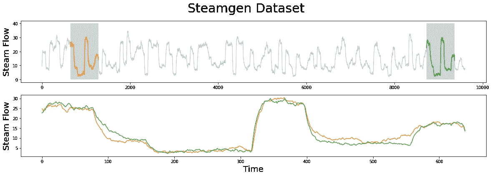
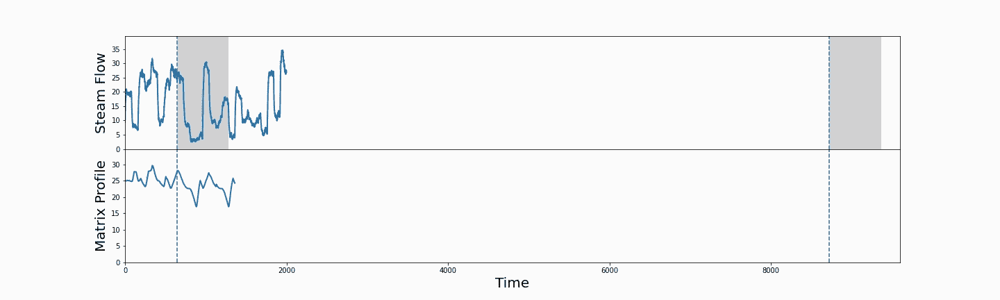

# 第 6 部分:流式时间序列数据的矩阵轮廓

> 原文：<https://towardsdatascience.com/matrix-profiles-for-streaming-time-series-data-f877ff6f9eef?source=collection_archive---------41----------------------->

## 使用 STUMPY 使用在线数据逐步更新您的矩阵档案


(图片由[若昂·布兰科](https://unsplash.com/@jfobranco?utm_source=unsplash&utm_medium=referral&utm_content=creditCopyText)提供)

# 整体大于部分之和


(图片由作者提供)

[STUMPY 是一个强大且可扩展的 Python 库，用于现代时间序列分析](https://github.com/TDAmeritrade/stumpy)，在其核心，有效地计算出一种叫做*矩阵轮廓*的东西。这个多部分系列的目标是解释什么是 matrix profile，以及如何开始利用 [STUMPY](https://stumpy.readthedocs.io/en/latest/) 完成所有现代时间序列数据挖掘任务！

*注:这些教程最初出现在* [*STUMPY 文档*](https://stumpy.readthedocs.io/en/latest/tutorials.html) *中。*

第一部分:[矩阵轮廓图](/the-matrix-profile-e4a679269692)
第二部分: [STUMPY 基础知识](/stumpy-basics-21844a2d2d92)
第三部分:[时间序列链](/part-3-time-series-chains-da281450abbf)
第四部分:[语义分割](/part-4-semantic-segmentation-b42c3792833d)
第五部分:[快速近似矩阵轮廓图与 STUMPY](/part-5-fast-approximate-matrix-profiles-with-scrump-c6d9c984c560)
第六部分:[用于流式时间序列数据的矩阵轮廓图](/matrix-profiles-for-streaming-time-series-data-f877ff6f9eef)
第七部分:[快速模式搜索与 STUMPY](/part-7-fast-pattern-searching-with-stumpy-2baf610a8de1)
第八部分:【T2 10: [发现多维时间序列模体](/part-10-discovering-multidimensional-time-series-motifs-45da53b594bb)
第十一部分:[用户引导的模体搜索](/part-11-user-guided-motif-search-d3d317caf9ea)
第十二部分:[机器学习的矩阵轮廓](/part-12-matrix-profiles-for-machine-learning-2dfd98d7ff3f)

# 用于流时间序列数据的增量矩阵轮廓

现在，您已经对如何计算矩阵配置文件有了基本的了解，在这个简短的教程中，我们将演示当您有流(在线)数据时，如何使用`stumpy.stumpi()`(“STUMP Incremental”)函数增量更新您的矩阵配置文件。您可以通过阅读[矩阵档案 I](https://www.cs.ucr.edu/~eamonn/PID4481997_extend_Matrix%20Profile_I.pdf) 文件的 G 部分以及本文件的第 4.6 部分和表 5 [来了解有关该方法的更多详细信息。](https://www.cs.ucr.edu/~eamonn/ten_quadrillion.pdf)

# 入门指南

让我们导入创建和分析随机生成的时间序列数据集所需的包。

```
import numpy as np
import stumpy
import numpy.testing as npt
import time
```

# 生成一些随机时间序列数据

想象一下，我们有一个[物联网](https://en.wikipedia.org/wiki/Internet_of_things)传感器，它在过去 14 天里每小时收集一次数据。这意味着到目前为止我们已经积累了`14 * 24 = 336`个数据点，我们的数据集可能如下所示:

```
T = np.random.rand(336)
```

或许，我们从经验中知道，在 12 小时(滑动)的时间窗口内，可以检测到一个有趣的主题或异常:

```
m = 12
```

# 典型批量分析

使用`stumpy.stump()`通过批处理直接计算矩阵分布图:

```
mp = stumpy.stump(T, m)
```

但是随着`T`的长度随着时间的推移而增长，计算矩阵轮廓将花费越来越多的时间，因为`stumpy.stump()`将实际上重新计算时间序列内所有子序列之间的所有成对距离。这个超级耗时！相反，对于流数据，我们希望找到一种方法来获取新的传入(单个)数据点，并将它所在的子序列与时间序列的其余部分进行比较(即，计算距离轮廓)并更新现有的矩阵轮廓。幸运的是，这可以通过`stumpy.stumpi()`或“残肢增量”轻松实现。

# 用 STUMPI 进行流式(在线)分析

当我们等待下一个数据点`t`到来时，我们可以用现有的数据初始化我们的流对象:

```
stream = stumpy.stumpi(T, m)
```

并且当新的数据点`t`到达时:

```
t = np.random.rand()
```

我们可以将`t`添加到`stream`中，并在后台轻松更新矩阵配置文件、`P`和矩阵配置文件索引、`I`:

```
stream.update(t)
```

在后台，`t`已被附加到现有的时间序列中，它自动将新的子序列与所有现有的子序列进行比较，并更新历史值。它还确定现有子序列中的哪一个是新子序列的最近邻居，并将该信息附加到矩阵简档。随着额外数据的流入，这可以继续进行，比如说，再进行 1000 次迭代(或无限期地):

```
for i in range(1000):
    t = np.random.rand()
    stream.update(t)
```

重要的是要重申，增量`stumpy.stumpi()`与批量`stumpy.stump()`不同，它不会浪费任何时间来重新计算任何过去的成对距离。`stumpy.stumpi()`只花时间计算新的距离，然后在必要时更新适当的数组，因此，它真的很快！

# 验证矩阵配置文件

现在，这种用流(在线)数据“快速更新”的说法可能感觉奇怪或不可思议，因此，首先，让我们验证增量`stumpy.stumpi()`的输出与执行批处理`stumpy.stump()`的输出相同。让我们从具有`64`数据点的完整时间序列开始，并计算完整的矩阵轮廓:

```
T_full = np.random.rand(64)
m = 8mp = stumpy.stump(T_full, m)
P_full = mp[:, 0]
I_full = mp[:, 1]
```

接下来，对于`stumpy.stumpi()`，我们将只从全长时间序列中的第一个`10`元素开始，然后一次一个地增加额外的数据点:

```
# Start with half of the full length time series and initialize inputs
T_stream = T_full[:10].copy()
stream = stumpy.stumpi(T_stream, m)# Incrementally add one new data point at a time and update the matrix profile
for i in range(len(T_stream), len(T_full)):
    t = T_full[i]
    stream.update(t)
```

现在我们已经完成了，让我们检查并验证一下:

1.  `stream.T == T_full`
2.  `stream.P == P_full`
3.  `stream.I == I_full`

```
npt.assert_almost_equal(stream.T_, T_full)
npt.assert_almost_equal(stream.P_, P_full)
npt.assert_almost_equal(stream.I_, I_full)
```

没有错误，它们都匹配！因此，这意味着`stump.stumpi()`确实产生了我们所期望的正确矩阵分析结果。

# 验证性能

我们基本上声称，当每个新数据点到达时，用`stumpy.stumpi()`增量更新我们的矩阵轮廓比用`stumpy.stump`执行完整的成对距离计算要快得多(在总计算时间上)。让我们实际比较一下时间，取一个完整的时间序列，长度为 1，000 个数据点，我们用时间序列的前 20%(即前 200 个点)初始化这两种方法，并在每次迭代时附加一个新的数据点，然后重新计算矩阵轮廓:

```
T_full = np.random.rand(1000)
T_stream = T_full[:200].copy()
m = 10# `stumpy.stump` timing
start = time.time()
mp = stumpy.stump(T_stream, m)
for i in range(200, len(T_full)):
    T_stream = np.append(T_stream, T_full[i])
    mp = stumpy.stump(T_stream, m)
stump_time = time.time() - start# `stumpy.stumpi` timing
start = time.time()
stream = stumpy.stumpi(T_stream, m)
for i in range(200, len(T_full)):
    t = T_full[i]
    stream.update(t)
stumpi_time = time.time() - startprint(f"stumpy.stump: {np.round(stump_time,1)}s")
print(f"stumpy.stumpi:, {np.round(stumpi_time, 1)}s")stumpy.stump: 429.9s
stumpy.stumpi:, 3.4s
```

撇开拥有更多 CPU 将加速这两种方法的事实不谈，我们清楚地看到，对于处理流数据，增量`stumpy.stumpi()`比批量`stumpy.stump()`快几个数量级。事实上，对于当前的硬件，平均来说，`stumpy.stump()`分析每个新矩阵配置文件大约需要半秒钟。因此，如果每半秒钟就有一个新的数据点到达，那么您将无法跟上。相比之下，`stumpy.stumpi()`应该能够使用相当适中的硬件轻松处理每秒 300 多个新数据点。此外，计算复杂度为`O(n^2)`的批处理`stumpy.stump()`将会变得更慢，因为越来越多的数据点被附加到现有的时间序列，而`stumpy.stumpi()`，本质上是`O(1)`，将继续保持高性能。

# 直观的例子

现在，我们已经了解了如何使用流数据计算和更新我们的矩阵轮廓，让我们用一个真实的示例数据集来探索这个问题，其中有一个已知的模式，并看看`stumpy.stumpi()`是否能够正确识别何时遇到全局基序(模式)。

# 检索和加载数据

首先让我们导入一些额外的 Python 包，然后检索我们的标准“Steamgen 数据集”:

```
%matplotlib inline

import pandas as pd
import stumpy
import numpy as np
import matplotlib.pyplot as plt
from matplotlib.patches import Rectangle
from matplotlib import animation
from IPython.display import HTML
import os

plt.rcParams["figure.figsize"] = [20, 6]  # width, height
plt.rcParams['xtick.direction'] = 'out'

steam_df = pd.read_csv("https://zenodo.org/record/4273921/files/STUMPY_Basics_steamgen.csv?download=1")
steam_df.head()drum pressure  excess oxygen  water level  steam flow
    320.08239       2.506774     0.032701    9.302970
   1321.71099       2.545908     0.284799    9.662621
   2320.91331       2.360562     0.203652   10.990955 
   3325.00252       0.027054     0.326187   12.430107
   4326.65276       0.285649     0.753776   13.681666
```

该数据是使用模糊模型生成的，该模型用于模拟位于伊利诺伊州香槟市的 Abbott 电厂的蒸汽发生器。我们感兴趣的数据特性是输出蒸汽流量遥测，单位为 kg/s，数据每三秒“采样”一次，共有 9600 个数据点。

下面突出显示了我们正在寻找的主题(模式),但是仍然很难确定橙色和绿色的子序列是否匹配，也就是说，直到我们放大它们并将子序列重叠在彼此之上。

```
m = 640
fig, axs = plt.subplots(2)
plt.suptitle('Steamgen Dataset', fontsize='30')
axs[0].set_ylabel("Steam Flow", fontsize='20')
axs[0].plot(steam_df['steam flow'], alpha=0.5, linewidth=1)
axs[0].plot(steam_df['steam flow'].iloc[643:643+m])
axs[0].plot(steam_df['steam flow'].iloc[8724:8724+m])
rect = Rectangle((643, 0), m, 40, facecolor='lightgrey')
axs[0].add_patch(rect)
rect = Rectangle((8724, 0), m, 40, facecolor='lightgrey')
axs[0].add_patch(rect)
axs[1].set_xlabel("Time", fontsize='20')
axs[1].set_ylabel("Steam Flow", fontsize='20')
axs[1].plot(steam_df['steam flow'].values[643:643+m], color='C1')
axs[1].plot(steam_df['steam flow'].values[8724:8724+m], color='C2')
```



(图片由作者提供)

现在，我们可以清楚地看到，母题非常相似！

# 使用 STUMPI

现在，让我们看看当我们用前 2000 个数据点初始化`stumpy.stumpi()`时，矩阵轮廓会发生什么变化:

```
T_full = steam_df['steam flow'].values
T_stream = T_full[:2000]
stream = stumpy.stumpi(T_stream, m)
```

然后递增地添加新的数据点并更新我们的结果:

```
windows = [(stream.P_, T_stream)]
P_max = -1
for i in range(2000, len(T_full)):
    t = T_full[i]
    stream.update(t) if i % 50 == 0:
        windows.append((stream.P_, T_full[:i+1]))
        if stream.P_.max() > P_max:
            P_max = stream.P_.max()
```

当我们绘制增长时间序列(上图)、`T_stream`以及矩阵分布图(下图)、`P`时，我们可以看到矩阵分布图是如何随着新数据的添加而演变的:

```
fig, axs = plt.subplots(2, sharex=True, gridspec_kw={'hspace': 0})rect = Rectangle((643, 0), m, 40, facecolor='lightgrey')
axs[0].add_patch(rect)
rect = Rectangle((8724, 0), m, 40, facecolor='lightgrey')
axs[0].add_patch(rect)
axs[0].set_xlim((0, T_full.shape[0]))
axs[0].set_ylim((-0.1, T_full.max()+5))
axs[1].set_xlim((0, T_full.shape[0]))
axs[1].set_ylim((-0.1, P_max+5))
axs[0].axvline(x=643, linestyle="dashed")
axs[0].axvline(x=8724, linestyle="dashed")
axs[1].axvline(x=643, linestyle="dashed")
axs[1].axvline(x=8724, linestyle="dashed")
axs[0].set_ylabel("Steam Flow", fontsize='20')
axs[1].set_ylabel("Matrix Profile", fontsize='20')
axs[1].set_xlabel("Time", fontsize='20') lines = []
for ax in axs:
    line, = ax.plot([], [], lw=2)
    lines.append(line)
line, = axs[1].plot([], [], lw=2)
lines.append(line)def init():
    for line in lines:
        line.set_data([], [])
    return linesdef animate(window):
    P, T = window
    for line, data in zip(lines, [T, P]):
        line.set_data(np.arange(data.shape[0]), data) return linesanim = animation.FuncAnimation(fig, animate, init_func=init,
                               frames=windows, interval=100,
                               blit=True, repeat=False)anim_out = anim.to_jshtml()
plt.close()  # Prevents duplicate image from displaying
if os.path.exists("None0000000.png"):
    os.remove("None0000000.png")  # Delete rogue temp fileHTML(anim_out)
# anim.save('/tmp/stumpi.mp4')
```



(图片由作者提供)

这里，垂直虚线标记了预期的全局基序对的位置，灰色方框强调了相应的基序子序列。播放动画时，您可能会注意到矩阵轮廓不断变化，因为过去的子序列可能会找到新的最近邻。但是，请注意，矩阵轮廓的任何变化只能向下移动(向零移动)。在该动画的大部分时间里，左侧高亮显示的子序列(灰色框)具有相对较高的矩阵轮廓值。然而，随着时间序列延伸超过右侧的灰色框，前述矩阵轮廓值显著下降，并且一旦其最近的邻居完全到达流中就迅速稳定。这真的很酷！事实上，最初的 [Matrix Profile I](https://www.cs.ucr.edu/~eamonn/PID4481997_extend_Matrix%20Profile_I.pdf) 论文的作者指出，在这个数据集上，在耗尽时间或内存之前，可以用`stumpy.stumpi()`继续监控 Matrix Profile 几十年！

# 奖金部分—从不更新历史记录

上面，我们已经用典型的定义矩阵配置文件。也就是说，对于任何给定的子序列，`T[i : i + m]`，找出到它最近的邻居，`T[j : j + m]`的距离，不管`j`是在`i`(即`j < i`)的左边还是在`i`(即`j > i`)的右边。这意味着随着新数据的到来，如果一个“新的”最近邻点出现，甚至过去的历史数据点的矩阵轮廓也会更新。本质上，这是“事后诸葛亮”。因此，可能会有这样的情况，当您第一次看到一个独特的子序列时，您可能会将其识别为异常，因为它的矩阵分布值相对较高。然而，随着越来越多的新数据到达，这种最初的异常子序列可能不再是唯一的。考虑只观察正弦波的第一个周期，所有这些子序列将是唯一的。但随着正弦波的下一个周期开始流入，我们意识到第一个周期中的数据点不再异常，因此我们相应地更新了它们的矩阵轮廓值。

现在，这可能有益，也可能无益，取决于你选择如何定义“异常”。事实上，您可以选择不更新过去的矩阵轮廓，并且您可能希望限制对最近邻居`j`的搜索，使其始终位于`i`的左侧(即`j < i`)。幸运的是，在`stumpy.stumpi()`中，这已经为您完成，您可以分别通过流对象的`.left_P`和`.left_I`属性访问左矩阵配置文件和左矩阵配置文件索引:

```
T_full = np.random.rand(64)
m = 8T_stream = T_full[:10].copy()
stream = stumpy.stumpi(T_stream, m)for i in range(len(T_stream), len(T_full)):
    t = T_full[i]
    stream.update(t)print(f"Full Matrix Profile: {np.round(stream.P_, 2)}")
print(f"Left Matrix Profile: {np.round(stream.left_P_, 2)}")
print(f"Full Matrix Profile Indices: {stream.I_}")
print(f"Left Matrix Profile Indices: {stream.left_I_}") Full Matrix Profile: [2.59 2.56 2.4  2.07 1.99 2.22 2.18 1.57 2.29 1.8  1.94 1.93 1.97 2.12
 2.06 2.35 2.54 2.15 1.95 1.78 2.18 1.99 2.43 2.05 1.77 2.07 2.04 2.49
 2.18 2.23 1.57 1.68 1.59 1.93 1.68 1.59 2.12 2.12 1.77 1.78 2.08 2.06
 1.99 2.42 2.1  2.07 1.99 2.22 2.1  1.8  2.29 2.16 2.13 1.95 1.93 1.93
 1.97]
Left Matrix Profile: [ inf  inf  inf 4.42 3.78 2.98 2.74 3.12 2.98 3.8  2.93 2.75 2.45 2.56
 2.4  2.35 2.54 2.34 2.77 2.56 2.48 2.58 2.74 2.48 2.29 2.39 2.16 2.51
 2.18 2.23 1.57 2.05 1.91 2.07 1.68 1.59 2.19 2.12 1.77 1.78 2.08 2.06
 1.99 2.52 2.4  2.07 1.99 2.22 2.1  1.8  2.29 2.16 2.13 1.95 1.93 1.93
 1.97]
Full Matrix Profile Indices: [52 19 39 45 46 47 48 30 26 49 54 55 56 40 41 42  6 56 53 39 28 42 30 31
 38 33 55 38 20  6  7 34 35 54 31 32 54 34 24 19  3 14 21 47 48  3  4  5
 44  9 10 36 37 18 33 11 12]
Left Matrix Profile Indices: [-1 -1 -1  0  1  2  3  4  2  4  0  1  7  3  9  5  6 12 13  1  9  6  7 10
 11 12 13  4 20  6  7 23 24 25 31 32 25 34 24 19  3 14 21 30  3  3  4  5
 44  9 10 36 37 18 33 11 12]
```

当然，需要指出的是，左侧矩阵轮廓索引中的`-1`值并不对应于时间序列中的最后一个子序列。相反，这意味着该位置的子序列在其左侧没有有效的最近邻。因此，相应的左矩阵轮廓值将被设置为`np.inf`。

# 摘要

就是这样！您刚刚学习了如何针对流式(在线)数据逐步更新矩阵配置文件。

# 资源

[Matrix Profile I](https://www.cs.ucr.edu/~eamonn/PID4481997_extend_Matrix%20Profile_I.pdf)
[时序连接、基序、不一致和 Shapelets:利用 Matrix Profile 的统一视图](https://www.cs.ucr.edu/~eamonn/MP_journal.pdf)(见第 4.6 节和表 5)
[STUMPY Matrix Profile 文档](https://stumpy.readthedocs.io/en/latest/)
[STUMPY Matrix Profile Github 代码库](https://github.com/TDAmeritrade/stumpy)

## ← [第 5 部分:使用 STUMPY 的快速近似矩阵轮廓](/part-5-fast-approximate-matrix-profiles-with-scrump-c6d9c984c560) | [第 7 部分:使用 STUMPY 的快速模式搜索](/part-7-fast-pattern-searching-with-stumpy-2baf610a8de1) →