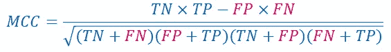

# 马修斯相关系数:何时使用，何时避免

> 原文：<https://towardsdatascience.com/matthews-correlation-coefficient-when-to-use-it-and-when-to-avoid-it-310b3c923f7e?source=collection_archive---------8----------------------->

## 这不是解决分类问题的灵丹妙药

马库斯·斯皮斯克在 [Unsplash](https://unsplash.com?utm_source=medium&utm_medium=referral) 上的照片

当我在 StackExchange 上遇到[这个关于不平衡分类问题度量的问题时，我知道了马修斯相关系数(MCC)。Boaz 在他的名为](https://datascience.stackexchange.com/questions/51808/multiclass-classification-on-imbalanced-dataset-accuracy-or-micro-f1-or-macro?rq=1)[*“Matthews Correlation Coefficient Is The Best class ification Metric You Never Heard”*](/the-best-classification-metric-youve-never-heard-of-the-matthews-correlation-coefficient-3bf50a2f3e9a)的中型故事中出色地解释了使用 MCC 的优势，我相信许多人在下次遇到棘手的不平衡分类问题时都会受到启发并兴奋地使用它。

但是等等……最好的*分类度量？*

*让我们在二进制分类问题的背景下更仔细地考虑 MCC。与 F1 得分类似，MCC 是一个总结混淆矩阵的单值指标。混淆矩阵，也称为误差矩阵，有四个条目:真阳性(TP)、真阴性(TN)、假阳性(FP)和假阴性(FN)。使用 MCC 而不是 F1 分数获得的主要好处可以通过查看他们的公式很容易地猜到:*

****

*当我输入 FP 和 FN 时，它们是红色的，因为它们是不可取的*

*F1 分数忽略真阴性的计数。相比之下，MCC 友好地将其关注扩展到混淆矩阵的所有四个条目。《计算生物学中机器学习的十个快速提示》的作者 Davide Chicco 评论说，MCC“只有在你的分类器在正负元素上都表现良好的情况下才是高的。”*

*现在让我们把第一感觉放在一边，看一个具体的例子(MCC 的 wiki 页面中使用的同一个例子):*

*有条目的混淆矩阵:TP = 90，FP = 4；TN = 1，FN = 5。*

*F1 得分= 0.9524，误导我们认为分类器极其优秀。相比之下，将这些数字代入 MCC 的公式，我们得到的是可怜的 0.14。MCC 的范围从-1 到 1(嘿，反正是相关系数)，0.14 表示分类器非常接近随机猜测分类器。从这个例子中，我们可以看出，MCC 有助于识别分类器在分类特别是负类样本时的无效性。*

*然而，F1 分数很大程度上受哪个类被标记为积极的影响。F1 分数在数量上与 MCC 相差如此之大，因为少数族裔被贴上了负面标签。让我们通过颠倒正反标签来看另一个例子:*

*有条目的混淆矩阵:TP = 1，FP = 5；TN = 90，FN = 4。*

*F1 分 0.18，MCC 0.103。这两个度量向从业者发送分类器表现不好的信号。*

# *F1 的分数通常已经足够好了*

*重要的是要认识到多数类通常被标记为负面的(如第二个例子)。这是因为更罕见或更“有趣”的样本通常被标记为阳性，例如患有罕见疾病的患者(他们被检测为阳性)。对于这些问题，F1 分数通过更加强调积极的类别来实现其作为良好指标的目的。*

# *F1 分数可能优于 MCC*

*我们在构建一个好的模型和选择信息性的度量标准上所付出的努力是为了一个主要的目的:解决现实生活中的问题。因此，不要急于下结论说某种方法或方法论是“最好的”，因为一种尺寸很难适合所有人。**如果数据分析从业者有幸拥有商业领域的知识，他或她可能知道精确度和召回率是如何贴近客户的核心。在这种情况下，F1 分数以一种比 MCC 更容易解释的方式融合了精确度和召回率。**只有在低精度和低召回率的成本确实未知或不可量化的情况下，MCC 才优于 F1 分数，因为它是对分类器更“平衡”的评估，无论哪一类是正面的。*

# *结论*

*MCC 在数学上构造得非常漂亮，从分类器的输出被视为一个单一实体的意义上来说，它是全面的——一个可以与真实标签进行比较的变量。这可以说是二元分类问题的最佳度量。*

*这个故事试图比较 F1 得分和 MCC，并说明 F1 得分对于人们通常遇到的分类问题也是非常有用的。此外，在选择度量标准时，应该始终考虑问题的先验知识(如领域知识)。如果你亲爱的客户更关心 F1 的分数呢？*