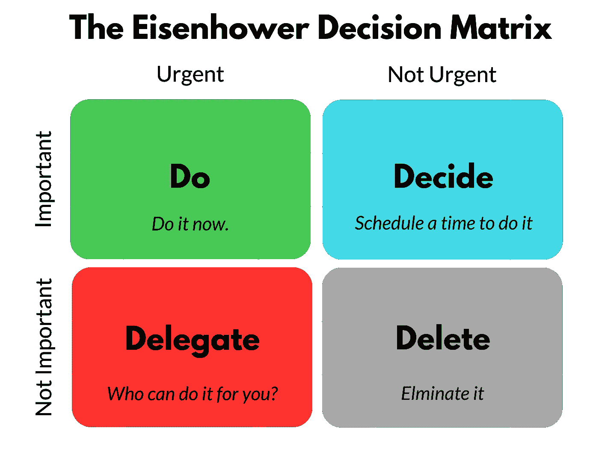
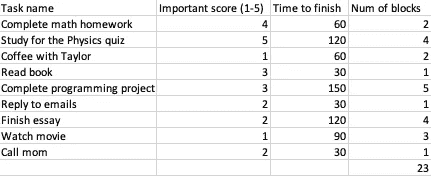
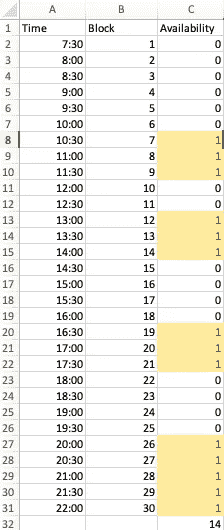
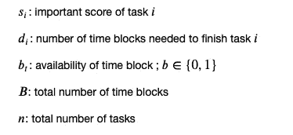
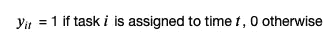
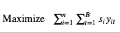
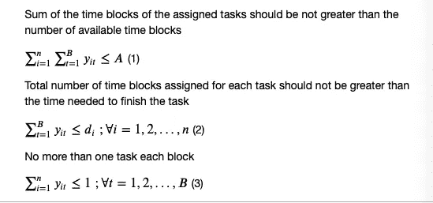
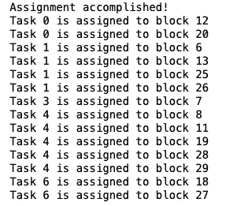
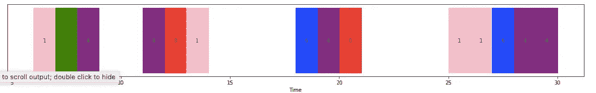

# 使用 Python 最大化您的生产力

> 原文：<https://towardsdatascience.com/maximize-your-productivity-with-python-6110004b45f7?source=collection_archive---------5----------------------->

## 你创建了一个待办事项清单来提高效率，但最终却把时间浪费在了不重要的任务上。如果您可以使用 Python 创建一个任务选择系统来最大化您的生产力，会怎么样？

# 动机

你有没有发现自己在一天之内写了一个长长的待办事项清单，但是在检查了清单上的许多方框之后，却感觉什么都没做？原因是你虽然完成了很多任务，但大部分都很紧急却不重要。我们大多数人花时间完成需要的事情，而没有意识到我们没有做任何事情来投资我们的未来，比如读书。那么解决办法是什么呢？



艾森豪威尔矩阵来自[卢克斯特](https://luxafor.com/the-eisenhower-matrix/)

正如你在上面看到的，解决方法很简单，优先考虑重要的任务而不是琐碎的任务。但是这需要时间来找出如何适应我们一天中的重要任务，同时仍然去上课/工作/开会。好消息是，只要掌握一点 Python 知识和数学思维，您就可以轻松地创建自己的系统来最大化生产率。

# 方案

假设你在一天中有不同的任务要完成。早上 7 点是一天中完成所有任务的最早时间，晚上 10 点是最晚时间。由于每个时间段是 30 '，所以有(15 小时)*(2 块/小时)= **30 块**。每个任务需要**不同的时间来完成**和**不同的重要分数**。鉴于白天有**个预定会议**，您无法分配任务。你如何分配任务给**最大化生产力**？

注意:由于每天的时间有限，您**不需要分配一天中的每项任务**，目标不是适合每项任务，而是**最大化总分**

下图是我根据自己的日常工作和任务创建的数据。



任务



时间段

在`availability`列中，0 表示该时间段不可用于分配任务(你可能在这些时间吃早餐、去上班、开会、上课)，1 表示其他情况。

读取数据:

```
import pandas as pd
tasks = pd.read_csv('tasks.csv')#We simplify our problem by using time block instead of hours
schedule = pd.read_csv('schedule.csv')['Availability']
```

# 纸浆优化

如果您不熟悉 PuLP，它是一个 python 库，使您能够解决优化问题。你可以在这里找到关于这个图书馆的纪录片。我将使用这个方便的包来制定和解决我们的问题。

## 安装软件包

克隆回购

```
git clone [https://github.com/khuyentran1401/Task-scheduler-problem](https://github.com/khuyentran1401/Task-scheduler-problem)
```

安装所有依赖项

```
pip install -r requirements.txt
```

## 导入模块并定义问题

```
from pulp import *#Define and name the problem. The objective is to maximize the productivityprob = LpProblem("Schedule_Tasks",LpMaximize)
```

## 输入参数



```
s = list(tasks['Important score (1-5)'])d = list(tasks['Num of blocks'])b = list(schedule)B = len(b)n = len(s)#Time blocks available
A = sum(b)
```

## 决策变量

是否在特定时间段内分配任务



```
y = LpVariable.dicts('Block', [(i,t) for i in range(n) for t in range(B)],
                    cat='Binary')
```

`LpVariable`允许您定义变量、名称、尺寸和类别。由于 y = 0 或 1，所以它是一个二进制变量。

## 目标

最大化总重要分数(通过选择一个重要的任务或通过选择许多任务)



```
prob += lpSum(s[i]*b[t]*y[(i,t)] for i in range(n) for t in range(B))
```

## 限制

有 3 个约束条件:

1.  分配的时间段数量不能超过可用的时间段数量。
2.  由于每个任务都需要一定的时间来完成，如果任务完成了，就不应该再将该任务分配到新的时间段。也就是说，需要两个时间段才能完成的任务不应该分配到三个不同的时间段。
3.  我们假设每个块只能完成一个任务



```
prob += lpSum(y[(i,t)] for i in range(n) for t in range(B)) <= A #1for i in range(n):
    prob += lpSum(y[(i,t)] for t in range(B)) <= d[i] #2for t in range(B):
    prob += lpSum(y[(i,t)] for i in range(n)) <= 1 #3
```

## 解决问题，观察答案

```
prob.solve()print("Assignment accomplished!")
for i in range(n):
    for t in range(B):
        if y[(i,t)].varValue ==1:
            print('Task {} is assigned to block {}'.format(i,t))
```

结果:



# 结果的解释

让我们看看选择的任务:

任务 0:完成数学作业。重要分数:4

任务 1:为物理测验学习。重要分数:5

任务三:看书。重要分数:3

任务 4:完成编程项目。重要分数:3

任务 6:完成论文。重要分数:2

有几件事需要注意:

*   不是每个任务都选(任务 2，5，7，8 都没选)。
*   重要的任务优先于不太重要的任务(任务 0、1、3、4 比其他任务有更高的重要分数)
*   并非每项选定的任务都在一天内完成(任务 6 被分配到 2 个区块，而需要 4 个区块才能完成)

# 这个解决方案实用吗？

解决方案的代价是我们无法在一天内完成所有任务。但是因为我们试图最大化一天中的重要任务，所以明智的做法是将重要任务排在其他任务之前。生产力不在于任务的数量，而在于我们完成任务的质量(T2)。

然而，有一件事我们应该考虑。在现实生活中，我们会像解决方案显示的那样，花 30 分钟完成一项任务，然后在完成前一项任务之前再做另一项任务吗？我们显然不想在短时间内从一项任务跳到另一项任务，但我们也不想因为在一项任务上工作太长时间(写一篇 2 小时的短文)而感到疲惫或厌倦。那么，我们如何对我们的问题建模，以便我们可以得到更接近现实生活的结果呢？我会让读者想出你的答案。我期待收到你的建议，这些建议要么对你的生活有用，要么对你认识的大多数人有用。

在[这个 Github repo](https://github.com/khuyentran1401/Task-scheduler-problem/tree/master) 中，您可以随意使用这篇文章的代码。

我喜欢写一些基本的数据科学概念，并尝试不同的算法和数据科学工具。你可以在 [LinkedIn](https://www.linkedin.com/in/khuyen-tran-1401/) 和 [Twitter](https://twitter.com/KhuyenTran16) 上联系我。

如果你想查看我写的所有文章的代码，请点击这里。在 Medium 上关注我，了解我的最新数据科学文章，例如:

[](/choose-stocks-to-invest-with-python-584892e3ad22) [## 用 Python 选择要投资的股票

### 您计划在未来 3 年投资几只股票，每只股票的每一美元都有不同的预期回报…

towardsdatascience.com](/choose-stocks-to-invest-with-python-584892e3ad22) [](https://medium.com/@khuyentran1476/comprehensive-numpy-tutorials-for-beginners-8b88696bd3a2) [## 为您的数据科学项目提供 Numpy 技巧

### 创建数组、矩阵、执行矩阵运算、解决线性代数问题和常见数据科学的技巧…

medium.com](https://medium.com/@khuyentran1476/comprehensive-numpy-tutorials-for-beginners-8b88696bd3a2) [](/how-to-build-a-matrix-module-from-scratch-a4f35ec28b56) [## 如何从头开始构建矩阵模块

### 如果您一直在为矩阵运算导入 Numpy，但不知道该模块是如何构建的，本文将展示…

towardsdatascience.com](/how-to-build-a-matrix-module-from-scratch-a4f35ec28b56)