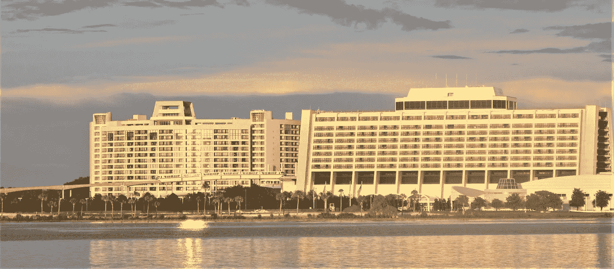
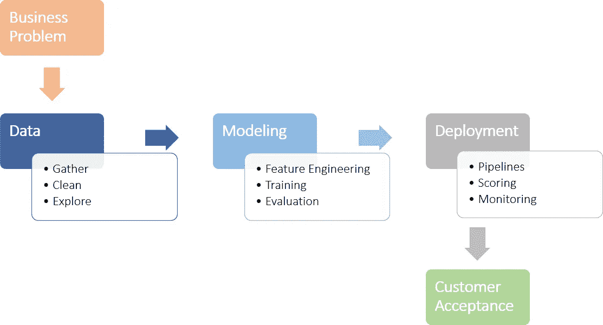
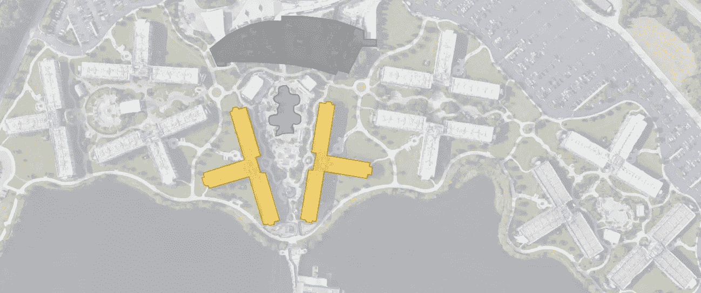
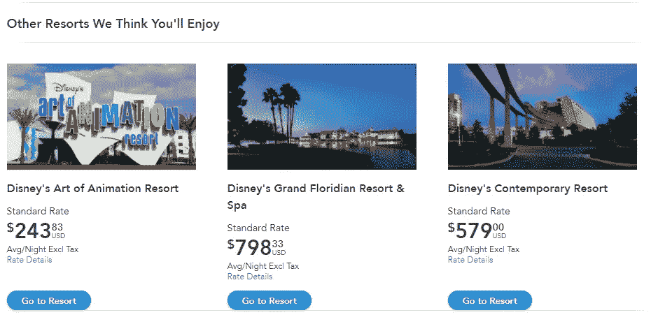

# 最大限度地采用数据产品

> 原文：<https://towardsdatascience.com/maximizing-adoption-of-data-products-3951745854cb?source=collection_archive---------53----------------------->

## [办公时间](https://towardsdatascience.com/tagged/office-hours)

## 确保你的基于 ML 的产品被内部商业客户接受的方法

华特·迪士尼世界当代度假村照片(作者拍摄)。

当科学团队构建[数据产品](/designing-data-products-from-a-customer-viewpoint-8e9f622ec27b)时，他们可能会遵循一个固有的过程。这个过程从收集数据开始，移动到模型构建，然后是模型生产。微软在 2017 年推出的[数据科学过程生命周期](https://docs.microsoft.com/en-us/azure/machine-learning/team-data-science-process/overview)【1】记录了这一过程。该流程由业务问题和客户对数据产品的接受程度来决定。作为参考，我在下面提供了数据科学流程生命周期的概述。

作者对数据科学流程生命周期的说明

如果你的团队和大多数人一样，你可能会花 90%以上的时间在这个生命周期的“中心流”上。可以说是最有趣的，也是最好玩的。就“业务问题”而言，产品经理专注于将业务问题转化为技术需求。这就剩下一个关键部分:客户接受度。“客户”既包括外部用户，也包括内部业务用户。

> 不幸的是，客户的接受通常是开发过程中的事后想法。

科学团队可以通过用户接受测试来确认客户的接受程度。更糟糕的是，科学团队可能会通过 RMSE、AUC 或 F1 分数等科学指标来验证客户对数据产品的接受程度。本文从内部业务用户的角度提供了接受客户的方法。我们应该认识到接受不是一次性的事情，而是贯穿数据产品生命周期的事情。我发现，至少有三个选项可以支持机器学习产品获得客户认可，或最大限度地采用。它们是:1)使它可以解释，2)提供一些控制，3)显示价值。让我们通过一组用例来探索这些组件。

# **让它变得可以解释……**

虽然展示机器学习驱动的产品的财务影响是强有力的证据，但有时企业领导人希望了解“引擎盖下发生了什么”。虽然不可扩展，但提供基于客户的例子来说明你的科学为什么有意义，可以在获得内部认可方面大有帮助。当我在迪士尼工作时，我们有时会遇到让内部业务客户接受我们团队数据产品的挑战。下面是我们所做的一个例子。

如果你曾经试图在华特·迪士尼世界度假村或任何地方的酒店预订住宿，你可能有时会发现酒店不可用。这并不奇怪，因为在一年中的某些时候，比如夏天或节假日，酒店房间的需求量可能会超过供应量。为了最大限度地减少这种情况，我们希望全年的需求保持平稳。特别是，我们希望通过提高高需求房间的价格和降低低需求房间的价格来实现这一目标。我们的团队建立了一个基于机器学习的数据产品，该产品根据房间类型、度假胜地和一年中的时间来量化需求的价格弹性。价格弹性计算的结果通常小于零。-0.01 到-0.99 的价格弹性告诉你，客户对价格上涨不太敏感，或者对定价缺乏弹性。这意味着你可以对提高价格充满信心，只需最低限度地减少需求。相反，价格弹性小于 1 意味着顾客对价格敏感。我们创建的模型可以向我们展示在特定日期某个度假胜地的湖景、停车场景或主题公园景房间之间的弹性差异，或客人价格敏感度。使用需求预测和价格弹性模型，我们能够计算出每种房间类型和度假村的最佳价格点。有了这些认识，我们可以向企业领导层建议价格变动。

我们的团队开发的是一个离线定价模型:一个内部工具，可以为迪士尼领导层提供关于来年战术定价变化的建议。当我们计划第一次回顾这些结果时，我们意识到其中一些变化是不寻常的。这是因为我们的许多建议与历史变化不同。对于那些看起来最违背直觉的建议，我们试图为科学的驱动力提供逻辑。我们采取了以客户为中心的方法，而不是“进入黑盒子”来确定最相关的功能。我们查看了在线留言板，过去的客人在那里分享度假小贴士。我们还开车去了度假村，亲自查看房间，并与度假村经理交谈，了解他们的见解。华特·迪士尼世界的一个度假胜地，[“动画艺术”](https://disneyworld.disney.go.com/resorts/art-of-animation-resort/)，有一种房间类型，我们的模型认为它在一年的大部分时间里是无弹性的。这种房型是“海底总动员”套房。除了主题之外，这个房间类型和动画艺术中的其他房间类型没有明显的区别。因为我们知道我们的数据产品中的 ML 模型可能会受到质疑，所以我们决定参观这个度假村。走了一圈之后，很容易明白为什么这位模特会提出这些建议。海底总动员套房都位于离最大的游泳池最近的地方。它也是最靠近主建筑的地方，这里有度假村的餐厅、零售店和电子游戏中心。在下面的地图中，你可以看到黄色突出显示的海底总动员套房，灰色的主建筑，蓝色的主游泳池。

来自谷歌地图的截屏，带有作者提供的覆盖图。

我们也能够通过查看迪士尼和旅游博客来确认我们的见解。我们注意到过去的客人为我们确定的原因提供了选择海底总动员套房的建议。我们的科学模型能够通过数据推断出这一点。虽然这不是一个可扩展的方法，但我们能够为我们的模型提供基于客户的验证。

# **提供一些控制…**

当创建主要用户是内部客户的数据产品时，您应该内置灵活性。

如果数据产品提供基于科学预测的建议，这一点尤其重要。面向内部客户的数据产品通常会取代现有的流程。在预测的情况下，遗留过程通常是一个没有因果关系的时间序列预测。从时间序列到基于科学的方法的最初商业案例是准确性和可解释性的提高。虽然基于 ML 的预测将包括许多特征，但实际上，该模型无法考虑战略决策、业务变化或其他外部因素。一个相关的例子是 Covid 导致的产品需求变化。没有任何科学模型能够预测到疫情或其持续的影响。

回到迪士尼的另一个例子，我们的团队构建了一个内部数据产品来推荐迪士尼公园和度假村的促销活动。我们促销的目的是在一年中表现不如预期的时期增加需求。因此，我们的促销是对客户对我们在上一节中讨论的定价的最初反应的回应。如果我们定价过高，促销可以让我们“调整方向”。我们开发的科学模型做了两件事。它推荐了 10%的折扣级别和促销的预订窗口.商业用户只需提供旅行窗口，或需求低于预期的一年中的时间。科学模型预测了不同折扣水平下的需求，并考虑了促销稀释。稀释意味着向客人提供折扣，即使他们可能会支付全价。

创建成千上万(或更多)预测并优化生成结果的科学模型的一个挑战是，最终用户可能不相信这些预测。这具有不相信优化结果或建议的后续后果。为了克服这些异议，我们提供了需求预测。这使得我们的内部客户能够理解模型“看到”了什么，并据此进行优化。我们还提供了场景分析功能，让用户可以查看不同折扣级别的预测。即使这样，我们仍然有客户接受的问题。这是因为迪士尼乐园和度假村的其他业务领域也在努力增加需求。在华特·迪士尼世界的某一年，有许多活动和节日。例子包括花卉和花园，食品和葡萄酒，并运行迪士尼周末。增加这些活动或改变其持续时间会对度假需求产生重大影响。这是科学模型无法理解的。

虽然不完美，但最好的方法是混合方法。这种方法从科学模型开始，然后结合内部客户的影响。具体来说，我们允许客户将自己的见解添加到科学预测中，然后根据机器学习模型和分析师输入的组合进行重新优化。为了取得成功，我们的数据产品包括:

> 接受内部客户输入(包括约束)的用户界面
> 
> 基于科学的建议的初步产出
> 
> 场景分析，包括嵌入在用户界面中的原始数据和可视化
> 
> UI 中允许内部客户提供需求“影响”的功能
> 
> 基于内部客户需求影响进行重新优化的能力
> 
> 存储初始预测供以后参考，以便在根据影响重新优化时减少模型运行时间

# **显示数值…**

帮助客户接受数据产品的第三个选择是展示可量化的好处。这可以通过 AB 测试来完成。不幸的是，并不是所有的数据产品都可以进行 AB 测试。例如，之前讨论过的内部数据产品通常不能以这种方式进行验证。内部客户接受的 AB 测试方法的最佳候选是直接与最终客户交互的基于 ML 的产品。这类产品的例子包括聊天机器人、个性化 UX 或推荐。

在华特·迪士尼世界，如果潜在的客人试图预订的度假村不可用，他们会得到建议。如果迪士尼没有这样做，潜在客户有可能会寻找非迪士尼的替代产品。这些选择可能包括呆在非迪士尼度假区或寻找另一个城市度假。下面的屏幕截图显示了这样一个例子。

https://disneyworld.disney.go.com 度假村推荐截图

在实施基于科学的模型之前，我们创建了基于业务规则的方法。这始于一个静态的度假胜地列表和一个相应的三个维度的“次佳选择”列表。例如，31 个华特·迪士尼世界旅游胜地中的每一个都可以基于相似的定价、主题相似性以及与主题公园之一的接近度而具有相关联的堆栈排名列表。如上面的截图所示，从每个维度选择的度假胜地可以满足三个推荐选项中的一个。这种基于业务规则的方法在 AB 测试中充当基线或“控制”。

一旦我们建立了基于 ML 的推荐产品，潜在的客人被随机分配到两组。半数访问网站的潜在客人看到了基于 ML 模型的推荐。另一半人看到基于业务规则方法的建议。AB 测试的目标是确定客人预订率的差异。一旦我们可以量化与新数据产品相关的增量提升，我们就可以计算每年的收益。通过年化的财务收益，科学工作的价值对领导层是显而易见的，使内部客户更容易接受。不幸的是，有两个警告。如前所述，只有某些类型的数据产品可以进行 AB 测试。第二，你不能假设 AB 测试结果不会改变。即使没有推出新功能，也应该建立重新测试的节奏，以确保价值仍然存在。

所以，概括一下:

仅仅因为一个团队建立了一个机器学习模型，并不意味着内部客户会相信并采用它。

产品和科学团队经理需要明确考虑如何获得内部客户对数据产品的接受，并考虑最终客户将如何受到产品的影响。

数据产品有可能通过以下协调努力获得内部认可:1)使输出可解释，2)提供一定的灵活性和对模型的控制，以及 3)展示财务或业务价值的实验。

**参考文献:**

[1][https://docs . Microsoft . com/en-us/azure/machine-learning/team-data-science-process/overview](https://docs.microsoft.com/en-us/azure/machine-learning/team-data-science-process/overview)