# 最大化 BERT 模型性能

> 原文：<https://towardsdatascience.com/maximizing-bert-model-performance-539c762132ab?source=collection_archive---------12----------------------->

## 一种评估预训练 BERT 模型以提高性能的方法

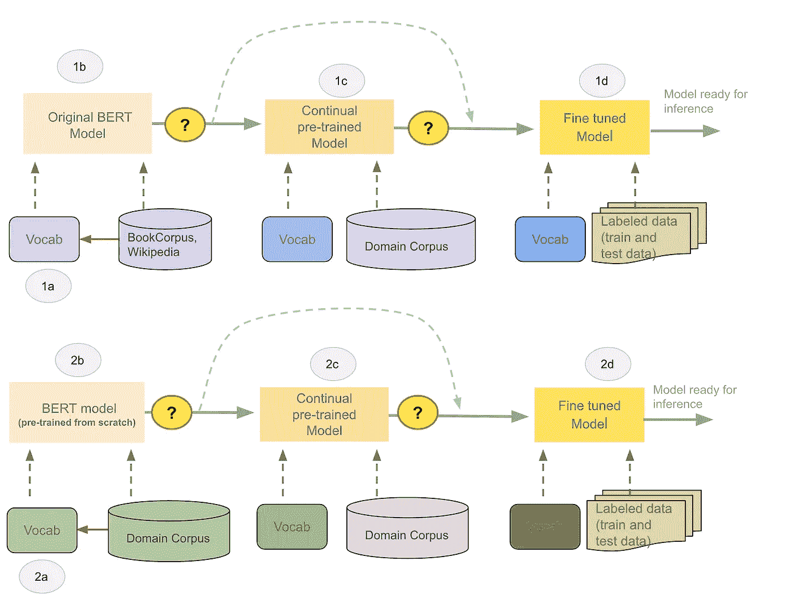

**图一。最大化 BERT 模型性能的培训途径**。对于实体类型—人、位置、组织等—的应用程序域。是主要的实体类型，训练途径 1a-1d 就足够了。也就是说，我们从一个公开发布的 BERT 模型开始([BERT-base/large-cased/uncased，或 tiny bert 版本](https://github.com/google-research/bert))，并可选地进一步训练它(1c-连续预训练)，然后针对特定任务对它进行微调(1d-带有标记数据的监督任务)。对于个人、位置、组织等的域。不是主要的实体类型，使用原始 BERT 模型对特定领域的语料库进行连续预训练(1c ),然后进行微调，可能不会像途径 2a-2d 那样提高性能，因为 1a-1d 途径中的词汇仍然是原始 BERT 模型词汇，具有对人、位置组织等的实体偏好。途径 2a-2d 使用从领域特定语料库生成的词汇表从头开始训练 BERT 模型。**注意**:任何形式的模型训练——预训练、连续预训练或微调，都会修改模型权重和词汇向量——在训练阶段从左到右，相同颜色模型的不同阴影(米色阴影)以及词汇(蓝色/绿色阴影)说明了这一事实。标有“？”的方框，是本文的重点—评估预训练或持续预训练的模型以提高模型性能。**作者图片**

# TL；速度三角形定位法(dead reckoning)

已经证明，在特定领域语料库(例如生物医学空间)上用特定于该空间生成的定制词汇从头训练 BERT 模型对于最大化生物医学领域中的模型性能是至关重要的。这在很大程度上是因为生物医学领域特有的语言特征，这些特征在谷歌*发布的原始*预训练模型*中没有得到充分体现(BERT 模型的自我监督训练通常被称为预训练)。*这些领域特定的语言特征是

*   **生物医学领域有许多该领域特有的术语或短语** — *，例如药物、疾病、基因等的名称*。这些术语，或者广义地说，生物医学领域语料库对疾病、药物、基因等的实体偏向。从模型性能最大化的角度来看，在原始预训练模型中没有足够的代表性。最初的 BERT 模型(*BERT-大型案例/无案例，BERT-基本案例/无案例)*用带有实体偏差的词汇表进行预训练，该词汇表[很大程度上偏向于人、地点、组织等。](/unsupervised-ner-using-bert-2d7af5f90b8a)
*   **生物医学领域特有的句子片段/结构**例如(1)“*<疾病名称>继发于<药物名称>……”，**“<疾病名称>对接受<治疗名称>治疗*的患者的前两个疗程无效

在保留原始词汇的领域特定语料库上进一步训练原始 BERT 模型，通常称为*连续预训练*，然后*在监督任务上进一步微调*模型已经显示出提高模型性能 [*(例如 BioBERT。图 1 中路径 1a→1b→1c→1d)*](https://arxiv.org/pdf/1901.08746.pdf)。然而，这样的模型的性能仍然落后于在具有领域特定词汇*(例如*[*SciBERT*](https://arxiv.org/pdf/1903.10676.pdf)*)的领域特定语料库上从头开始预训练的模型。图 1 中路径 2a→2b→2d)*。

假设 BERT 模型的典型用途是采用现有的预训练模型，并在任务*(图 1 中的路径 1a→1b→1d)*中对其进行微调，那么在实践中通常会做出一个隐含的假设，即原始的预训练模型经过了“良好”的训练，并且表现良好。只评估微调后的模型—预训练模型的质量是理所当然的。

然而，当我们使用自定义词汇表从头开始预训练 BERT 模型以最大化性能时，我们需要一种方法来评估预训练模型的质量。BERT 的预训练模型在屏蔽语言目标*(预测句子中屏蔽或损坏的标记)*或下一个句子目标上的损失在实践中可能不足。

下面列出的性能检查对于检查预训练模型可能很有价值

*   **上下文无关矢量性能**。检查构成 BERT 词汇的经过训练的上下文无关向量。特别是它们的聚类特征和词汇表中所有向量与其他向量的聚集分布。当执行该测试时，训练不充分/不适当的模型往往具有与训练良好的模型不同的特征。
*   **上下文敏感向量性能**。当上下文无关向量通过训练模型时，在它转换成上下文敏感向量之后，检查上述上下文无关向量的质量。这些转换后的向量显示了模型在屏蔽词预测中的表现。虽然这实质上是屏蔽语言模型损失值在训练期间捕获的内容，但是对几大类屏蔽语言任务*(如下所述)*的模型性能的细粒度检查可以揭示比代表模型损失的单个数字更多的模型性能。假设测试是全面的*，即包括针对特定领域实体类型的测试，并且具有特定领域句子结构*，则在该测量中表现不佳的模型表示模型训练不足。

下面使用这两个性能度量来检查一些公开发布的 BERT 预训练模型的质量。

下面讨论的这个练习的结果强调了评估预训练模型以最大化模型性能的重要性。它还帮助我们确定是否需要进一步预训练一个公开发布的模型，即使它是在我们感兴趣的领域内预训练的，在我们为一个领域特定的任务微调它之前。

## 快速回顾用于 NLP 任务的 BERT 模型用例

BERT 中的自我监督学习是通过屏蔽和破坏每个句子中的几个单词来实现的，并通过预测这些单词来让模型学习。尽管这种形式的学习*(自动编码器模型)*限制了模型生成新句子的能力，与 GPT-2 等自回归模型相反，预训练的 BERT 模型可以原样用于[无监督的 NER](/unsupervised-ner-using-bert-2d7af5f90b8a) 、[句子表示](/unsupervised-creation-of-interpretable-sentence-representations-851e74921cf9)等。在不需要任何标记数据的情况下，利用构成 BERT 词汇表的学习向量*(上下文无关向量)*和模型的 MLM *(屏蔽语言模型)*能力，即使用上下文敏感向量的 BERT 的“填空”能力*(出现屏蔽位置的模型的向量——原始词汇表中这些向量的邻居是填空的候选者)*。

然而，预训练 BERT 模型的流行和典型用途是针对下游监督任务对其进行微调。在某些情况下，微调之前可能会持续进行预训练，以提高模型性能*(图 2)* 。

任何形式的模型训练、预训练、连续预训练或微调，都会修改模型权重和词汇向量——在训练阶段，从左到右不同色调的相同颜色模型*(米色色调)*以及词汇*(蓝色色调)*说明了图 1 和图 2 中的事实。

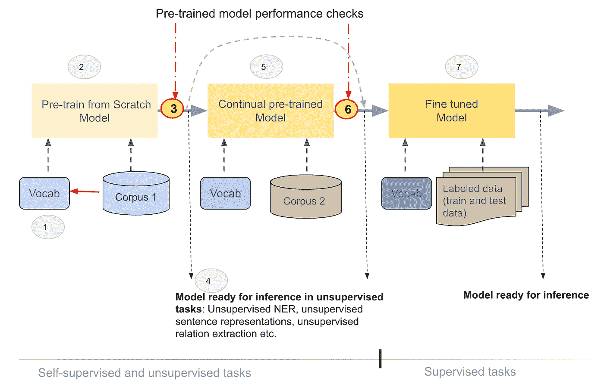

**图二。BERT** 的 MLM 或“填空”功能对于使用预先训练的模型来执行通常以无监督方式监督的任务可能具有巨大的价值(4)。例子有[无监督 NER](/unsupervised-ner-using-bert-2d7af5f90b8a) 、[无监督句子表示](/unsupervised-creation-of-interpretable-sentence-representations-851e74921cf9)、无监督关系提取等。此外,“填空”功能也可用于评估预训练模型的性能，这可能是最大化模型性能的关键步骤。**作者图片**

检查以下模型的证据表明，无论使用何种训练途径*(图 1 中的 1a-1d 或 2a-2d)*，对预训练模型性能的评估*(图 2 中的步骤 3 和 6)*可能是在下游任务中最大化模型性能的关键。

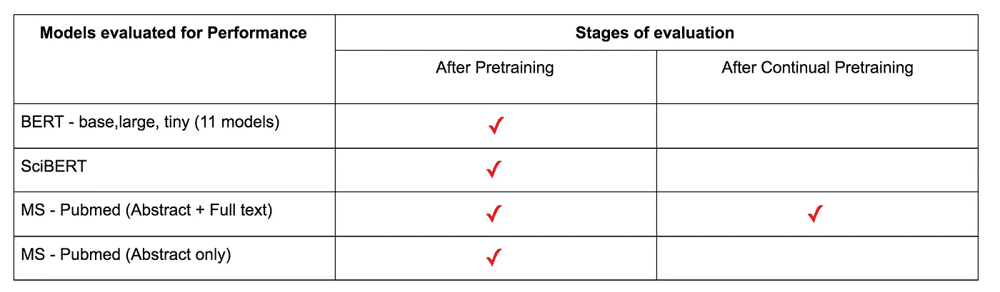

**图 3。评估性能的模型。** [伯特的 11 种典型风格——都在维基百科和图书语料库](https://github.com/google-research/bert)上训练过， [SciBERT 在语义学者的论文上训练过](https://github.com/allenai/scibert)，[微软 PubmedBERT](https://microsoft.github.io/BLURB/models.html#page-top;) 在 Pubmed 摘要和全文上训练过。为了这次评估，我在临床试验语料上对微软 PubmedBERT 进行了持续的预训练。**作者图片**

## 上下文相关向量的评估(MLM 检验)

三大类“填空”测试*(屏蔽语言模型预测)*用于评估模型性能。这些测试本质上是具有隐蔽位置的句子。屏蔽位置的模型预测分数*(在整个词汇表上)*用于评估模型性能。

*   **词汇测试**——一个模型在带有领域语料库特有术语的句子中表现如何。这个测试类别包含词汇表中出现的完整术语*(未分解成子词的术语)*以及由词汇表中的子词组成的术语。
*   **领域特定实体和句子结构测试** —测试模型预测句子中领域特定实体和领域特定结构的能力。
*   **基本语言句子结构测试** —这测试模型预测感兴趣的主要语言的基本句子结构的能力*(对于多语言语料库，这需要成比例地表示主要语言)*。

**词汇测试样本**

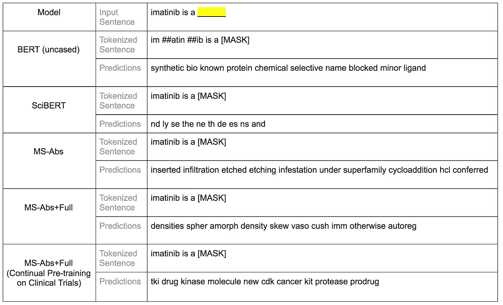

**图 4a。词汇测试样本** —空白位置的 5 个模型的前 10 个预测。尽管词汇中不存在术语**伊马替尼**，但 BERT base 无案例预测抓住了伊马替尼是一种化学物质的概念。相比之下，SciBERT 没有捕捉到它，尽管这个完整的词存在于它的词汇表中。这在一定程度上可能是因为 SciBERT 是在科学语料库而不是具体的生物医学语料库上预先训练的。两个微软预训练模型表现不佳，但其中一个(MS-Abs+Full)在持续进行临床试验预训练时，在所有 5 个模型中表现最佳。**作者图片**

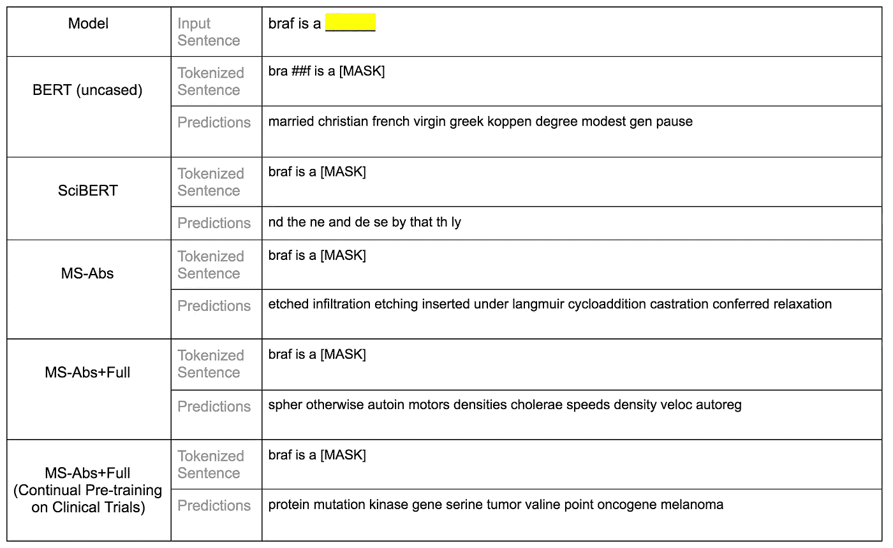

**图 4b。词汇测试样本** —空白位置的 5 个模型的前 10 个预测。伯特的无案例预测未能抓住 braf 是一种基因的事实。SciBERT 也没有捕捉到它，尽管在它的词汇表中有完整的单词 braf。这在一定程度上可能是因为 SciBERT 是在科学语料库而不是具体的生物医学语料库上预先训练的。两个微软预训练模型表现不佳，但其中一个(MS-Abs+Full)在持续进行临床试验预训练时，在所有 5 个模型中表现最佳。**作者图片**

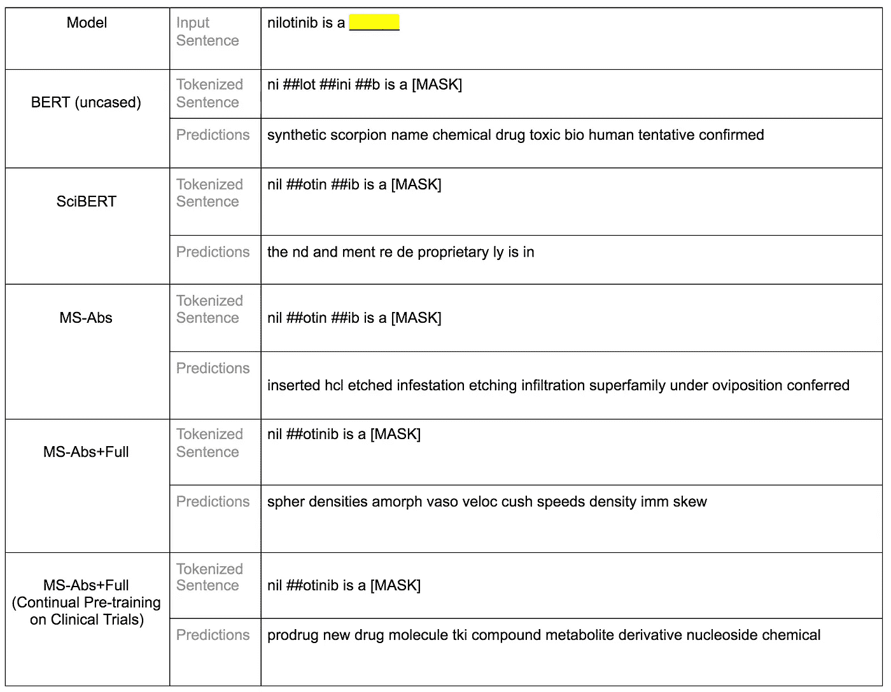

**图 4c。词汇测试样本** —空白位置的 5 个模型的前 10 个预测。尽管术语**尼罗替尼**没有出现在词汇中，但是 BERT base 无案例预测捕捉到了**尼罗替尼**是一种化学物质的概念。相比之下，SciBERT 没有捕捉到它，尽管这个完整的词存在于它的词汇表中。两个微软预训练模型表现不佳，但其中一个(MS-Abs+Full)在持续进行临床试验预训练时，在所有 5 个模型中表现最佳——在这种情况下，术语**尼罗替尼**被微软模型分解为子词。**作者图片**

**领域特定实体和句子结构测试样本**

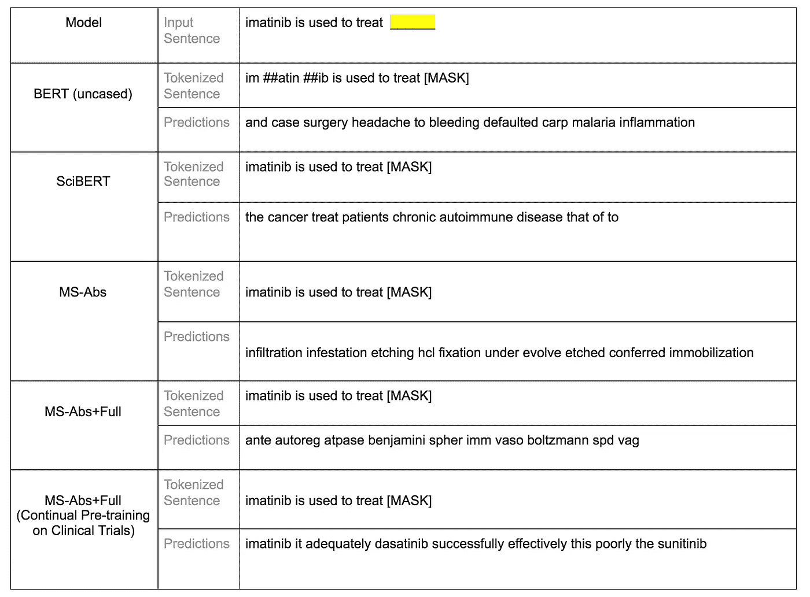

**图 4d。领域特定实体和句子结构测试样本** —空白位置的 5 个模型的前 10 个预测。BERT base uncased 预测抓住了伊马替尼治疗疾病药物的概念。赛伯特也捕捉到了它。微软模型在这项测试中表现不佳，即使在临床试验语料库连续预训练后也是如此。**作者图片**

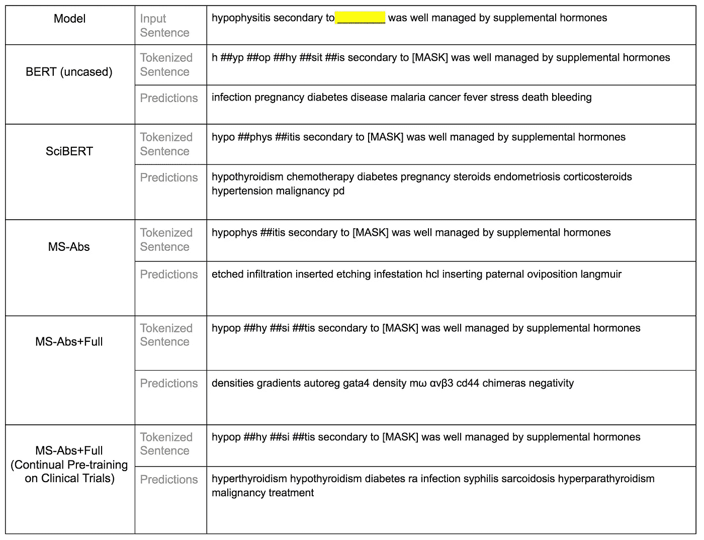

**图 4e。领域特定实体和句子结构测试样本** —空白位置的 5 个模型的前 10 个预测。在这个测试中，空白位置有一个实体歧义—可能是药物或疾病。伯特 base uncased 抓住了疾病的概念，但不是药物。西伯特抓住了疾病和治疗的概念。微软持续的预先训练也抓住了这两种感觉。这两个微软预训练模型在这个测试中表现不佳。**作者图片**

**基础语言句子结构测试样本**

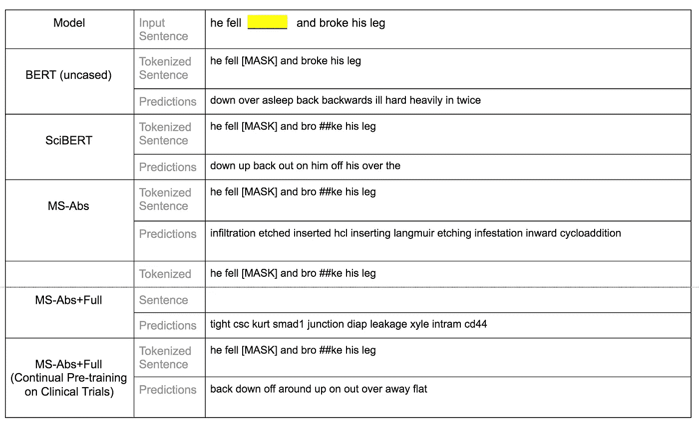

**图 4f。基础语言句子测试**—5 个模型对空白位置的前 10 个预测。考虑到训练它的语料库——维基百科和图书语料库，BERT base 在这个测试中毫不奇怪地优于其他模型。SciBERT 和 ms 连续预训练模型表现也很好，而两个 MS 预训练模型表现很差。**作者图片**

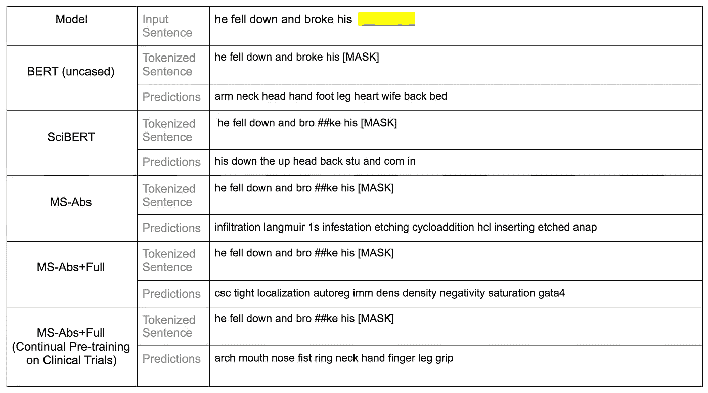

**图 4g。基础语言句子测试**—5 个模型对空白位置的前 10 个预测。BERT base 在此测试中也优于其他型号。SciBERT 和 ms 连续预训练模型表现也相当好，而两个 MS 预训练模型表现差。**作者图片**

**上述测试的总结**

虽然上面的测试纯粹是三大类别的说明性样本，但从业者可以使用像上面那样的少数定性测试来检测模型在训练模型时或训练模型后表现不佳。微软的两个预训练模型就是这样的例子——它们在所有测试中的表现一直很差。除了不准确的预测之外，表现不佳的模型还表现出不充分/不正确的预训练的其他迹象——它们具有相同的签名噪声，如不同/不同输入句子的术语。

然而，要确定模型是否经过预训练以获得最佳性能，必须在这些类别中创建足够数量的测试案例，然后根据空白位置的最佳模型预测对性能进行评分。

概括地说，在上面的测试中，

*   ***微软预训练模型，在临床试验中持续预训练*** *(持续预训练由我* [*完成，以评估*](https://drive.google.com/file/d/1De5P6kwiAcu-8uU96gMuu8hZXpXnpdQc/view) *)* ***在生物医学领域测试中表现最佳，在基本语言测试中表现相当好*** 。
*   尽管没有特定领域的词汇，BERT 在生物医学测试中表现得相当好*(除了特定领域的术语预测)*，表明它经过了良好的预训练。
*   SciBERT 的表现也相当不错，然而，无论是在生物医学领域还是在基本语言测试中，他都无法超越。
*   两个公开发布的微软预训练模型(PubMedBERT)，如上所述，表现最差。鉴于持续的预训练提高了模型的性能，使其成为此次评估中生物医学领域的最佳模型，这间接证明了微软模型*(即使上面的样本太小，无法得出模型性能的结论)*在训练时间更长(*最先进的模型尚未由微软发布—* [*三个模型中的两个*](https://arxiv.org/pdf/2007.15779.pdf) *已发布-表 8。【论文中)】T27。这也强调了在将模型发布/用于其他任务之前对其进行评估的重要性，尽管事实上随后对在该测试中表现不佳的模型进行微调，仍然可以产生最先进的结果*(两个 ms 模型就是这方面的证据)。**

## 上下文无关向量的评估(词汇检查)

除了由表现出不充分/差训练的可测量迹象的训练模型输出的上下文敏感向量之外，构成 BERT 词汇的向量也可以揭示关于训练质量的可测量信息。举个例子，

*   根据伯特学习向量词汇表中的每一项与词汇表中所有其他向量的余弦分布构建的直方图。这些直方图可用于识别可能训练不充分/不正确的模型。
*   对术语的顶部邻居进行采样也有助于揭示训练质量——顶部邻居往往是通常具有相同实体类型的那些。
*   词汇向量的聚类。在训练期间或者在预训练和连续预训练运行之间比较训练模型的集群，提供了对连续训练的效果的洞察。

**各种模型的余弦分布直方图**

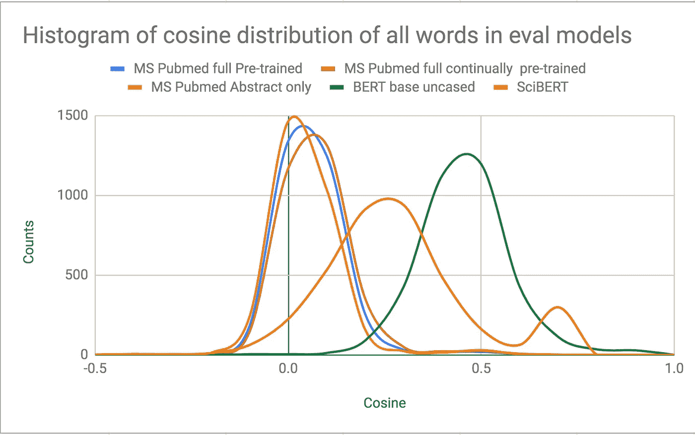

**图五。****5 个评测模型的词汇中随机抽取约 1000 个词的余弦分布直方图**。微软模型即使在持续的预训练之后，也有一个看起来更像 BERT 大模型的分布(如下)。然而，总的来说，这些并没有显示出任何异常，表明词汇向量得到了充分的训练。在连续预训练后，分布仅轻微向右移动，进一步支持了该结论。向量组(下面将会讨论)也为词汇向量被充分训练的说法提供了证据。这导致了一个合乎逻辑的结论，即 MS 模型权重可能没有被充分训练。持续的预培训解决了这一问题，带来了一流的表现。这一结论得到了以下事实的进一步证实:MS 已经训练了一个模型更长的时间，并且在所有三个模型中产生了最好的分数(三个模型中最好的模型尚未由微软公开发布)。与所有被检查的分布相比，SciBERT 有第二个凸起，使其具有独特的形状——其原因尚不清楚。一般来说，这些直方图对于检测可能指示一些潜在现象的异常分布是有用的。**以上图片作者**

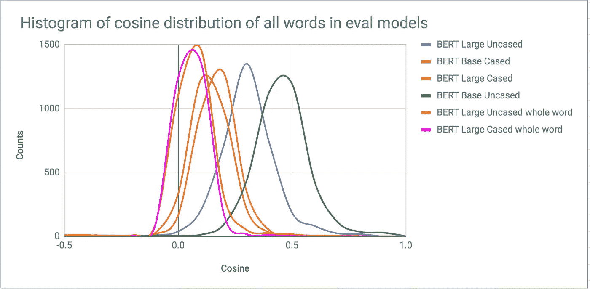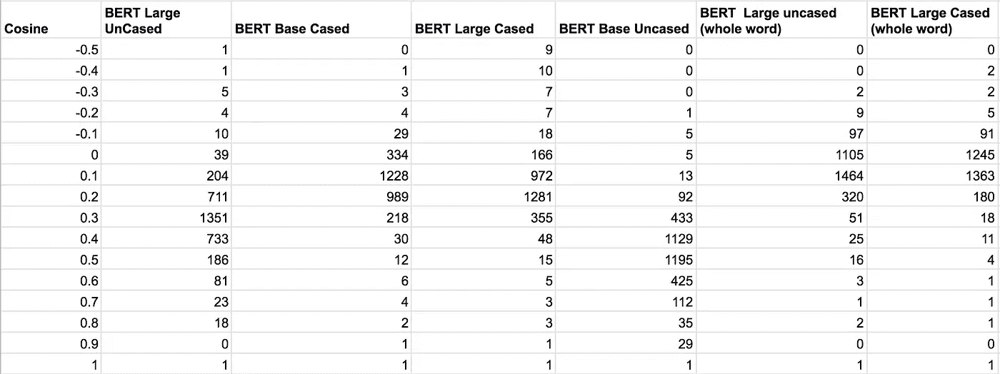

**图六。** **随机抽取词汇中约 1000 个词的余弦分布直方图。** BERT 大模型(有壳和无壳，全字屏蔽)往往有一个较长的尾巴。无案例模型的分布均值更倾向于向右偏移，基础模型比大型模型更是如此。有趣的是，MS 模型与 BERT 基本模型(768 dim12 层)具有更像 BERT 大模型的分布。**以上图片作者**

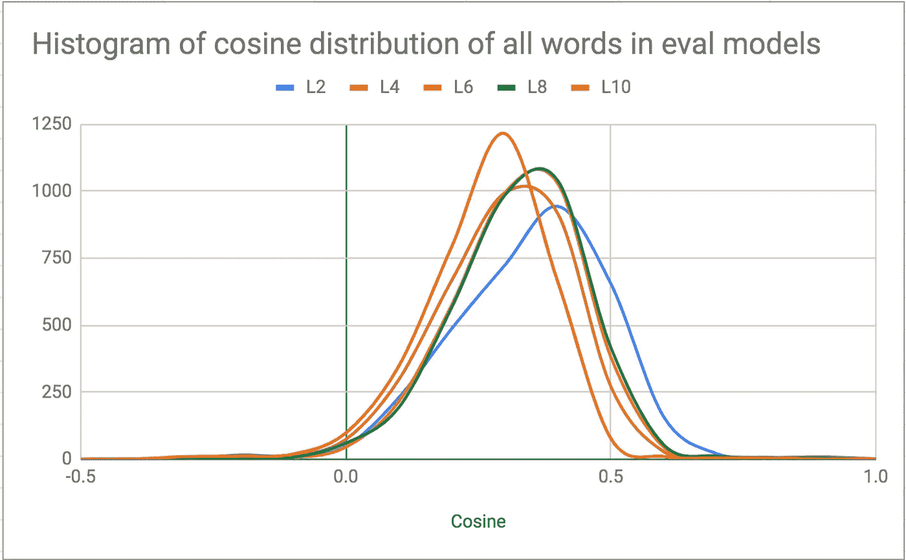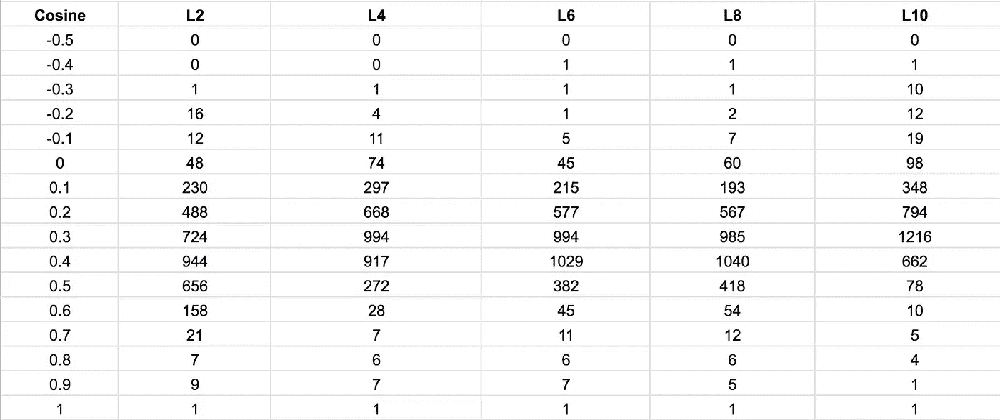

**图 7。** **随机抽取约 1000 个词汇样本的余弦分布直方图。**2、4、6、8、10 层伯特微小模型分布。随着层数的增加，平均值向左移动，类似于从 BERT 基本模型(12 层)到 BERT 大模型(24 层)的平均值移动**上图作者**

上面的数字没有显示所有 5 个评估模型的任何异常，表明在构成 BERT 词汇的向量的训练中没有明显的异常。下面对几个样本单词的余弦距离邻居测试进一步证实了这一点。

然而，包括连续预训练模型*(图 6)* 在内的 MS 预训练模型的一个奇怪的特性是，768 维的词汇向量*(类似于基于 bert 的模型)*具有类似于具有全词屏蔽的 1024 BERT 模型的分布轮廓(图 7)。很可能是全字掩蔽导致了这种分布概况*(*[*)MS 模型被预训练*](https://arxiv.org/pdf/2007.15779.pdf) *(具有全字掩蔽)*。如果是这样的话，还不清楚为什么全词屏蔽会导致如此大量的向量几乎与其他向量正交*(下面的实现注释详细说明了这一点，但还没有回答这个问题)*即使在训练 *—* 之后，MS 预训练模型和 BERT 全词*(有壳和无壳)*的 y 截距超过 1000，与没有全词屏蔽的 BERT 基本模型和大型模型形成鲜明对比，后者低于 500 *。*

**之前使用的少数词汇测试术语的前 10 个邻居**

对以下术语的邻居测试显示，它们的邻居都很好，即使对于两个 ms 预训练模型和 SciBERT 也是如此，这两个术语都出现在除 BERT 之外的所有评估模型的词汇表中。然而，这三个模型在包含这些术语的句子测试中表现不佳，这表明模型层的训练与词汇向量本身相反是不充分的。MS 模型的分布尾部的平均长度相对较高，表明高质量的邻居，为训练有素的词汇向量提供了进一步的证据*(下面的实施说明中有示例)*

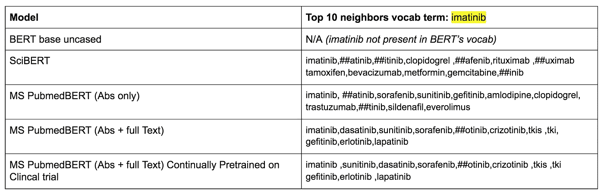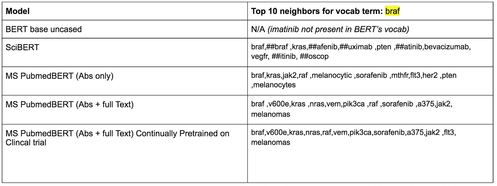

**图 8。** **词汇测试中使用的两个词的前十名邻居**。对这两个词的测试表明，它们的邻居都很好，即使对于两个 ms 预训练模型和 SciBERT，这两个词也存在于除 BERT 之外的所有评估模型的词汇中。然而，这三个模型在包含这些术语的句子测试中表现不佳，这表明模型层的训练与词汇向量本身相反是不充分的。**以上图片作者**

**词汇向量的聚类**

此外，当检查由微软预训练模型*(摘要+全文)*及其持续预训练版本的向量形成的聚类时，其中聚类是用固定阈值(60 度-0.5 余弦)完成的，80%的聚类是相同的。这进一步证实了这样的事实，即使在原始的预训练模型中，词汇向量也得到很好的训练。需要进一步培训的是模型层。词汇向量的聚类没有固定阈值，但具有基于单个术语确定的截止值*(主要基于特定余弦距离的邻居的个位数计数)*，显示了 MS 模型的长尾*(实施说明中的示例)*。这进一步证明了训练有素的词汇向量。

# [连续]预培训的顺序流程

下图显示了在训练和连续预训练期间最大化模型性能的顺序流程。下面的顺序甚至适用于模型输出一组检查点*(相对于一个最终检查点)*的情况，我们评估每个检查点，如流程所示。但是，在这种情况下，如果一个检查点未通过 MLM 检查，我们可以丢弃它，前提是选择了一个更新的检查点作为候选检查点。

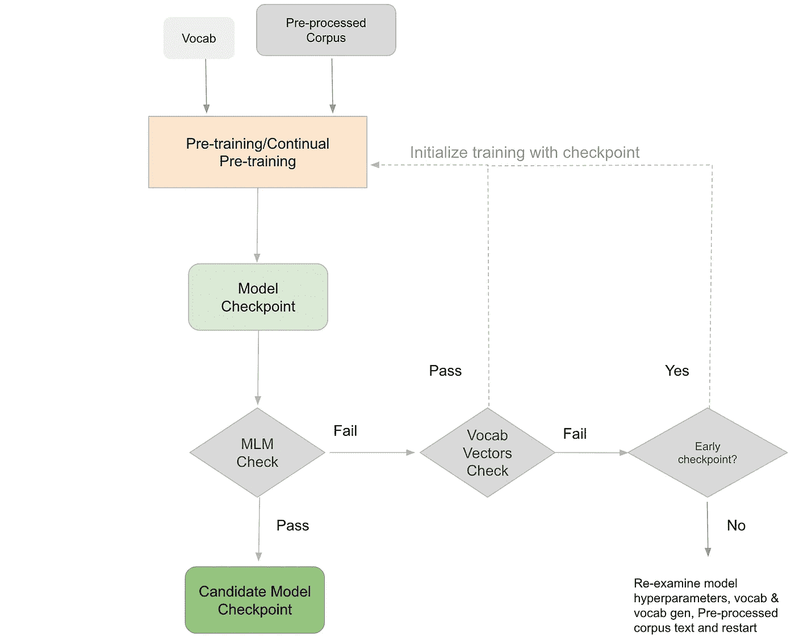

**图 9** 显示了在训练和连续预训练期间最大化模型性能的顺序流程。**作者图片**

# 最后的想法

对具有定制词汇的领域特定语料库进行预训练或持续预训练已被证明是从业者的关键，尤其是当将该模型用于各种下游任务时，无论是受监督的还是不受监督的。任何不利用特定领域定制词汇表的方法都被证明产生相对次优的结果，至少在生物医学领域是这样。当进行预训练或持续训练时，不像通常的方法那样只对一定数量的步骤或时期进行预训练，而是对下游任务进行微调，按照本文中讨论的思路评估模型可能会在这些下游任务中产生更好的性能。

从从业者的角度来看，BERT 的“填空”(MLM)学习方法的效用不能被夸大，尽管这种学习方法限制了该模型成为像 GPT-2 那样的生成性模型。除了如本文所示用于评估训练的 BERT 模型的质量之外，“填空”能力在与学习的词汇向量结合使用时，有助于将传统的监督任务转换为非监督任务(例如[非监督 NER](/unsupervised-ner-using-bert-2d7af5f90b8a) )。

# 实施说明

*   术语“微调”的澄清。在本文中，微调仅用于接受预先训练或持续预先训练的模型，然后在监督任务中对其进行训练的任务。
*   当 BERT 模型被持续训练/微调时，可以添加额外的特定于域的令牌。这是一个有限的改进，在上面的文章中没有提到，因为它没有解决原始词汇表中的实体偏差问题。
*   预处理语料库遵循 [BERT 的 Github 页面](https://github.com/google-research/bert)中的建议是最大化模型性能的关键。使用 [HuggingFace](https://github.com/huggingface/transformers) 的预训练目前有一个限制——它在训练之前将整个语料库读入内存*(这个代码正在快速更改，所以这个问题可能会很快得到解决)*。这使得在没有大量内存的情况下，对大型语料库进行预训练是不切实际的。
*   当使用[原始 BERT 发布代码](https://github.com/google-research/bert.git)进行【连续】预训练时，全词屏蔽已被证明可提高模型性能。当创建训练前记录时，而不是在训练前*期间，需要指定该选项(我犯了这个愚蠢的错误，并想知道为什么在生成训练记录期间没有发生全词屏蔽。但是请注意，如果我们检查训练记录输出，我们可能会发现单词的前缀被屏蔽，而后缀没有——这只是因为随机标记替换(BERT 既屏蔽又替换)发生在标记化的句子上*。
*   当使用[原始 BERT 发布代码](https://github.com/google-research/bert.git)进行【连续】预训练时，用于创建预训练记录的序列长度需要与预训练期间使用的序列长度相同。
*   当使用[原始 BERT 发布代码](https://github.com/google-research/bert.git)进行【连续】预训练时，可能需要选择与我们选取的序列长度相对应的批量大小，批量大小也由可用的 GPU 内存决定
*   当使用[原始 BERT 发布代码](https://github.com/google-research/bert.git)进行预训练时，即使是针对特定领域进行预训练，也可能有助于添加来自通用语料库(如[图书语料库](https://huggingface.co/datasets/bookcorpus))的句子。然而，该语料库不必是 vocab 生成的一部分。
*   当使用[原始 BERT 发布代码](https://github.com/google-research/bert.git)进行预训练时，定制词汇文件生成最好在领域语料库的子集上完成，该子集从术语的角度来看是有代表性的和干净的。检查词汇向量的群集可以揭示看起来有噪声的群集。这可能表明词汇生成过程可以改进。对于词汇生成子集语料库，最好有选择地删除与我们感兴趣的领域不相关的非 ascii 字符。数字术语也是一样*(对于数字术语，我们需要确保添加 0-9 的次数与词汇生成中的最小频率计数一样多，以确保它们被包含在内)*。这为固定大小的词汇留下了更好地表示语料库的空间。然而，这些字符/术语最好保持原样用于训练。在标记化期间，它们将被未知标记*(或者在数字的情况下——由数字构成)*替换，同时仍然保留句子结构*(移除它们将影响句子结构)*。
*   下图显示了从头开始预训练模型时矢量分布的直方图。正如人们所料，所有向量几乎都是相互正交的——这是高维向量随机初始化的好处。

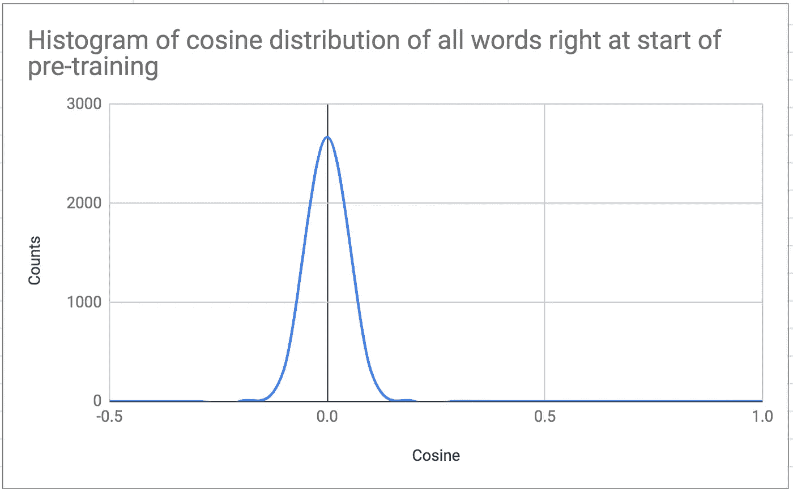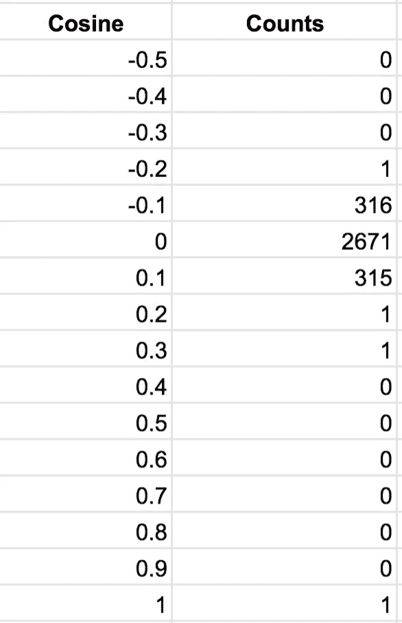

**图 10** 。**从零开始预训练模型时，词汇中大约 1000 个词的随机样本的余弦分布直方图。**正如人们所料，所有向量几乎相互正交——这是高维向量随机初始化的简单好处。值得注意的是，所有 BERT 发布的预训练模型都有数百个正交向量，只有一千多个的全词屏蔽模型除外。MS 预训练模型具有类似的高数量的正交向量，并且即使在连续预训练之后也保持如此。**需要回答的问题是，这些向量是在训练期间移动，然后变得接近正交，还是在训练期间根本不移动**。如果结果是它们根本没有移动，那么这可能表明词汇生成没有真正代表特定领域语料库——这个问题可以通过在真正代表整个语料库的语料库子集上重新生成词汇来解决。然而，检查具有大量正交向量的项揭示了具有长尾的高质量邻域。这类似于我们在全词屏蔽 BERT 模型中看到的情况。这表明，全词屏蔽似乎在创建实体类型、保持具有语义上接近的术语的高质量邻域以及通过使它们接近正交来分离语义上不接近的术语方面起作用。**以上图片作者**

*   全词掩蔽在确定词汇向量的质量中起着重要作用，这可以通过两个测量来量化:( 1)与术语正交的向量的数量平均增加。这些正交向量是语义上远离术语的术语。( 2)术语与词汇表中其他术语的余弦距离分布中的尾部长度也增加。这对于像[无监督 NER](/unsupervised-ner-using-bert-2d7af5f90b8a) 这样的任务具有巨大的价值，在这些任务中，实体标注依赖于词汇向量簇。下图说明了使用全字屏蔽时正交向量的数量呈线性下降，而不使用全字屏蔽时呈指数下降

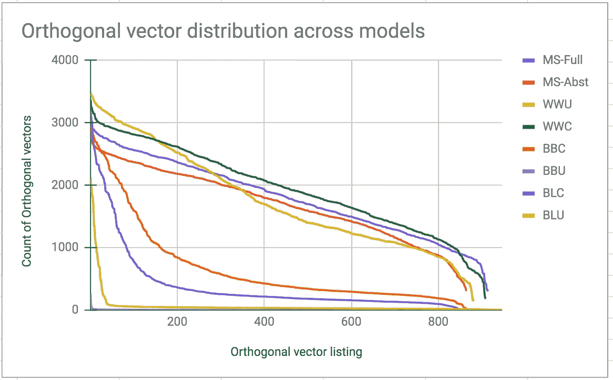

**图 11。**全词掩蔽对词汇向量的影响。与某项正交的向量数量显著增加(y 截距更高)。所有全词屏蔽模型(MS 模型和两个 BERT 模型)都表现出这种行为。此外，与非整词屏蔽的指数下降相比，对于整词屏蔽模型，正交向量的下降是线性的。高正交向量计数间接表示高质量的向量邻域。**上图作者**

*   下图显示了没有和有全词屏蔽的示例术语的邻域

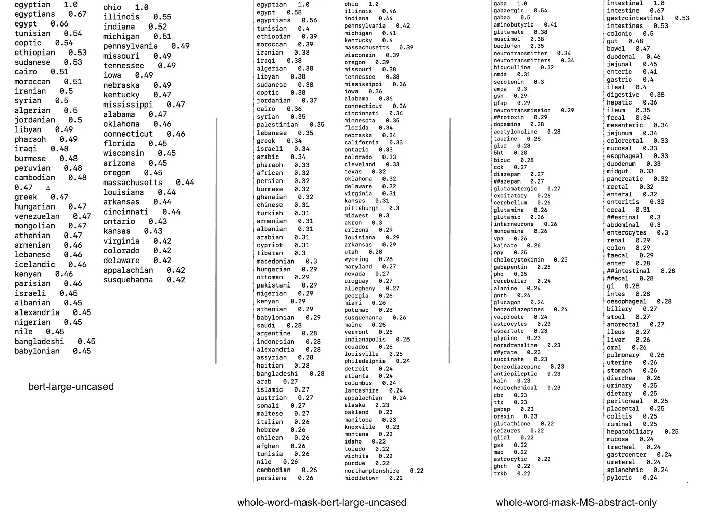

**图 12。**对于全词屏蔽模型，实体类型以长尾形式保留，这与没有全词屏蔽的模型相反(左侧为 bert-large-uncased)。**上图作者**

*   用于本次评估的 Github 库 [MLM 检查](https://github.com/ajitrajasekharan/bert_mask)和 [vocab 检查](https://github.com/ajitrajasekharan/bert_vector_clustering)
*   上述评估中使用的 MS 预训练模型的时间戳。这些模型可能会在将来被训练得更好的模型更新，使得本文的一些结果不可复制。

[本次评估中使用的 MS 摘要+全文模型的时间戳](https://huggingface.co/microsoft/BiomedNLP-PubMedBERT-base-uncased-abstract-fulltext#list-files)。**作者图片**

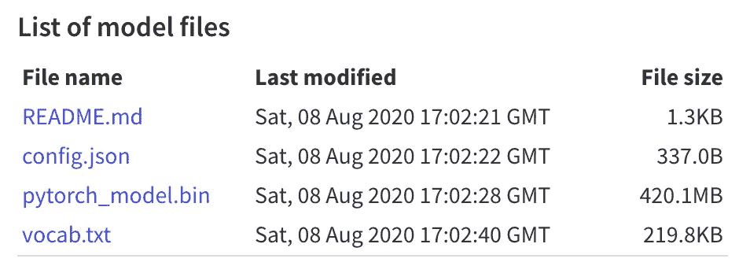

[本次评估中使用的仅 MS 抽象模型的时间戳](https://huggingface.co/microsoft/BiomedNLP-PubMedBERT-base-uncased-abstract#list-files)。**作者图片**

*   更新了文章，将[CLS]矢量性能纳入模型评估。下一句预测可用于[学习对各种任务有用的高质量句子表达](/swiss-army-knife-for-unsupervised-task-solving-26f9acf7c023)。以下可视为评估预训练模型质量的测试列表。(1)对上下文敏感向量的 MLM 检查*(如上所述)* (2)对上下文无关向量的评估——聚类*(不是固定阈值，而是每个词的 z 分数驱动阈值)*、累积分布形状的直方图——是均值远且接近 1 还是理想地接近 0、零向量计数/分布(与向量正交的向量的数量)；(3)【CLS】性能

*本文原帖* [*Quora*](https://qr.ae/pNgh9D)