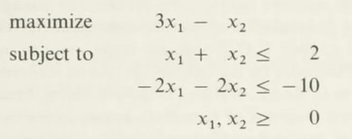
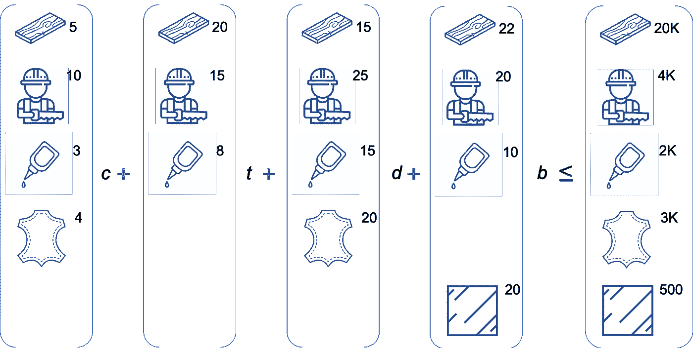
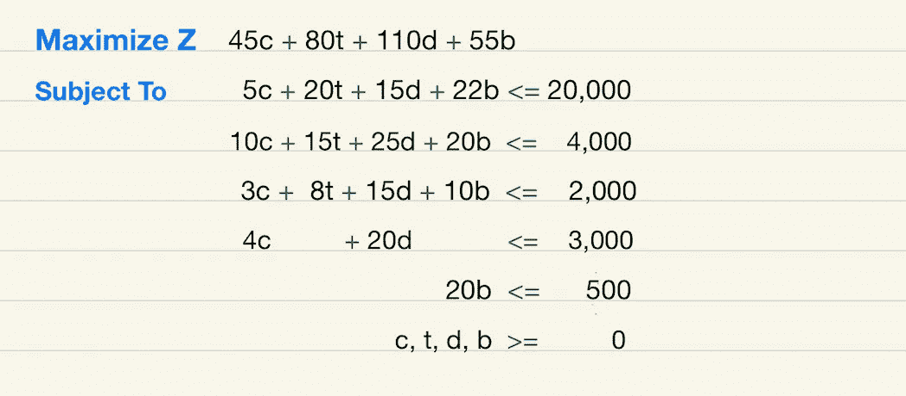
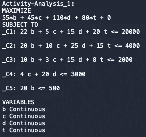
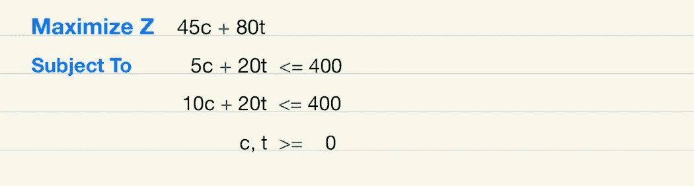
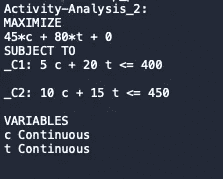
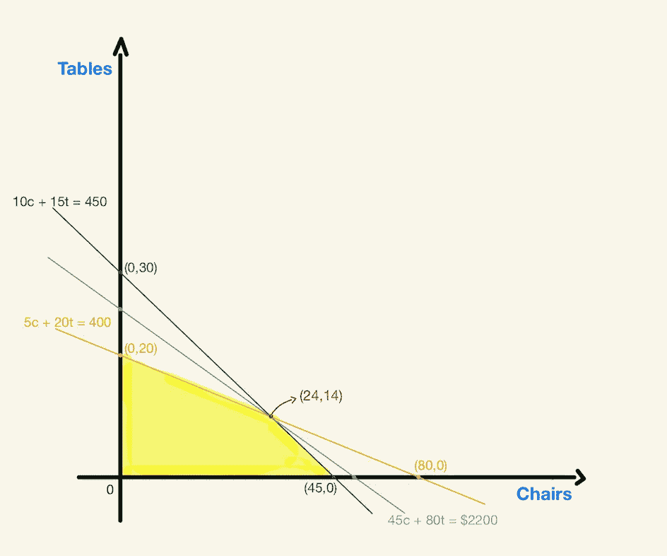

# 使用 Python 中的线性规划实现利润最大化

> 原文：<https://towardsdatascience.com/maximizing-profit-using-linear-programming-in-python-642520c43f6?source=collection_archive---------8----------------------->


[明丹迪](https://www.freepik.com/mindandi)在 [FreePik](https://www.freepik.com/premium-photo/carpenter-working-with-equipment-wooden-table-carpentry-shop_5143131.htm) 上的照片

## 学习如何解决最大化线性规划问题

## 线性规划(LP)和单纯形算法已经存在了几十年。早在 40 年代，它就被美国空军首次引入，用于帮助制定战略计划。从那时起，许多行业都在利用它来最大化利润和最小化成本，等等。

*单纯形法*是为了帮助解决 lp 问题而设计的，它基本上就是我们将在这里看到的。随着技术领域的进步，这种方法开始被使用，不仅在军事上，而且在无数的行业。今天，我将向大家展示一个我们如何利用这种算法的例子。我将介绍以下内容:

1-线性规划的基本概念

2-如何制定一个线性规划问题

3-如何使用 Python 求解线性规划

4-用图解的方式看 LP 问题

# 基本概念

线性规划和*线性不等式*齐头并进。也就是说，许多现实生活中的问题都受到一些限制，例如生产一把椅子的原材料数量。换句话说，有些限制阻止我们在不影响其他产品生产的情况下生产一种产品。

例如，假设你需要木材来制作椅子和桌子，那么你可用的木材数量就限制了你能生产的椅子和桌子的数量。

本质上，这正是 LP 试图解决的问题:如何系统地分配资源，以便从我们所拥有的限制(*约束*)中获得最大收益，同时考虑，例如，你从他们的销售中获得的利润的潜在*最大化*。关于这一点，我们可以使用 LP 来最大化利润，或者最小化成本。有趣的是，我们可以将最大化问题转化为最小化问题，反之亦然。但这不会是这里的重点。

在 LP 中，当我说“解决”时，并不意味着我们会一直找到解决方案(比如 2 + 2 = 4)。我们可以公式化一个 LP 问题，做一些数学计算，并得出结论，特定的 LP 问题没有最优解，这是解决 LP 的主要目标:试图获得唯一的最优解。这可能是因为一些问题可能有太多不同的*最优解*或者甚至根本没有*最优解*。

我们可能遇到没有*最优解*的 LP 的一些原因可能超出了我们的控制。在许多情况下，问题太复杂而无法解决(找到唯一的*最优解*)。在解决 LP 问题时，我们可能想问自己一个问题:问题*可行*还是*不可行*？有些问题甚至可以有很多*可行*解，最后被*无界*。总结一下，我们可以把一个 LP 问题分为三类:*最优解*、*不可行*、*无界*。

在这里，你将看到一个 LP 问题的例子，它给了我们一个*最优解*。但是在我们开始解决问题之前，我想给你看一个传统 LP 问题的例子:



摘自《线性规划》一书(Chvatal 1983)

第一行写着“*最大化*，这就是我们的 ***目标函数*** 所在的位置。这也可以说“*最小化*”，这将表明我们的问题是一个*最小化*问题。

第二行和第三行是我们的 ***约束。*** *这是*基本上是什么阻止我们，让我们说，最大化我们的利润到无限。就像我已经提到的，这是我们可以发现*线性不等式* (≤、=、≥)的部分。我还必须透露，有不同的方法来解决一个线性规划问题，例如，BigM，对偶，两阶段的方法等。

不幸的是，试图在这里涵盖 LP 的所有细节是适得其反的，我希望您已经掌握了一些基础知识，可以继续学习我们的示例。如果没有，我会在这篇文章的末尾删除一些参考资料，这样你就可以参考了。

> false 优化是现代研究对决策过程的革命性贡献——乔治·丹齐格

# **问题**

假设我们在一家制造公司的数据科学团队工作。我们在这里要解决的问题被命名为“活动分析问题”(Gass 1970)。数据科学团队的目标是*通过定义生产多少种不同的产品，并考虑到可用资源的有限性，来最大化*制造公司的利润。通过改善公司的运营和资源配置，我们有可能最大化利润，这是我们这里讨论的焦点。

公司生产四种家具:**椅子**、**桌子**、**书桌**和**书柜**。主要成分是红木，但他们也使用胶水，皮革，玻璃和工时。例如，当我们看到一把椅子时，制作一把椅子真正需要的是 5 板英尺的红木，10 个工时的劳动，3 盎司的胶水和 4 平方英尺的皮革。生产一张桌子，我们需要 20 英尺木板，15 个工时，8 盎司胶水。一张桌子由 15 板英尺、25 工时、15 盎司胶水和 20 平方英尺皮革制成。最后，书柜是用 22 英尺木板、20 个工时、10 盎司胶水和 20 平方英尺玻璃制成的。

以下是制作一把单人椅子所需材料的示例:


作者图片

瓶颈是所有这些材料每周的可用总量如下:

**-** 两万板英尺的红木

**-**4000 工时

**-**2000 盎司胶水

**-**3000 平方英尺的皮革

**-** 500 平方英尺的玻璃

正如你所看到的，有限数量的材料使我们无法同时生产无限数量的产品。也就是说，我们的工作是决定如何更好地分配这些资源，以获得最大利润。这是一个如何开发数据驱动的决策流程的练习。

但是为了建立这个问题，我们需要知道每个产品给公司带来的利润。提示:这就是我们想要的*最大化*。

他们在这里:

**-** :每把椅子 45 美元

**-** :每桌 80 美元

**-** :每张桌子 110 美元

每个书架 55 美元

等等！人们可能决定只生产桌子，因为仅这一项就有最高的利润(110 美元)。但是，为什么我们不应该接受这种方法呢？我会留给你答案。

由于我们想生产所有这四种产品，并向我们的客户提供良好的产品组合，同时分担风险，我们真正想知道的是，为了获得最大利润，每种产品我们必须生产多少单位。这就是 LP 建模可以帮助我们解决这个问题的地方。

# 公式化线性规划问题

对于这个 M *最大化* LP 问题，我们将用项目名称的第一个字母来表示项目。同样， ***c*** 为椅子， ***t*** 为桌子， ***d*** 为书桌， ***b*** 为书柜。

就像我们在前面的例子中生产一把椅子需要什么一样，我们将对所有其他项目遵循类似的模式。下面我们可以看到制作每一个产品所需的资源量。请注意，制造这些产品的总量必须是可用资源总量的*减*或*等于*。



作者图片

请慢慢阅读这个模式。我只是把制造我们四种产品中每一种产品的数据放在一起，加上*约束*，这是可用的资源(最后一栏)。

现在，为了以一种更传统的方式来制定我们的 LP，我们所要做的就是带来项目的利润(目标函数*)。下面是这个 LP 问题的最终表述:*

**

*作者图片*

*我们做到了。恭喜你！拍拍你自己的背，因为通常，公式化一个 LP 问题是这个过程中最难的部分。记住“垃圾进，垃圾出”，所以一个 LP 如果制定不当，是不会带来多大价值的。*

*既然我们已经将问题公式化了，我们将使用 Python，更具体地说，使用名为 PuLP 的库来解决这个 LP。没有进一步的原因，让我们做那件事。*

> *线性规划是线性代数的推广。它能够处理**各种问题**，从为航空公司或影院中的电影寻找时间表到从加油站向市场配送石油。如此多才多艺的原因是约束可以很容易地被结合到模型中——史蒂文·j·米勒*

# *使用 Python(纸浆库)求解线性规划*

*关于如何在 Anaconda 上安装纸浆的说明可以在[这里](https://anaconda.org/conda-forge/pulp)找到。*

*因为这是一个简单的例子，而且我们没有处理很多变量、约束等，我们不会使用任何文件(比如 *csv* 文件)并将其导入 Python，我们只是输入这几个变量。我们也可以创建一个 Python 程序来请求用户以一种更高层次和更有组织的方式来做这件事，但是我会把这留给你。*

*我将把这个部分分成两部分:第一部分我们将使用 PuLP 在 Python 中解决这个问题，第二部分我们将解决它。*

## *第一部分:*

*安装完纸浆后，我们需要导入纸浆库，如下所示:*

```
*# import the library PuLP as p 
import pulp as p*
```

*接下来，我们将设置最大化问题并初始化变量:*

```
*# Set Up a LP Maximization Problem:
Lp_prob = p.LpProblem('Activity-Analysis_1', p.LpMaximize) # Here we named the Problem "Acitity-Analysis_1".

# Set Up Problem Variables: 
c = p.LpVariable("c", lowBound = 0) # "c" for chair
t = p.LpVariable("t", lowBound = 0) # "t" for table
d = p.LpVariable("d", lowBound = 0) # "d" for desk
b = p.LpVariable("b", lowBound = 0) # "b" for bookcase*
```

*现在，这就是我们将创建*目标函数*(我们试图*最大化*)和*约束*的部分。*

```
*# Create Objective Function:
Lp_prob += 45 * c + 80 * t + 110 * d + 55 * b    

# Create Constraints: 
Lp_prob += 5 * c + 20 * t + 15 * d + 22 * b <= 20000
Lp_prob += 10 * c + 15 * t + 25 * d + 20 * b <= 4000
Lp_prob += 3 * c + 8 * t + 15 * d + 10 * b <= 2000
Lp_prob += 4 * c + 20 * d <= 3000
Lp_prob += 20 * b <= 500*
```

*最后，我们将显示这个问题，以确保事情看起来不错。*

```
*# Show the problem:
print(Lp_prob) # note that it's shown in alphabetical order*
```

*运行上述代码后，您的 LP 问题应该是这样的:*

**

*作者图片*

*正如你所看到的，显示的问题看起来像我以前写的那个，除了纸浆按字母顺序组织变量，这对解决方案没有任何影响。到目前为止，我们所做的只是输入我们之前讨论过的变量，并用 Python 对 LP 问题建模。为了简单和更容易理解，我们现在不解决它，而是在第二阶段。*

## *第二阶段:*

*在这里，我们将创建一个新的简化问题，该问题源自我们刚刚看到的问题。这样做的原因只是为了更容易传达解决方案，这也有助于获得解决这类问题的额外直觉。*

*好的，在这个新问题中，我们仍然使用相同的变量，但是现在我们把它减少到只有两个变量(椅子和桌子)，并且我们改变了一些数字。这是我们新的*最大化*问题的样子:*

**

*作者图片*

*事实上，我们保留了大部分的数字不变，但是现在，红木的总数是 400，工时总数是 450。第二个约束条件也由“15t”改为“20t”。现在我们将用 Python 解决这个问题，如下所示:*

```
*### Simplifying the Problem and Solving it #### Generate a New LP Maximization Problem:
Lp_prob2 = p.LpProblem('Activity-Analysis_2', p.LpMaximize)

# Generate Problem Variables (>= 0): 
c = p.LpVariable("c", lowBound = 0)
t = p.LpVariable("t", lowBound = 0)# Create Objective Function:
Lp_prob2 += 45 * c + 80 * t #+ 110 * d + 55 * b    

# Set Up the Constraints: 
Lp_prob2 += 5 * c + 20 * t <= 400
Lp_prob2 += 10 * c + 15 * t <= 450# Show the problem:
print(Lp_prob2) # note that it's shown in alphabetical order*
```

*同样，让我们看看这个新问题是如何在 Python 中显示的:*

**

*作者图片*

*它看起来很好，所以现在我们可以着手解决它。下面是这样做所需的代码。请注意，我们将打印解决方案的“状态”，它只是告诉我们解决方案是否是*最优*(或者不是)。在这个例子中，我们得到了一个*最优* *解*。*

```
*# Solve the Problem:
status = Lp_prob2.solve()
print(p.LpStatus[status])   # Display Solution Status*
```

*请记住，并非所有 LP 问题都有一个*最优*解决方案。现在，为了真正看到实际的数字，我们需要如下所示的*打印*结果。*

```
*# Printing the final solution 
print(p.value(c), p.value(t), p.value(Lp_prob2.objective))# Result: 24.0 14.0 2200.0*
```

*于是我们得到了“24”、“14”、“2200”。有人可能想知道这些数字是什么，对吗？结果是，24 和 14 分别是我们需要生产的椅子和桌子的最佳数量，以便获得 2200 美元的*最佳*利润。提示:线性编程完全是关于*优化*。*

*如果您愿意，可以创建一个循环来显示这个结果。这里有一个例子:*

```
*# Printing Number of Chairs and Tables:
for var in (c,t):
    print('Optimal number of {} to produce is: {:1.0f}'
          .format(var.name, var.value()))# Output:
# Optimal number of c to produce is: 24
# Optimal number of t to produce is: 14*
```

*换句话说，考虑到我们对可用的红木数量和工时的限制，生产这两种物品并获得最大利润的最佳组合是: *c* =24 把椅子， *t* =14 张桌子，为了找到最佳利润，我们必须将目标函数带入该方程。这将看起来像: **$45 x 24 + $80 x 14 = $2，200** 。*

*我们刚刚用单纯形算法解决了这个问题。现在，我们可以根据数据做出决定，并得到结果的支持。不是基于直觉，对吗？！*

*还有一件事我需要指出的是，单纯形可能是相当具有挑战性和棘手的解决方案。虽然在这里看起来像是小菜一碟，但是如果你试图用手来解决它，如果你不知道实际上是什么和如何做，你会有一段艰难的时间。感谢上帝，现在我们有能力使用像 Python/PuLP 这样的解决方案来做到这一点。*

*在结束我的案例之前，我想向你展示如何将这个问题绘制成图表。解决线性规划问题有许多方法，图解法是其中之一。*

## *使用单纯形图*

*所以，我走到白板前，画出了单纯形图，让我们的讨论更进一步。下面是绘图(可以在 Python 上使用 Matplotlib 完成):*

**

*作者图片*

*看起来不错吧？！让我向你解释我们是如何到达那里的。*

*首先，我们开始查看 LP 问题的第一个不等式(5c + 20t ≤ 400)，在这种情况下，用橙色表示。我们需要的是找到两个点，一个为 *c* 轴，另一个在 *t* 轴(记住 *c* 为椅子， *t* 为桌子)。想出那个最简单的方法是假设如果 *c* = 0，我们必须得到 *t* = 20，并在 *t* 轴上标记那个“点”；如果 *t* = 0，那么我们得到 *c* = 80，我们把它画在 *c* 轴上。*

*其次，我们绘制最后一个约束(10c + 15t ≤ 450)，用绿线表示。按照与前面相同的方法，我们得到轴上的点如下:45，0 和 0，30。*

*在这个图中，我们看到的是这两个不等式的叠加。通过重叠它们，我们可以计算出所需的解空间，也就是黄色突出显示的区域。这个区域中的任何点都将满足这个问题的约束，这个组合代表了考虑到我们可用的资源(桃花心木和工时)，我们可以生产的不同的桌椅组合。当两条线相交时，我们得到的*最优*值为 24，14(红色)。这意味着 *c* =24，而 *t* =14 正好满足这两个约束。我们在使用纸浆时也发现了同样的结果，但是如果你想证实这一点，你可以使用一些代数方法。*

*最后我们看*目标函数* (45c + 80t = 0)。这由灰色线表示。现在，让我们想一想。如果公司不生产任何桌椅，它的利润会是多少？零，对吗？！这将意味着 *c* =0，而 *t* =0。这是我们使用单纯形法的起点，我们可以将那条灰线从零向上移动到与 *c* 和 *t* (24，14)相交的点，但不能移出黄色区域的边界。通过这样做，我们最终得到了最优的公式，我们以前见过这个公式: **$45 x 24 + $80 x 14 = $2，200。***

*到现在为止，你可能已经有了可以用不同的值进行实验的直觉，并且最终基于*目标函数*的变化测试了多个最佳解决方案。我希望这对你有用。*

*这个例子摘自 Saul I. Gass 的《线性编程图解指南》一书。你可以在我的 GitHub [这里](https://github.com/Lucianoboas/LP-Problem/blob/master/LP%20Modeling_Activity-Analysis%20Problem.py)找到代码。*

> *开始吧，但不要试图一餐吃掉大象。从试点项目开始，构建您的第一个仪表板。从那里你可以学习、提高并扩展到其他领域——鲁珀特·邦汉姆·卡特*

## *结论*

*在本文中，您了解了 LP 的一些基本概念，您了解了如何制定 LP 问题，以及如何解决它。资源的优化将永远是世界上许多公司议事日程的一部分。根据项目的范围，*最大化*和/或*最小化*总是有问题。*

*数据科学家至少需要有一个关于 LP 如何有用的非常基本的概念，以及我们今天可以用来帮助我们的资源。我希望这篇文章能激励你去做自己的实验。祝你好运。*

*谢谢大家！*

## *参考资料:*

*[1] Lial，格伦威尔和 Ritchey，2012:有限数学。马萨诸塞州波士顿:皮尔逊。*

*[2] Chvatal，Vasek，1983:线性规划。美国:弗里曼。*

*[3] Gass，Saul I .，1970:线性规划图解指南。加拿大:多佛。*