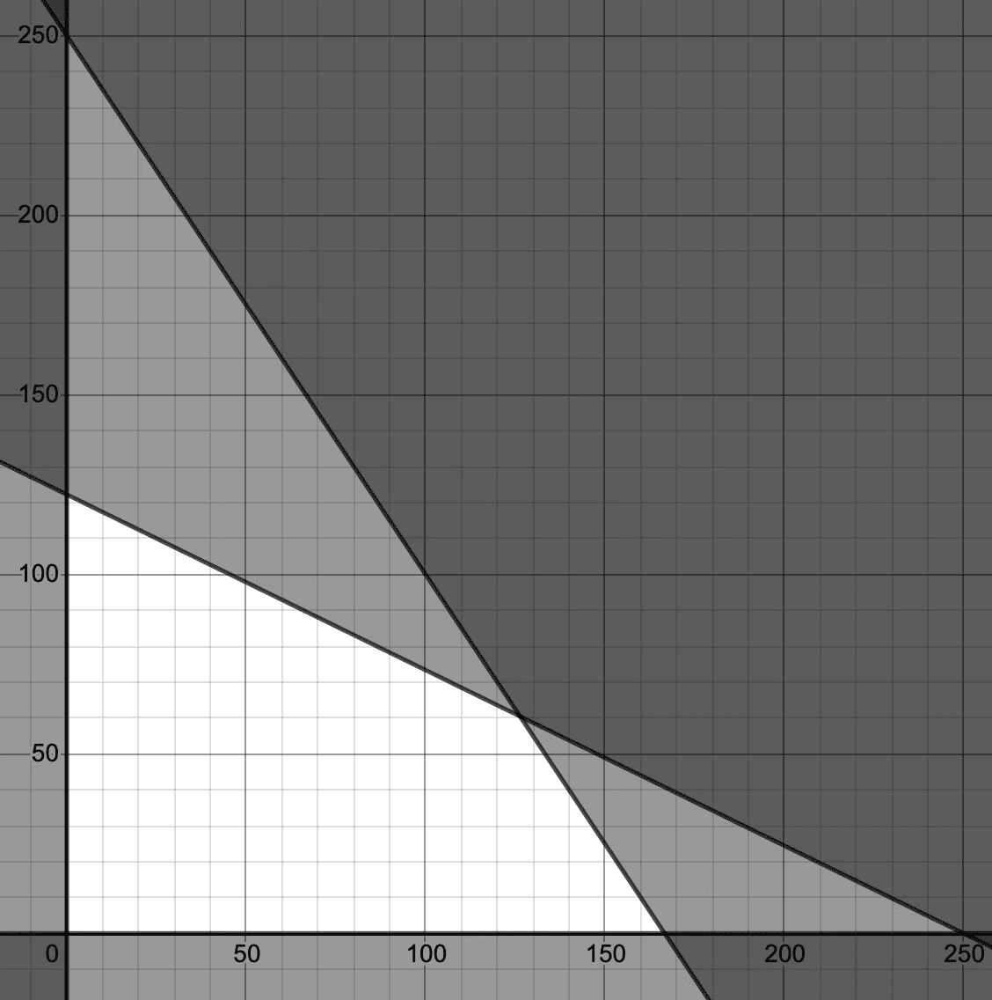

# 通过可用材料实现利润最大化

> 原文：<https://towardsdatascience.com/maximizing-profits-by-materials-available-3be9f1a64d6d?source=collection_archive---------57----------------------->

## 线性规划在供应链运作中的应用初探

Guillaume Bolduc 在 [Unsplash](https://unsplash.com/s/photos/ship?utm_source=unsplash&utm_medium=referral&utm_content=creditCopyText) 上拍摄的照片

> 如果你正在寻找一款更深入一点的 jupyter 笔记本，看看[这款笔记本](https://nbviewer.jupyter.org/github/kevkevinpal/MathTeachingTools/blob/master/linearProgram.ipynb)

虽然有些公司可能没有实物商品，但在今天的世界上，许多公司仍然有，对于这些公司来说，重要的是不要浪费任何材料，因为这意味着浪费金钱。

我们将研究一个线性问题，假设我们有实物产品，而我们只有有限数量的材料来制造这些产品，我们如何最大化我们得到的回报。我们将通过创建一个线性约束优化问题来做到这一点，并举例说明。

# 现在，让我们设置一个示例问题。

1.  我们卖什么，卖多少钱？在当今时代，加入家具游戏可能不是最明智的举动，但这正是我们今天要模仿的。假设我们是一家小型家具公司，我们销售两种产品，桌子和椅子，价格分别为 **$30** 和 **$45** 。*(这些椅子很别致，但桌子很一般)*
2.  **每件产品需要多少材料？**
    所以做一张桌子，需要 **22 根木头**和 **15 根钢
    T22；做一把椅子，需要 **45 根木头**和 **10 根钢。换句话说，这就是我们在制造每一张桌子和椅子时从可用材料中去除的量。****
3.  总共有多少可用材料？
    在这个问题中，我们将可利用的材料设定为 **5500 木材**和 **2500 钢**来配合工作。

> 注意:我没有使用任何特定的单位，所以如果你打算使用这种方法，就标准化单位
> 
> 双注:我们将使用图形方法来解决我们的问题，但你可以使用像 CVXPY 这样的库来构建你的问题，并使用求解器来获得解决方案。如果你想了解更多关于解决线性或凸性问题的方法，请查阅[单纯形](https://en.wikipedia.org/wiki/Simplex_algorithm)或[内点](https://en.wikipedia.org/wiki/Interior-point_method)方法

现在我们对这个问题有了一个大致的概念，我们想要以一种具体的形式来定义这个问题，我们将通过把它分成两部分来做到这一点目标函数*(即我们想要最大化的部分)*和不等式约束*(即我们必须保持的阈值)。*

# **目标函数**

这个问题的目标是利润最大化。这是通过销售每件商品的正确数量来实现的，这样我们可以获得最多的钱。我们可以用下面的函数来表示

> 最大 f(t，c) = t*30 + c*45
> 
> 其中 t 和 c 分别是我们售出的桌椅数量

> 我们可以把它推广到向量和矩阵，但是为了这个玩具问题，我们将保持这种方式

我们可以看到，如果我们可以得到 t 和 c 值的完美组合，那么我们就可以最大化我们的利润，同时仍然有效地利用手头的材料。

# **不等式约束**

不等式约束告诉我们什么时候使用了太多的材料，否则会迫使问题超出可行性区域(即我们没有那么多可用的材料，所以不可能)。

现在我们知道我们有 5500 块木头和 2500 块钢材可以使用。因此，我们可以从为木材创建不等式约束开始。每张桌子需要 22 块木头，每把椅子需要 45 块木头。所以我们可以把它翻译成这样一句话

> h1(t，c) = t*22 + c*45 ≤ 5500

我们可以对我们的钢约束做类似的事情

> h2(t，c) = t*15 + c*10 ≤ 2500

为了完整起见，我们需要包括我们想要零个或多个或每个项目，因为负面的桌子和椅子没有意义。

> h3(t，c) = t ≥ 0
> h4(t，c) = c ≥ 0

我们现在可以在我们的问题中使用这些不等式约束。

# **构造最终问题并以图形方式求解**

既然我们已经得到了这些碎片，现在我们终于可以把它们组合在一起了。这是看起来的样子。

> 最大化 f(t，c) = t*30 + c*45
> 服从
> h1(t，c) = t*22 + c*45 ≤ 5500
> h2(t，c) = t*15 + c*10 ≤ 2500
> h3(t，c) = t ≥ 0
> h4(t，c) = c ≥ 0

现在，通常你会用某种迭代方法来解决这个问题，比如单纯形法或者内点法。但是因为只有两个变量*(桌子和椅子)*我们可以用图解法解决这个问题。

由德斯莫斯制造

当画这个图的时候，我简单地采用了约束条件，并把变量 c(椅子)单独安排在左边。y 轴表示购买的桌子数量，x 轴表示椅子数量

这给我们留下了空白空间中的可行区域，该区域也是多项式。

现在，当用图解法求解时，我们将采用类似于单纯形法的*(不精确)*方法，通过查看角点解。

> 注意:单纯形法不是查看所有的点，然后进行比较，而是使用松弛变量来判断是否达到了最佳点，但除此之外，它会访问拐角点

我们有 4 个点要看(0，0)，(166.667，0)，(126.374，60.44)，(0，122.222)。如果我们把这些坐标代入我们的目标函数，我们可以看到哪一个产生最好的结果

> f(0，0) = 0
> f(166.667，0) = 5000.01
> f(126.374，60.44)= 6511.02
> f(0，122.222) = 5499.99

我们可以看到(126.374，60.44)的角点给出了最好的结果。请注意，我们没有得到整数值，因为这可能是通过整数编程可以实现的一个改进点，但这是另一篇文章的内容。

# 结论

我们看到，给定一个由物理材料组成的变量的问题，我们可以通过使用线性规划来最大化我们可以得到的钱数。希望这篇文章激起你对数学优化的兴趣，因为它是一个有趣的领域，对许多现实生活场景都很有用。

如果你喜欢这篇文章，并且想看更多我的作品，请查看[www.kevinpallikunnel.com](http://www.kevinpallikunnel.com),并随时给我发电子邮件，我很乐意与你聊天。