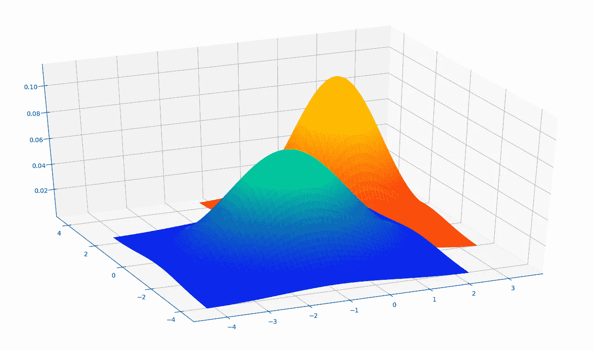
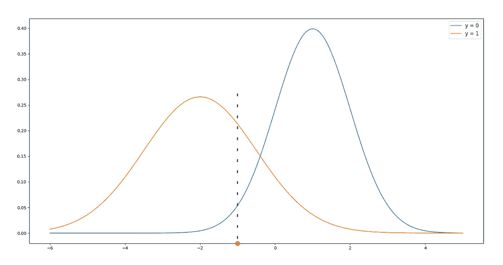
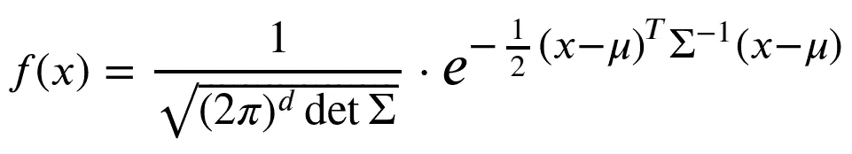
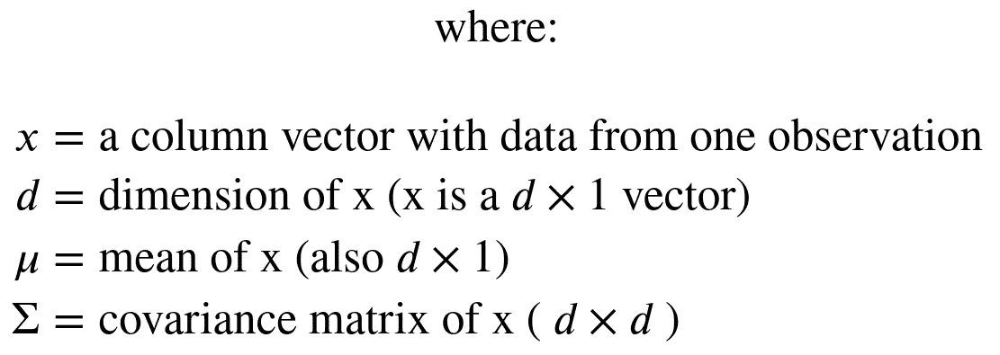
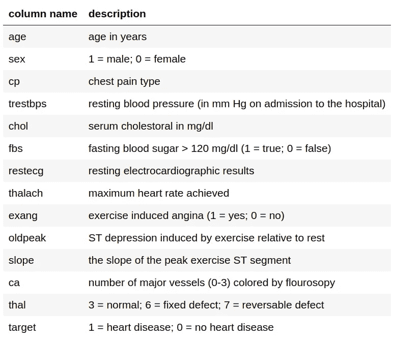

# 最大似然分类

> 原文：<https://towardsdatascience.com/maximum-likelihood-classification-4b129971ea92?source=collection_archive---------12----------------------->

## 实现最大似然分类器并使用它来预测心脏病

# 这是关于什么的？

最大似然分类的主要思想是预测使我们观察到的数据 **x** 的似然性最大化的类别标签 **y** 。我们将把 **x** 视为随机向量，把 **y** 视为 **x** 的分布所依赖的参数(非随机的)。首先我们需要对 **x** 的分布做一个假设(通常是高斯分布)。

然后，我们的数据学习包括以下内容:

*   我们将数据集分成对应于每个标签 **y** 的子集。
*   对于每个子集，我们仅使用该子集内的数据来估计 **x** 的假设分布的参数。

当对新的数据向量 **x** 进行预测时:

*   我们使用每个标签 **y** 的估计参数来评估假设分布的 PDF。
*   返回评估的 PDF 具有最大值的标签 **y** 。

让我们从一个简单的例子开始，考虑一个一维输入 **x** ，和 2 个类: **y = 0** ， **y = 1** 。

假设我们估计了在 **y = 0** 和 **y = 1** 两种情况下的参数后，我们得到了上面绘制的这两个 pdf。蓝色的( **y = 0** )有均值𝜇=1 和标准差𝜎=1；橙色地块( **y = 1** )有𝜇=−2 和𝜎=1.5.现在，如果我们有一个新的数据点 **x** = -1，我们想预测标签 **y** ，我们评估两个 pdf:𝑓₀(−1)≈0.05；𝑓₁(−1)≈0.21.最大值是 0.21，这是我们考虑 **y = 1** 时得到的，所以我们预测标签 **y = 1** 。

这只是一个简单的例子，但在现实世界的情况下，我们将有更多的输入变量，我们希望使用，以作出预测。因此，我们需要一个多元高斯分布，其 PDF 如下:

要让这个方法起作用，协方差矩阵σ应该是**正定**；即它应该是对称的，并且所有特征值应该是正的。协方差矩阵σ是包含 x:σ𝑖𝑗=𝑐𝑜𝑣(𝑥𝑖,𝑥𝑗).所有分量对之间的协方差的矩阵所以，它是一个像𝑐𝑜𝑣(𝑥𝑖,𝑥𝑗)=𝑐𝑜𝑣(𝑥𝑗,𝑥𝑖一样的对称矩阵)，因此我们要检查的是所有的特征值都是正的；否则，我们将显示警告。如果观测值比变量多，且变量之间没有很高的相关性，这个条件应该满足，σ应该是正定的。

# 现在，让我们来实现它

# 利用多分类器预测心脏病

图片由[米利安·齐尔斯](https://pixabay.com/ro/users/Myriams-Fotos-1627417/?utm_source=link-attribution&utm_medium=referral&utm_campaign=image&utm_content=1953179) @ [皮克斯贝](https://pixabay.com/ro/?utm_source=link-attribution&utm_medium=referral&utm_campaign=image&utm_content=1953179)提供

对于这个任务，我们将使用这里提供的数据集。该数据集由一个 csv 文件组成，该文件有 303 行，每行有 13 列可用于预测和 1 个标签列。下表显示了每个字段的简短描述:

我们得到了 **80.33%** 的测试准确率。虽然这种方法的精确度不如其他方法，但我仍然认为这是一种有趣的思考问题的方式，因为它简单而给出合理的结果。

Jupyter 笔记本可以在[这里](https://www.kaggle.com/dorianlazar/maximum-likelihood-classification-heart-disease)找到。

*我希望这些信息对您有用，感谢您的阅读！*

这篇文章也贴在我自己的网站[这里](https://www.nablasquared.com/maximum-likelihood-classification/)。随便看看吧！