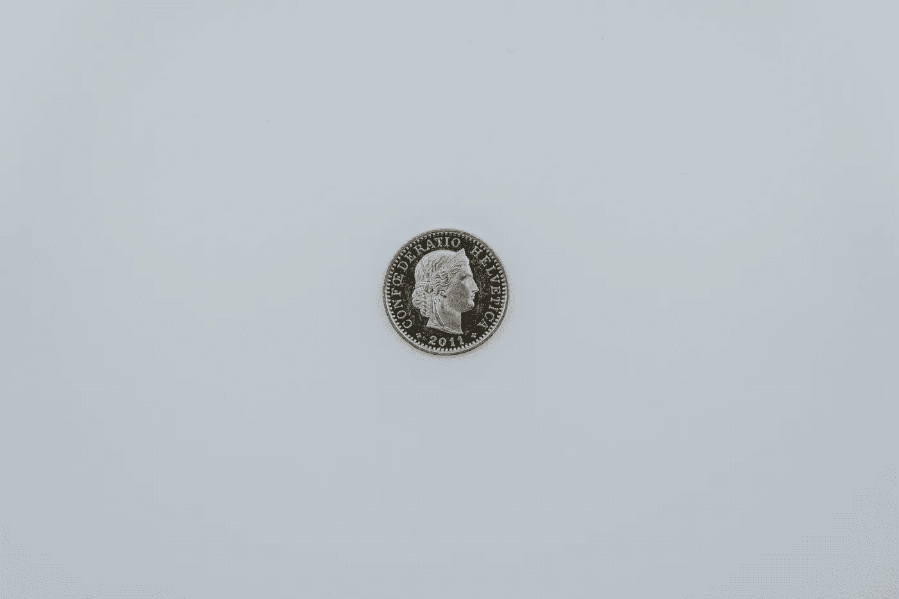
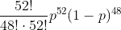

# R 中的最大似然估计

> 原文：<https://towardsdatascience.com/maximum-likelihood-estimation-in-r-b21f68f1eba4?source=collection_archive---------2----------------------->

## 通过这份快速简单的指南，最大限度地提高您在统计方面取得成功的可能性



🇨🇭·克劳迪奥·施瓦茨| @purzlbaum 在 [Unsplash](https://unsplash.com/s/photos/coin?utm_source=unsplash&utm_medium=referral&utm_content=creditCopyText) 上拍摄的照片

通常，你会有某种程度的直觉——或者具体的证据——来表明一组观察结果是由特定的统计分布产生的。与你正在模拟的现象相似的现象可能已经被证明可以用某种分布很好地解释。您正在研究的情况或问题的设置可能会自然地建议您尝试一系列的发行版。或者，你可能只是想通过将你的数据拟合到某个模糊的模型来获得一点乐趣，看看会发生什么(如果你在这方面受到挑战，告诉人们你正在做探索性的数据分析，并且当你在你的区域时，你不喜欢被打扰*。*

现在，有许多方法可以根据你所拥有的数据来估计你所选择的模型的参数。其中最简单的是*矩量法*——一个有效的工具，但是[也有它的缺点](https://en.wikipedia.org/wiki/Method_of_moments_(statistics))(值得注意的是，这些估计值经常*有偏差*)。

你可能想考虑的另一种方法是*最大似然估计(MLE)*，它倾向于对模型参数产生更好的(即更无偏的)估计。技术含量高一点，但没什么我们不能处理的。让我们看看它是如何工作的。

## 什么是可能性？

*似然*——更准确地说是*似然函数*——是一个表示从给定模型中获得某一组观察值的可能性有多大的函数。我们认为这组观察值是固定的——它们已经发生了，它们发生在过去——现在我们考虑在哪组模型参数下我们最有可能观察到它们。

## 一个简单的抛硬币的例子

考虑一个例子。假设我们将一枚硬币抛 100 次，观察到 52 个正面和 48 个反面。我们想出一个模型来预测如果我们继续翻转另外 100 次，我们会得到多少个头。

把这个问题正式化一点，让我们想想 100 次抛硬币得到的人头数。鉴于:

*   只有两种可能的结果(正面和反面)，
*   有固定数量的“试验”(100 次抛硬币)，而且
*   “成功”的可能性是固定的。

我们可以合理地建议使用*二项式分布来模拟这种情况。*

我们可以使用 R 来如下设置问题(查看用于本文的 [Jupyter 笔记本](https://github.com/andrewhetherington/python-projects/blob/master/Blog%E2%80%94Maximum%20Likelihood%20Estimation%20in%20R/Maximum%20Likelihood%20Estimation%20in%20R.ipynb)以了解更多细节):

```
# I don’t know about you but I’m feeling
set.seed(22)# Generate an outcome, ie number of heads obtained, assuming a fair coin was used for the 100 flips
heads <- rbinom(1,100,0.5)heads# 52
```

*(为了生成数据，我们使用了 50%的机会得到正面/反面，尽管我们打算暂时假装不知道。对于几乎所有现实世界中的问题，我们都无法获得生成我们正在查看的数据的过程的这种信息——这就是为什么我们有动力去估计这些参数！)*

在我们将正面/反面过程公式化为二项式过程的情况下，我们假设每次掷硬币都有获得正面的概率 *p* 。由此延伸，在 100 次翻转后获得 52 个头的概率由下式给出:



这个概率就是我们的似然函数——它允许我们计算概率，即在给定正面概率的情况下，我们的数据集被观察到的可能性有多大。给定这种技术的名称，你也许能猜到下一步——我们必须找到使这个似然函数最大化的 *p* 的值。

我们可以很容易地在 R 中用两种不同的方法计算这个概率:

```
# To illustrate, let's find the likelihood of obtaining these results if p was 0.6—that is, if our coin was biased in such a way to show heads 60% of the time.
biased_prob <- 0.6# Explicit calculation
choose(100,52)*(biased_prob**52)*(1-biased_prob)**48# 0.0214877567069514# Using R's dbinom function (density function for a given binomial distribution)
dbinom(heads,100,biased_prob)# 0.0214877567069514
```

回到我们的问题——我们想知道我们的数据暗示的 p 的值。对于像正在考虑的这种简单情况，可以对关于被估计参数的似然函数进行微分，并使结果表达式等于零，以求解 *p* 的最大似然估计。然而，对于更复杂(和现实)的过程，您可能不得不求助于数值方法。

幸运是，这也是一件轻松的事情！我们的方法如下:

1.  定义一个函数，该函数将计算给定值 *p* 的似然函数；然后
2.  搜索产生最高可能性的 *p* 的值。

从第一步开始:

```
likelihood <- function(p){
  dbinom(heads, 100, p)
}# Test that our function gives the same result as in our earlier example
likelihood(biased_prob)# 0.0214877567069513
```

现在考虑第二步。在 R 中有许多不同的优化(即最大化或最小化)函数的方法——我们在这里考虑的一种方法利用了代表非线性最小化的 *nlm* 函数。如果你给 nlm 一个函数，并指出你希望它改变哪个参数，它将遵循一个算法并迭代工作，直到它找到使函数值最小的那个参数值。

你可能会担心我引入了一个工具来*最小化*一个函数值，而我们实际上是在寻找*最大化——*这毕竟是最大似然估计！幸运的是，*最大化一个函数相当于最小化这个函数乘以-1。*如果我们创建一个新函数，简单地将可能性乘以-1，那么使这个新函数的值最小化的参数将与使我们的原始可能性最大化的参数完全相同。

因此，对我们的职能进行一点小小的调整是合适的:

```
negative_likelihood <- function(p){
  dbinom(heads, 100, p)*-1
}# Test that our function is behaving as expected
negative_likelihood(biased_prob)# -0.0214877567069513
```

很好——我们现在准备好找到我们的 *p* 的 MLE 值。

```
nlm(negative_likelihood,0.5,stepmax=0.5)# $minimum
# -0.07965256# $estimate
# 0.5199995# $gradient
# -2.775558e-11# $code
# 1# $iterations
# 4
```

nlm 函数返回了一些关于寻找 p 的最大似然估计的信息。

*   $minimum 表示找到的负可能性的最小值，因此最大可能性就是这个值乘以负一，即 0.07965…；
*   $estimate 是我们对 p 的极大似然估计；
*   $gradient 是我们对 p 的估计值附近的似然函数的梯度——对于成功的估计，我们希望它非常接近于零；
*   $code 解释使用最小化算法终止的原因——值 1 表示最小化可能已经成功；和
*   $iterations 告诉我们 nlm 为获得参数的最佳值而必须经历的迭代次数。

知道这些信息很好——但我们真正关心的是，它告诉我们，我们对 *p* 的极大似然估计是 0.52。我们可以凭直觉判断这是正确的——在 100 次投掷中，哪个硬币更有可能让我们 52 次正面朝上，而不是 52%的时候正面朝上？

## 结论

在我们今天看到的这个相当琐碎的例子中，我们似乎已经经历了很多争论才得出一个相当明显的结论。但是，请考虑一个问题，其中您有一个更复杂的分布和多个参数要优化，最大似然估计的问题变得更加困难，幸运的是，我们今天探索的过程可以很好地扩展到这些更复杂的问题。

最终，如果你想建立稳健的模型，你最好很好地掌握最大似然估计——在我看来，你只是朝着最大化你的成功机会又迈进了一步——或者你更愿意认为这是最小化你的失败概率？

# 学分和更多信息

**Andrew Hetherington** 是英国伦敦的一名见习精算师和数据爱好者。

*   查看我的[网站](https://www.andrewhetherington.com/)。
*   在 [LinkedIn](https://www.linkedin.com/in/andrewmhetherington/) 上与我联系。
*   看看我在 [GitHub](https://github.com/andrewhetherington/python-projects) 上摆弄什么。
*   用于制作本文作品的笔记本可以在[这里](https://github.com/andrewhetherington/python-projects/blob/master/Blog%E2%80%94Maximum%20Likelihood%20Estimation%20in%20R/Maximum%20Likelihood%20Estimation%20in%20R.ipynb)找到。

硬币照片由[🇨🇭·克劳迪奥·施瓦茨| @purzlbaum](https://unsplash.com/@purzlbaum?utm_source=unsplash&utm_medium=referral&utm_content=creditCopyText) 在 [Unsplash](https://unsplash.com/s/photos/coin?utm_source=unsplash&utm_medium=referral&utm_content=creditCopyText) 上拍摄。